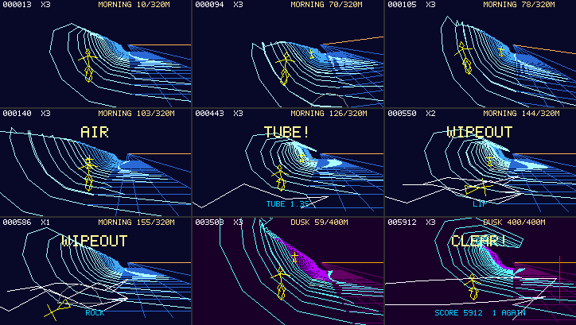

# BIG WAVE — 線分の疑似3Dで大波に乗る

2026-09-29、ブランチ `vm/game-wave`（`vm/main` 026e8c7 から）。対象は [apps/bigwave/big_wave.js](../../apps/bigwave/big_wave.js)（APPS の BIG WAVE、`local.bigwave`）。**この文書の数値はすべて host（実物の QuickJS・`pocket.kasane`・`pocket.input.keys` をホストで動かしたもの）か計算で、実機では1つも測っていない。** 種別は各表に書いた。美的な評価はしない（見比べ用の画像を置いた）。

## 結論

- 崩れていく大波の面を TPS 視点で滑るゲームを作った。見せ方は `pocket.kasane.procedural` の線分だけ。**波は「世界に固定した断面（スライス）の列」で、1 断面を CUBIC 1 本（谷 → 面 → リップ）で描く。** 断面の形はカールの量と高さの区分線形関数で決まり、JS は区分ごとに 1 回 `draw` し、VM が区分の中の断面を回して透視・ロール・形の補間をする。
- **VM に割り算が無いので、透視の 1/d を断面ごとに級数で進める**（`y ← y(1 − u + u² − u³)`、`u = D·y`）。先頭の 1/d だけ JS が正確に渡す。誤差は計算で最大 3.1 px（10 m 横の点、奥行き 7 m）。
- host で、台本（タイトル → 開始 → E/S/A/D・急旋回・ポップ・チューブ → 波頭・岩・他のサーファー・崩れるセクション・着地失敗の各ワイプアウト → 一時停止 → ゲームオーバー → 再挑戦）と、**キーだけで操作するボットが 3 セットをワイプアウト 0 回でクリア**するまでを流し、29 項目の物理・規則の期待がすべて通った。全 7,256 フレーム・63,883 draw を plan／デバッグ単歩の plan／単歩の VM の3通りで実行してビット一致、帯ごとの再描画と一括の再描画で全画素一致（2.35 億画素）。
- 負荷（host 計数、MID 段、走行中）: 1 フレームの線分最大 361、ラスタ 8,195、VM ステップ 3,889、draw 16。MEGADEMO の TWIST HEAVY（実機 29.8 fps: 線分 566、ラスタ 19,190、ステップ 6,571、draw 7）より VM と描画は軽く、**draw の数（＝JS の呼び出し）は多い**。30 fps に届くかは実機で測るまで分からない。
- ゲストヒープ（host、実機と同じ 8 B JSValue の i386 ビルド）: 評価後 103,028 B、実行中の最大（GC 後）109,160 B、**評価と実行が通る最小の上限は約 135.0 KB（163,840 B の 82%）**。MEGADEMO は同じ測り方で 123,125 B（75%）。ソースは 22,372 B。
- ファーム `idf.py -B build_gamewave build` は通る。静的 DIRAM は仮の BIG WAVE と同じ 172,204 B（map から、±0）、image は 2,199,152 B（+21,984 B、JS の埋め込みは flash の DROM）。

## 設計の芯

### 世界と波

- 波は x 方向（down the line）に崩れていく。**カール（崩れ始め）の位置 `xc` が波速 `vw` で進み**、サーファーは `x`、面の上の高さの割合 `p`（0 = 谷、1 = 波頭）、進行方向の角 `h`（+ で面を登る）、速さ `v` を持つ。カールからの距離 `ξ = x − xc` で区間が決まる。

| ξ | 区間 | カールの量 c | 高さ h | 波の力 |
| --- | --- | --- | --- | --- |
| < 0 | 崩れた後（泡） | 描かない（泡の plan） | — | 捕まったらワイプアウト |
| 0〜7 m | バレル | 1 | H | 0.75。しゃがんで低くないと波頭に叩かれる |
| 7〜22 m | ポケット | 1 → 0.2 | H | 1（最良、得点が一番高い） |
| 22〜30 m | 面 | 0.2 → 0 | H | 1 → 0.5 |
| 34〜74 m | ショルダー | 0 | H → 0.3H | 0.5 → 0.1 |

崩れるセクション（コース上の固定位置、幅 6〜12 m）は、全高の区間（ξ < 30 m）に入ってから c に山（最大 +0.8）を足し、そこもバレルと同じ規則（しゃがんで低く）になる。

- **断面の形（波の高さ単位）**: `P0 = (0, 0)`（谷）、`P1 = (−1, 0)`、`P2 = (−1, 1.25)`、`P3 = (−1.35 + 1.45c, 1.05 − 0.5c)`（リップ）。横 `l` は右が +（岸側の平らな海）、壁は左。c = 0 で P3 は P2 の左下に来て丸い波頭、c = 1 で右下に来てリップが前へ巻き込む（バレル）。c と h は区間の中で線形なので、JS は区間の境目で断面をまとめる。
- **断面は世界に固定した格子 `x = m·D`（D = 1.8 m）**。カメラからの奥行き `d = x − x_cam` は乗り手の速さで手前へ流れ、障害物（JS が正確に投影する）と同じ速さで動く。
- **投影**: 画面 = `V + (F/d)·(Δl·e + Δv·u)`、`e = (cosθ, sinθ)`、`u = (sinθ, −cosθ)`、θ はロール、`V = (160, 56)` は消失点（光軸）、`F = 150`。VM の中では `a = y·F·H·e`（JS が `F·H·e` を渡す）、`a⊥ = (a_y, −a_x)`、谷の点 `T = V + y·Wc`（`Wc = −F(l_cam·e + v_cam·u)`、JS が渡す）、制御点 `P_i = T + l_i·a + v_i·a⊥`。**ロールもカメラの位置も入力の 4 数に入っていて、形の定数は plan に焼いてある。**
- **1/d の級数**: `1/(d + D) = y/(1 + u)`、`u = D·y` を 3 次で打ち切る（`M` と `A` 12 命令）。先頭の断面の `y0 = 1/d0` だけ JS が渡す。誤差は `u⁴` で、手前ほど大きい。最も近い断面は d ≥ 5.2 m なので u ≤ 0.35。

| 誤差（計算、float32 で再現） | 値 |
| --- | --- |
| 1/d の相対誤差の最大 | −1.44%（d = 7.0 m、先頭の断面の位相による） |
| 10 m 横・上の点の画面上のずれの最大 | 3.1 px（同上） |
| 最遠（64 m）での相対誤差 | −0.30% |

障害物は JS が正確に `1/d` で投影するので、波の線との食い違いは最大でこのずれ。

- **区間の draw（ラン）**: 断面を区間の境目（カール・バレル端・ポケット端・面端・ショルダーの始まりと終わり・セクションの4点）でまとめて1 draw。**各ランは前のランの最後の断面を重ねて始める**ので、リップのレール（前の断面の P3 から今の P3 への LINE）が区間をまたいで繋がる。重ねた断面の c（または h）は両側で同じ値（区間の中は両端の真値の線形補間）。ランは「カール側」（h = H 固定、c を補間、`cu`）と「ショルダー側」（c = 0、h を補間、`sh`）の2つの plan に分けた — c と h の両方を補間すると入力が 10 個要る。
- **前後関係は描く順**: 空（水平線・放射レール）→ 海（谷のレール・横線・きらめき）→ 波（奥の区間から）→ 泡 → 障害物（奥から）→ 影 → サーファー。

### カメラ

- サーファーの 8 m 後ろ、目の高さ +2.2 m、岸側へ 2.6 m ずらしてまっすぐ down the line を見る。サーファーは画面の (111, 97) に固定され、世界が動く。ジャンプではカメラも上がる（波が下がって見え、水面に影の線を描く）。
- カメラをサーファーから 8 m 離したのは、断面の格子（1.8 m 間隔、最も近い断面 5.2 m）がいつもサーファーの手前と奥にあるようにするため。6 m のときは最も近い断面がサーファーより奥に来るフレームがあり、サーファーが面の手前に浮いて見えた（host の画像で確認）。
- ロール θ はサーファーの傾き（旋回の強さ）の −0.45 倍を滑らかに追う。ロールの中心は消失点 V（光軸回り）。

### サーファー

- ロール角 7 段（傾き −0.6〜+0.6、0.2 刻み）× 立ち／しゃがみの**型付き点列の表（affineQ14Points、24 点、14 本）**。ZENITH の自機の「回転済みスプライト表」と同じ流儀。ボード（7 点の菱形）から体（脚・腰・胴・腕・頭）まで1本の経路で、戻りながらなぞる。
- 画面上の傾きは `0.55 × 傾き`、置き場所は段ごとに「V 回りにその段のロールだけ回した位置」。連続のロールとの差（段の中央からのずれ）は計算で最大約 2 px。
- 他のサーファー（障害物）とワイプアウトの転倒は VM の棒人間（`ri`、色はレジスタから `LINE_COLOR_REG`、転倒は基底を回すだけ）。

## 遊び方

キー割り当ては [apps/bigwave/README.md](../../apps/bigwave/README.md) の表（E 加速、S ブレーキ、A/D 旋回、`;` ポップ、`.` しゃがむ、`,` `/` 急旋回、`1` 開始、`2`〜`4` 負荷、`tab` 一時停止）。矢印相当の割り当ての理由:

- `;`（上）がポップ: 「上へ」の位置で、押した瞬間の動作（`pressed`）。
- `.`（下）がしゃがむ: 「下へ」の位置で、押し続ける動作（`held`）。E と同時に押せる（右手と左手）。
- `,` `/`（左右）が急旋回: A/D と同じ向き。急旋回は A/D の約 1.9 倍の角速度で、速度を失う。
- ゴースト（A+S+D→F、A+D+E→T、`;`+`,`+`/`→Enter、`,`+`.`+`/`→Space）は、出るのが使わないキーなので遊びは変わらない。E+A+D と `;`+`,`+`/` は同時に押しても実害は無い（左右同時は旋回が打ち消し合うだけ）。

**規則**: 1 セット 320／360／400 m を走り切ると次のセット（MORNING → NOON → DUSK、波の高さ 5 → 6.5 → 8 m、波速 9 → 10.5 → 12 m/s、岩・セクション・他のサーファーが密になる）。3 セットでクリア。ワイプアウトは3回まで（カールの 14 m 前から再開、1.5 秒無敵）。

| 得点 | 値（`K.pts`） |
| --- | --- |
| ポケット（ξ < 22 m）を走る | 12 点/秒 × v/vw |
| ショルダー | 2 点/秒 |
| チューブ（バレル・セクションでしゃがんで低く） | 80 点/秒 |
| エア（着地したとき） | 4 点 × 滞空フレーム |
| 波頭（p > 0.85）での急旋回 | 10 点/8 フレーム |
| セットのクリア | 400 × セット番号 |

| ワイプアウト（`BIGWAVE WIPE <理由>`） | 条件 |
| --- | --- |
| `CAUGHT` | ξ < 0（泡に捕まる） |
| `LIP` | バレルかセクションの中で、しゃがんでいないか p ≥ 0.6 の状態が 8 フレーム続く（HUD に `TUCK!`） |
| `ROCK` / `RIDER` | 岩・他のサーファーと \|Δx\| < 1.3 m、\|Δp\| < 0.12、高さ < 0.6 m |
| `LAND` | 着地のとき \|h\| > 0.8（面を横切る向き） |

### 物理（JS、float、固定の Δt = 1/30 s、乱数の種 20260929 + 7919·セット）

```
a = K.drag·(1.08·vw)²·power(ξ)·(0.5 + 0.5·sin(π·p))   // 波の力: ポケットの面の中ほどで最大
  − K.grav·sin(h) − K.drag·v²                         // 登ると減速、空気と水の抵抗
  + (E ? K.acc) − (S ? K.brake) − (急旋回 ? K.cost) − (しゃがみ ? 0.5)
空中: a = −0.2·K.drag·v²、旋回は 0.3 倍
x += v·cos(h)·Δt、  p += v·sin(h)·Δt / K.face、  xc += vw·Δt
```

ポケットでトリムすると力と抵抗が釣り合う速さは `1.08·vw`（わずかに波より速い）なので、何もしないとショルダーへ出て力を失い戻ってくる。バレルでは力が 0.75 倍で釣り合いが `0.93·vw` 程度になり、しゃがむとさらに遅くなるので、E で漕がないと泡に捕まる。

### 調整する定数（1か所: `K`、`C`、`TIER`、`PF`）

| 定数 | 値 | 効くところ |
| --- | --- | --- |
| `K.acc` / `K.brake` / `K.drag` / `K.grav` | 5 / 6 / 0.05 / 6 | 加速・減速・最高速・登り下りの速度変化 |
| `K.turn` / `K.carve` / `K.cost` / `K.relax` / `K.head` | 1.9 / 3.6 rad/s / 2.5 / 1.4 / 1.05 rad | 旋回の効き、急旋回の代償、手を離したときの戻り、最大の角 |
| `K.face` | 7 m | 面の幅（p の動きの速さ） |
| `K.pop` / `K.g` / `K.land` / `K.air` | 5.5 m/s / 13 / 0.8 rad / 4 m/s | ジャンプの高さと滞空、着地の許容、波頭から自動で飛ぶ速さ |
| `K.tube` / `K.pocket` / `K.sh` / `K.taper` / `K.hmin` | 7 / 22 / 34 / 40 m / 0.3 | 波の区間 |
| `K.tuck` / `K.grace` / `K.hitX` / `K.hitP` | 0.6 / 8 f / 1.3 m / 0.12 | チューブの判定、当たり判定 |
| `K.vw` / `K.H` / `K.len` / `K.rock` / `K.sec` / `K.rid` | セットごと | 難度（波速・高さ・距離・岩／セクション／他のサーファーの間隔） |
| `C` | V (160,56)、F 150、8 m / 2.2 m / 2.6 m、最近 5.2 m、D 1.8 m | カメラと格子（D は plan に焼く） |
| `TIER` | [44, 5, 4] / [54, 6, 5] / [64, 7, 6] | 負荷: 最遠の断面、CUBIC の分割数、泡の点数（後の2つは plan に焼き、次に読み直したときに効く） |

## plan とプリミティブ

| plan | 本数 | 命令 | レジスタ | 入れ子 | 入力 | 点 | 使う op | 登録 |
| --- | ---: | ---: | ---: | ---: | ---: | ---: | --- | --- |
| `cu` 波（カール側） | 1 | 62 | 16 | 1 | 8 | — | INPUT, REPEAT_REG, MUL, ADD, SET, LINE, CUBIC | セットごと |
| `sh` 波（ショルダー側） | 1 | 57 | 16 | 1 | 8 | — | 同上 | セットごと |
| `se` 海（谷のレール、横線、きらめき） | 1 | 53 | 14 | 1 | 7 | — | ＋ MOVE, SIN, PLOT | セットごと |
| `sk` 空（水平線、放射レール） | 1 | 33 | 12 | 1 | 5 | — | ＋ REPEAT | セットごと |
| `fo` 泡（崩れた後、飛沫） | 1 | 56 | 16 | 2 | 8 | — | ＋ SIN, REPEAT の入れ子 | セットごと |
| `ro` 岩 | 1 | 38 | 16 | 0 | 4 | — | CUBIC, LINE | 起動後 |
| `ri` 他のサーファー・転倒 | 1 | 56 | 15 | 0 | 6 | — | LINE_COLOR_REG, MOVE | 起動後 |
| `ln` 線（影、ゴールの旗） | 1 | 7 | 5 | 0 | 5 | — | LINE_COLOR_REG | 起動時 |
| `sp0`〜`sp13` サーファー | 14 | 1 | 1 | 0 | 0 | 24 | affineQ14Points | 起動後 |

ksn_proc_op 15 個のうち 13 個を使った。**使っていないのは `BREAK_IF_GT` と `PLOT_COLOR_REG`**: 前者は断面の数を JS が REPEAT_REG で渡すので途中で抜ける理由が無く、後者は点の色を変える場所（きらめき）が1色で足りた。どちらも入れるだけなら入るが、使い道の無い命令で網羅を作らなかった。

plan の登録: 起動時に 6 本（波・海・空・泡・線）、残りの 16 本（サーファー 14、岩、他のサーファー）はタイトル画面で 1 フレーム 1 本（未登録の plan の draw は飛ばす）。セット（海の区間）の切れ目の 45 フレーム以上のインターバル（空と海だけを描く）で、波・海・空・泡の 5 本を 1 フレーム 1 本ずつ解除 → 登録で差し替える。**走行中は登録しない**（実機で 1 本 12〜20 ms、MEGADEMO の実測）。同時の plan は最大 22 本（host、上限 32）。

## host の再生結果

`python3 tools/games/run_big_wave.py`（WSL）。実物の QuickJS、`pocket.kasane`（view と procedural）、`pocket.input.keys`（キーの辺は実物の `keymap_poll()` と `keystate` を通す）。台本はキーを押す・離すだけで、障害物の試験だけは開始位置を状態に書き込む（書いたことを表に示す）。ボットは状態を読んでキーを押すだけで、状態を書かない。乱数の種が固定なので、毎回同じ結果になる。

| 操作（台本） | 結果（host の実測） |
| --- | --- |
| 起動 → 40 フレーム | タイトルの自動走行、残りの plan 16 本がタイトル中に 1 フレーム 1 本で登録済み |
| `1` | 走行開始（lives 3） |
| 何も押さない 30 フレーム | ポケットで得点（ξ 14.2 → 14.7 m、v 9.38 → 9.52 m/s） |
| `e` 30 フレーム | v 9.52 → 12.66 m/s（+3.15）、ξ 14.7 → 17.1 m |
| `s` 40 フレーム | v 13.38 → 5.87 m/s、ξ 19.9 → 19.6 m（カールへ戻る） |
| `a` 12 フレーム | p 0.40 → 0.62、h +0.76 rad、ロール −0.129 rad（左へバンク） |
| `d` 26 フレーム | p 0.62 → 0.51、h −0.89 rad、ロール +0.141 rad |
| `a` 5 フレームと `,` 5 フレーム | 角の変化 +0.317 と +0.600 rad（急旋回は約 1.9 倍） |
| `;` | 空中へ（z 0.19 → 0.36 m）、27 フレーム後に着地 |
| `s .` でバレルへ、ボットがしゃがんで低く保つ | チューブ 79 フレーム（2.6 秒）、+213 点 |
| バレルの中で立つ（`e`） | `LIP`、lives 3 → 2、1.6 秒後に再開（無敵 45 フレーム） |
| 岩の 8 m 手前・同じ高さに置いて直進（書き込み） | `ROCK` |
| `tab` | 一時停止（x が変わらない）、もう一度で再開 |
| `s` を押し続ける | 波頭に叩かれ続けてゲームオーバー（`LIP`×2） |
| `1` | セット 1 から再挑戦（lives 3、得点 0） |
| 岩の手前（書き込み）、3.5 m まで近づいたら `;` | 越える（ワイプアウト無し） |
| 他のサーファーの後ろ（書き込み）で追い、2.6 m 手前で `;` | 越える |
| 他のサーファーを追い続ける（`e` と `a`/`d`） | `RIDER` |
| 崩れるセクションの手前（書き込み）、`.` で低く | 25 フレームのチューブ、+67 点 |
| 同じく高く（p 0.75）立ったまま | `LIP` |
| `a` で登りながら `;`、空中でも `a` | `LAND`、3回目でゲームオーバー |
| `1` → ボット（キーだけ） | **3 セットをクリア**: 3,205 フレーム、ワイプアウト 0 回、5,912 点。240 m ごとにチューブを狙う |
| `2`（LIGHT）／`4`（HEAVY）で同じボット 900 フレーム | 負荷の統計用 |
| Back（`frame(0x2000)`） | `BIGWAVE BACK best=… score=…` を出し、描かない、例外なし |

全体: 7,279 フレーム、例外 0、表示の失敗 0、tone の呼び出し 248、ワイプアウト LIP 9 / ROCK 1 / RIDER 1 / LAND 1。

### 全画素の検証

全フレーム（7,256 フレーム、63,883 draw）で、各 draw を `ksn_proc_plan_run`（`pocket_proc.c` が回す経路）、同じ plan のデバッグ単歩、`ksn_proc_step` の単歩の3通りで実行し、線分・ラスタ歩数・ステップ数・レジスタがビット一致。型付き点列はスカラー・PIE の模型・ディスパッチャの3通りが一致。フレームを plan の線分から一括で、VM の線分から 8 行の帯ごとに描いて全画素一致（235,094,400 画素）。失敗 0。手順は [test_proc_megademo_scenes.c](../../tools/kasane_contract/test_proc_megademo_scenes.c) と同じ。

## 負荷と上限

フレームごとの統計（host 計数、状態別と負荷段階別、全フレームの最大と平均）。

| 区分 | フレーム | draw 最大 | 線分 最大 | 線分 平均 | ラスタ 最大 | ラスタ 平均 | draw ラスタ 最大 | draw ステップ 最大 | フレーム ステップ 最大 | 平均 |
| --- | ---: | ---: | ---: | ---: | ---: | ---: | ---: | ---: | ---: | ---: |
| タイトル | 40 | 7 | 325 | 314.5 | 5,915 | 5,586 | 2,599 | 1,322 | 3,099 | 3,010 |
| 走行 | 6,340 | 16 | 444 | 328.3 | 8,195 | 6,029 | 2,842 | 1,557 | 3,945 | 3,113 |
| ワイプアウト | 588 | 12 | 419 | 313.8 | 7,087 | 6,068 | 2,827 | 1,557 | 4,428 | 3,497 |
| セットの切れ目 | 276 | 2 | 104 | 87.0 | 4,053 | 3,710 | 2,770 | 1,557 | 1,626 | 1,360 |
| 走行 LIGHT | 1,273 | 11 | 262 | 241.1 | 6,342 | 5,360 | 2,437 | 1,040 | 3,129 | 2,586 |
| 走行 MID（既定） | 4,382 | 16 | 361 | 326.3 | 8,195 | 6,204 | 2,687 | 1,322 | 3,889 | 3,142 |
| 走行 HEAVY | 1,273 | 12 | 444 | 415.8 | 7,087 | 6,110 | 2,842 | 1,557 | 4,428 | 3,720 |
| 参考: MEGADEMO TWIST HEAVY | 128 | 7 | 566 | 566 | 19,190 | — | 7,395 | 1,807 | 6,571 | — |

上限の使用率（全フレームの最大、host 計数）。

| 上限 | 値 | 使用 | 率 | どこで |
| --- | ---: | ---: | ---: | --- |
| 線分／フレーム | 1,024 | 444 | 43% | HEAVY の走行（波 7 分割の CUBIC） |
| ラスタ歩数／フレーム | 65,535 | 8,195 | 13% | MID の走行 |
| ラスタ歩数／draw | 8,192 | 2,842 | 35% | 海（横線 8 m、きらめき） |
| VM ステップ／draw | 10,000 | 1,557 | 16% | 海 |
| 命令／plan | 64 | 62 | 97% | 波（カール側） |
| レジスタ | 16 | 16 | 100% | 波・泡・岩 |
| REPEAT 入れ子 | 8 | 2 | 25% | 泡（断面 × 泡の点） |
| 入力／draw | 8 | 8 | 100% | 波・泡 |
| 点列の点数 | 128 | 24 | 19% | サーファー |
| 座標 | −480〜720 | −137〜632 | 上限側 88% | 近い断面の平らな海の端（横 8 m） |
| 同時 plan | 32 | 22 | 69% | 走行中 |
| 面 | 2 | 1 | 50% | 面 0 だけ（`resource()` で全画面の画像） |

**上限に近いのは命令・レジスタ・入力（1 plan の表現力）で、フレームの量はまだ余っている。** 波の plan は 62/64 命令・16/16 レジスタ・8/8 入力で、級数をもう1項（誤差 u⁵）足すと 64 命令ちょうどになる。座標の上限（720）は平らな海の横幅（`args` の `f` = 8 m）とカメラの横のずれで決まるので、海を広げるときはここを見る。

## メモリ

| 項目 | 値 | 種別 |
| --- | --- | --- |
| ソース | 22,372 B | 実測 |
| ゲスト: 評価前 → 評価後 | 33,312 → 103,028 B（TLSF の課金、i386 = 実機と同じ 8 B JSValue） | 実測（host） |
| ゲスト: 評価中の最大（コンパイル） | 126,732 B | 実測（host） |
| ゲスト: 実行中の最大（GC 後） | 109,160 B | 実測（host） |
| **評価と実行が通る最小の上限** | **約 135.0 KB（134,419 で失敗、134,996 で通過）、上限 163,840 の 82%** | 実測（host、二分探索） |
| 参考: MEGADEMO の同じ値 | 123,125 B（75%） | 実測（host、[megademo-limit-scenes.md](../kasane/megademo-limit-scenes.md)） |
| ネイティブ: plan 22 本 | 22 × 872 B = 19,184 B | 計算（i386 の構造体の大きさ） |
| ネイティブ: サーファーの点列 14 本 | 14 × 211 B = 2,954 B | 計算（`points_bytes(24)`） |
| ネイティブ: フレーム（面 0 の候補・確定・作業）＋ VM | 3 × 10,246 + 996 = 31,734 B | 計算 |
| ネイティブの合計 | 約 53.9 KB（MEGADEMO は面 2 つ＋plan 16 本で約 65 KB） | 計算 |

host の台本は、登録・描画の記録をゲストのヒープに持たない（C へ直接渡す）。持っていた版では最小の上限が 148.8 KB に見えた — 台本の配列が評価中に plan のプログラム配列を掴んでいたため。

## ファーム

| 項目 | 値 | 種別 |
| --- | --- | --- |
| `idf.py -B build_gamewave build` | 成功 | 実測 |
| 静的 DIRAM（`tools/memlog.py --map`） | 172,204 B。仮の BIG WAVE（026e8c7 の 390 B の JS）を同じビルドディレクトリで作った map と同じ（±0） | 実測（map） |
| image | 2,177,168 → 2,199,152 B（+21,984 B） | 実測 |
| JS の置き場所 | `_binary_big_wave_js_start` = 0x3c1cb472 〜 0x3c1d0bd7（22,373 B、DROM、flash） | 実測（map） |

`main/` と共有の表（`main.c`、`shell.c`、`CMakeLists.txt`、`app_registry.c`）は変えていない。`local.bigwave` の行は `CAPS_GAME`（`display.kasane`、`input.action`、`input.keys`）必須、`audio.tone` 任意のままで足りた。

## 画像



`python3 tools/games/run_big_wave.py --sheet` が host で描いた合成済みの画面（HUD 込み、724×409）。左上から: 走行、`a` で左旋回、`d` で右旋回、ジャンプ、チューブ、バレルでの波頭のワイプアウト、岩のワイプアウトの飛沫、DUSK（高さ 8 m）の走行、クリア。技術的な性質: 1 フレームの線分 300〜440 本、手続き面の色はセットごとの 6 色（背景、波 2 色、海、空、泡）＋固定の 6 色（サーファー、岩、他のサーファー 2 色、旗、影）、HUD の文字 4 行。

## 設計の判断と却下した案

| 案 | 判断 |
| --- | --- |
| TWIST と同じ幾何級数の断面（z 倍） | 却下。断面が世界に固定されないので、障害物（JS で正確に投影）と波の線の流れる速さが奥行きで食い違う。等間隔の断面と 1/d の級数にした |
| JS が断面ごとに 1 draw（CUBIC の制御点 4 つ＝入力 8） | 却下。draw が 25〜35 回に増え（JS の呼び出し）、断面をまたぐレール（リップの線）が引けない |
| 1 つの plan で c と h を両方補間 | 却下。入力が 10 個要る。カール側（h 固定）とショルダー側（c = 0）の2つに分け、セクションは全高の区間でだけ崩す |
| 1/d を Newton 法で | 却下。奥行き d のレジスタが要り、波の plan は 16 本を使い切っている。級数なら y だけで進む |
| ロールの中心をサーファーに | 却下。消失点が毎フレーム動き、入力が足りない。光軸（V）回りにして、サーファーの点列を段ごとの位置に置いた |
| サーファーを VM で（入力で回す） | 却下。回した点 1 つに約 10 命令で 64 に収まらない。型付き点列の表にした |
| 区間の間を重ねずに draw | 却下。VM は draw ごとにペンを失うので、リップのレールが区間の境目で切れる |
| 走行中に plan を登録（先読み） | 却下。1 本 12〜20 ms（実機、MEGADEMO）。セットの切れ目にインターバルを置いた |
| 他のサーファーが一定速で動く | 却下（直した）。全体の時計で動かすと走行中に出会わない。35 m に近づいてから波に乗り出す |
| 面 2 枚（レーダーのような別面） | 使わない。フレーム 3 枚（約 30 KB）が増えるだけで遊びに要らない |

## 実機で調整・確認する項目（すべて未測定）

1. **fps**。MID と HEAVY の走行、ワイプアウト、セットの切れ目。VM と描画は TWIST より軽いが、draw が最大 16 回（TWIST は 7）で JS の frame() も物理・投影・HUD を持つ。30 fps に届かなければ、まず `TIER`（最遠の断面）、次に HUD の更新間隔（4 フレームに 1 回）を見る。
2. **旋回の手触り**。`K.turn` `K.carve` `K.relax` `K.head` と、ロールの量（`camera()` の −0.45）とサーファーの傾き（`sprite()` の 0.55）。急旋回の代償 `K.cost`。
3. **難度**。波速と釣り合う速さ（`1.08·vw`）、バレルで漕がないと捕まるまでの時間、`K.grace`（8 フレーム）、当たり判定、ジャンプで他のサーファーを越えられる窓（計算で約 2〜3 m 手前、相対速度 6 m/s のとき）。
4. **ネイティブのヒープ**。plan 22 本とフレーム 3 枚で約 54 KB（計算）。起動直後・タイトルの登録中・セットの切れ目の空きと最大連続領域。
5. **plan 登録の位置**。タイトル中の 16 フレーム（1 本 12〜20 ms なら 1 フレーム 45〜55 ms）と、セットの切れ目の 5 フレーム。
6. **見え方**。線の密度（遠い断面の CUBIC）、泡のジグザグの大きさ、色（RGB565 の近似）、HUD の文字と波の重なり。
7. **音**。tone が BGM を止めること、短音の連打が聞こえるか、波の低音（55〜79 Hz）がスピーカーで出るか。
8. **キー**。E/A/S/D と `;` `,` `.` `/` を同時に押したときの取りこぼし・FIFO あふれ（[keystate.md](../platform/keystate.md) の未測定の項目と同じ）。

## 確信の低い点

- 級数の誤差は計算（float32 で再現）で、実機の画面では見ていない。
- ゲストヒープの最小上限（約 135 KB）は host の TLSF 模型で、実機の断片化は見ていない。MEGADEMO は 123 KB の値で実機が動いた。
- 固定の Δt（1/30 秒）で物理を進めるので、fps が下がると遊びがゆっくりになる（時間ではなくフレームで進む）。実時間にすると host の再現性が失われるので、実機の fps を見てから決める。
- 周辺で見つけたこと: 基準（026e8c7）の `tools/build_keytest_app_test.sh` → `/tmp/test-keytest-app` は、keytest.js の評価が `Error: LIMIT_EXCEEDED` で止まり FAIL する（原因は調べていない）。この変更とは無関係なので触っていない。
