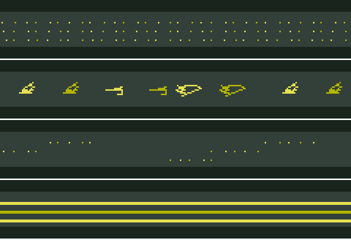

# DERBY WATCH: 首振りカメラと楕円コースの計算コスト

2026-09-30、ブランチ `vm/pan-cost`（`vm/main` b9584e7 から）。ユーザーの構想 (A) コースを楕円にする、(B) WIDE/FIELD を場内の固定カメラにして首を振る（WIDE は、先頭に近い区間は広角 f≈200、遠い区間は先頭馬を約 14 px に保つ自動ズームで f ≤ 1,500）について、**実装する前に**計算の費用を見積もる。**出荷するコード（`apps/`・`main/`）は変えていない。** 単価は実機（ESP32-S3、この VM）で測り、シーンの費用はその単価から計算した。**数値には「実測」か「推定（計算）」かを付ける。**

## 結論

- **点ごとの投影を JS で書くと成り立たない。** JS で 1 点を投影（回転・近クリップ・除算・格納）すると **41.8 µs**（実測）。1 フレームの余力 5.7 ms で約 130 点しか投影できず、首振りの WIDE の 1 フレーム（柱・縞・観客の区画で 100〜250 点）は中央値 13〜25 ms、最悪 24〜45 ms になる（推定、20 fps 前後）。型付き点列を毎フレーム登録し直す案はさらに遅い（**74 µs/点**、実測）。
- **投影を VM の中でやれば成り立つ。** VM には除算が無いが、直線上に並ぶ点（柱・縞の端・観客の区画）の奥行きは番号の一次式なので、逆数を「前の点の逆数から Newton 法 2〜3 回」（`r ← r(2 − zr)`、MUL と ADD だけ）で出せる。柱 1 本は **9.5 µs**（実測、19 ステップ）で、JS の 4.4 分の 1。JS は線ごとにクリップの両端の 2 点だけを正確に投影して渡す。誤差は f=200 で 2 回なら最大 0.07 px（計算）。
- **(B) 直線・首振りの WIDE は、VM 方式に LOD と奥の打ち切りを足せば、MID・HEAVY とも 30 fps に収まる見込み**（推定）。対策なしの VM 方式は、今の背景より中央値で 1.5〜2 倍重く（MID 4.0〜6.1 ms、HEAVY 4.9〜7.4 ms）、**先頭がカメラから遠く、視線がコースに沿う（首振り 70〜83°）区間**で、奥の柵・観客が消失点へ詰まって最大 7〜13 ms になる。柱の間隔を 4 px 未満で間引き、先頭より 150 m 奥を描かないと、最大は MID 4.4〜4.7 ms、HEAVY 5.2〜5.9 ms（今の FIELD と同程度）。
- **台数は、1 フレームの費用に効かない**（同時に描くのは 1 台）。台数が効くのは、首振りの最大角と望遠の最大 f を通して、最悪フレームの点数に効く分だけ（2 台で最大 83°・f 1,468、6 台で 71°・f 515）。カットの瞬間の追加費用は無い（plan はカメラに依存せず、カメラは入力で渡すだけ。推定）。
- **望遠で投影の単価は変わらない。** 点数は、視線がコースに斜め（首振り 60° まで）なら f とともに大きく減る（f=1,500 で柱 2〜8 本）。ただし視線がコースに沿う（75° 以上）と、狭い視野が長い区間を切り取るので、f=1,500 でも柱 135 本・区画 52 と広角より多い（計算）。**望遠の最悪フレームは LOD と奥の打ち切りで抑える前提。**
- **(A) 楕円は、見えるコーナー 1 つあたり VM 方式で +1.1／1.5／2.0 ms（10／16／24 分割）、JS 方式で +2.1／3.1／4.6 ms**（推定）。MID は上の対策後の余り（約 1.0〜1.3 ms）で 10〜16 分割が入る。HEAVY は余りが無く、奥の打ち切りを 75 m に詰める（最大 3.8〜4.2 ms）か、コーナーでは観客を間引く必要がある。
- **観客をノイズ（型付きのタイル）にする案は、今の API では安くならない**（§4、実測）。登録済みのタイルを描くのは 1 点 2.1 µs と今の観客（7.4 µs）の約 3.5 分の 1 だが、係数と色が登録時に固定で動かせず、毎フレーム登録し直すと 1 回 535 µs で今より遅い。draw の入力で平行移動と色を変えるネイティブの変更があれば、4 本（128 点）ずつにまとめて観客の費用が今の約半分（推定）。**それより効くのは、望遠で観客を太い帯にする（観客 0.45〜0.53 ms で一定、望遠のフレームで −2.0〜−5.7 ms）か点を 1/4 にする（−1.5〜−4.3 ms）案で、どちらもネイティブを触らない**（推定）。瞬きは入力だけなので費用 0（実測）。
- **時間より先に、1 フレームの線分の上限（1,024 本）に当たる。** 対策なしの最悪フレームは 976〜1,937 本（計算）。対策後は 524〜700 本。
- **広角で大型画面が映るフレームは別枠で重い。** 今の VISION は大型画面の中継で JS が約 2.5 ms 重い（derby-background-cost.md §5、実測）。首振り WIDE（f=200）の背景 3〜5 ms にこれを足すと 5.7 ms を超える（推定）。画面が映る間は観客の LOD を強める等が要る。

## 1. 単価（実機、実測）

測定器 [`tools/games/pancost/bench/derby_watch.js`](../../tools/games/pancost/bench/derby_watch.js) を DERBY WATCH の行に差し替えて（`DERBY_BGCOST_SOURCE`、bgcost と同じ仕組み）、ケースごとに 40 フレーム、反復回数 n を変えて、`MDT` の `js=`（JS ターン）の中央値の n に対する傾きを取った。集計は [`tools/games/pancost/pancost_device.py`](../../tools/games/pancost/pancost_device.py)。2 回の実行（1 回目は Newton の 256 本で止まった。REPEAT_REG の上限 255。2 回目で直した）の傾きは ±0.5% 以内で一致。

**JS（QuickJS、ループ 1 周の本体。空ループを引いた値）**

| 演算 | µs/回 |
| --- | ---: |
| 空ループ 1 周（`for (let i…; ++i)`、差し引く前） | 2.86 |
| 浮動小数の乗算 `s = s * b` | 2.50 |
| 加算 | 2.27 |
| 除算 | 4.87 |
| `Math.sqrt`（ローカル別名） | 7.42 |
| `Math.atan2` | 15.9 |
| `Math.sin` / `cos`（ローカル別名） | 12.1 / 12.0 |
| `M.sin`（プロパティ経由の呼出し） | 13.1 |
| 配列への書き込み `A[i & 63] = x` | 3.77 |
| 配列の読み出し | 2.75 |
| `Float32Array` / `Int16Array` への書き込み | 4.25 / 4.25 |
| 関数呼出し `id(x)` | 4.44 |
| オブジェクトのプロパティ参照 `o.p` | 2.18 |
| 8 要素の配列リテラル（`H.draw` の入力の形） | **22.7** |

S3 の FPU は単精度だけなので、JS の double は整数命令での計算になる（一般的な事実。この測定で原因を切り分けてはいない）。

**投影と draw（1 点あたり、または 1 draw あたり。ループ込み）**

| ケース | 単価 | 内訳 |
| --- | ---: | --- |
| JS 投影（yaw の回転 2 mul 2 add、近クリップ、除算、スケール、2 値を配列へ）`projp` | **41.8 µs/点** | 通常配列へ |
| 同、`Float32Array` へ `projf` | 42.8 µs/点 | 型付きは速くならない |
| 投影 ＋ 4 点（入力 8 個）ずつ `H.draw`（3 本の折れ線）`projd` | **61.6 µs/点** | うち draw 9.1 µs/点 |
| draw の固定費: 1 命令の plan、入力 0 個 `nop0` | 29.3 µs/draw | ネイティブ側 12.1 |
| 同、入力 8 個（定数の配列を使い回し）`nopd` | 37.3 µs/draw | 入力 1 個あたり約 1 µs |
| 12 命令（入力 8 個・LINE 3 本）の plan `pd0` | 48.8 µs/draw | |
| **VM の Newton で柱を投影**（1 draw、柱 64〜240 本）`newton` | **9.5 µs/本** | ネイティブ側 8.7、19 ステップ（0.46 µs/ステップ） |
| 型付き点列を毎フレーム登録し直す（`register`→`draw`→`unregister`）`treg` | **74 µs/点**＋固定 0.54 ms | 投影 42＋`x`/`y` の配列作り＋点の読み取り 5.5（§4 の追加測定。固定は `register` の plan 準備） |

- **draw の固定費は plan に依存する。** 1 命令なら 29〜37 µs、12 命令で 49 µs。derby-background-cost.md §3 の「約 100〜115 µs/draw」は算術 plan（ループあり）の 1 回と 8 回の差から出た値で、同じものを測っていない。この文書のモデルは 37.3 µs ＋ plan の中のステップで数える。
- `H.draw` に渡せる入力は **8 個まで**（`KSN_PROC_INPUTS`）。4 点ずつしか渡せないので、JS で投影した点列を VM に渡すと、4 点ごとに draw ＋ 配列リテラルの約 60 µs がかかる。
- 型付き点列（`affineQ14Points`）は登録時に点を写し、draw ではアフィン変換しかしない。毎フレーム違う点を渡すには登録し直すしかなく、1 回の登録に約 0.54 ms かかる。

## 2. VM の中で投影する方法（Newton 法の逆数）

直線（柵・観客席の前面）の上に間隔 s で並ぶ点は、カメラ座標で横位置 `X_i = X_0 + i·dX`、奥行き `Z_i = Z_0 + i·dZ`（i の一次式）。画面の x は `120 + f·X_i / Z_i` で、`1/Z_i` だけが要る。1 つ前の点の逆数 `r` から

```
t = Z·r; t = t·(−1); t = t + 2; r = r·t     # 1 回 4 ステップ
```

を 2 回（または 3 回）回す。測定したプログラム（`newton`、柱 1 本 = 逆数 8、画面 x・柱の上下 6、LINE 2、次の点へ 2、END 1）は 19 ステップで 9.5 µs/本（実測）。

- JS が渡すのは、線ごとにクリップ後の最初の点の `X_0, dX, Z_0, dZ, 本数, 1/Z_0`、地平線、高さ（入力 8 個に収まる）。JS の投影は線ごとに 2 点（クリップの両端）で済む。
- 精度（計算、`scene_model.py --newton`）: カメラを内柵から 25 m、f=200 で、首振り 0〜83° の内柵の柱（5 m 間隔）。2 回で最大 0.07 px、3 回で 0.0001 px。初期値は前の柱で、手前から奥へ進むので比 `Z_{i+1}/Z_i` は 2 より十分小さい（Newton が発散しない条件）。モデルの費用は安全側で 3 回（＋1.8 µs）にした。
- 制約（コードで確認）: `REPEAT_REG` は 1 ループ 255 回まで、1 draw 10,000 ステップ、plan は 64 命令・レジスタ 16 本。観客の plan は今 40 命令でレジスタをほぼ使い切っているので、区画ごとの Newton（3〜4 本のレジスタ）を足すにはレジスタの割り当てを組み直す必要がある（未検証）。

## 3. シーンの費用（推定。単価は実測、点数は計算）

モデルは [`tools/games/pancost/scene_model.py`](../../tools/games/pancost/scene_model.py)。ジオメトリは DERBY WATCH のもの（内柵 11 m・外柵 22.6 m・観客 40 m、柱と縞の間隔は `KN`）。カメラはシミュレータ（場内マップ）の配置に合わせて内柵から 25 m 内側・高さ 6 m、先頭を向く。f は `max(200, 14·距離/2.4)`、上限 1,500。台数 n はコース上に等間隔、監督は先頭に一番近い台を選ぶ。先頭の位置 0〜1,000 m を 5 m ごとに 201 フレーム。画面の外（横）と、画面上で直前の点から LOD px 未満の点は描かない（縦の画面外は数えていない＝望遠で観客席の上部が切れる分は過大に見積もる）。

要素ごとの数え方:

| 要素 | VM 方式 | JS 方式 |
| --- | --- | --- |
| 柵 2 本 | 1 本 1 draw（端 2 点を JS）、柱ごと 14.3 µs（Newton 3 回＋上下の横線 2 本）＋帯描画 | 柱ごとに 2 点（上下）を JS、4 点ずつ draw |
| 刈り目の縞 | 1 draw、縞ごとに内柵と外柵の 2 系列の Newton（19 µs） | 縞ごとに 2 点 |
| 観客席 | 1 draw、区画ごとに Newton＋今の区画の描画（30 µs）＋帯 | 区画ごとに 1 点＋1 draw |
| 観客 | 1 draw、区画ごとに Newton＋点 7.3 µs（折り返し後の実測 6.1＋帯 1.2） | 区画ごとに 1 点＋1 draw（今の「1 行 1 draw」は首振りで成り立たない） |
| 8 頭 | 今も 1 頭 1 回割っている。回転の 4 演算だけ増える（約 0.08 ms） | 同じ |
| ミニマップ | 変わらない | 同じ |
| 大型画面 | 4 隅の投影 0.17 ms ＋ 台形の塗り。中継（`course(K)`）は横見のままで今と同じ | 同じ |

観客の「LOD」は、区画の見かけの幅に応じて 1 行の点数を減らす（今の WIDE の密度、1 点 ≈ 2.5 px を上限にする）。

### 今の背景との比較

今の背景の費用（derby-background-cost.md の実測の差から、q19 の観客の折り返し後に直したもの。JS ＋ 帯描画）: **MID WIDE 約 2.4 ms、MID FIELD 約 3.5 ms、HEAVY WIDE 約 4.0 ms、HEAVY FIELD 約 5.2 ms**（推定。異なる実行の差の組み合わせ）。モデルの首振り 0°・f=200 の MID は 2.16 ms で、今の MID WIDE と同じ桁に合う（モデルの確かめ）。

### (B) 直線・首振り WIDE（先頭 0〜1,000 m の 201 フレーム）

| 段階 | 台数 | 方式 | 中央値 ms | 90% | 最大 | 柱の最大 | 区画の最大 | f の範囲 | 首振りの最大 |
| --- | ---: | --- | ---: | ---: | ---: | ---: | ---: | --- | ---: |
| MID | 2 | JS | 20.8 | 36.5 | 37.8 | 135 | 44 | 200〜1,468 | 83° |
| MID | 2 | 型付き再登録 | 26.0 | 43.5 | 45.2 | | | | |
| MID | 2 | VM | 6.3 | 11.2 | 11.4 | | | | |
| MID | 2 | VM＋観客 LOD | 6.1 | 10.4 | 10.9 | | | | |
| MID | 4 | JS | 15.6 | 27.3 | 31.6 | 102 | 43 | 200〜749 | 77° |
| MID | 4 | VM＋観客 LOD | 4.7 | 7.7 | 8.9 | | | | |
| MID | 6 | JS | 12.8 | 21.7 | 24.4 | 80 | 33 | 200〜515 | 71° |
| MID | 6 | VM＋観客 LOD | 4.0 | 6.3 | 7.0 | | | | |
| HEAVY | 2 | JS | 25.2 | 43.1 | 44.5 | 149 | 44 | 200〜1,468 | 83° |
| HEAVY | 2 | VM＋観客 LOD | 7.4 | 12.6 | 13.3 | | | | |
| HEAVY | 4 | VM＋観客 LOD | 5.6 | 9.2 | 10.6 | 116 | 43 | 200〜749 | 77° |
| HEAVY | 6 | JS | 16.1 | 26.6 | 29.8 | 93 | 33 | 200〜515 | 71° |
| HEAVY | 6 | VM＋観客 LOD | 4.9 | 7.5 | 8.4 | | | | |

（3 台の行と残りの組み合わせはスクリプトの出力にある。）最悪のフレームは、どの台数でも**先頭が 2 台の中間にいて、視線がコースに沿う**ところ（例: MID 2 台で先頭 505 m、f 1,439、首振り 83°: 柵 3.3・縞 1.5・観客席 2.2・観客 3.9 ms、柱 134・縞 55・区画 43）。

### 削減案の効果（VM＋観客 LOD。「奥」は先頭までの距離＋余裕 m より奥を描かない）

| 段階 | 台数 | 柱の LOD | 奥の余裕 | 中央値 | 90% | 最大 | 5.7 ms 超のフレーム | 最悪の fps |
| --- | ---: | ---: | --- | ---: | ---: | ---: | ---: | ---: |
| MID | 2 | 2 px | なし | 6.05 | 10.4 | 10.9 | 60% | 26.0 |
| MID | 2 | 4 px | なし | 5.27 | 7.9 | 8.1 | 34% | 28.0 |
| MID | 2 | 4 px | 150 m | 4.38 | 4.6 | 4.7 | 0% | 30.0 |
| MID | 4 | 4 px | 150 m | 4.05 | 4.4 | 4.5 | 0% | 30.0 |
| MID | 6 | 4 px | なし | 3.79 | 5.3 | 5.8 | 2% | 29.9 |
| MID | 6 | 4 px | 150 m | 3.79 | 4.2 | 4.4 | 0% | 30.0 |
| HEAVY | 2 | 4 px | 150 m | 5.37 | 5.7 | 5.9 | 13% | 29.8 |
| HEAVY | 2 | 4 px | 75 m | 3.82 | 4.0 | 4.2 | 0% | 30.0 |
| HEAVY | 4 | 4 px | 150 m | 4.87 | 5.4 | 5.5 | 0% | 30.0 |
| HEAVY | 6 | 2 px | 150 m | 4.80 | 5.6 | 5.9 | 6% | 29.9 |
| HEAVY | 6 | 4 px | 150 m | 4.53 | 5.0 | 5.2 | 0% | 30.0 |

fps は「背景なしの固定費 27.6 ms ＋ 背景」が 33.3 ms を超えたときの値（derby-background-cost.md §5 の MID FIELD の実測を全段階に当てた。HEAVY の馬や監督の費用の差は入れていない）。

**30 fps を割る構成**（推定）: JS 方式と型付き再登録はすべて。VM 方式でも、対策なしなら全台数・両段階で最悪フレームが割る（24〜29 fps）。**割らない構成: VM 方式＋観客 LOD＋柱の LOD 4 px＋先頭の 150 m 奥で打ち切り**（HEAVY の 2 台だけは 75 m）。奥の打ち切りは、見た目では望遠の遠景が途中で芝の色になること。決めるのはユーザー。

**時間より先に、1 フレームの線分の上限（1,024）に当たる。** 対策なしの VM 方式の最悪フレームは線分 976〜1,937 本（柱×3、縞、観客席の区画×6、観客の点、馬 104、マップ 10 の計算）で、MID の 6 台以外は上限を超え、`draw` が `frame drawing limit` で失敗する（上限と失敗は、§4 の測定で実機で踏んだ）。上の「割らない構成」では最大 524〜700 本。

### 台数と切り替え

- 台数（2〜6）は、同時に 1 台しか描かないので、1 フレームの費用の式には入らない。効くのは、最悪の首振り角（83°→71°）と望遠の f（1,468→515）を通した点数だけ（上の表）。
- カットの瞬間: plan は `course()` と同じく登録済みのものを使い、カメラの位置・向き・f は draw の入力で渡すので、登録し直しは無い。監督がどの台かを選ぶのは n 回の距離の比較（数十 µs 以下）。**カットの追加費用は無い**（推定。今の DERBY WATCH のカットも毎フレーム全画面が変わる）。
- 自動ズーム（f が毎フレーム変わる）も入力が変わるだけで、費用は変わらない。

### f と首振りで点数はどう変わるか（MID、VM＋観客 LOD、柱/縞/区画・ms）

| f | 0° | 30° | 60° | 75° | 83° |
| ---: | --- | --- | --- | --- | --- |
| 200 | 16/4/6・2.16 | 24/7/8・2.61 | 86/33/34・6.35 | 75/30/31・5.70 | 70/29/29・5.36 |
| 500 | 6/2/2・1.35 | 8/2/3・1.54 | 30/9/12・3.51 | 109/45/43・8.51 | 97/41/38・7.47 |
| 1,000 | 2/1/1・1.08 | 3/1/1・1.11 | 13/3/4・1.90 | 58/17/21・5.71 | 128/53/47・10.25 |
| 1,500 | 2/1/1・1.13 | 3/1/1・1.16 | 8/2/3・1.64 | 34/10/13・3.98 | 135/51/52・11.89 |

1 点の単価は f によらない。点数は、斜めの視線では f とともに減り、コースに沿う視線では f が大きいほど増える（狭い視野が長い区間を切り取り、奥の柵と観客が消失点の手前で詰まる）。自動ズームは「遠い＝望遠＝視線がコースに沿う」を同時に起こすので、望遠のフレームは安くならず、最悪フレームになる。

### (A) 楕円（追加分、見えるコーナー 1 つ）

柵 2 本と観客席の前面を n 分割の折れ線にする（頂点 3×(n+1)）。VM 方式は、弧の点を `SIN` 2 回（小さい引数、約 1.5 µs）＋回転＋Newton で出し、線ごとに 1 draw。

| 分割 | VM 方式 | JS 方式 |
| ---: | ---: | ---: |
| 10 | +1.10 ms | +2.05 ms |
| 16 | +1.48 ms | +3.11 ms |
| 24 | +1.97 ms | +4.58 ms |

直線の柱の費用とは別に足しているので、上限寄りの値。上の対策後の最大（MID 4.4〜4.7 ms）に足すと、MID は 10〜16 分割で 5.7 ms 以内に収まる（推定）。HEAVY（最大 5.2〜5.9 ms）は、コーナーが見えるフレームでは奥の打ち切りを 75 m に詰める（最大 3.8〜4.2 ms）必要がある。

## 4. 観客をノイズにする案（追加、2026-09-30）

ユーザーの提案「観客席を図形でなくノイズにして描画負荷を下げる」の材料。測定器 [`tools/games/pancost/crowd/derby_watch.js`](../../tools/games/pancost/crowd/derby_watch.js)（§1 と同じ仕組み、ブランチ `vm/crowd-noise`）。1 draw の点数 P（32/64/128）と、1 フレームの draw 回数 n を変えて、JS ターンと帯描画の時間の n に対する傾き（= 1 draw の費用）を取った。**表は実測**（2 回の実行。1 回目は線分の上限で一部のケースが欠け、両方にあるケースは ±1.5% で一致）。

### 先に分かった制約（コードと実機で確認）

- **型付き点列（`affineQ14Points`）は、登録した後に動かせない。** 係数（平行移動を含む）と色は `register` のときに写され、`draw` の入力は届かない（`pocket_proc.c` の `read_points`、`ksn_proc_plan_points.c`）。「柱 1 本ぶんのタイルを作って平行移動で貼る」は、今の API では**毎フレーム登録し直す**しかない。
- **型付き点列は 1 本の折れ線**（点 i−1 と i を結ぶ線分）で、ばらばらの点にはならない。ノイズは「短い歩幅のランダムウォークの折れ線」として作った（下の画像）。
- plan の登録は同時に **32 個まで**（`PROC_HANDLES`）。DERBY WATCH はすでに 20 前後を使う。
- **1 フレームの線分は 1,024 本まで。** 1 回目の実行で、今の観客の 64 点×16 draw（1,024 点＋1）が `frame drawing limit` で失敗した。

### 1 draw の費用（µs、実測）

| 方式 | 32 点 | 64 点 | 128 点 | 1 点あたり（傾き） | 1 draw の固定 |
| --- | ---: | ---: | ---: | ---: | ---: |
| 今の観客 plan（`T.crowd`、`SIN` で点の位置）: JS ターン | 294.5 | 495.1 | 896.2 | 6.27 | 94 |
| 　同: 帯描画 | 36.9 | 73.5 | 147.0 | 1.15 | ≈0 |
| 型付きのタイル（登録済みを描くだけ）: JS ターン | 59.0 | 79.3 | 125.3 | 0.69 | 37 |
| 　同: 帯描画（折れ線の線分） | 45.6 | 92.2 | 184.2 | 1.44 | — |
| 型付きのタイルを毎フレーム登録し直す: JS ターン | 709 | 873 | 1,232 | 5.45 | 535 |
| 太い帯: 全幅（240 px）の横線 1 本 | JS 5.7／帯描画 35.5 | | | | |

- **draw の固定費は約 110 µs ではなかった。** 今の観客 plan で 94 µs（入力 7 個と、ループ前の約 20 ステップを含む）、入力なしの型付きで 37 µs、1 命令の plan で 29〜37 µs（§1）。
- 登録済みのタイルを描くのは、今の観客の 1 点 7.4 µs（JS＋帯）に対して 2.1 µs で、**1 点あたり約 3.5 分の 1**。ただし上の制約で、そのままでは動かせない。「タイルを登録したまま、draw の入力で平行移動と色を変える」には**ネイティブの変更が要る**（`draw_impl` で入力を係数の平行移動に足す等。未実装）。その場合の費用は、この「登録済み」の行に入力の読み取り（1 個約 1 µs）を足したものと見込む（推定）。
- 毎フレーム登録し直すのは、登録 1 回の 535 µs（plan の準備）が重く、今の plan より遅い。

### 柱を何本まとめるのが最安か（柱 1 本 = 32 点、JS＋帯描画、実測からの計算）

| 1 draw にまとめる柱 | 今の観客 plan | 型付き（登録済み） | 型付き（毎フレーム登録） |
| ---: | ---: | ---: | ---: |
| 1 本（32 点） | 331 µs/本 | 105 µs/本 | 759 µs/本 |
| 2 本（64 点） | 284 | 86 | 486 |
| 4 本（128 点、1 バッチの上限） | 261 | 77 | 357 |

どの方式も、**128 点（4 本）にまとめるのが最安**。今の plan は固定費の割合が小さいので、まとめても 21% しか減らない（型付きは 27%）。首振りでは 1 draw の中の柱は同じ縮尺になるので、まとめられるのは奥行きが近い柱だけ（今の plan なら、plan の中に区画ごとの Newton を足せば全部を 1 draw にできる。§2）。

### 首振りの WIDE での観客の費用（推定。単価は上の実測、点数は §3 のモデル）

`scene_model.py` の「crowd variants」。先頭 0〜1,000 m の 201 フレームの中央値／最大、ms。点の密度は今の段階のまま（観客の LOD なし）。

| 段階 | 台数 | 今の plan＋Newton | 点を 1/4 に | 太い帯（1 行 2 本） | タイル 1 本ずつ（要ネイティブ） | タイル 4 本ずつ（要ネイティブ） | 毎フレーム登録 |
| --- | ---: | --- | --- | --- | --- | --- | --- |
| MID | 2 | 2.37／4.54 | 0.90／1.60 | 0.44／0.45 | 2.80／5.59 | 1.17／2.24 | 5.28／9.98 |
| MID | 4 | 1.88／4.44 | 0.74／1.57 | 0.45／0.45 | 2.16／5.46 | 0.94／2.22 | 4.29／9.90 |
| MID | 6 | 1.68／3.45 | 0.68／1.25 | 0.44／0.45 | 1.91／4.19 | 0.79／1.76 | 3.55／7.92 |
| HEAVY | 2 | 4.33／8.45 | 1.39／2.58 | 0.52／0.53 | 3.36／6.72 | 1.73／3.37 | 7.10／13.62 |
| HEAVY | 4 | 3.39／8.27 | 1.12／2.52 | 0.53／0.53 | 2.59／6.56 | 1.38／3.31 | 5.70／13.46 |
| HEAVY | 6 | 3.01／6.39 | 1.01／1.98 | 0.53／0.53 | 2.29／5.04 | 1.17／2.60 | 4.79／10.65 |

- **タイルを柱ごとに描くと、今の plan より高くなりうる**（MID）。首振りでは柱ごとに JS が 1 点を投影（42 µs）して入力の配列（23 µs）を作るので、draw の回数がそのまま効く。4 本ずつにまとめて、今の plan の約半分。
- **点を 1/4 にすると、観客の費用は約 6〜7 割減る**（1/4 にならないのは、区画ごとの Newton と draw の固定費が残るため）。
- **太い帯は、画面に映る観客の量によらず 0.45〜0.53 ms でほぼ一定**（1 行に全幅の線 2 本、JS 5.7 µs＋帯描画 約 35 µs）。

### (2) 望遠のときに粗く描く見込み（推定）

望遠（f ≥ 500）のフレームだけの中央値で、観客の費用の削減量:

| 段階 | 台数 | 今の plan＋Newton | 点を 1/4（削減） | 太い帯（削減） |
| --- | ---: | ---: | --- | --- |
| MID | 2 | 2.47 | 0.93（−1.5） | 0.43（−2.0） |
| MID | 4 | 3.26 | 1.18（−2.1） | 0.45（−2.8） |
| MID | 6 | 3.35 | 1.22（−2.1） | 0.44（−2.9） |
| HEAVY | 2 | 4.51 | 1.44（−3.1） | 0.51（−4.0） |
| HEAVY | 4 | 6.02 | 1.87（−4.2） | 0.53（−5.5） |
| HEAVY | 6 | 6.20 | 1.93（−4.3） | 0.52（−5.7） |

6 台は望遠のフレームが 7 つ（先頭 1,000 m の 3%）しかない。望遠で観客を太い帯にすると、§3 の最悪フレーム（視線がコースに沿う望遠）の観客の分（MID 3.9、HEAVY 5.8 ms）が約 0.5 ms になり、線分も数百本減る（1,024 本の上限に効く）。

### (3) 色の瞬きだけ動かす案

- **今の plan では、瞬きの費用は 0。** 瞬きは入力 6（色）だけで、毎フレーム瞬きを切り替えても、切り替えないのと同じ（64 点の draw で 494.6 と 495.1 µs、実測）。
- **ただし「位置は固定」で安くはならない。** 今の plan は位置を毎フレーム `SIN` で計算し直し、procedural のフレームは毎ターン全部を作り直すので、位置が同じでも費用は同じ。位置の計算を省くには、位置を持った型付きのタイルが要る。
- 型付きのタイルは色も登録時に固定なので、2 色の瞬きには**タイルを色ごとに 2 回登録**する（登録枠と heap が 2 倍、1 フレームの費用は変わらない）。タイル 1 つの heap は plan 約 0.87 KB＋点（32/64/128 点で 0.28/0.54/1.05 KB）で、約 1.2/1.4/1.9 KB（`sizeof` からの計算。実機の heap の標本はターンの始めにしか採られず、今回の測り方では差が出なかったので、実測できていない）。色を draw の入力で変えるネイティブの変更があれば、登録は 1 回で済む。

### 画像（host の描画、見た目の評価はしない）



上から: 今の観客（MID・WIDE の横見、`T.crowd` を float32 で再現）／型付きのタイル（ランダムウォークの折れ線、3 種を柱の番号の hash で選ぶ）／今の点を 1/4 に間引き／太い帯（1 行 2 本）。[`tools/games/pancost/crowd_preview.py`](../../tools/games/pancost/crowd_preview.py) が作る（240×40 の帯を 3 倍）。実機の画面ではない。

## 5. 条件と出所

| 項目 | 値 |
| --- | --- |
| 基準 | `vm/main` b9584e7 |
| 測定器 | `tools/games/pancost/bench/derby_watch.js`（7,230 B、80 ケース）。`idf.py -B build_pancost -DKASANE_MEGADEMO_TRACE=ON -DKASANE_BGCOST_TRACE=ON "-DDERBY_BGCOST_SOURCE=../tools/games/pancost/bench/derby_watch.js"`（2,253,648 B、SHA-256 `d7154be8b00a…`、2 回目の image） |
| 実行 | `bgcost_device.py run --seconds 330`（1 回目、76 ケースの途中の Newton 256 本で停止）と `--seconds 300`（2 回目、全ケース 2〜3 巡、1 ケース 74〜111 ターン）。ログは `.cache/pancost/run{1,2}.log`（git 管理外） |
| 片付け | 通常 image（`build_pancost_ship`、`DERBY_BGCOST_SOURCE` 空、2,248,176 B、測定器の文字列が入っていないことを確認）を書き戻した。音量・Wi-Fi などの設定は変えていない |
| モデル | `tools/games/pancost/scene_model.py`（計算のみ） |
| 観客の測定器（§4） | `tools/games/pancost/crowd/derby_watch.js`（44 ケース）。`idf.py -B build_crowd -DKASANE_MEGADEMO_TRACE=ON -DKASANE_BGCOST_TRACE=ON "-DDERBY_BGCOST_SOURCE=../tools/games/pancost/crowd/derby_watch.js"`（2,251,776 B、SHA-256 `025458242633…`）。`bgcost_device.py run --seconds 240` を 2 回、集計は `pancost_device.py`（帯描画の傾きの列を足した）。ログは `.cache/pancost/crowd{1,2}.log`（git 管理外）。最後に通常 image（`build_crowd_ship`）を書き戻した |

## 確信の低い点

- **VM 方式の縞・区画・観客席の単価は推定。** 実測したのは柱の Newton（9.5 µs/本）だけで、縞（2 系列、19 µs）・区画（9.5 µs）はその組み合わせ。観客の plan に Newton を足すとレジスタ 16 本に収まるかは確かめていない。
- **JS の単価は、小さなクロージャの中の測定。** 実際の `course()` はグローバルや外側の変数を多く読むので、1 点 42 µs より重くなりうる（軽くはならないと考える）。
- 今の背景の費用（2.4〜5.2 ms）は、別々の実行の差を組み合わせた推定。
- 帯描画は derby-background-cost.md の短い線のモデル（1.2 µs＋画素）で、柱の縦線の入り直しを含めた。長い斜めの縞は長さの 3 割を横の画素として数えた大づかみ。
- 縦方向の画面外（望遠で観客席の上部や柵が切れる分）は差し引いていないので、望遠のフレームは過大。
- 観客の LOD（1 点 ≈ 2.5 px）と柱の LOD（4 px）、奥の打ち切り（150 m）は、費用の見積もりのための仮の値。見た目の判断はユーザー。
- 楕円の追加分は、コーナーが 1 つ見える場合の大づかみで、コーナーの内側の縞（放射状）の形の違いは入れていない。
- fps の換算は MID FIELD の固定費 27.6 ms を全段階に当てたもの。大型画面が映るフレーム（＋約 2.5 ms）は表に入れていない。
- §4 のタイルの費用は、ランダムウォーク（1 歩 1〜3 px）の折れ線で測った。歩幅が大きいノイズは線分が長くなり、帯描画が増える。「要ネイティブ」の列は、登録済みのタイルの実測に入力の読み取りを足した見込みで、ネイティブの変更そのものは測っていない。
- 線分の数（§3 の上限の話）は、柱×3・区画×6 などの数え方による計算で、実装では変わる。

## 5. 整数と倍精度（追加、2026-09-30、ブランチ `vm/pan-camera`）

問い「固定小数点化や型の変更で速くなるか」。測定器 [`tools/games/pancost/num/derby_watch.js`](../../tools/games/pancost/num/derby_watch.js)（§1 と同じ仕組み、27 ケース × n = 0/500/1000、各 40 フレーム）。`bgcost_device.py run --seconds 230`、集計は `pancost_device.py --all-js`。**表は実機の実測**（1 回の実行、各点 74〜111 ターンの中央値）。ループ 1 周の本体の µs（空ループ 2.87 µs を引いた値）。

| 演算 | µs | | 演算 | µs |
| --- | ---: | --- | --- | ---: |
| 整数の加算 `s + 7`（int32 のまま） | 1.59 | | 倍精度の加算 | 2.25 |
| 整数の加算とマスク `(s + 7) & 1023` | 2.09 | | 倍精度の乗算 | 2.49 |
| 整数の乗算とマスク `(s * 3) & 1023` | 2.08 | | 倍精度の除算 | 4.86 |
| `Math.imul(s, 7) \| 1` | 4.79 | | 倍精度の比較 | 3.16 |
| 整数の比較 | 1.72 | | 倍精度 ＋ 整数 | 2.99 |
| シフトとマスク `(s << 1) & 65535 \| 1` | 2.28 | | 整数 × 倍精度 | 3.46 |
| Q8 の乗算 `(s * b) >> 8` | 2.25 | | 配列の読み・書き | 2.72・3.38 |
| Q16 の乗算 `(s * b) >> 15` | 2.24 | | `Int32Array` の読み・書き | 2.64・3.72 |
| Q16 を `imul` で | 5.10 | | `Int16Array` の読み・書き | 2.69・3.72 |
| | | | `Float32Array` の読み・書き | 2.92・4.27 |
| | | | `Float64Array` の読み・書き | 2.76・4.19 |

- **整数は倍精度の 2 倍速くない。** 加算 1.4 倍、比較 1.8 倍、乗算は 1 回ぶんで 1.2 倍程度。固定小数点の乗算（乗算＋シフト 2.24 µs）は倍精度の乗算 1 回（2.49 µs）とほぼ同じで、`Math.imul` は関数呼び出しで 2 倍遅い。整数と倍精度を混ぜると倍精度より遅い（2.99・3.46 µs）。1 周 2.87 µs の空ループ（命令の取り出しと分岐）と同じ桁で、インタプリタの 1 命令の費用が支配的（推定）。
- **固定小数点化の見込み**（推定）: DERBY の「その他の JS」約 10 ms のうち、四則だけが 1.2〜1.4 倍になっても、plan の入力（浮動小数）への変換や `Math` の関数は残るので、削れるのは 1 ms 前後が上限。レースのモデル（`step()`）は倍精度で全桁一致を約束しているので、変えると再現性の検査からやり直しになる。**価値は低い**と判断した。
- 型付き配列は読むのが速くならない（2.64〜2.92 µs、通常の配列 2.72 µs）。書き込みは遅い（3.7〜4.3 µs、通常 3.38 µs）。
- 数値の表を型付き配列や文字列にしたときの heap（計算）: 通常の配列は 1 要素 8 B（実機の JSValue）、`Int16Array` は 2 B ＋ オブジェクト約 100 B、文字列は atom で 1 文字 1 B。HEAD ON の点列 `HD`（88 個）で 約 0.7 KB → 0.3 KB。首振りの heap の問題（[derby-pan-memory.md](derby-pan-memory.md)、関数と atom）には効かない。
