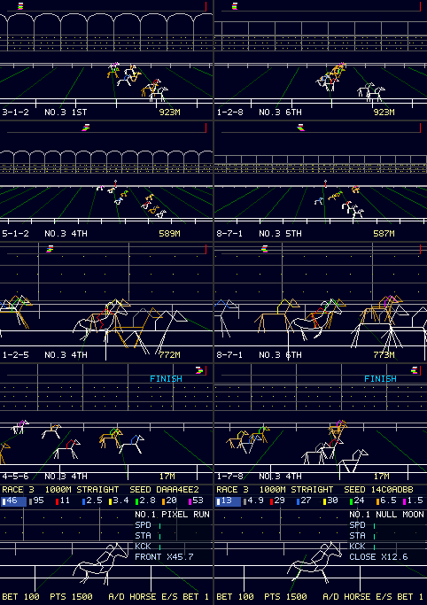

# DERBY WATCH: 首振りカメラ（段階 3）は何にヒープを使うか、事前コンパイルで減るか

2026-09-30、ブランチ `vm/pan-camera`。段階 3（首振り WIDE、このブランチの最後の wip コミット、マージしない）は実機の DRAM に収まらなかった（[derby-watch.md](derby-watch.md) の「首振りカメラ（段階 3）」）。ユーザーの問い「首振りはそんな大規模なコードになるのか、事前コンパイルでなんとかなるか」への材料。**数値は host（WSL、`-m32` で実機と同じ 8 B の JSValue、確保は実機の TLSF の長さで課金）の実測**。断りのあるものだけ実機か推定。

**2026-10-01 の現状: 段階 3 は `vm/main` b184202 に追従させてマージに出した（§11）。fps 以外の条件は満たし、首振り WIDE は 25 fps 前後で 30 fps を割る（ユーザーの決定 q24 で、承知のうえで入れる）。楕円（段階 4）への引き継ぎも §11 に置いた。**

## 結論

- **段階 3 のコードは約 3 KB（ソースのコメント抜き）だが、ゲストに常駐するのは約 9.4 KB（コンパイル済み）で、実行後は +11.1 KB になる**（host、評価後）。内訳は、関数の固定費、atom、バイトコード。一番大きい関数は `pan()` 2.0 KB と `ser()` 1.7 KB。
- **関数の固定費は小さな関数 1 つで約 200 B**（2 引数の 1 行の関数を足した差、名前の atom を含む）。段階 3 は関数を 9 つ足した。
- **事前コンパイルは定常のヒープを減らさない**。`JS_WriteObject`（行番号表つき）→ `JS_ReadObject` の常駐は、ソースからコンパイルしたものとバイト単位で同じ（63,796 B = 63,796 B）。`JS_ReadObject` はバイトコードを RAM に写して atom を書き換えるので、flash に置いたままにはできない（[eval-peak.md](../vm/eval-peak.md) §3.5）。減るのは評価のピーク（解析の一時領域）だけ。
- **行番号表を落とすと（`STRIP_DEBUG`）、アプリ全体で −3.7 KB**（段階 3 の分は −0.6 KB）。ファームはすでに関数のソース文字列を持たない（`CONFIG_POCKET_VM_STRIP_FN_SOURCE`、`quickjs.c` の `js_function_toString` の注記。`fd->source` はどこでも設定されない）が、行番号表（pc2line）は残している。`JS_SetStripInfo` や評価時の strip の指定は無い（`app_session.c`・`pocket_app_load.c` を確認）。
- **受け入れ条件には、どの組み合わせでも届かない見込み**（下の表、推定）。一番遠いのは「ネイティブの空きのターン内最小の悪化 2 KB 以内」で、機能を削り切っても 3 KB 前後足りない。

## 1. 増えた分の内訳

`tools/vmtest/retain_cost.py`（新規。エントリと評価中に読む 4 チャンクを 1 つのランタイムでコンパイルし、関数を保ったまま `JS_ComputeMemoryUsage` を取る）。

| | 基準 00a7c26 | 段階 2 | 段階 3 | 段階 3 − 段階 2 |
| --- | ---: | ---: | ---: | ---: |
| 課金（コンパイル済み） | 53,496 | 54,388 | 63,796 | **+9,408** |
| atom（個・B） | 445・23,919 | 447・23,984 | 482・26,243 | +35・+2,259 |
| バイトコードの関数（個・構造体 B） | 53・11,369 | 54・11,670 | 63・14,519 | +9・+2,849 |
| バイトコード本体 | 18,491 | 18,945 | 22,562 | +3,617 |
| 行番号表（pc2line） | 2,588 | 2,652 | 3,276 | +624 |

評価して実行した後（`DERBY_EVAL_ONLY`、`JS_DumpMemoryUsage`）は段階 2 から +11,027 B（atom +3,156、関数の構造体 +2,777、バイトコード +3,206、pc2line +624、オブジェクト・プロパティ・シェイプ・配列 約 +1,260）。実行後の方が多いのは、カメラの表の行・`PAN`・グローバルの束縛など、トップレベルが作る値の分。

部分ごと（その部分だけを消したときに減る量、コンパイル済み、大きい順。`retain_cost.py --parts`）:

| 部分 | チャンク | B |
| --- | --- | ---: |
| `pan()`（1 フレームの組み立て） | scene | 1,988 |
| `ser()`（線上の点列、視野の切り出し、LOD の段） | scene | 1,700 |
| `wide()`（監督の台選び） | view | 524 |
| `pt` plan の文字列（芝） | prog | 472 |
| `hl()` | scene | 460 |
| `rin`（走者の入力、横見と共用） | view | 456 |
| `prail` plan の文字列 | prog | 376 |
| `pj()`（投影） | scene | 336 |
| `inr()` | scene | 312 |
| `feed()`（中継、横見と共用） | view | 284 |
| `lim()` | scene | 280 |
| `pc` plan の文字列（観客） | prog | 272 |
| `hl` plan の文字列 | prog | 204 |
| 残り（`shot` の首振りの分岐、`paint` の 4 隅の判定、監督の 1 行、カメラの表の 3 行、`PAN` と 7 つの `let`） | view・scene・play | 約 1,700 |

plan の文字列は atom として常駐する（文字数 ＋ 約 20 B）。

## 2. 事前コンパイルの上限（`retain_cost.py <dir>`、3 つの形で読み込む）

| 形 | 基準 | 段階 2 | 段階 3 |
| --- | ---: | ---: | ---: |
| (a) ソースからコンパイル（今のファーム） | 53,496 | 54,388 | 63,796 |
| (b) `JS_WriteObject`（行番号表つき）→ `JS_ReadObject` | 53,496 | 54,388 | 63,796 |
| (c) `STRIP_DEBUG \| STRIP_SOURCE` で書いて読む | 50,452 | 51,276 | 60,052 |

- (b) は (a) と完全に同じ。定常の削減は 0（以前の実機のスパイクでも、落ち着いた後 119,440 と 119,692 B でほぼ同じ、eval-peak.md §3.5）。
- (c) で減るのは行番号表と数個の atom（ファイル名）だけ: 基準 −3,044、段階 3 −3,744 B。代わりにエラーと `FRAMEFAIL` の位置（`derby_scene.js:125`）が出なくなる。**事前コンパイルでなくても、パーサが行番号表を作らない（または捨てる）VM の変更で同じだけ減る**（未実装、VM の路線の判断）。
- flash に置いたバイトコードから読んでも、`JS_ReadObject` は RAM に写してから atom の番号を書き換えるので、バッファの分は RAM に要らないが、関数の中身は全部 RAM に載る。flash 常駐にするには、atom の読み方か番号の固定（ROM atom）の VM 改造が要る（中〜重、§3.5）。

## 3. 規模を削る案（C）と受け入れ条件

host の評価後のゲスト（m32、段階 2 からの増分。累積で削った実測）:

| 削ったもの | 減った量 | 残りの増分 |
| --- | ---: | ---: |
| （段階 3 そのまま） | — | +11,092 |
| 観客の点を別 plan にしない・芝を 1 色に（plan −2 本） | −432 | +10,660 |
| 首振りで大型画面を映す経路 | −592 | +10,068 |
| 首振りの距離標 | −524 | +9,544 |
| LOD の段（1 本の線を 1 draw、歩幅一定） | −612 | +8,932 |
| 台を 1 台・自動ズームなし | −260 | +8,672 |

- **関数の統合**（`pj`・`lim`・`inr`・`hl`・`feed` を呼び出し側へ）: 固定費 約 200 B × 5 で −1.0 KB 前後、書き直したコードの重複で一部戻る（推定）。
- **表を文字列に**: カメラの表の 3 行と `PAN` は数十 B で、効かない。plan の文字列はすでに文字列（atom）。
- **観客は今の見た目のまま**にするので、観客を横線にする案と散らしを捨てる案は採れない。今の見た目の点を首振りで描くには、区画ごとの逆数を足した観客の plan（リードの実測で 57 命令・16 レジスタ）が要り、plan 1 本と数百 B のコードが増える（推定）。

受け入れ条件との差（実機の値に換算。実機の評価後の増分は host の約 1.3 倍だった: 14.5 KB と 11.1 KB。削った版は実機では測っていない、推定）:

| 条件 | 基準（実機） | 削り切った版の見込み | 足りない量 |
| --- | ---: | ---: | ---: |
| ターン内の空きの最小が基準から 2 KB 以内 | 13,256 B | ゲスト +約 10 KB（8.7 KB × 1.3、統合で −1 KB）と plan 4 本 約 3.5 KB → 約 −13 KB | **約 11 KB** |
| 　同、pc2line を落とす VM の変更を足す | | アプリ全体で −約 4.8 KB（3.7 × 1.3） | 約 6 KB |
| 　同、首振りの plan を `fr`・`hd`・`vis`・`gate` と入れ替える | | plan の分がほぼ 0 | 約 3 KB |
| 評価の余裕 20 KB 以上 | 29,969 B | 約 29,969 − 1,199（段階 1・2）− 約 10 KB | 0〜1 KB（境目） |
| ゲストの最大 140 KB 以下 | 128,736 B | 約 138.5 KB | 満たす見込み |
| 毎レース plan 全部が載る | 25 本 | 空きの最小が上と同じだけ下がるので、門（18,432 B）で詰まる見込み | 上と同じ |

**首振りを入れる道は、別の所でゲストかネイティブを 3〜11 KB 空けることになる**（例: pc2line を落とす VM の変更で約 5 KB、場面ごとの plan の入れ替え）。どれも段階 3 の外の変更で、未検討。

## 確信の低い点

- 実機の値の換算（host の 1.3 倍）は 1 点（段階 3 そのまま）の比から。削った版は実機で測っていない。
- 部分ごとの量は「その部分を消した差」で、共有の atom や、消したことで変わる他の関数のバイトコードを含む（合計は全体と一致しない: 部分の和 7.7 KB、全体 9.4 KB）。
- (c) の −3.7 KB は host のコンパイル済みの値。実行後の定常にも同じだけ効く（行番号表は関数と一緒に残る）と見込むが、実機では測っていない。

## 8. 段階 3 の外で空けた分（ブランチ `vm/derby-trim`、実機の前後）

2026-09-30。§3 の「別の所でゲストかネイティブを空ける」の最初の分。§4〜7 は `vm/pan-camera` 側のこの文書にあり（§7 が関数の畳み込みの実測）、ここでは番号だけ続ける。見た目・着順・全画素ハッシュは変えていない（host の全 13 回で一致）。

変更（`vm/main` 31b2dbb からの 9 コミット、host m32 の値）:

| 変更 | コミット | 常駐 | 評価のピーク |
| --- | --- | ---: | ---: |
| 単発の関数を畳む: `frame_` → `frame`、`gallop` → `spec`、`spec` → `load` | 702ac2f・900d2b4・1083fb6 | −444 B | −3,588 B |
| plan を 4 bit に詰めた文字列で持つ（`pack.mjs --nibble`、原本は `derby_prog_text.js`、`run_derby.py` が一致を検査） | 523acfc | −1,704 B | −1,408 B |
| 描画の `[plan, 入力]` の配列をやめ、コースを組みながら 1 本ずつ `dr()` で描く | 309332e | −16 B | −48 B |
| 復号器の自己再帰（`-v()`）をやめる（下の退行の修正） | 6a9d777 | +48 B | +48 B |
| **計**（54,388 → 52,272、評価後 108,244 → 106,404） | | **−2,116 B** | **−4,896 B** |

**退行と検査**: 詰めた plan の復号器が負号を自分の再帰で読んでいた（`v()` が `-v()` を呼ぶ）。自分を参照するクロージャは循環なので、登録のたびに循環コレクタにしか回収できないゴミが残る。実機のコレクタはゲストの上限の近くまで走らない（`js_trigger_gc`）ので、ゲストが 1 レース約 4 KB ずつ増え、2 レース目からゲートで `LOADSTALL` になった。host の検査はフレームごとに GC を回していたので通っていた。`test_derby_host` は場面ごとに「循環コレクタだけが解放したバイト数」を出し、0 を合格条件にした（e7d0dcd）。

### 実機の前後（2026-09-30）

基準は `vm/main` d04f20c（plan-alloc と strip-debug をマージ済み、Kconfig 既定 OFF）、枝はそれをマージした 048557e。C は同じで、違うのは JS だけ。評価の余裕は heapprobe image（`derby` 変種、`--bisect 29 --step 256`）、ほかは診断 image（`-DKASANE_MEGADEMO_TRACE=ON -DKASANE_BGCOST_TRACE=ON -DPOCKET_KEYTEST=ON`）でキーを押さずにデモを流した（MID 420 秒で 6 レース、HEAVY 250 秒で 4 レース）。各 1 回。

| | 基準 | 枝 | 差 | host m32 の差 |
| --- | ---: | ---: | ---: | ---: |
| 評価の余裕（上限 163,840 − 評価できる最小の上限） | 28,814 B（135,026 で可、134,816 で OOM） | 34,071 B（129,769 で可、129,558 で OOM） | **+5,257 B** | 評価のピーク −4,896 B |
| 評価後のゲスト（heapprobe の `used`） | 117,604 B | 114,296 B | −3,308 B | 評価後 −1,840 B |
| 評価後のゲスト（診断 image、`APP_LOAD play` の最後） | 121,652 B | 118,216 B | −3,436 B | |
| ゲストの最大（`gu`）MID / HEAVY | 130,856 / 130,884 B | 126,456 / 126,508 B | **−4,400 / −4,376 B** | |
| ネイティブの空き、ターン境界の最小（`free`）MID / HEAVY | 33,356 / 27,808 B | 37,884 / 32,532 B | +4,528 / +4,724 B | |
| ネイティブの空き、ターン内の最小（`mn`、どちらもゲートの登録）MID / HEAVY | 23,336 / 17,536 B | 30,300 / 24,904 B | **+6,964 / +7,368 B** | 登録のピーク fr 9,556 → 7,024 B |
| fps（レース全体）MID / HEAVY | 29.1 / 28.1 | 29.0 / 27.9 | −0.1 / −0.2 | |
| fps（VISION）MID / HEAVY | 26.2 / 25.0 | 25.6 / 24.3 | −0.6 / −0.7 | |
| JS のターンの中央値（レース全体）MID / HEAVY | 14.85 / 15.67 ms | 14.97 / 15.82 ms | +0.12 / +0.15 ms | |
| JS のターンの中央値（VISION）MID / HEAVY | 18.09 / 19.53 ms | 19.02 / 20.71 ms | +0.9 / +1.2 ms | |
| `LOADSTALL`・`FRAMEFAIL`・`LOADFAIL`・`DEMOFAIL` | なし | なし | | |

- **ネイティブの空きのターン内最小は基準（今日の `vm/main`）で 23.3 KB あり**、§3 の表の 13,256 B（00a7c26、plan-alloc の前）から大きく増えている。plan-alloc（plan を命令数で確保）の分で、この枝の分は +7.0〜7.4 KB。§3 の「2 KB 以内」の比較は、基準を今日の値に取り直す必要がある。
- **レースを重ねてもゲストは増え続けない**（レースごとの `gu` の最大、ゲートの最初のフレームの `gu`）:

| レース | 1 | 2 | 3 | 4 | 5 | 6 |
| --- | ---: | ---: | ---: | ---: | ---: | ---: |
| 枝 MID | 126,352 | 126,364 | 126,356 | 126,376 | 126,392 | 126,456 |
| 基準 MID | 130,780 | 130,856 | 130,804 | 130,784 | 130,824 | 130,800 |
| 枝 HEAVY | 126,388 | 126,464 | 126,468 | 126,508 | | |
| 基準 HEAVY | 130,776 | 130,884 | 130,728 | 130,716 | | |

  修正前（523acfc〜309332e）は 1 レース約 4 KB 増えた。枝は 6 レースで +104 B（1 レース約 20 B）で、基準は ±70 B の揺れで傾きが無い（下の「確信の低い点」）。ターン内の最小（`mn`）は、基準も枝も 6 レースで約 1.5 KB 下がる（24,864 → 23,336、31,724 → 30,300）。ネイティブの側の断片化と見られ、この枝の変更とは無関係。
- **一巡**（診断 image）: パドックで `1` → レース → 写真 → 結果 → `R` の再生（`FINISH` の全桁が一致）→ `1` で次のレース → 放置でデモ → キーで `DEMO END` → Back（`SAVE points=6570 race=13`）。通常 image で起動し直すと `LOADED points=6570 race=13`。
- **回帰**（通常 image）: `smoke_device.py --cycles 20`（`SMOKE_OK 20`）、`stress_app.py`（`STRESS_APP_PASS`）、`test_app_resume.py`（IMU CAL・PET・COMPANION の中断と再開、`TEST_APP_RESUME_OK`）。

### フレームごとの配列の確保を減らす残り（入れなかった）

`test_derby_host` の `frame()` の確保（MID のレース、1 フレームあたり）は 189.1 回・7,849 B、1 フレームの中の最大の上がり 2,304 B（`[plan, 入力]` の配列をやめる前は 269.1 回・10,505 B・7,396 B）。残りを 2 通り試した（host m32 の実測、どちらも全画素ハッシュと着順は同じ）:

| 試したもの | 確保 / フレーム | 最大の上がり | 常駐 | 評価後 | 評価のピーク |
| --- | ---: | ---: | ---: | ---: | ---: |
| `up`（HUD の patch）と `P`（キーの読み）をフレームごとのクロージャからトップレベルへ | −6 回・−288 B | −64 B | +4 B | +88 B | +88 B |
| 上に加え、`paint` の `pose()` 2 回を定数に、`at()` を 1 本の配列の使い回しに | −28 回・−1,055 B | −380 B | +192 B | +580 B | +912 B |

- 参照カウントで即座に解放される一時の確保は、ゲストの最大（定常 ＋ ターン内の上がり）にはターン内の上がりの分しか効かない。前者は上がり −64 B で基準（±100 B）に届かず、後者は上がり −380 B に対して評価後の定常が +580 B で、差し引きでゲストの最大が増える。**どちらも入れなかった。**
- ネイティブのターン内の最小はゲートの登録で決まり（上の表）、フレームの配列とは関係しない。

### 確信の低い点

- 実機の値は各 1 回（同じ image のデモのレース 6 本・4 本）。
- **VISION の JS のターン +0.9〜1.2 ms** が本物かは切り分けていない。同じ JS（6a9d777、plan-alloc の前の C）を別の image で測ったときの VISION は 18.51 ms、今回の枝の image では 19.02 ms で、image が違うだけで 0.5 ms 動く。残りの 0.4〜0.7 ms は、`dr()` の関数呼び出し（VISION は中継の分で `course()` を 2 回組む）の可能性がある（推定）。
- **枝の `gu` の 1 レース約 20 B の上昇**は 6 レースの 1 回の測定で、揺れ（基準で ±70 B）と区別できない。host（m32）では 8 回のデモの後の GC 後のゲストが 130,168〜130,372 B で傾きが無い。仮に本物でも、ゲートの門（18,432 B）までターン内の最小の余りが約 12 KB あり、数百レース分。
- 評価後のゲストの差は実機で −3.3〜3.4 KB、host m32 で −1.8 KB（比 1.8 倍）。§3 の 1.3 倍とは合わない。

### 追記（2026-10-01、ブランチ `vm/rom-plans`）

DERBY の plan を flash の表に置き、名前で登録するようにした（[flash-plan.md](../kasane/flash-plan.md) §10）。首振り（段階 3）は含まない。同じ日の 806b10b と比べて、ターン内のネイティブ空きの最小 +18 KB（30.0 → 48.0 KB）、評価の余裕 +4.8 KB（33.8〜34.1 → 38.7 KB）、レース中のゲストの最大 −6.5 KB（126.6 → 120.1 KB）、描画は 9〜17% 遅い（実機、各 1 回）。§3 の「首振りには別の所で 3〜11 KB 空ける必要がある」の空きの大部分にあたる（段階 3 を載せた再評価は `vm/pan-stage3` のこの文書の §10: メモリの条件は満たし、fps だけが足りない）。

## 9. 段階 3 を今日の vm/main に載せ直した再評価（q34、ブランチ `vm/pan-stage3`、2026-10-01）

**結論: 受け入れ条件を満たさない。行番号表 OFF でも ON でも「ターン内のネイティブ空き最小（b）」と「首振り WIDE の fps（e）」が足りない。マージ不可の状態で止めた。** 足りない量は、(b) が OFF で 9.1〜14.1 KB、ON で 10.7〜10.8 KB（許容 2 KB を超えた分）。(e) は首振り WIDE が 24.3〜25.8 fps で、1.2〜2.7 fps 足りない。

### 移植したもの（bdaed0e）

- 段階 3（55956e9）の `wide()`・`shot()` の首振り分岐・`CAMS` の行 7〜9・`pj`・`lim`・`ser`・`inr`・`hl`・`pan`・`paint()` の 4 隅の判定・監督の 1 行を、今の構造（`dr()` で即座に描く、plan は `@plan` の関数）へ移した。`rin`（走者の入力）と `feed`（中継）は横見と共用の関数にした。
- plan は `@plan` の関数で 5 本足した（ゲートで登録、計 30/32）: `prail` 49 命令、`pt`（`t0`/`t1` の 2 本、`$0` が緑）59 命令、`hl` 27 命令。Newton は 1 点 3 段で、`.kjs` の `function`/`unroll` は手で展開した。
- **観客は作り直した（`pk`、56 命令・16 レジスタ）。** 今の `crowd` と同じ見た目にしてある。点は 12/$2 m ごとの列に $1 段で、段の高さは 1.2 + 2.4 i m。1 フレームに半分を描くチェッカー（列ごとに段の偶奇を入れ替える。最初の列は段 0 から始まるよう JS が選ぶ）で、各点は位相の sin で 1.5 px 散らす（列 +2.39996、段 +.9。位相はコース上で固定）。色は `(t >> 3 ^ t) & 1` から始めて列ごとに反転する。LOD は無し（間隔は最小でも数 px。段階 3 の横線への切り替えも無い）。命令数は、最初の素直な形が 75 命令で上限の 64 を超えた。LIGHT（1 区画 3 点、奇数）の色の規則を「偶数のときの並び」に寄せ、段の位相を段の高さから出して 56 命令にした。横見の LIGHT の色の並びは、そもそも画面に入る区画数の偶奇で変わるので、首振りでは偶数のときの並びを使う。
- host の検査（`test_derby_host.c`・`run_derby.py`）は段階 3 のものを移した。Newton の厳密な参照は、MUL の被演算子の順が逆でも拾う形にし、`SIN`・`BREAK_IF_GT` を足した。

### host（WSL、`run_derby.py` の ASan と `--m32`）

- 全 16 回 PASS（ASan・m32 とも）。着順・完走時刻・種・デモ・R の再生・オッズの行は、`SCENE` 行の plan の本数を除いて 806b10b と全行一致した。循環コレクタだけが解放したバイトは全場面で 0。
- 首振りのフレームは MID の台本で 2,199、f は 200〜1,144。Newton の誤差（倍精度の厳密な投影との全点比較）は、画面内の点で最大 0.029 px（画面を動かした実行、f 200）、画面外を含めて最大 0.075 px。
- 線分は最大 555/1,024（首振りの場面では 388）、plan は 30/32、1 draw の step は最大 3,812/10,000。
- ゲスト（m32）: 評価後 106,620 → 117,484 B（+10,864）、評価のピーク 121,032 → 132,188 B（+11,156）、GC 後の最大 131,068 → 141,320 B（+10,252）。

### 実機（COM3、各 1 回。基準は同じ日に焼いた 806b10b の image）

診断 image（`-DKASANE_MEGADEMO_TRACE=ON -DKASANE_BGCOST_TRACE=ON -DPOCKET_KEYTEST=ON`）で、書き込みの 6 秒後に DERBY を開き、キーを押さずにデモを流した（MID 420 秒で 6 レース）。続けて同じ起動のまま、パドックで tab を 1 回押して HEAVY で 250 秒流した。評価の余裕は heapprobe image（`derby` 変種、16 B 刻みの二分探索、2 回）で測った。ON は `sdkconfig.stripdebug.defaults` を重ねた別のビルド。

| 条件 | 基準 806b10b | 枝 OFF | 枝 ON |
| --- | ---: | ---: | ---: |
| (a) LOADSTALL・FRAMEFAIL・LOADFAIL・DEMOFAIL | なし | **HEAVY の 3 レース目で LOADSTALL**（plan 28/30 で発走） | なし |
| (b) ターン内のネイティブ空きの最小（`mn`）MID / HEAVY | 24,908 / 24,896 B | **13,788 / 8,768 B（−11.1 / −16.1 KB）** | **12,156 / 12,224 B（−12.8 / −12.7 KB）** |
| 　ターン境界の最小（`free`）MID / HEAVY | 32,384 / 32,240 B | 21,544 / 16,420 B | 19,776 / 19,880 B |
| (c) 評価の余裕（163,840 − 評価できる最小の上限） | 33,848 / 33,875 B | 21,296 / 21,388 B | 25,291 / 25,291 B |
| (d) レース中のゲストの最大（`gu`）MID / HEAVY | 126,444 / 126,448 B | 139,748 / 140,344 B | 135,628 / 135,768 B |
| (e) 横見 WIDE の fps MID / HEAVY | 29.7 / 29.1 | 29.0 / 28.1 | 29.6 / 28.9 |
| (e) 首振り WIDE（WIDE 2・WIDE 3）の fps MID / HEAVY | — | **24.3〜24.4 / 24.8〜25.1** | **25.0 / 25.7〜25.8** |
| (f) 6 レースのゲストの最大 MID | 125,460・126,356・126,400・126,420・126,444・126,392 | 138,968・139,536・139,624・139,668・139,748・139,632 | 134,936・135,560・135,584・135,532・135,572・135,628 |

- 判定: (a) OFF は不可、ON は可。(b) OFF・ON とも不可（許容 2 KB に対して 9.1〜14.1 KB 足りない）。(c) OFF・ON とも可（OFF の余りは 1.3 KB）。(d) ON は可、OFF の HEAVY は 140,344 B で、140,000 B を超え 140 KiB（143,360 B）以下（どちらの定義かで判定が分かれる）。(e) 横見は可、首振りは不可。(f) 1 レース目から 2 レース目で約 600 B 上がり、その後は ±120 B で平ら（基準も 1→2 で約 900 B 上がる）。
- `mn` はどの構成でもゲートの登録のターンで決まる。首振りのコード（評価後のゲスト、実機で +13 KB 前後）と plan 5 本（命令 250 本ぶん、約 3 KB。推定）が、登録の一時的なピークの下に常駐して、そのまま空きを減らす。
- **首振り WIDE のフレーム**（中央値、MID、OFF）: 間隔 41.0 ms、JS のターン 21.6 ms（横見 WIDE 14.5〜15.7 ms）、うち VM の draw 4.56 ms（横見 2.1 ms）。27 fps（37 ms）には JS のターンを約 4 ms 縮める必要がある。JS 側（`ser` の視野の切り出し・LOD の段・逆数）の分が約 +4.7 ms、VM の分が約 +2.4 ms。
- 一巡（パドック→R 再生→デモ→復帰）・smoke 20・stress・resume・他アプリの起動は、条件を満たさなかったので走らせていない。実機は最後に通常 image（806b10b、`build_q34_base`）を書き戻し、`HOME_READY` を確かめた。設定は変えていない（tab で変えた負荷の段は DERBY の中だけで、保存されない）。

### 見た目（host、[derby-pan-preview.png](derby-pan-preview.png)）

MID の台本で、首振りの最初のショットの 10 フレーム目を近い（f 394）・遠い（f 549）・望遠（f 1,048）の 3 つ撮った。左が同じ時刻の横見だけの実行（`PAN[0]` 1e9）、右が首振り。左右の時刻は同じ tick で、距離の表示が 1 m ずれる。見た目の評価はユーザーに任せる。

### 確信の低い点

- 実機の値は各 1 回。HEAVY は MID の後の同じ起動で測った（基準も同じ手順）。OFF の HEAVY の `mn` が MID より 5 KB 低い理由（断片化か）は切り分けていない。
- **ON の `mn` が OFF より低い**（MID 12,156 と 13,788）。ゲストの最大は ON の方が 4.1 KB 小さいのに、逆になっている。image（静的な配置）の違いか、起動ごとの無線の時刻同期の差の可能性があるが、確かめていない。
- (d) の「140 KB」は、B で 140,000 と 143,360 のどちらかを決めていない。
- 首振り WIDE の fps を上げる案（`ser` を JS で縮める、LOD の段を減らす、Newton を 2 段にする）は試していない。(b) の不足は、首振りのコードをゲートの登録と同時に常駐させない構成（首振りを別チャンクにして、最初に使うときに読み、レースの後に捨てる）でないと埋まらない見込み。これは推定で、チャンクを捨てる仕組みは今の `pocket.app.load` には無い。

## 10. flash の plan（q33）を載せて再挑戦（q35、ブランチ `vm/pan-stage3`、2026-10-01）

**結論: (a)(b)(c)(d)(f) は行番号表 OFF のままで満たした。(e) 首振り WIDE の fps だけが足りない（MID 25.4〜25.6、HEAVY 24.8 fps、27 必要）。マージ不可の状態で止めた。** (b) の不足（q34 で 9〜14 KB）は、plan を flash の表に置いて名前で登録したことで消え、基準より +3.3〜3.7 KB 良くなった。fps は、MID でも奥を 75 m で打ち切って MID が +1.2 fps 上がったが、足りない量は MID で約 2.2 ms、HEAVY で約 3.3 ms（フレーム間隔、37 ms に対して）。

### 入れたもの

- **61c5250**: flash-plan.md §2 の組み込み。`/** @planDecoder rom */` の印、`lower_plans.mjs --rom`、`make_app_chunks.py` の `APP_CHUNK_ROM`、CMake の表の生成、`app_session.c` の 1 行。DERBY は `H.register('derby.' + 名前, 引数, 点列)` で登録する（引数は宣言の数: stands 4、crowd 8、pk 2、runner 3、pt 1、他 0）。出荷する `derby_prog.js` は 6.3 KB（詰めた plan 14 本＋段階3 の 4 本＋復号器）から 1,617 B に、表は flash の `.rodata` に約 8.4 KB（18 本・671 命令、ビルド確認）。
- **2e1dbee**: 首振りの奥の打ち切りを MID でも 75 m に（HEAVY は元から 75 m、LIGHT は 150 m のまま）。

### host（WSL、`run_derby.py` の ASan と `--m32`、全 16 回 PASS）

- 61c5250: 5a6cb6a と比べて、ヒープの行以外（全画素ハッシュ、着順・完走時刻、種、デモ、R 再生、オッズ）が全行一致。循環コレクタだけが解放したバイトは全場面で 0。m32 のゲスト: 評価後 117,508 → 111,716 B（−5,792）、評価のピーク 132,212 → 126,456 B（−5,756）、GC 後の最大 143,504 → 137,228 B。ゲートの 1 フレームの最大の上がり 7,800 → 2,220 B（`prog()` の復号が無くなった）。
- 2e1dbee: 着順・種・デモ・オッズは不変、首振りフレームの線分 −20%、ラスタ −17%、フレームの VM ステップの最大 6,436 → 4,502（MID）。画素は奥の分だけ変わる。
- `check_equivalence.py` は `EQUIVALENCE PASS`・`JS REFERENCE PASS` に戻した（crowd は手書き IR が q27 から古いので、段階 3 の 4 本は手書き IR が無いので、compiled 同士で比べ、JS の関数との比較が実質の検査）。`check_lowered.py` は手書き IR の時点（e9b88bc）の非 plan 部分を前提にした移行時の道具で、段階 3 より前から成り立たない（直していない）。

### 実機（COM3、各 1 回、同じ日・同じ手順）

診断 image（`-DKASANE_MEGADEMO_TRACE=ON -DKASANE_BGCOST_TRACE=ON -DPOCKET_KEYTEST=ON`）を書き込み、同じコマンドのまま DERBY を開き（書き込みの約 8 秒後、無線のリンクの前）、キーを押さずにデモで MID 420 秒（6 レース）、パドックで tab を 1 回押して HEAVY 250 秒（4 レース）。基準は `vm/main` 806b10b の診断 image（`vm-main/build_q34_base_diag`）を同じ手順で測り直した。評価の余裕は heapprobe image（`derby` 変種、16 B 刻みの二分探索、2 回）。ON は `sdkconfig.stripdebug.defaults` を重ねたビルド。

| 条件 | 基準 806b10b | 枝 OFF（61c5250） | 枝 OFF＋75 m（2e1dbee） | 枝 ON＋75 m |
| --- | ---: | ---: | ---: | ---: |
| (a) LOADSTALL・FRAMEFAIL・LOADFAIL・DEMOFAIL | なし | なし | なし | なし |
| (b) ターン内のネイティブ空きの最小（`mn`）MID / HEAVY | 30,052 / 30,040 B | **33,560 / 33,304 B** | **33,396 / 33,788 B** | 35,688 / 37,672 B |
| 　ターン境界の最小（`free`）MID / HEAVY | 37,664 / 37,496 B | 37,948 / 37,720 B | 37,804 / 38,136 B | 42,016 / 42,068 B |
| (c) 評価の余裕（163,840 − 評価できる最小の上限） | 33,848 / 33,875 B（q34） | — | **27,915 / 27,853 B** | 31,905 / 31,952 B |
| 　評価後のゲスト（heapprobe の `used`） | | | 120,688 B | 116,824 B |
| (d) レース中のゲストの最大（`gu`）MID / HEAVY | 126,632 / 126,664 B | 134,412 / 134,480 B | **134,496 / 134,508 B** | 130,312 / 130,376 B |
| (e) 横見 WIDE の fps MID / HEAVY | 29.8 / 29.3 | 29.0 / 28.4 | 29.0 / 28.4 | 29.2 / 28.5 |
| (e) 首振り WIDE（WIDE 2・3）の fps MID / HEAVY | — | 24.2〜24.4 / 24.9 | **25.4〜25.6 / 24.8** | 25.7〜26.0 / 25.2〜25.3 |
| (f) 6 レースのゲストの最大 MID | 125,656・126,620・126,572・126,616・126,632・126,596 | 133,744・134,348・134,392・134,352・134,412・134,376 | 133,692・134,356・134,360・134,408・134,452・134,496 | 129,556・130,176・130,224・130,236・130,292・130,312 |

- 判定（OFF＋75 m）: (a) 可。(b) 可（基準より +3.3 / +3.7 KB）。(c) 可（余り 7.9 KB）。(d) 可（140,000 B に対して 5.5 KB の余り）。(e) 横見は可、首振りは不可。(f) 1→2 レースで約 660 B 上がり、その後の 5 レースは +140 B（基準も 1→2 で約 960 B、その後 ±60 B）。1 レース約 30 B の上がりが本物かは 6 レースでは区別できない（§8 の「確信の低い点」と同じ）。
- **`mn` を決めるターンが、ゲートの登録からレース中に移った**: 基準は MID・HEAVY ともゲート、枝の OFF はどちらもレース中（ON の MID だけは起動直後の最初のターン）。ゲートの登録の谷（`prog()` の復号と行の配列の読み）が無くなったため。表の値は起動直後の最初のターンを含む全ターンの最小。登録の時間は 1 本 1,252 → 568〜580 µs（中央値、`reg_us`/本）、うち解析（`prep_us`）は 172〜176 µs で同じ。PLANSZ の `took` は 44〜76 B（見込みどおり、`blk` 40〜72）。
- **flash からの読みの影響**（描画）: 横見の場面の `draw_us` の中央値は CLOSE 1.76 → 1.83、FIELD 2.58 → 2.80、WIDE 2.14 → 2.34 ms（基準 → 枝 OFF）。ただし image が違い（段階 3 のコードも入っている）、命令キャッシュで 15% 動く範囲なので、flash の読みの分とは言えない。同じ image で配列と名前を切り替える比較はしていない。
- **無線と重なった起動**: 最初の OFF の測定は、DERBY を開いたのが書き込みの約 15 秒後で、無線のリンク（11.3 秒）と重なった。その回は起動直後の最初のターンだけ `mn` 21,848 B（評価の直後、他のターンは 28 KB 以上）で、無線が評価と同時に DRAM を使った分と見られる。表はこの回を除き、基準と同じく無線の前に開いた回だけを載せた。
- **ON の混入（手順の注意）**: ルートの `sdkconfig` はビルドディレクトリ間で共有されていて、ON のビルド（`SDKCONFIG_DEFAULTS` に stripdebug を重ねる）がそこへ `STRIP_DEBUG=y` を書き、その後にビルドした「OFF のつもり」の image が ON になった（最初の 75 m の測定がそれで、表では ON の列にした）。OFF・ON を並べて測るときは `-DSDKCONFIG=<ビルドディレクトリ>/sdkconfig` で分けること。

### (e) 首振り WIDE の fps: 試したものと足りない量

フレーム間隔 ≒ JS のターン ＋ レンダ（`rn`）＋ 転送（`sd`）＋ 約 2 ms。27 fps（37 ms）には、MID（OFF＋75 m）で 39.4 → 37 ms、HEAVY で 40.3 → 37 ms。

| 変更 | 首振り WIDE MID（OFF） | JS / VM draw | 備考 |
| --- | ---: | ---: | --- |
| 段階 3（61c5250） | 24.2〜24.4 fps（41.3 ms） | 22.0 / 4.96 ms | `rn` 9.5、`sd` 7.4 ms（横見 WIDE は 9.1 / 7.4） |
| 奥の打ち切り 150 → 75 m を MID でも（採用、2e1dbee） | **25.4〜25.6 fps（39.4 ms）** | 20.4 / 3.8 ms | HEAVY は元から 75 m で変化なし（24.8 fps） |
| 同、行番号表 ON | 25.7〜26.0 fps（38.9 ms） | 19.7 / 3.8 ms | HEAVY 25.2〜25.3 |
| 柱・縞の最小間隔 4 → 8 px（host だけ、不採用） | — | — | host で VM ステップ −6〜9% だが、LOD の段が増えて draw が 22 → 26 本/フレームに増え、JS の分で相殺される見込み |
| 観客 `pk` の行を増分で（y と sin の位相、不採用） | — | — | 内側は 1 点 15 → 10 ステップになったが、市松で 1 列 1.5 点しか描かないので、列ごとの前処理の増分で VM ステップが 4,502 → 4,606 に増えた |

- **残りの内訳**（MID、OFF＋75 m、実機の中央値）: 首振り WIDE の JS 20.4 ms（うち VM の draw 3.8 ms）、横見 WIDE 15.8 ms（2.3 ms）。首振り固有の純 JS は約 2.8 ms（host のプロファイル: `ser` 6 回、`pan`、`pj` 22 回、`lim` 24 回、`inr` 12 回。横見の `course` の自己時間の約 4 倍）、VM は +1.5 ms（その約 65% が観客 `pk`）。**JS を全部消しても MID は 36.6 ms でようやく届く量**で、関数の展開などの小さな削減（見込み 0.5〜1 ms）では届かない。
- `Newton` の段数（3 → 2）は、1 列・1 柱あたり 3 ステップで、首振りの VM の数% にしかならない見込み（測っていない）。中継（大型画面）の頻度は、首振りのフレームで画面が見えていない（host の MID の台本で 0 フレーム）ので効かない。
- 届かせるには、観客の点の費用（`pk`、ユーザーが粗くするのを却下済み）以外では、フレームに共通の JS（首振りでも横見でも約 12 ms）を削るか、首振りの JS（`ser` の視野の切り出しと LOD）を VM 側へ移す設計の変更が要る（推定）。

### 確信の低い点

- 実機の値は各 1 回（MID 6 レース・HEAVY 4 レース）。基準も同じ日に 1 回。
- ON の列は OFF と同じ日だが、`mn` の差（ON が 2〜4 KB 高い）がすべて行番号表の分かは切り分けていない（ゲストが 4.1 KB 小さいので向きは合う）。
- (c) の基準は q34 の値（同じ 806b10b の heapprobe image）で、今回は測り直していない。
- host のプロファイルは関数を包む計測で、包む費用が小さな関数（`pj`・`lim`・`inr`）を大きく見せる。実機の 2.8 ms の内訳は host の比からの推定。

## 11. `vm/main` b184202 への追従とマージ前の再測定（2026-10-01、ブランチ `vm/pan-stage3`）

**結論: マージに出せる。(a)(b)(c)(d)(f) は満たし、(e) の首振り WIDE だけが 30 fps を割る（MID 25.3〜25.5、HEAVY 24.6〜25.0 fps）。** ユーザーの決定（q24: オーバルコースを入れて予定したコンテンツをすべてそろえてから、fps がプレイフィールに与える影響を見る）により、fps は条件にしないで入れる。基準 b184202 は flash の plan（[flash-plan.md](../kasane/flash-plan.md) §10）で空きが大きく増えているので、(b) は相対（基準から 2 KB 以内）ではなく絶対値で判定した（リードの判断: ターン内の最小 ≥ 11,208 B、ゲートのターンの最小 ≥ 門 18,432 B ＋ 5 KB、`LOADSTALL` なし）。基準との差は約 −14.5 KB で、これは首振りのゲスト（+14.4 KB）とほぼ同じ量。

### 取り込み（マージ 6bd81f3）

- firmware の表の組み込み（CMake・`make_app_chunks.py`・`app_session.c`・`ksn_proc_plan.h`・`lower_plans.mjs`・host の oracle の名前の経路・`check_equivalence.py`・`run_pocket_proc_rom_qjs.py`）は、`vm/rom-plans`（8641b46）と 61c5250 で**バイト単位で同じ**だったので、衝突なしで `vm/main` のものに一本化された。
- 衝突は 5 ファイル: `derby_view.js` と `test_derby_host.c` は、枝の側が「`vm/main` の内容＋段階 3 の行」だったので枝の側を採った（`vm/main` との差は段階 3 の追加分だけ）。文書は両方を残した（`flash-plan.md` は §10 が `vm/rom-plans`、§11 が段階 3 込みの実機。この文書は §8 の追記の後に §9・§10）。
- plan は 32 枠のうち同時 30 本（パドックの 12 本＋ゲートからの 18 本。うち段階 3 が `prail`・`t0`・`t1`・`pk`・`hl` の 5 本）。flash の表は 14 本 6,200 B → 18 本 8,604 B（`.rodata`、ビルド確認）。

### host（WSL、`run_derby.py` の ASan と `--m32`、全 16 回 PASS。基準は 13 回）

- 着順・完走時刻（全桁）・種・デモ・R 再生・オッズ・保存の行は、基準 b184202 と全行一致（差は画素ハッシュと、枝だけにある首振りの 3 回）。循環コレクタだけが解放したバイトは全場面で 0。
- **横見の画素**: 枝の ASan のバイナリを `DERBY_PAN=1e9`（首振りを使わない）で 8 構成（MID・LIGHT・HEAVY、監督だけの 3 段、8 番の CLOSE の 2 段）回し、画素ハッシュが基準とすべて一致した。首振りを止めると、段階 3 は横見の描画を 1 画素も変えない。
- Newton の誤差（倍精度の厳密な投影との全点比較）: 最大 0.0749 px（画面を 700 m に動かし f 200 に固定した実行）、パネル上の点で 0.029 px。通常の台本では 0.028 px 以下。
- m32 のゲスト: 評価後 100,944 → 111,808 B（+10,864）、評価のピーク 116,864 → 126,548 B（+9,684）、GC 後の最大 124,940 → 137,344 B（+12,404）。線分は最大 479 → 555/1,024、plan は 25 → 30/32。
- `tools/kasane_contract/run.sh`（`GAMES_M32=0`）、`run_pocket_proc_rom_qjs.py`（`--mutate` も）、`check_equivalence.py`（`EQUIVALENCE PASS`・`JS REFERENCE PASS`）が通る。

### 実機（COM3、各 1 回、同じ日・同じ手順、行番号表 OFF）

診断 image（`-DKASANE_MEGADEMO_TRACE=ON -DKASANE_BGCOST_TRACE=ON -DPOCKET_KEYTEST=ON`、ビルドごとに `-DSDKCONFIG` を分けた）を書き込んだ同じコマンドで DERBY を開き（書き込みの約 8 秒後）、キーを押さずにデモで MID 420 秒（6 レース）。HEAVY は**もう一度書き込んで**から開き、最初のパドックで tab を 1 回押して 250 秒（4 レース）。§10 は HEAVY を MID の後の同じ起動で測ったが、実機の 1 回の保持を 10 分までにしたので分けた。評価の余裕は heapprobe image（`derby` 変種、16 B 刻みの二分探索、2 回）。

| 条件 | 基準 b184202 | 枝（6bd81f3） | 差 |
| --- | ---: | ---: | ---: |
| (a) `LOADSTALL`・`FRAMEFAIL`・`LOADFAIL`・`DEMOFAIL`・OOM | なし | なし | |
| (b) ターン内のネイティブ空きの最小（`mn`）MID / HEAVY | 48,020 / 48,300 B | **33,636 / 33,820 B** | −14.4 / −14.5 KB |
| 　ゲートのターンの最小 MID / HEAVY | 50,648 / 50,976 B | **35,768 / 35,752 B** | −14.9 / −15.2 KB |
| 　ターン境界の最小（`free`）MID / HEAVY | 52,460 / 52,712 B | 38,016 / 38,136 B | −14.4 / −14.6 KB |
| 　最大の連続（`lg` の最小） | 31,744 B | 25,600 B | −6.1 KB |
| (c) 評価の余裕（163,840 − 評価できる最小の上限） | 38,686 / 38,903 B | **27,930 / 27,930 B** | −10.8〜11.0 KB |
| (d) レース中のゲストの最大（`gu`）MID / HEAVY | 120,104 / 120,056 B | **134,468 / 134,600 B** | +14.4 / +14.5 KB |
| (f) 6 レースのゲストの最大 MID | 119,116・120,088・120,068・120,104・120,080・120,048 | 133,704・134,340・134,312・134,416・134,468・134,436 | |
| 登録 1 本（`reg_us`/本の中央値）MID / HEAVY | 564 / 562 µs | 570 / 565 µs | 同じ |
| (e) 横見の fps MID: WIDE・FIELD・CLOSE・FINISH・HEAD ON・VISION | 29.8・29.4・29.6・29.5・30.3・25.5 | 29.0・29.2・29.9・29.5・29.7・25.4 | |
| (e) 横見の fps HEAVY: 同じ順 | 29.3・28.3・30.0・29.8・29.5・24.4 | 28.4・28.3・29.7・29.8・29.6・24.3 | |
| (e) **首振り WIDE（WIDE 2・WIDE 3）の fps** MID / HEAVY | — | **25.3・25.5 / 24.6・25.0** | |
| 　首振り WIDE の JS のターン / VM の draw（中央値）MID / HEAVY | — | 20.4 / 3.8 ms、21.6 / 4.5 ms | 横見 WIDE 15.9 / 2.3 ms |

- 判定: (a) 可。(b) 可（ターン内の最小 33.6 KB ≥ 11,208 B、ゲートのターン 35.75 KB ≥ 23,552 B、`LOADSTALL` なし）。(c) 可（20 KB に対して 7.9 KB の余り）。(d) 可（140,000 B に対して 5.4 KB の余り）。(f) 可（1→2 レースで約 640 B 上がり、その後の 4 レースは ±130 B。HEAVY は 2→4 レースで +116 B。基準も 1→2 で約 970 B 上がる）。(e) 横見は従来どおり（WIDE の −0.8〜0.9 fps は image の違いの範囲か、段階 3 のコードが同じフレームの JS に足す分。切り分けていない）、首振りは 30 fps を割る。
- 首振り WIDE が監督に選ばれる区間は、実機の MID 6 レースで横見の WIDE の約 3 倍（フレーム数 1,644 と 518）。プレイヤーが見るレースの絵の約 4 分の 1 が 25 fps 前後になる。
- 一巡（診断 image、keytest）: パドックで `1` → レース（FIELD → WIDE 2 → WIDE → WIDE 2 → CLOSE → WIDE 3 → CLOSE → VISION → WIDE 3 → HEAD ON → FINISH）→ 写真 → 結果 → `R` の再生（`FINISH` の全桁が一致）→ `1` で次のパドック → 放置でデモ → キーで `DEMO END` → Back（`SAVE`）→ 起動し直すと `LOADED`。KEYTEST（`r`）の起動と Back。
- 回帰（通常 image）: `smoke_device.py --cycles 20`（`SMOKE_OK 20`）、`stress_app.py`（`STRESS_APP_PASS`）、`test_app_resume.py`（`TEST_APP_RESUME_OK`）、MEGADEMO（NEWS・TWIST・ZENITH・LIMIT の全場面）・LCD CATCH・BIG WAVE・DERBY の起動と Back。
- 一巡で DERBY の保存が進んだ（`points=6370 race=15` → `points=6270 race=16`）。保存を書き戻す手段（`storage.kv` をホストから書く経路）が無いので戻していない。
- 実機は最後に通常 image（`vm/main` b184202、`build_b184_norm`）を書き戻し、`HOME_READY` を確かめた。設定は変えていない。

### 楕円（段階 4）への引き継ぎ

**残りの余裕**（枝の実測、楕円で plan とゲストがさらに増える前提）:

| 資源 | 今の値 | 下限・上限 | 余り |
| --- | ---: | ---: | ---: |
| ターン内の最小（`mn`） | 33.6 KB | 11,208 B | 約 22 KB |
| ゲートのターンの最小 | 35.75 KB | 23,552 B（門 18,432 B ＋ 5 KB） | 約 12 KB |
| 評価の余裕 | 27.9 KB | 20 KB | **7.9 KB** |
| レース中のゲストの最大 | 134.6 KB | 140,000 B | **5.4 KB** |
| plan の枠（同時） | 30 本 | 32 本 | **2 本** |
| plan 1 本の命令 | `prail` 49・`pt` 59・`pk` 56・`hl` 27（横見の `runner` 40、`fr` 56） | 64 | 5〜37 |
| view の ref（パドック） | 32 | 32 | 0 |

- **一番細いのはゲストの最大（5.4 KB）と評価の余裕（7.9 KB）**。段階 3 はゲストを約 14.4 KB 使ったので、楕円の JS が段階 3 の半分を超えると (d) を割る（推定）。楕円の追加は関数を足すより、`pose()`・`pj()` を曲線に広げて既存の関数で吸収する方が安い（関数の固定費は 1 つ約 200 B、§1）。
- plan の枠は 2 本。曲線の柵を新しい plan にするより、`prail` を短い直線の弦に分けて draw を増やす方が枠を使わない（下）。

**首振り・`CAMS`・pose の構造のうち、楕円で変わる所**（コードの読みからの見込み）:

- `pose(g, w)` と `CRS` はすでに曲率を持つ（段階 1）。`wide()`・`shot()` の首振りの分岐（台の位置と狙いの点）と `paint()` の大型画面の 4 隅は `pose` を通るので、そのまま曲線で動く。
- **`ser()` は直線を前提にしている**: 格子の点を `q + e·V`（コース上の距離 g に 1 次）で歩き、VM は 1 本の draw で等間隔に進む。曲線では g に 1 次でなくなるので、曲線の区間を短い弦に分け、弦ごとに `ser()` を呼ぶ（draw が増え、JS の `lim`・`inr` も弦の数だけ回る）。`hl()`（段の横線）と `pt`（芝の縞の `farX`/`farZ`）も同じ前提。
- `pan()` の距離標（`pj(m, DFR)`）と走者（`pj(xs[l] − 12.5U, DL[l])`）は世界の x をコースの距離 g と同じとみなしている。楕円では `pose(g, w)` を通して世界座標に直す必要がある。
- 横見の台（`CAMS` の 0〜5 行、`course()`）は全体が直線の前提（`cx` はコース上の m）。楕円では直線の区間（ホームストレッチ・バックストレッチ）でだけ使い、曲線の区間は首振りの台（7〜9 行、`[f, 高さ, 地平線, g, w]`）に任せる形になる見込み。台の行は `g, w` で置くので、曲線の内側に台を足すのは行を足すだけ（plan は増えない）。
- HEAD ON の `hd`（44 点の焼いた点列）と写真判定は、決勝線が直線の上にある限り変わらない。VISION と大型画面は `pose` で置いているので、画面を直線の上に置く限り変わらない。

**fps の見通し**: 首振り WIDE はいま 25 fps 前後（JS 20.4 ms、うち首振り固有の JS 約 2.8 ms・VM +1.5 ms。§10）。曲線を弦に分けると、`ser()` の呼び出しと draw が弦の数だけ増えるので、曲線の上の首振りは今より遅くなる見込み（推定。弦 1 本あたりの費用は未測定）。27 fps に届かせる手は §10 のとおり、フレームに共通の JS（約 12 ms）を削るか、`ser()` の視野の切り出しと LOD を VM へ移す設計の変更（どちらも未着手）。

### 確信の低い点

- 実機の値は各 1 回（MID 6 レース、HEAVY 4 レース）。HEAVY の手順が §10 と違う（別の起動）。
- 横見の WIDE の −0.8〜0.9 fps（基準 → 枝）が image の違い（命令キャッシュ）か段階 3 の JS の分かは切り分けていない。
- 楕円の見込み（弦に分ける形、台の配置）はコードの読みからの推定で、試していない。
## 12. 楕円（q24 段階 4、ブランチ `vm/oval`、2026-10-01）

**結論: 楕円コースを入れ、(a)(b)(c)(d)(f) は満たした。首振り WIDE は、直線で 24.8〜24.9 fps（MID）、楕円の曲線区間で 15.1 fps、楕円のホームストレート側で 18.5〜20.1 fps。** 最初の版（e574c73）は曲線区間の首振りが 8.9 fps だったので、JS の費用を削った（リードの判断で案 2）。fps は条件にしない（q24）。ゲストの最大は基準より +4.2 KB で、140,000 B まで残り約 1.4 KB。

### 入れたもの

- **4a（e16a2fd）**: コースはレースの種から決める（`field()`。補正の 8 回の後に、別の乱数列 `seed + 0x2545f491` から 9 回目を引く。楕円の確率は `OV[0]` = 1/2）。曲線の補正は中（`a` 0.25%、`s` 2%）、楕円のオッズは (c)（温度 .92、枠 .15、係数 .787）。直線では、乗数とオッズの項が恒等（×1、+0）になる。パドックの 1 行目は `1000M OVAL` / `1000M STRAIGHT`（既存の text、ref は増えない）。
- **4b（e574c73 と最終のコミット）**:
  - `pose()` は区間の表（`[長さ, 曲率, 始点 x, z, 接線, (曲線の始まりの向き)]`）を持つ。内柵の半径は 120 m で、650 m からは直線と同じ線になる。直線は表を通らない近道（`[g, w, 1, 0]`）で、三角関数を使わない。曲線の点は三角関数 2 回。
  - 首振りの列（`ser()`）は、弦ごとに描く。曲線は `PAN[3]` = 16 本。
    - 弦の端は列ごとの格子に丸める。隣の弦と柱の位置で接するので、継ぎ目に余分な線が出ない。
    - 弦の端は 1 フレームに 1 回だけカメラ座標にする（`VE`）。列ごとの視野の判定（`ou()`）は算術だけで先に行い、視野に入らない弦の本体を回さない。
  - 芝の縞の奥の点は、弦の法線から取る。スタンドの段（`hl`）は弦ごとに描く。
  - 首振りのコードは別チャンク `pan`（`derby_pan.js`）にした。
- **カメラ**:
  - 曲線区間の WIDE は、常に一番近い首振り台にする。FIELD は向こう正面だけにした（`L < OB`）。
  - 楕円では、WIDE 2 の台を曲線の中心近く（内柵から約 110 m 内側、`CAMS` の行の 6 番目の要素）に置く。台が遠くなるので f が長くなり、視野に入る弦の数が減る。直線の台の表は変えていない。
  - **横見のカメラは曲げない**。曲線区間では、柵に沿って展開した直線として映る（リードの判断。曲がって見えるのは首振りが受け持つ）。

### 増分（host m32、評価後 / 評価のピーク / GC 後の最大）

| 段階 | 評価後 | 評価のピーク | GC 後の最大 |
| --- | ---: | ---: | ---: |
| 基準 d587bec | 111,808 | 126,548 | 137,344 |
| 4a（e16a2fd） | +828 | +728 | +916〜1,940 |
| 4b の最初（チャンク分割の前） | +4,204 | **+8,516** | +4,640 |
| 4b（e574c73、`pan` チャンクと `hl` の畳み込み） | +3,812 | +3,760 | +4,092 |
| 最終（JS の費用削減の後） | **+4,788** | **+4,736** | **+4,928**（楕円だけの構成は +5,060） |

- plan の数（同時 30/32）と命令数（`prail` 49・`pt` 59・`pk` 56・`hl` 27）は変えていない。
- scene チャンクにそのまま足すと、そのチャンクのコンパイルのピークが +5.9 KB 跳ねた（`DERBY_COMPILE_ONLY` で、チャンクごとに測った）。首振りを別チャンクにして −4.8 KB。
- 行番号表を落とす（`CONFIG_POCKET_VM_STRIP_DEBUG`）は使っていない（保留のまま）。

### 曲線の fps を上げた手順（実機 MID、各 1 回、診断 image）

| 版 | 曲線の首振り（WIDE 2） | 楕円の WIDE 3 | 直線の首振り（WIDE 2・3） |
| --- | ---: | ---: | ---: |
| 基準 d587bec | — | — | 25.6・25.7 |
| e574c73 | 8.9 fps（JS 93 ms） | 12.6 | 22.6・22.8 |
| pose の近道・三角関数の削減・弦の端の pose の使い回し・pj の展開 | 11.2（70 ms） | 17.9 | 24.8・24.8 |
| 弦の端のカメラ座標と、列ごとの視野の判定（`ou()`） | 12.6（60 ms） | 14.2 | 23.9・24.0 |
| 同、弦 10 本（比較のため。採らない） | 12.6（61 ms） | 15.3 | 23.9・24.0 |
| pose を区間の始点から（曲線の三角関数 2 回） | 13.2（57 ms） | 20.4 | 23.6・23.7 |
| WIDE 2 の台を曲線の中心近くに | 15.1（47 ms） | 18.9 | 23.8・23.9 |
| 直線は弦の判定を飛ばす（最終） | **15.1（47.8 ms）** | **19.1** | **24.8・24.9** |

- **実機の内訳**（計時を入れた一時ビルド、楕円の首振り 1 フレーム）:
  - pose を区間の始点から計算する前: VE 6.2 ms、`ser` 31〜39 ms、走者 6.3 ms、距離標 1.5 ms。直線の首振りは `ser` 8.9 ms、走者 4.4 ms。
  - pose 1 回の費用: e574c73 の形（三角関数が最大 10 回）が 178 µs、区間の始点から計算する形が 135 µs、直線の近道が 26 µs。`Math.sin` 1 回は 18.7 µs（倍精度は soft-float）。
  - `ser` の本体は 1 回約 1.2〜1.5 ms で、直線と曲線でほぼ同じ。曲線では、本体の回数（1 フレーム 26〜31 回、そのうち視野内 21〜25 回）が効いていた。
- **host の回数**（MID の台本、楕円の曲線区間、1 フレームの平均）:
  - e574c73（HEAVY）: `ser` の本体約 52 回（視野内 21.5）、pose 144 回。
  - 最終: 本体 21.5 回（視野内 19.1）、pose 43 回。
  - 直線の首振り: 本体 6 回、pose 20 回。
- 弦の本数は、実機の時間にほとんど効かなかった（16 本と 10 本で 12.6 fps と 12.6 fps）。見た目への効きは大きい。f 約 700 の台から見た弦の中ほどのずれは、スタンドで 16 本 4 px、10 本 11 px（計算）。16 本のままにした。
- host の 1 フレームの JS 時間の比（曲線 / 直線）は 1.9 倍だったが、e574c73 の実機では 3.7 倍に開いた。host は倍精度が速く、pose の三角関数がほぼ費用にならないため。**このアプリの JS の費用は、host の比で見積もれない。**

### 実機（COM3、各 1 回、同じ日・同じ手順、行番号表 OFF）

診断 image で、書き込みの約 6 秒後に DERBY を開き、デモで MID 420 秒。HEAVY は書き込み直後のパドックで tab を押して 300 秒（2 回）。コースは種で決まるので、レースごとに直線と楕円が混ざる（MID は 420 秒で 5 本、うち楕円 3 本。HEAVY は 4 本中 4 本・3 本）。

| 条件 | 基準 d587bec | 楕円（最終） |
| --- | ---: | ---: |
| (a) `LOADSTALL`・`FRAMEFAIL`・`LOADFAIL`・`DEMOFAIL`・OOM | なし | なし |
| (b) ターン内の最小（`mn`）MID / HEAVY | 34,144 / 33,516 | **29,060 / 29,072〜29,352** |
| 　ゲートのターンの最小 MID / HEAVY | 36,140 / 35,628 | 31,836 / 31,744〜31,792 |
| (c) 評価の余裕（heapprobe、2 回） | 27,930 | **22,788 / 22,710** |
| (d) レース中のゲストの最大（`gu`）MID / HEAVY | 134,392 / 134,512 | **138,560 / 138,664〜138,676** |
| (f) 1 レースごとのゲストの最大 MID（S 直線、O 楕円） | 133,660・134,264・134,392・134,308・134,360・134,380 | 137,708 S・138,344 S・138,440 O・138,452 O・138,560 O |
| 首振り WIDE 2・3、直線 MID / HEAVY | 25.6・25.7 / 24.7・24.8 | 24.8・24.9 / 24.0・24.0 |
| 首振り、楕円の曲線（WIDE 2）MID / HEAVY | — | **15.1 / 15.0〜15.1** |
| 首振り、楕円の WIDE 3 MID / HEAVY | — | 19.1 / 18.5〜20.1 |
| 横見 WIDE・FIELD・CLOSE・FINISH・HEAD ON・VISION MID（楕円の版: WIDE は直線のレース、他は楕円のレース） | 29.0・29.2・29.8・29.5・29.5・25.4（直線） | 29.9・29.4・29.4・29.8・30.2・25.6 |

- 判定:
  - (a) 可。
  - (b) 可（ターン内 ≥ 11,208 B、ゲートのターン ≥ 23,552 B）。
  - (c) 可（20 KB に対して 2.7 KB の余り）。
  - (d) 可（140,000 B に対して約 1.3〜1.4 KB の余り）。
  - (f) 可（1→2 レースで約 640 B 上がり、その後は ±220 B。楕円のレースは直線より約 100〜200 B 高い）。6 レース続けた回（直線の近道の 1 つ前の版、opt4）は 137,692 S・138,288 S・138,260 S・138,320 S・138,512 O・138,488 O で、増え続けない。
- 一巡（診断 image、keytest）: 起動で `LOADED` → `1` でレース（直線）→ 写真 → 結果 → `R` の再生（`FINISH` の全桁が一致）→ `1` で次のパドック → 放置でデモ（楕円）→ キーで `DEMO END` → Back（`SAVE`）→ 起動し直して `LOADED`。KEYTEST（`r`）の起動と Back。**楕円のレースの R 再生は、実機では確かめていない**（host では楕円のデモ = 手で走らせたレース、が全桁一致）。
- 回帰（通常 image）: `smoke_device.py --cycles 20`（`SMOKE_OK 20`）、`stress_app.py`（`STRESS_APP_PASS`）、`test_app_resume.py`（`TEST_APP_RESUME_OK`）、MEGADEMO（NEWS・TWIST・ZENITH・LIMIT）・LCD CATCH・BIG WAVE・DERBY の起動と Back。
- 一巡で DERBY の保存が進んだ（`points=6270 race=16` → `points=6170 race=17`）。
- 実機は最後に通常 image（d587bec）を書き戻し、`HOME_READY` を確かめた。設定は変えていない。

### host（WSL、`run_derby.py`）

- ASan と `--m32` を、種の混在・`--course straight`・`--course oval` の各条件で、全 16 回 PASS（計 6 構成）。
- **直線は d587bec と全行一致**（着順・完走時刻・オッズ・結果・保存・**全画素ハッシュ**）。
- 楕円は、R 再生とデモ（= 手で走らせた同じレース）が全桁一致。
- Newton の誤差は最大 0.029 px。線分は最大 555/1,024。循環コレクタだけが解放したバイトは全場面で 0。
- `tune_derby.mjs`:
  - 直線: 2 万レースの出力が d587bec と全行一致。
  - 楕円: 4 万レースで、枠 14.1〜11.0%、本命 40.4%、全群の期待値 0.784〜0.847、`ODDS_CHECK PASS`。
- `derby_corner.mjs verify`（直線 = 出荷の step）と `app`（アプリの楕円 = 参照実装、4,000 種で全ステップ全桁）が PASS。
- `tools/kasane_contract/run.sh`（`GAMES_M32=0`）は PASS。ただし `run_pocket_proc_rom_qjs.py` の `scalar: failed`（`invalid instruction entry`）が出る。**d587bec でも同じように出るので、今回の変更の前からある**（plan は変えていない。原因は調べていない）。
- `check_equivalence.py` は `EQUIVALENCE PASS`・`JS REFERENCE PASS`。
- 見た目: [derby-oval-preview.png](derby-oval-preview.png)。行は先頭 290 / 460 / 610 / 800 m、列は監督（曲線では首振り）・横見 WIDE（展開）・FIELD・CLOSE。見た目の評価はユーザーに任せる。

### 確信の低い点

- 実機の値は各 1 回（HEAVY は 2 回）。直線と楕円の本数は種で決まり、HEAVY の直線は 1 レースだけ。
- 直線の首振りの −0.8 fps（MID、基準比）が、image の違い（命令キャッシュ）か JS の分かは切り分けていない。
- ゲストの最大の余りは約 1.4 KB しかない。楕円の追加の描写は、どこかを削らないと入らない。
- 楕円のホームストレート側（WIDE 3）の fps は、レースによって 18.5〜20.1 で揺れる（曲線の弦が視野に入る量が、先頭の位置で変わる）。
- 楕円のコースは、ホームストレートの先（1,073 m 以降）とスタートの手前（−150 m 以前）をまっすぐ延ばしている（2 つ目のコーナーは描かない）。首振りの奥の打ち切り（先頭の 75 m 先）の内側なので、レース中には映らない見込み（推定）。

## 13. 観客を模様線に（P24、ブランチ `vm/crowd-p24`、2026-10-01）

**結論: (a)(b)(c)(d)(f) は満たした。ゲストは少し増えた（評価後 +292 B、評価のピーク +268 B、GC 後の最大 +184〜324 B、host m32）。** 観客は `crowd` 1 本（模様線、[crowd-primitives-design.md](../kasane/crowd-primitives-design.md)）になり、`pk` が消えて plan は同時 **29/32**。

### 増分（host m32、基準 45f309f → P24）

| 項 | 基準 | P24 | 差 |
| --- | ---: | ---: | ---: |
| 評価後 | 116,604 | 116,896 | +292 |
| 評価のピーク | 131,292 | 131,560 | +268 |
| GC 後の最大（構成ごと） | 139,816〜142,280 | 140,140〜142,464 | +184〜324 |
| plan（同時） | 30/32 | 29/32 | −1 |
| flash の plan の表 | 18 本・671 命令・22 パッチ | 17 本・607 命令・32 パッチ | .rodata −656 B（ビルドの size） |

- 増えた分の中身（`DERBY_EVAL_ONLY` で 1 ファイルずつ基準に戻して測った）: `derby_view.js` が大半、`derby_pan.js` は +216 B（最初の版。最終の版はスタンドの段の枝に入れて小さくした）。
- **最初の版は評価のピークが +2,040 B だった**（実機の評価の余裕 22,810 → 20,540 B）。原因は見た目の値を置いた新しいトップレベルの `const CR`（約 1.8 KB。コメントは 0 B）。既存の `KN` に寄せて戻した。
- 定数を `KN[3]` でなく登録の行に直書きすれば、さらに −124 B（評価後）。値を 1 か所にまとめる方を採った。

### 実機（COM3、各 1 回、同じ日・同じ手順）

診断 image（`-DKASANE_MEGADEMO_TRACE=ON -DKASANE_BGCOST_TRACE=ON -DPOCKET_KEYTEST=ON`、ビルドごとに `-DSDKCONFIG` を分けた）を書き込み、約 6 秒後に DERBY を開いてデモで MID 420 秒。HEAVY はもう一度書き込んでから、最初のパドックで tab を 1 回押して 250〜300 秒。評価の余裕は heapprobe image（`derby` 変種、16 B 刻みの二分探索）。コースはデモの種で決まり、回ごとに直線と楕円の数が違う（P24 の最終 MID は 5 本とも楕円、基準 MID は楕円 1・直線 5）。

| 条件 | 基準 45f309f | P24 |
| --- | ---: | ---: |
| (a) `LOADSTALL`・`FRAMEFAIL`・`LOADFAIL`・`DEMOFAIL`・OOM | なし | なし |
| (b) ターン内の最小（`mn`）MID / HEAVY | 29,128 / 29,044 | 25,720 / 25,844 |
| 　同、最初のターン（`MDT 0`）を除く | 29,744 / 28,956 | 29,144 / 28,948 |
| 　ゲートのターンの最小 MID / HEAVY | 31,924 / 31,692 | 31,772 / 31,828 |
| (c) 評価の余裕（heapprobe） | 22,810（141,030 で評価できた） | **22,670**（141,170、2 回同じ） |
| (d) ゲストの最大（`gu`）MID / HEAVY | 138,448 / 138,724 | 138,828 / **138,944** |
| (f) 1 レースごとのゲストの最大 MID | 137,780 O・138,296 S・138,276 S・138,328 S・138,308 S・138,324 S | 138,244 O・138,800 O・138,772 O・138,828 O・138,800 O |
| 同 HEAVY | 137,740 S・138,596 O・138,724 O | 138,144 S・138,840 O・138,720 S・138,944 O |

- 判定: (a) 可。(b) 可（≥ 11,208 B、ゲート ≥ 23,552 B）。(c) 可（20 KB に対して約 2.6 KB の余り）。(d) 可（140,000 B に対して約 1.0 KB）。(f) 可（1 → 2 レースで約 600 B 上がり、その後は ±100 B）。
- (b) の最小は両方とも最初のターン（評価の直後、パドックの 1 フレーム目）で、P24 は 3.4 KB 低い。最初のターンを除くと基準と同じ程度。この差の原因は調べていない（無線のリンクの時期など、起動ごとの条件が効く場所）。
- ゲストの最大は同じコース同士で約 +100〜250 B（楕円同士 HEAVY: 138,596〜138,724 → 138,840〜138,944）。host の GC 後の最大の差（+184〜324 B）と合う。

### fps と時間（中央値）

| 場面 | 基準 fps / JS ms | P24 fps / JS ms |
| --- | --- | --- |
| MID 横見 WIDE（直線） | 29.7 / 14.50 | 29.7 / 14.51 |
| MID FIELD（直線） | 29.5 / 15.07 | 29.7 / 14.80 |
| HEAVY FIELD（直線） | 28.6 / 15.83 | 29.2 / 15.07 |
| HEAVY 首振り WIDE 2（直線） | 23.9 / 22.98 | 24.4 / 21.40 |
| MID 首振り WIDE 2（楕円） | 15.3 / 48.13 | **16.1 / 44.25** |
| HEAVY 首振り WIDE 2（楕円） | 15.3 / 47.51 | 16.1 / 43.95 |
| MID VISION（楕円） | 25.9 / 18.91 | 26.1 / 18.50 |

- VM の draw と帯描画の差は [crowd-primitives-design.md](../kasane/crowd-primitives-design.md) §8.2。
- 楕円の首振りが上がったのは、`pk` の列を別に回していた JS（`ser()` の 1 回分）が消えたため。

### 回帰・一巡

- 一巡（診断 image）: 起動で `LOADED` → `1` でレース → 結果 → `R` の再生（`FINISH` の全桁が一致）→ `1` で次のパドック → 放置でデモ → キーで `DEMO END` → パドックの画面取り込み → Back（`SAVE`）→ 起動し直して `LOADED`。KEYTEST（`r`）の起動と Back。
- 通常 image: `smoke_device.py --cycles 20`（`SMOKE_OK 20`）、`stress_app.py`（`STRESS_APP_PASS`）、`test_app_resume.py`（`TEST_APP_RESUME_OK`）、MEGADEMO（NEWS・TWIST・ZENITH・LIMIT）・LCD CATCH・BIG WAVE・DERBY の起動と Back。
- DERBY の保存が進んだ（`points=6170 race=17` → `points=6070 race=18`）。
- 実機は最後に通常 image（45f309f）を書き戻し、`HOME_READY` を確かめた。設定は変えていない。

### host（WSL）

- `run_derby.py` の ASan と `--m32` で全 16 回 PASS（P24・基準とも）。着順・時計・種・デモ・R 再生・オッズ・保存の行は、P24 と基準で全行一致（ASan と m32 も一致）。全画素ハッシュは全構成で変わった（観客を描くため）。
- **観客以外の画素**: 観客の draw だけを外す（`DERBY_JS` で `H.draw` を包む）と、P24 と基準の全画素ハッシュが MID・LIGHT・HEAVY とも一致（`d3aaac56…`・`0cb6ea30…`・`345b496a…`）。
- 循環コレクタだけが解放したバイトは全場面で 0。Newton の誤差は最大 0.075 px（基準と同じ構成の値）。
- `check_equivalence.py` は `EQUIVALENCE PASS`・`JS REFERENCE PASS`。`test_kir.mjs`・`test_plan_js.mjs` は PASS。
- `tools/kasane_contract/run.sh`（`GAMES_M32=0`）は PASS。ただし `run_pocket_proc_rom_qjs.py` の `scalar: failed`（`register: invalid instruction entry`）は基準でも出る既知のもの（今回は調べていない）。

### 確信の低い点

- 実機は各 1 回。デモの種でコースが決まるので、MID の最終の版は楕円しか走っていない（直線の首振りの MID は、最終の版の 1 つ前の JS の値）。
- (b) の最初のターンの −3.4 KB の原因は未確認。
- ゲストの最大の余りは約 1.0 KB（140,000 B まで）。

## 14. 列を C に（S1b、ブランチ `vm/ser-native`、2026-10-02）

**結論: 楕円コーナーの首振り WIDE 2 が MID 15.9 → 24.6 fps（JS 44.11 → 22.00 ms）、HEAVY 16.0 → 24.4 fps。ゲストの最大は −5.2 KB（実機 MID 138,432〜138,556 → 133,192〜133,276）、評価の余裕は 22,477 → 30,638 B。** `ser()` を倍精度の C（`pocket.derby`、DERBY のセッションにだけ注入）に写し、`draw` を数値引数にした。画素・結果は fac3552 と全行一致（host）。詳細は [derby-ser-native.md](derby-ser-native.md)。

| 項 | 基準 fac3552 | S1b | 差 |
| --- | ---: | ---: | ---: |
| host m32 評価後 / 評価のピーク | 116,996 / 131,660 | 111,524 / 126,008 | −5,472 / −5,652 |
| host m32 GC 後の最大 | 140,240〜142,564 | 134,820〜138,044 | −4,520〜−5,544 |
| 実機 ゲストの最大 MID / HEAVY | 138,432〜138,556 / 138,624 | 133,192〜133,276 / 133,292 | 約 −5.3 KB |
| 実機 評価の余裕（heapprobe） | 22,477 | 30,638 | +8,161 |
| 実機 ターン内の最小 MID / ゲート | 26,124 / 31,876〜31,956 | 33,672〜33,796 / 34,844〜35,152 | +7.5 KB / +3.0 KB |
| DIRAM（`.bss`） / flash | — | — | +96 B / +6,136 B |

- 140,000 B の線まで、ゲストの最大で約 6.7 KB の余りができた（以前は約 1.0 KB）。
- トップレベルの名前は 8 個減り（`ser`・`ou`・`lim`・`inr`・`Lo`・`Hi`・`VC`・`VE`）、`S` が 1 個増えた。

## 4. 横見を首振りの系に統合する（段階 3b、ブランチの 2 つ目の wip コミット）

ユーザーの提案「カメラの統合」。横見の台は「視線がコースの法線に沿う首振り」の特別な場合なので、`course()` を 1 つの投影（`pj()`・`ser()`）で全カメラを描く形にした。plan は高さと地平線を入力で受け（x と z を h·f で割って渡す。1 本目の 1/Z~ は 1 から Newton 20 回）、横見専用の `rail`・`turf`・`stands`・`crowd` の plan を消した。観客は今の見た目のまま（`T.crowd` と同じ sin の散らし・2 色・瞬き。12 m の区画ごとに Newton 3 回、64 命令）。スタンドの屋根の弧は描けなくなった（まっすぐな屋根と中段の線。レジスタが足りず `CUBIC` の 8 本を空けられない）。

**host**（`run_derby.py`、ASan と `--m32`、全 16 回 PASS）: 着順・完走時刻・デモ・種・オッズ・R 再生の行は基準と一致。Newton の誤差はパネル上で最大 0.011 px（LIGHT、f 331）。横見の絵は基準と同じ種・同じフレームで 0.7〜3.4 % の画素が違う（WIDE 3.0 %、FIELD 3.4 %、CLOSE 1.0 %、VISION 2.0 %、FINISH 1.2 %、パドック 0.7 %）。違いの大半は屋根の弧と観客の点の散らし方。

| | 基準 | 段階 3 | 統合（3b） |
| --- | ---: | ---: | ---: |
| host m32 評価後のゲスト（段階 2 からの増分） | — | +11.1 KB | **+6.9 KB** |
| コンパイル済みの常駐（`retain_cost.py`） | 53,496 | 63,796 | 60,888 |
| 同時に載る plan | 25 | 30 | 27 |
| 実機: 評価の余裕 | 29,969 | 15,242 | **18,667** |
| 実機: 評価直後のゲスト | 115,124 | 129,620 | 126,268 |
| 実機: ゲストの最大 | 128,736 | 143,040 | 139,484 |
| 実機: ターン内の空きの最小 | 13,256 | 5,156 | 5,332 |
| 実機: `GO LOADSTALL` | なし | 毎レース | 毎レース |
| 実機 MID: 横見 WIDE fps（JS 中央値 ms） | 29.7（14.2） | 28.5（16.5） | **25.7（20.3）** |
| 実機 MID: FIELD / VISION / CLOSE fps | 29.5 / 26.7 / 29.8 | 28.6 / 26.9 / 29.8 | 25.5 / 24.0 / 28.7 |
| 実機 MID: 首振り fps（JS ms） | — | 27.3〜27.8（18〜19、plan が載らない） | 23.3〜23.4（23.5〜23.8） |
| 実機 HEAVY: 横見 WIDE / FIELD fps | 29.2 / 28.0 | 27.4 / 27.2 | 24.7 / 24.0 |

実機の値は診断 image（`-DKASANE_MEGADEMO_TRACE=ON -DKASANE_BGCOST_TRACE=ON -DPOCKET_KEYTEST=ON`）で MID・HEAVY のデモ各 3 レース、評価の余裕は `heapprobe` の二分探索。段階 3 と統合は plan が全部は載っていない（`LOADSTALL`）状態の値なので、載ればターン内の最小はさらに下がり、fps も下がる。

- **統合はゲストを約 4 KB、plan を 3 本減らした**が、横見が遅くなった: 横見の直線は奥行きが一定なので本来は「拡大＋平行移動」で済むのに、統合では 1 本ごとの Newton の立ち上げ（60 ステップ）、柱 1 本ごとの Newton（9 ステップ）、区画ごとの Newton と点の補間が乗る。横見 WIDE の JS が 14.2 → 20.3 ms（実測）。u = 0 で Newton が「退化して安く」はならない（plan は同じ命令を実行する。分岐が無い）。
- 楕円（段階 4）への見通し: 統合した系は直線の区間ごとに `ser()` を呼ぶ形で、弧は折れ線の区間の列として同じ plan で描ける（点が直線上に並ぶ前提は区間の中だけ）。ただし上の費用はそのまま残る。

## 5. 精度を落とす・式を縮める（数学の近道）

- **plan の常駐メモリは命令数によらない**（`ksn_proc_plan` は `code[64]` を固定で持つ、`ksn_proc_plan.h`）。命令を減らしても、減るのは VM の時間だけ。メモリに効くのは plan の本数と JS のコード。
- **Newton を減らす**（host、LIGHT・MID、`DERBY_PAN=0`、統合の版）: 3 回 → 2 回でパネル上の最大誤差 3.8 px（LIGHT）・1.8 px（MID）、1 回で 40 px・28 px。最悪は観客の手前の区画（12 m の区画は近いと奥行きの比が 0.5 を超える）。0.5 px に収めるには、手前の区画を細かい歩幅で描く（draw が増える）か、1 回 1 区画にする必要があり、時間の得は相殺される（推定）。命令は prail 53→50、pt 62→56、観客 64→61 で、メモリは変わらない。
- **plan の本数を減らす**: 芝の 2 色（`t0`/`t1`）は、1 本の draw の中で色を入れ替えれば 1 本にできる（1 縞 +4 命令、plan −1 本 = ネイティブ −0.87 KB、推定）。観客の 2 色（`c0`/`c1`、瞬きの位相）は、観客の plan が 64 命令・入力 8 個を使い切っていて 1 本にできない。`hl` を `prail` に入れるのも命令が足りない。
- **式を畳む**: 視野の 4 つの不等式（`lim`）を配列 1 つのループにする、`inr`・`hl` を呼び出し側に入れる、は小さな関数の固定費 約 200 B ずつで、合わせて 0.5〜1 KB（推定）。遠→近の Newton の代わりに「前の 2 点からの一次外挿＋Newton 1 回」は、1 点 1 演算の得（時間）で、レジスタが 1 本要る（観客と柵の plan には空きが無い）。投影を「画面 x = (a + bt)/(c + dt)」として 1 点ずつ Newton で割るのは今の形そのもので、これ以上畳めない。

## 6. 受け入れ条件との差（一覧）

条件: `LOADSTALL` なし、ターン内の空きの最小 ≥ 11,208 B（基準 13,256 − 2 KB）、評価の余裕 ≥ 20 KB、ゲストの最大 ≤ 140 KB、fps ≥ 27。「実測」の行以外は推定（host の差 × 1.3 で実機に換算、plan 1 本 872 B）。

| 構成 | ターン内の最小 | 評価の余裕 | ゲストの最大 | fps（横見 WIDE / 首振り） | LOADSTALL |
| --- | ---: | ---: | ---: | --- | --- |
| 段階 3（実測） | 5,156（−6.1 KB） | 15,242（−5.2 KB） | 143,040（+3 KB 超） | 28.5 / 27.3（plan 未載） | あり |
| 統合 3b（実測） | 5,332（−5.9 KB） | 18,667（−1.8 KB） | 139,484（満たす） | **25.7 / 23.3（−1.3 / −3.7 fps）** | あり |
| 3b ＋ 芝を 1 本 | 約 6.2 KB（−5.0） | 同じ | 同じ | ほぼ同じ | あり |
| 3b ＋ 首振りの画面の経路を外す | 約 7.0 KB（−4.2） | 約 19.4 KB | 約 138.7 KB | 同じ | あり |
| 3b ＋ 行番号表を落とす VM の変更（アプリ全体 −3.7 KB × 1.3） | 約 11.8 KB（満たす見込み） | 約 24 KB（満たす） | 約 134 KB | 同じ | 境目 |
| 段階 3（横見はそのまま）＋ 行番号表を落とす | 約 10 KB（−1.2） | 約 20 KB（境目） | 約 138 KB | 28.5 / 27 前後 | 境目 |

- 時間の条件は統合で悪くなる（横見 WIDE 25.7 fps）。統合で得たメモリ（約 4 KB と plan 3 本）と引き換えに、横見の fps を 4 落とす。
- **メモリの条件に届くのは、アプリの外の変更（行番号表を落とす VM の変更、約 5 KB）を足した場合だけ**。その場合も、plan が全部載った状態のターン内の最小は測っていない（今の実測は `LOADSTALL` で plan が欠けた状態）。

## 7. 関数を呼び出し側に畳む（実測、host m32、コンパイル済みの常駐）

リードの分析（「関数の数が本命: 51 個 × 1 関数 200〜316 B」）を、畳んで確かめた。`retain_cost.py <dir>` で、段階 3（55956e9）のチャンクから順に 1 つずつ畳んだ累積の差。

| 畳んだもの | 呼び出し | 差 |
| --- | ---: | ---: |
| `pan()` を `course()` へ | 1 | −168 B |
| `wide()` を監督へ | 1 | −224 B |
| `lim()` を 1 つのループへ | 4 | −72 B |
| `inr()` を 1 つのループへ | 2 | −168 B |
| `rin` を 2 か所に展開 | 2 | +80 B |
| `hl()` を 2 か所に展開 | 2 | −72 B |
| `feed()` を 2 か所に展開 | 2 | −68 B |
| **計（7 つ）** | | **−692 B**（63,796 → 63,104） |

基準（00a7c26）の単発の関数でも同じ: `sound()` を `frame` へ −168 B、`settle()` を `frame_()` へ −148 B。

- **単発の関数を畳む得は 1 つ 150〜220 B**（小さな関数を足したときの固定費 約 200 B と合う）。2 回以上呼ぶ関数は、畳むとバイトコードが増えて、得は 0〜170 B か損（本体が大きい `rin` は +80 B）。
- 「関数の固定費が全体で 10〜16 KB」ではない: 固定費は 1 つ約 200 B だが、畳んでも本体のバイトコードは残る。基準の単発の関数は 10 個前後（`attract`・`build`・`frame_`・`gallop`・`hud`・`paint`・`pilot`・`settle`・`sound`・`spec`）で、全部畳んで **約 1.5〜2 KB**（推定。2 つを実測）。段階 3 の 9 関数では 0.7 KB。
- 大きな関数に畳むと、コンパイル中のバイトコードのバッファが 1.5 倍の段を越えて評価のピークが跳ねることがある（README「ゲスト heap とソースの書き方」）。常駐は減っても、評価の余裕を確かめる必要がある。
