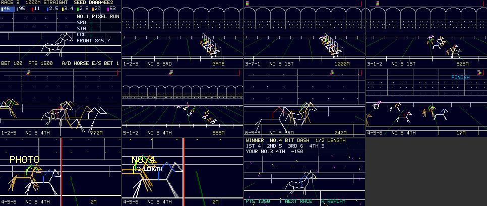
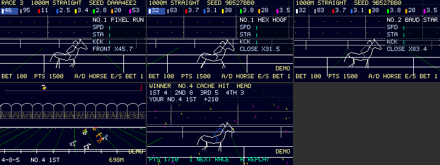
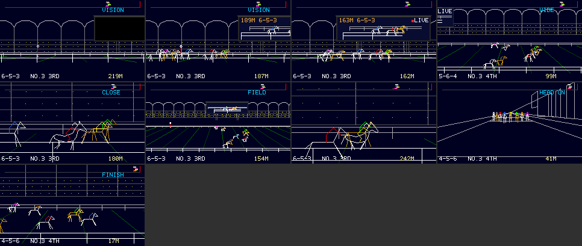
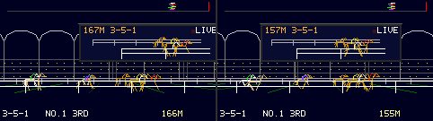

# DERBY WATCH — 観戦主体の競馬（1000 m 直線・ナイター）

2026-09-29、ブランチ `vm/game-derby`（`vm/main` 026e8c7 から）。対象は [apps/derby/derby_watch.js](../../apps/derby/derby_watch.js)（APPS の DERBY WATCH、`local.derby`）。コードの隣の設計メモは [apps/derby/README.md](../../apps/derby/README.md)。**この文書の数値は断りのない限り host の実測**（実物の QuickJS・`pocket.kasane`・`pocket.input.keys`・Kasane レンダラ。m32 は i386 で実機と同じ 8 B の JSValue）。実機は使っていない（fps・ネイティブ heap・見え方は「実機で調整・確認する項目」）。計算値・推定値はその旨を書く。美的な評価はしない。

## 結論

- **2026-09-30 追記（`vm/derby-demo`）: デモ（アトラクト）モードを足した。** パドックで 15 秒（壁時計）キーが無いと、ゲームが通常と同じ経路で 1 レースを走らせ、右下に `DEMO` が点滅する。どのキーでも戻り、プレイヤーの持ち点・レース番号・次の種・保存は変わらない。下の「デモモード」。host の検証のみ（実機は未確認）。
- **2026-09-30 追記（2）: 大型画面（ターフビジョン）と演出カメラを足した**（ブランチ `vm/derby-vision`）。コースの向こう側にワールド固定の大型画面が立ち、その中に先頭集団を追う中継映像が映る。レースは監督がカメラを自動で切り替え（手動キーは 5 秒だけ優先）、新しい角度として低い横位置（VISION）と正面（HEAD ON）を足した。**画面は面を 2 枚にせず、面0の中に塗りと映像を描いた**（面1のフレームが実機で確保できなかった）。設計と実測は末尾の「大型画面と演出カメラ（2026-09-30）」。
- **2026-09-30 追記: 実機で起動に失敗していたのを直した**（`EVAL_ERROR InternalError: interrupted`）。原因はソースの評価中に `pocket.memory.info().internalFreeBytes` が `null` で、起動時の登録ループが終わらなかったこと。実機の数値は下の「実機での測定（2026-09-30）」。以下の本文は host の実測（初版のまま）。
- **題材は馬、コースは 1000 m の直線、夜のレース。** 横から追うカメラなら奥行きごとの投影が「拡大＋平行移動」になり、割り算の無い VM で柵・観客席・刈り目を ADD の繰り返しで描ける。コースと直交する線（芝の刈り目・ゲート・決勝線）は消失点 (120, 地平線) に集まる。
- **遊びはパドックで1頭選んで賭けるだけ**（A/D で選択、E/S で賭け金、`1` で決定、オッズ表示）。レース中は `,` `/` でカメラ（WIDE／CLOSE／FIELD）を切り替える。ゴール前 20 m からスロー（FINISH カメラ）、写真判定（決勝線に沿って見る静止画を 2 倍に拡大）、結果（着順・着差・持ち点）、`R` で同じレースを再生、`1` で次のレース。
- **固定の種で完全に再現する。** レースは四則演算と比較だけで書いたので、同じ種なら処理系に依らない: レース 3〜6 の最終状態（完走時刻と位置の全桁）が V8（Node）と QuickJS（32 bit・64 bit）で一致した。host の台本では、カメラを 3 回切り替えた 1 回目と、切り替えない再生（`R`）で着順・完走時刻が一致した（種 `DAAA4EE2`: 4-5-6-3-7-2-1-8、着差 1/2 LENGTH）。
- **手続き IR の 15 命令をすべて使い、全 draw を 3 通り（plan・デバッグ単歩 plan・`ksn_proc_step` の単歩 VM）で実行して一致、全フレームを全画素比較した**（MID の全台本 3,083 フレーム、LIGHT 1,569、HEAVY 1,567。不一致 0）。
- **既定の負荷は MID**: レースの 1 フレームは線分最大 491/1,024（48%）、ラスタ 5,928/65,535（9%）、draw 15〜16 本、VM ステップ最大 2,857。HEAVY は FIELD カメラで線分 759（74%）になり、MEGADEMO の TWIST（566 本で実機 29.8 fps）を超えるので、実機で測るまで既定にしなかった。
- **plan は場面ごとに登録・解除し、同時 22 本（上限 32）、1 フレーム 1 本まで。** レースの最中には登録しない（負荷段階を `tab` で変えたときだけ例外）。ゲートで馬が1頭ずつ入る演出が、そのまま走者 plan の読み込み（1 フレーム 1 本）になっている。
- **ゲスト heap（m32、実機と同じ課金）**: 評価（コンパイル）のピーク 135,308 B（評価の直前から +100,868）、評価後 98,896、実行中の GC 後の最大 118,828。**評価と全台本が通る最小の上限は約 143,890 B**（二分探索、QuickJS の 1 ブロック 8 B の課金込み）で、上限 163,840 B の 88%。余裕は約 20 KB で、ここが最も細い（下の「確信の低い点」）。
- **ファーム**: `idf.py -B build_gamederby build` 成功。image 2,200,304 B。`tools/memlog.py` は DIRAM 172,204 B（+0）。JS（23,534 B）は flash の rodata（`_binary_derby_watch_js_start` = 0x3c1cb2d7）にあり DIRAM に入らない。

## 題材と理由

| 決めたこと | 理由 | 却下した案 |
| --- | --- | --- |
| 馬（競馬） | 線だけの 240×135 でも脚4本・首・騎手の勝負服で「走る生き物」と「どの馬か」が同時に読める。写真判定と単勝オッズが見慣れている | 犬（グレイハウンド）: 背が低く、同じ画面では脚と胴が数ピクセルにつぶれる。2 コースから選ぶ: ソースが増え（ゲスト heap が最も細い資源）、線画の見せ場は変わらない |
| 1000 m の直線 | 横からのカメラで奥行きの層ごとに投影が線形（`x = 120 + (w − cx)·f/d`）。VM は割り算を持たないので、線形なら ADD の繰り返しで描ける | 周回コース・後方からの追走カメラ: 点ごとに透視の割り算が要る（VM で描けず、JS で点ごとに計算すると入力 8 個に収まらない） |
| ナイター | 背景は 1 色（`beginFrame` の色）しか無い。芝と空を塗り分けられないなら、暗い地に明るい線の方が線画として成り立つ | 昼: 背景 1 色では地面と空の区別が線だけに頼る |
| 実在しない名前 | 馬名はポケットコンピュータにちなむ造語 12 個から 8 頭。勝負服は枠ごとの 8 色 | — |

## 遊び方とキー

| 場面 | キー | 動作 |
| --- | --- | --- |
| パドック | `A` / `D` | 前 / 次の馬（勝負服の色見本付きのオッズ板で選ぶ） |
| パドック | `E` / `S` | 賭け金 +50 / −50（50〜500、持ち点まで） |
| パドック | `1` | 決定（オッズが出てから、起動後約 9 フレーム） |
| ゲート・レース | `,` / `/`（`A` / `D` も可） | カメラを戻す / 進める（WIDE → CLOSE → FIELD） |
| 写真判定 | `1` | 先へ（放っておけば 110 フレームで結果） |
| 結果 | `1` | 次のレース（新しい種） |
| 結果 | `R` | 同じレースをもう一度（同じ種。持ち点は動かない） |
| どこでも | `tab` | 負荷段階 LIGHT → MID → HEAVY |
| どこでも | `` ` `` | 終了（保存ターンで持ち点を保存） |

使うキーは E/A/S/D、`,` `/`、`1`、`R`、`tab` で、依頼の安全なキーの範囲。`f` `space` `enter` `z` は使わない。同時押しは要らない設計にした（観戦が主体なので、操作は1キーずつ）。

1 レースの流れ（MID、host の台本）: パドック（オッズ計算 9 フレーム）→ ゲート 40 フレーム（走者 plan の読み込み 10 本）→ レース約 1,311 フレーム（完走 61.4 秒を 1.5 倍速＝約 41 秒、ゴール前 20 m からスロー約 3 秒）→ 写真判定 111 フレーム → 結果。30 fps なら 1 レース約 50 秒（計算）。

### レースのモデルと展開（host の Monte Carlo、4,000 レース）

`node tools/games/tune_derby.mjs 4000`。モデルの項は README の表。

| 指標 | 値 |
| --- | --- |
| 1 番人気（乱数なしで最速の馬）の勝率 | 42.7%（一様なら 12.5%） |
| 脚質別の勝率（逃げ／先行／差し） | 27.4% / 31.9% / 40.7%（出走の比率は各 33%） |
| 勝ち時計 | p10 61.12 秒、中央値 61.36 秒、p90 61.61 秒 |
| 1・2 着差 | 中央値 0.58 m。ハナ差（0.12 m 未満）12.5%、アタマ差以内（0.6 m 未満）51.5%、1 馬身（2.4 m）超 6.5% |
| ラスト 300 m の先頭交代 | 中央値 2 回、p90 3 回、交代なし 15.4% |
| オッズの温度 `TAU` | 0.23（勝ち馬の平均対数尤度 −1.670 が最大。一様は −2.079） |

オッズの較正（予測勝率の区間ごと、予測 vs 実際）: 0〜5% は 1.9% vs 2.7%、5〜10% は 7.0% vs 6.3%、10〜20% は 15.7% vs 12.7%、20〜30% は 23.8% vs 24.3%、30〜50% は 36.6% vs 45.1%、50% 以上は 59.6% vs 78.3%。**本命ほど実際は強い**（softmax の裾が合っていない）。控除 20% に対して本命買いが得になる区間があるが、ゲームとしては許容した。

最初の版は 1 番人気が 91% 勝ち、着差の中央値が 7.5 m だった。能力の幅を狭め（`top` の幅 0.9→0.2 m/s）、当日の出来とゆらぎを足し、前半の馬群（先頭との差に比例した追走）と後半の競り合い（先頭との差 4 m 未満で差に比例した加速）を入れて今の値にした。**競り合いの項は接戦を作るためのゲームデザイン上の項**で、物理のモデルではない（これが無いと着差の中央値は 2 m 以上になった）。

## 設計の判断と却下案

| 判断 | 理由 | 却下した案 |
| --- | --- | --- |
| 遠景の馬は VM の plan（`runner`、40 命令、1 頭 1 plan に毛色・勝負服を焼く） | 位置と大きさが毎フレーム変わる。型付き点列は変換が登録時に固定なので動かせない | 全頭を型付き点列: 画面上で動かせない。奥行きごとの大きさの段（8 段）を plan に焼く: カメラを変えるたびに登録し直しになる |
| 頂点を 2.5 単位の格子に置き、`±2.5S` の加算で全頂点を作る | 1 頂点 1 命令。素直に `SET+MUL+ADD` だと 1 座標 3 命令で 64 命令に入らない | JS で頂点を全部計算: 入力は 8 個まで |
| 大写しの馬は型付き点列のギャロップ 6 コマ（各 36 点）、CLOSE カメラを「その馬が画面の同じ位置・同じ大きさ」に合わせる | 固定の変換でも、カメラが馬に固定なら馬は動かない。脚のコマ違いで走る（ZENITH の回転済み点列表と同じ発想） | 大写しも VM: 膝のある脚・頭・たてがみを 64 命令に入れられない |
| レーンの奥行きを等比（12 m×1.085^j） | ゲートの柱を MUL 1 回ずつで奥へ歩ける | 等間隔: 1/d が等差にならず、VM では各柱に入力が要る |
| 写真判定は決勝線の延長から線に沿って見る（`cx = 1000`） | 決勝線がどの奥行きでも x = 120 の縦線になる。本物の写真判定の幾何 | 斜めの決勝線と比べる: 鼻先の前後が読みにくい |
| スローは表示だけ（4 フレームで 1 ステップを補間） | シミュレーションの刻みを変えると結果が変わる。表示だけならカメラやスローはレースを変えない（再生で確認） | スロー中に刻みを細かく: 再現性が崩れる |
| オッズは乱数なしの 1 走（刻み 0.25 秒、9 フレームに分割）の完走時間の softmax、`TAU` は host で推定 | 実機の JS は host の約 250〜360 倍遅い（MEGADEMO の実測）。1 レース 1,228 ステップ×8 頭×数十回の Monte Carlo は実機では秒単位 | 実機で Monte Carlo: 時間が足りない |
| 面は 1 枚、image モード（全画面の image に手続き面を貼る） | 写真判定の拡大が image の `setRect` でできる。MEGADEMO がこの経路を実機で測っている（TWIST 29.8 fps） | 面 2 枚（ミニマップを面 1 に）: フレーム 20 KB 増、表示待ち候補が全面で 1 枚なので同じフレームに更新できない。backdrop モード: 拡大ができない |
| HUD は最小（レース中は着順・残り距離・カメラ名の 3 行、写真判定で大きな番号） | 主役は線画の動き。view の合成は MEGADEMO の LIMIT で 13 ms かかった | — |
| ソースを詰めた（初版 27 KB → 23.5 KB、コンパイルのピーク +116 KB → +101 KB） | コンパイル時のピークが律速（実行中より高い） | ソースを文字列にして `eval` で分けてコンパイル: 文字列そのものがヒープを使い、利得が小さい |

## 使ったプリミティブ

### 手続き描画（`pocket.kasane.procedural`）

| プリミティブ | 使った所 |
| --- | --- |
| `register(program)` / `register(program, affineQ14Points)` | 全 plan / ギャロップ 6 コマ（`g0`〜`g5`、36 点） |
| `unregister(handle)` | 場面の切替（結果で走者 10 本、写真 1 本、ゲートは先頭 120 m で）、負荷段階の変更 |
| `beginFrame(color)` / `draw` / `commit` / `resource()` | 毎フレーム。起動時に `beginFrame(0)` だけ呼んでフレームを先に確保（MEGADEMO の教訓） |
| `createSurface` / `resource(surface)` / `beginFrame(color, surface)` | 使わず（上の表） |

| 命令 | 使った plan |
| --- | --- |
| `SET` `INPUT` `ADD` `MUL` `MOVE` `LINE` | ほぼ全部 |
| `SIN` | 観客の点のゆらぎ（黄金角の位相）、紙吹雪の位置 |
| `REPEAT` / `END` | スタンドの段、ゲートの 9 本の柱、写真の目盛り（8×5 の入れ子）、紙吹雪 |
| `REPEAT_REG` | 柵の支柱、芝の刈り目、スタンドの柱、観客の区画（本数を入力から） |
| `BREAK_IF_GT` | 紙吹雪の枚数を時間で増やす（上限を入力から） |
| `PLOT` | 遠景の馬の帽子 |
| `PLOT_COLOR_REG` | 観客（2 色を交互に、8 フレームごとに入れ替えて明滅） |
| `LINE_COLOR_REG` | 柵（色を入力から、向こう正面と手前で共有）、刈り目（2 色交互）、騎手の勝負服（色を入力から、8 頭で共有）、紙吹雪 |
| `CUBIC` | スタンドの屋根の弧、決勝柱の円盤（上下 2 本）、騎手の帽子 |

### view（`pocket.kasane`）

`replace`（場面ごと）、`patch`（毎フレーム）、`tx.background`、`tx.image`（手続き面の資源、`sourceWidth/Height`）、`tx.rect`（半透明の帯・選択枠・能力の棒・勝負服の色見本）、`tx.text`（`caption`・`display`、`capacity`）、`ref.setText`、`ref.setRect`（能力の棒、選択枠、写真判定の拡大）。**HUD を最小にする方針で、`gradient`・`roundRect`・`strokeRect`・`animate`・`group`・`cache`・`pixel`・`grid` は使っていない**（見せ場は手続き面の線。view を増やすと合成の時間が増える）。

### 入力・音・保存

`pocket.input.keys.pressed()`（1 フレーム 1 回の読み取り）、`pocket.audio.tone`（1 声の正弦波、1 音ずつ列で鳴らす）と `audio.cue('move'/'accept')`、`pocket.storage.get/set`（`derby.v1`）、`pocket.memory.info()`（登録の門）、`pocket.capabilities.get('audio.tone')`。歓声（雑音）は tone では出せないので、観客の点の明滅で代える。マニフェスト（`app_registry.c` の `local.derby` 行）は変えていない（`audio.tone` は既に optional、`storage.kv` はマニフェストに依らず入る）。

## 動的 plan の登録位置

| 場面 | 登録（1 フレーム 1 本） | 解除 | 同時 |
| --- | --- | --- | --- |
| 起動 | パドックの 12 本（最初のフレームから 1 フレーム 1 本。評価中は登録しない、下の「実機での測定」） | — | 12 |
| ゲート | `gate`・`r0`〜`r7`・`map` の 10 本（馬が 1 頭ずつゲートに入る） | — | 22 |
| レース | なし（`tab` のときだけスタンド・観客の 2 本） | 先頭 120 m で `gate` | 21 |
| 写真 | `photo`（静止画の間） | — | 22 |
| 結果 | `conf` | `r0`〜`r7`・`map`・`photo` | 13 |

host の全台本（MID、2 レース＋再生）: 登録 42、解除 30、同時の最大 22、1 フレームの登録の最大 1。登録は空き heap が 22,528 B 以上のときだけ（MEGADEMO の実機の値。host は空き 40,000 B の固定値で代用したので、門で待つ経路は host では通っていない）。

## host の検証

`python3 tools/games/run_derby.py`（WSL）。`tools/games/test_derby_host.c` を実物の QuickJS・`pocket.kasane`（view と procedural）・`pocket.input.keys`（`keymap_poll()` と `keystate` 経由でキーの押下・解放を注入）・Kasane レンダラで組む。

| 検査 | 内容 | 結果 |
| --- | --- | --- |
| 台本（MID） | 保存済みの持ち点を読む → パドックで `tab`×3・`D`×2・`E` `S` `E`・`1` → ゲート → レースで `/` を 3 回（WIDE→CLOSE→FIELD→WIDE）→ スロー → 写真 → 結果 → `R` で再生（カメラ切替なし）→ 結果 → `1` で次のレース → Back（`frame(0x2000)`） | PASS。3,093 フレーム、例外 0、表示失敗 0、tone 20 回、保存 `{"v":1,"pts":1350,"race":4}` |
| 再現性 | 1 回目と再生の `DERBY FINISH` 行（着順・8 頭の完走時刻 3 桁・着差）の一致 | 一致（種 `DAAA4EE2`） |
| 処理系をまたぐ再現性 | レース 3〜6 の完走時刻と位置の全桁（`tc`・`x` の `join`）を V8（Node）と QuickJS（m32・64 bit）で比較 | 全桁一致（4 レース） |
| 手続きの全画素 | 各 draw を plan・デバッグ単歩 plan・単歩 VM で実行し、線分・ラスタ・ステップ・レジスタを比較。点列は scalar・PIE モデル・dispatcher を比較。フレームを plan の線分（全面）と VM の線分（8 行の帯）で描いて全画素比較 | 不一致 0（MID 3,083、LIGHT 1,569、HEAVY 1,567 フレーム） |
| 上限 | 線分・ラスタ（フレーム・draw）・ステップ・入力・点の座標・同時 plan・15 命令すべての使用 | PASS |
| ASan/UBSan（64 bit）と `--m32` | 同じ台本 | PASS（両方） |

## フレームごとの統計と上限の使用率（host、レース場面の最大）

| 段階 | 線分 最大 | 線分 平均 | ラスタ 最大 | draw ラスタ 最大 | draw ステップ 最大 | フレームのステップ 最大 | draw 数 最大 |
| --- | ---: | ---: | ---: | ---: | ---: | ---: | ---: |
| LIGHT | 338 | 253 | 5,435 | 1,825 | 1,023 | 1,814 | 16 |
| MID（既定） | 491 | 343 | 5,928 | 2,164 | 1,983 | 2,857 | 16 |
| HEAVY | 759 | 505 | 6,339 | 2,410 | 3,861 | 4,802 | 16 |

カメラ別の線分（最大 / 平均）: MID は WIDE 367/350、CLOSE 488/248、FIELD 491/483。HEAVY は WIDE 540/518、CLOSE 757/321、FIELD 759/751。FIELD が重いのは、引いた画で観客の点（1 点＝1 線分）が多く入るから。

| 上限 | 値 | 使用（全段階・全場面の最大） | 率 |
| --- | --- | --- | --- |
| 線分／フレーム | 1,024 | MID 491（HEAVY 759） | 48%（74%） |
| ラスタ／フレーム | 65,535 | 6,339 | 10% |
| ラスタ／draw | 8,192 | 2,515 | 31% |
| VM ステップ／draw | 10,000 | 3,861（HEAVY の観客） | 39% |
| 命令／plan | 64 | 49（ミニマップ）、走者 40 | 77% |
| レジスタ | 16 | 16 | 100% |
| 入れ子 | 8 | 3 | 38% |
| 入力／draw | 8 | 8 | 100% |
| 点列の点数 | 128 | 36 | 28% |
| 点列の座標 | −480〜720 | 63〜143 | — |
| 同時 plan | 32 | 22 | 69% |
| 面 | 2 | 1 | 50% |

上限まで詰めることより 30 fps を優先したので、線分とラスタは半分以下にとどめた。

## プレビュー画像

`python3 tools/games/run_derby.py --ppm` が作る（966×409、21 KB）。host の描画で、実パネルの撮影ではない。技術的な性質（MID）:

| コマ | 場面 | draw | 線分 | ラスタ | VM ステップ | 同時 plan | 点列の点 | 色数 |
| --- | --- | ---: | ---: | ---: | ---: | ---: | ---: | ---: |
| 1 | パドック | 7 | 153 | 3,748 | 824 | 12 | 36 | 34 |
| 2 | ゲート（読み込み中） | 12 | 328 | 4,401 | 1,945 | 19 | 0 | 25 |
| 3 | 発走 | 15 | 364 | 4,790 | 2,074 | 22 | 0 | 30 |
| 4 | WIDE | 14 | 348 | 4,736 | 1,984 | 22 | 0 | 29 |
| 5 | CLOSE（選んだ馬） | 15 | 253 | 5,827 | 1,152 | 21 | 36 | 25 |
| 6 | FIELD | 15 | 488 | 4,874 | 2,842 | 21 | 0 | 29 |
| 7 | 先頭交代の後 | 14 | 329 | 4,479 | 1,854 | 21 | 0 | 29 |
| 8 | FINISH（スロー） | 14 | 284 | 4,828 | 1,563 | 21 | 0 | 29 |
| 9 | 写真判定 | 13 | 245 | 5,692 | 1,253 | 22 | 0 | 20 |
| 10 | 写真判定（2 倍） | 13 | 245 | 5,692 | 1,253 | 22 | 0 | 19 |
| 11 | 結果 | 8 | 174 | 4,146 | 1,754 | 13 | 36 | 23 |

色数は合成後のパネルの RGB の種類（全 11 コマで 50 色）。

## ソース量とゲスト heap

`python3 tools/games/run_derby.py --m32`。確保は実機の課金（TLSF 長、4 B 切り上げ・最小 12 B）で数える（MEGADEMO の `test_megademo_app_host.c` と同じ方式）。

| 項目 | 値 | 種別 |
| --- | --- | --- |
| ソース | 23,534 B | 実測 |
| 評価の直前（host の prelude 込み） | 34,440 B | 実測（host） |
| コンパイルのピーク | 135,308 B（+100,868） | 実測（host） |
| 評価後 | 98,896 B（コンパイル済みの保持 +46,700） | 実測（host） |
| 実行中の GC 後の最大 | 118,828 B | 実測（host） |
| 評価と全台本が通る最小の上限 | 約 143,890 B（上限 163,840 B の 88%） | 実測（host、二分探索、QuickJS の課金） |
| 同じ方法の MEGADEMO（28,175 B） | コンパイルのピーク +87,032 | 実測（host） |

コンパイルのピークはコードの量にほぼ比例し（コード 1 B あたり約 4.3 B。コメントと表の数値リテラルはほぼ効かない）、区分ごとに削って測ると、レースのモデル約 20 KB、場面の処理（`frame_`）約 14 KB、HUD 約 13 KB、plan のテキストと点列の生成 約 12 KB、コースの組み立て約 10 KB だった。MEGADEMO の実機では host の最小上限 123,125 B に対して 124〜128 KiB が要った（[megademo-device-limits.md](../kasane/megademo-device-limits.md)）ので、このアプリの実機の要求は 144〜150 KB 前後と推定する（未測定）。

## ネイティブ heap（計算）

`sizeof` は [procedural-ir-experiment.md](../kasane/procedural-ir-experiment.md) の xtensa の計算値（plan 872 B、フレーム 10,246 B、VM 996 B）、点列は `pocket_proc.c` の `points_bytes()`。**実測ではない。**

| 場面 | 内訳 | 合計 |
| --- | --- | --- |
| パドック（12 本） | フレーム 3 枚（候補・確定・scratch）30,738 ＋ VM 996 ＋ plan 12×872 ＋ 点列 6×339 | 44,232 B |
| レース・写真（22 本） | 同じフレーム ＋ plan 22×872 ＋ 点列 6×339 | 52,952 B |
| 比較: MEGADEMO ZENITH（2 面、16 本） | フレーム 5 枚 51,230 ＋ plan 16×872 ＋ 点列 | 約 66 KB |

面を 1 枚にしたので、MEGADEMO より約 13 KB 少ない見込み。Kasane の view（HUD のノード）は含めていない。

## ファームのビルド

| 項目 | 値 | 種別 |
| --- | --- | --- |
| `idf.py -B build_gamederby build`（ESP-IDF v6.0.1、`tools/prepare_dependencies.py` の後） | 成功、`cardputer_pocketjs.bin` 2,200,304 B、SHA-256 `2dd2e7d17f3dd0e19fc7c1d1154fe612148ed7d13c6566e900064bb6abcf79e9` | 実測 |
| `tools/memlog.py --map build_gamederby/cardputer_pocketjs.map` | DIRAM 172,204 B、**+0**（026e8c7 から） | 実測（map） |
| JS の置き場所 | `_binary_derby_watch_js_start` = 0x3c1cb2d7、終わりとの差 23,535 B（ソース＋NUL）。flash の rodata | 実測（map） |

C を変えていないので DIRAM が動かないのは期待どおり。

## 実機での測定（2026-09-30）

ブランチ `vm/derby-start`（`vm/main` d4c20fd から）。**この節の数値は実機の実測**（断りのあるものを除く）。診断は `Date.now()` の時刻と `pocket.memory.info()` を `console.log` に出す一時的な JS（コミットしていない、ソース +457 B）と、キー注入のために `POCKET_KEYTEST=ON` にした image で取った。fps・起動時間・MEM は診断なしの通常 image でも確かめた。

### 起動に失敗していた原因

修正前の通常 image では毎回 `APP_ID` の約 2.2 秒後に `EVAL_ERROR InternalError: interrupted at user.js:400` → `START_FAILED`。評価の期限は 2 秒（`app_session.c` の `deadline`）。診断で段ごとに測った:

| 段 | 所要（実測） |
| --- | ---: |
| `APP_ID` → ソースの最初の行（ゲスト生成・面の注入・コンパイル） | 約 150 ms |
| 最初の行 → `enter('pad')` の前（`field`・`race`・`storage.get` など） | 9 ms |
| `enter('pad')` | 11 ms |
| `while (queue.length && reg < 3) load();` | **期限まで終わらない**（打ち切りを入れた診断で 1,180 ms に 2,749 周、登録 0 本） |

評価中の `pocket.memory.info()` は `internalFreeBytes: null`、`guestUsedBytes: 0` だった。ネイティブ heap の標本は `app_session.c` の `sample_memory_pressure()` がターンの始めに採り、`pocket_memory_install()` がそれを空にしてから評価が始まるので、**評価中は一度も採られていない**。`load()` の門 `internalFreeBytes < 22528` は `null < 22528`（真）で毎回そこで戻り、`reg` が増えないのでループが終わらない。値はターンの中で変わらないので、評価中でなくても「門が開くまで回す」ループは終わらない。host の台本は `internalFreeBytes` に固定値 40,000 を返していたので通っていた。仮説のうちオッズの計算（a）・plan の解読（b）・view の構築（c）・コンパイル（d）はどれも支配的でなく、原因は（e）の無限ループだった。

### 直したこと（JS のみ）

- 起動時の登録ループを消した。パドックの 12 本は最初のフレームから 1 フレーム 1 本（`frame()` の `load()`、ターンの始めに標本があるので門が正しく働く）。ソースは 23,534 → 23,491 B。
- host の台本（`tools/games/test_derby_host.c`）は最初の `frame()` まで `internalFreeBytes: null` を返し、評価を 2 秒で打ち切る。修正前のソースはこの台本で `FAIL eval`（打ち切り）になる。
- 却下: ネイティブで評価の前に標本を採る（`app_session.c` の変更。評価中にも数値が出るが、門で回るループはターン内で値が変わらない限り同じく終わらない。JS の直しで足りる）。評価の期限を延ばす（原因が無限ループなので無意味）。`null` を「門を開ける」と読む（安全の門を未知の値で開ける）。

### 修正後（実機）

| 項目 | 値 |
| --- | --- |
| 起動（`APP_ID` → `RUN ... ESP_OK`、通常 image） | 179 ms（2 回とも）。期限 2 秒の約 9% |
| パドックの 12 本がそろうまで | 最初のフレームから約 0.63 秒（オッズは 9 フレーム目、`ODDS` は `APP_ID` の約 0.7 秒後） |
| 1 フレームの JS の最大（診断 image、場面ごと） | パドック 56 ms（登録とオッズ計算が重なる最初の数フレーム）、ゲート 26 ms、レース 18 ms、写真判定 34〜51 ms（最初のフレームの `settle()`）、結果 24 ms |
| fps（`KASANE_PAINT` の 30 フレーム窓） | パドック 30（turn 8.0 ms、render 12.3 ms）、レース 30（turn 13〜15.3 ms、render 8.9 ms）、写真判定 約 25（窓 1.2 秒、render 21.7 ms。2 倍拡大の image）、結果 30 |
| ゲスト heap（`MEM ... js=`、評価後） | 109,564〜109,620 B（host m32 の評価後 98,584 B より約 11 KB 多い） |
| ゲスト heap（`guestUsedBytes`、ターンの始めの標本） | レース中 119.0〜121.4 KB、最大 122,608 B（写真判定の最初のフレーム）。上限 163,840 B に対し約 41 KB の余裕。**評価中のピークは実機では測っていない**（host m32 は 135,176 B） |
| ネイティブの空き（`internalFreeBytes`） | 起動直後 67,804 B（最大連続 31,744）、レース中 34,760〜36,808 B、最小 33,928 B（写真判定）。門（22,528 B）で登録が待ったことはなく、`LOADSTALL` なし |
| 一通りの進行（診断 image、USB のキー注入） | レース 1（種 9E3B5B70、SHORT HEAD）→ 写真 → 結果 → 次のレース（`tab`×3 で段階を一周）→ レース 2（種 3C72D529、HEAD）→ `R` で再生 → Back。**再生の `DERBY FINISH` 行は 1 回目と全桁一致**。例外・`FRAMEFAIL`・runaway・OOM・Guru Meditation なし |
| Back と再起動 | `DERBY SAVE points=1830 race=2` → `APP_STOPPED`（`MEM free=220,912`）。再起動で `LOADED points=1830 race=2` |

同じ image で他の 2 本も起動を確かめた（修正はしていない）: LCD CATCH は `APP_ID` → `RUN` 84 ms、`MEM free=137,740 js=70,272`。BIG WAVE は 319 ms、`MEM free=99,912 js=104,480`、30 fps（turn 12.6 ms）。どちらも `EVAL_ERROR`・`START_FAILED` なし。

## デモモード（2026-09-30、ブランチ `vm/derby-demo`）

`vm/main` 964f634 から。アーケードのアトラクトモードの作法で、放置されたゲームが自分で遊んで見せる。**この節の数値は host の実測**（`tools/games/run_derby.py`、ASan と `--m32`）。実機は使っていない（下の「実機で確かめる項目」）。

### 仕様

| 項目 | 決めたこと |
| --- | --- |
| タイトル | **パドック（`scene === 'pad'`）をタイトルとみなす。** このアプリには独立したタイトル画面が無く、起動直後に最初に出る待機状態がパドック（馬をまだ選んでいない）。次のレースのパドックも同じ扱い |
| 放置の判定 | パドックで `DEMO_IDLE_S = 15` 秒、キーが無いこと。計時をやり直すのは、キーを押している間（`input.keys.down()` が空でない）、フレームの外で押して離したゲームのキー（`A D E S 1 R , / tab` の `pressed()`）、`frame(buttons)` のパッドのビット、パドック以外の場面 |
| 時計 | `pocket.time.now()`（`esp_timer` の単調なミリ秒。`pocket_app_install()` が全アプリに入れる面）。**フレーム数ではなく壁時計**で数えるので、fps が落ちても 15 秒 |
| 1 周 | 15 秒の放置 → デモのパドック（オッズが出たら A/D で 12 フレームに 1 歩、決めたら `1`）→ ゲート → レース（キーは送らず、カメラは監督の自動切替。大型画面との統合（2026-09-30）までは 240 フレームごとに `/`）→ 写真判定（通常どおり 110 フレームで先へ）→ 結果 150 フレーム（`DEMO_RES`）→ パドックへ戻る → また 15 秒 |
| 走らせる馬 | 奇数回目のデモは 1 番人気、偶数回目は 2 番人気（オッズ順、同率は枠の若い方）。A/D は近い方向へ。賭け金は 100 固定 |
| 抜け方 | デモ中のキー（`down()` に新しく入ったキー、フレームの外で押して離したゲームのキー、`frame(buttons)` のパッドのビット）で、**そのフレームのうちに**パドックへ戻る。押したキーはデモの終了にだけ使い、ゲームの操作としては読まない。Back は通常どおり終了 |
| 表示 | 右下 `[212,109,238,120]` に `DEMO`（caption、`0xfffb96ff`）。16 フレームごとに点滅（`!(t & 16)`）。デモ中のパドックの 1 行目は `RACE n` を出さない |
| 音 | デモ中は無音 |

### 実際のゲームロジックをそのまま通す方法

デモのためのシミュレーションは書いていない。`attract()`（フレームの最初、`frame_()` の前）が、そのフレームの「押されたキー」を 1 つ `dk` に置き、`frame_()` の `P = k => dk === 0 ? K.pressed(k) : k === dk` がそれを押下として読む。A/D の選択、`1` の決定、写真判定・結果への遷移は、人が押したときと同じ行を通る。`dk === 0` が通常のプレイ（本物のキーを読む）、`''` がどのキーにも一致しない「押していない」、文字がデモの押下。

デモの終わり方（結果の 150 フレーム、またはキー）だけがデモ専用の遷移で、`demo(0)` がパドックへ入り直す（`enter('pad')`）。通常のゲームでは結果の `1` が `++raceNo` と保存をするので、デモはこれを押さない。

### 状態の退避と復元

| 状態 | 方法 |
| --- | --- |
| 持ち点・レース番号・選んだ馬・賭け金 | `demo(1)` で `bk` に退避、`demo(0)` で戻す（`[pts, raceNo, pick, stake, A] = bk`） |
| 種の列 | 種は `field(0x3e1b7 + raceNo·φ)` でレース番号だけから決まる（乱数の状態は持ち越さない）。デモのレース番号は `1e6 + n`（n はデモの回数）なので、プレイヤーの 1, 2, 3… の種を進めも使いもしない。100 万レースにプレイヤーが届くのは 1 レース 50 秒で約 1.6 年後。負の番号なら構造的に交わらないが、それでは同じ種を手で走らせる照合（下）ができない（保存の読み込みは `race > 0` だけを受ける）ので、照合できる方を選んだ |
| 保存 | `save()` の頭で `if (dm) return;`。結果での保存（`settle()`）はデモ中は書かない。**Back の保存ターンは先に `demo(0)` で退避を戻してから保存**するので、デモの持ち点は書かれない |
| 音 | デモ中は `A = null`（`A` も退避）。`tone` も `cue` も呼ばれない。終わりで残りの音符を捨てる |
| plan | 途中で抜けたときは走者・`map`・`gate`・`photo` を解除し（`drop(RUN)`、`drop(['photo'])`）、パドックの 12 本に戻す。`conf` は `enter('pad')` が解除する |

**音を止める理由**: 放置された機械が勝手に鳴るとアトラクトモードとして困る。加えて、最初の `tone` はホームから流れているプレイヤーの音楽を止める（`pocket_av_background_stop("tone")`）ので、デモが鳴らすと、音楽を聴きながら放置していた人の音楽がデモの開始で止まる。

### `DEMO` の位置とノード

- **位置**: 右下、下の HUD 行（y 122〜134）の上。どの場面の HUD テキストとも重ならない場所を探した: 上端は、パドックの 1 行目（`RACE n  1000M STRAIGHT  SEED …` が x 222 まで）、レース中のミニマップ（y 2〜12、x 8〜232）、カメラ名（y 13〜24）、結果の 1〜3 行目に当たる。下端の HUD 行はパドックで全幅を使う。右の y 109〜120 はパドックの能力パネル（y 28〜90）の下で、どの場面にもテキストが無い。レース中は馬と手前の柵（絵）の上に重なることがある。
- **ノード**: view のテキスト 1 つ（`R.dm`）を `build()` で場面ごとに作り、`hud()` の最後で `setVisible` する（`patch` ではノードを足せないので、作っておいて出し入れする）。動かさないので clip は要らない。
- **上限**: ref はパドックの 30 → **31 / 32**（`the update exposes more than 32 draw references` まで残り 1）、コマンドは最大 **31 / 80**（`kasane.stats().displayed.commands`、host）。他の場面は ref 7 前後。
- **通常のゲームで見えないこと**: host の全画素ハッシュが、デモを追加する前と LIGHT（`a7685da2e14ec212`）・HEAVY（`e4e68a319354cd22`）で同じ。非表示のノードは 1 画素も変えない。

### host の検証（`python3 tools/games/run_derby.py`、ASan/UBSan と `--m32` の両方で PASS）

MID の台本の最初（保存済みの持ち点 1500・レース 3 を読んだ直後のパドック）に、デモの検査を足した。時計は host が `pocket.time.now()` として渡す値で、1 フレーム 33.3 ms（100 ms にして fps の低下、1 回で 15 秒進めて早送り）。

| 検査 | 結果 |
| --- | --- |
| 放置の計時 | `Q`（ゲームで使わないキー）を押した 14 秒後に `R` をフレームの外で押して離す（`pressed` だけ、`down` に出ない）。最初の `Q` から 15 秒を過ぎてもデモに入らず、`R` から 14.9 秒でも入らず、**15,000.0 ms** のフレームで入った |
| fps が落ちたとき | 1 フレーム 100 ms で、デモの終わりから **15,033.3 ms**（15 秒を越えた最初のフレーム。フレーム数では 150） |
| 1 周 | デモ 3 回とも パドック → ゲート → レース → 写真判定 → 結果 → パドック（`DERBY DEMO START` / `DERBY DEMO END` の間の `SCENE` 列を照合） |
| 通常プレイとの一致 | デモ 1〜3（レース 1000001〜1000003、1 番人気・2 番人気・1 番人気）を、同じレース番号を保存に置いて手で（`D` と `1`）走らせ、`DERBY FINISH`（着順・**8 頭の完走時刻の全桁**・着差）、`PICK`（馬・賭け金・オッズ）、`RESULT`（着順・増減・持ち点）の行が文字列として一致（例: `race=1000001 seed=9B527BB0 order=4,8,5,3,7,6,1,2 t=61.23225621986288,… margin=HEAD`） |
| プレイヤーの状態 | 10 回のデモすべてで、開始時と終了時の持ち点・レース番号・馬・賭け金が一致。デモの前後でパドックの `race=3 seed=DAAA4EE2` が同じ。デモ中の `storage.set`・`tone`・`cue` は 0 回 |
| デモの後のプレイヤーのレース | 9 回のデモの後に走ったレース 3 の `FINISH` が、デモの無い LIGHT・HEAVY の実行と全桁一致。保存は変更前と同じ `{"v":1,"pts":1350,"race":4}` |
| キーで抜ける | パドック 20 フレーム目に `D`、ゲート 5 フレーム目に `tab`、レース 130 フレーム目に `frame(0x80)`、スローの 10 フレーム目に `1`、写真判定 30 フレーム目に `E`、結果 40 フレーム目に `1`。**すべてそのフレームで**パドックへ戻り、`PICK`・`TIER`・`storage.set` は起きず、次のデモの開始時の馬・賭け金、次の種も変わらない（キーが二重に読まれない） |
| Back | デモのレース中の保存ターンで `SAVE points=1350 race=4`（プレイヤーの値） |
| `DEMO` の表示 | デモ中 5,200 フレームで表示・4,908 フレームで非表示（点滅）、デモの外で表示されたフレーム 0（パネルの画素を読んで判定）。Back の保存ターンは描かずに終わるので除外 |
| リーク | 9 回のデモの後、パドックの plan は毎回 12 本。ゲスト heap（m32、GC 後）は 124,588〜124,828 B で増えない |
| 全画素 | MID 14,485 フレーム（デモ中を含む）、LIGHT 1,569、HEAVY 1,567 で 3 通りの実行と全画素比較の不一致 0 |

`DERBY FINISH` の完走時刻は `toFixed(3)` をやめて全桁にした（ソースは 11 B 減る）。これまでの「再生が 1 回目と一致」の照合も全桁になる。

### ソース量とゲスト heap（m32、同じ台本で変更前後を測った）

host の prelude（時計・計数）が 1,888 B 増えたので、変更前のソースも新しい台本で測り直した（上の「ソース量とゲスト heap」の 143,890 B とは比べない）。

| 項目 | 変更前 | 変更後 | 差 |
| --- | ---: | ---: | ---: |
| ソース | 23,491 B | 25,222 B | +1,731 |
| コンパイルのピーク（評価の直前から） | +100,368 | +106,100 | +5,732 |
| 評価後の保持 | +63,776 | +67,300 | +3,524 |
| 実行中の GC 後の最大（LIGHT、デモなし） | 120,008 | 124,204 | +4,196 |
| 同（MID、デモ 10 回を含む） | — | 125,600 | — |
| 評価と全台本が通る最小の上限（二分探索） | 約 145,536 | 約 151,591 | +6,055（上限 163,840 の 92.5%） |

コンパイルのピークを減らす形を測って選んだ: 時計の読み出しを矢印関数にしない・キーの確認に `some()` の closure を使わない（−648 B）。人気順の並べ替え（`sort` の比較関数）は約 500 B かかるが、依頼の「1 番人気と 2 番人気を交互」のために残した（1 番人気と最長の大穴を交互にすると −500 B）。コメントはピークにほぼ効かなかった（±10 B）。

### プレビュー画像

`python3 tools/games/run_derby.py --ppm` が作る（724×272）。host の描画で、実パネルの撮影ではない。`--ppm` は既存の `derby-watch-preview.png` も作り直すが、そのパドックのコマはデモの後に撮るので馬の位置と観客の明滅が変わる（この変更では既存の画像を差し替えていない）。

### ファームのビルド

`idf.py -B build_derbydemo build`（ESP-IDF v6.0.1、`tools/prepare_dependencies.py` の後）は成功、`cardputer_pocketjs.bin` 2,231,920 B（実測）。`tools/memlog.py --map build_derbydemo/cardputer_pocketjs.map` は DIRAM 172,204 B、**+0**（964f634 から、実測）。C は変えておらず、JS は flash の rodata に埋め込まれるので DIRAM は動かない（期待どおり）。ビルドが書き換えた `dependencies.lock` はコミットしていない。

### 却下した案

| 案 | 却下の理由 |
| --- | --- |
| フレーム数で 15 秒（450 フレーム） | fps が落ちると長くなる（20 fps なら 22.5 秒） |
| デモ用の別のシミュレーション（着順を決め打ちの再生など） | 依頼に反する。ゲームの変更がデモに届かない |
| デモにプレイヤーの次のレースの種を使う | プレイヤーがこれから走るレースの結果を見せてしまう |
| デモのレース番号を負にする | 構造的にプレイヤーと交わらないが、同じ種を手で走らせて照合できない（保存の読み込みが `race > 0` だけを受ける）。HUD に `RACE -1` が出る |
| `replay = 1` で保存と持ち点の増減を止める | 結果の表示が `REPLAY` になり、通常のレースと違う画面になる |
| `DEMO` を場面ごとに動かす（`setRect` と clip） | どの場面でもテキストと重ならない固定の位置があったので、コードを増やさなかった |
| `DEMO` と `PRESS ANY KEY` を交互に | 13 文字（78 px）が入る位置がパドックの右下に無く、テキストは左寄せなので隅に置けない |
| 押したキーをデモの終了とゲームの操作の両方に使う | 例えばパドックの `1` がそのまま賭けの決定になり、プレイヤーが意図せずレースを始める |

### 実機で確かめる項目（未測定）

1. **15 秒の体感。** 放置からデモへの切り替えが、放置と感じる長さか。短すぎ・長すぎなら `DEMO_IDLE_S` を変える。
2. **`DEMO` の見え方。** 右下の位置、色（HUD と同じ黄）、点滅の速さ（16 フレームごと、30 fps で約 0.53 秒）。レース中は馬と柵の上に重なる。
3. **デモ中の fps。** デモはキーの確認（`down()` と `pressed()` 9 回）を毎フレーム足すだけで、描画は通常のゲームと同じ。`KASANE_PAINT` で通常のレースと比べる。
4. **放置からデモへの遷移の引っかかり。** デモの開始は `enter('pad')` で新しい馬（`field`）とオッズの計算（9 フレーム）をする。plan は 12 本のまま（登録し直さない）。
5. **キーで抜けたときの引っかかり。** レースの途中で抜けると走者 10 本を解除する（ネイティブ heap の解放）。次のデモ・次のゲートで 1 フレーム 1 本ずつ登録し直す。
6. **音楽。** ホームの音楽を流したまま起動し、放置してデモに入っても音楽が止まらないこと。デモの後に自分で遊ぶと、最初の tone で止まる（従来どおり）。
7. **ゲスト heap。** 評価の最小上限が host で約 6 KB 上がった（92.5%）。実機で評価が通るか（`EVAL_ERROR`・`START_FAILED` が出ないか）、`guestUsedBytes` の最大。

### 確信の低い点

- **ゲスト heap の余裕。** host の最小上限 151,591 B は上限の 92.5%。MEGADEMO の実機と host の差（+1〜6 KB）を当てはめると、実機の要求は 153〜158 KB（推定）で、上限 160 KiB に近い。`vm/derby-vision` の変更と合わせると超える可能性がある。
- **フレームの外で押して離した、ゲームで使わないキー**（例えば `Q` を 1 フレームより短く）は拾えない。`input.keys` に「押されたキーの一覧」が無く、全キーを `pressed()` で聞くと毎フレーム 56 回の呼び出しになるので、ゲームのキーだけを聞いた。押し続けたキーは `down()` で拾う。
- **ref の余裕が 1。** パドックは 31 / 32 で、他のブランチがパドックにノードを足すと上限を超える。
- **HUD の 1 行目の変更**（デモ中は `RACE n` を出さない）と、`DERBY FINISH` の全桁化は、デモ以外の出力も変える。

## 実機で調整・確認する項目（初版の一覧。2026-09-30 に 1〜4・7 を上で測った）

1. **fps。** 場面・カメラ・段階ごとに `KASANE_PAINT` の窓で測る。見積もりの根拠: MEGADEMO の TWIST（線分 566、ラスタ 19k、draw 7）が 29.8 fps、JS 10 ms。このアプリの MID は線分が少ない（最大 491）が、draw が 15〜16 本と倍あり、JS は毎フレーム 8 頭のシミュレーション・16 本の入力配列・HUD の `setText` 5 回を作る。**JS の時間が最も読めない**（`frame()` の JS を `MDT` 相当の診断で測る）。30 fps を割るなら、まず `KN` を LIGHT 側へ、次に `hud()` の毎フレームの `setText` を変化したときだけにする。HEAVY を既定にできるかもここで決める。
2. **plan 登録のフレーム。** パドックの最初の 9 フレームとゲートの 10 フレームは 1 フレーム 1 本の登録（JS の解読が MEGADEMO の実測で 1 本 12〜20 ms）とオッズの計算（1 フレーム 30 ステップ×8 頭）が重なる。ゲートで馬が入るのが引っかかって見えるか。レース中は登録しない。
3. **ゲスト heap。** 評価に通るか（host の最小上限 143,890 B、推定の実機要求 144〜150 KB、上限 160 KiB）。`tools/memlog.py --port` の `app_free`／`app_largest` と、MEGADEMO の診断 image の方法（ゲストの上限を下げて起動）で余裕を測る。
4. **ネイティブ heap。** 計算で 44〜53 KB。`pocket.memory.info()` の門（22,528 B）でゲートが止まらないか（止まると 300 フレームで `GO LOADSTALL`、そろわない馬は描かれない）。
5. **見え方（人が見る）。** 線の馬が 30 fps で走って見えるか（遠景は脚 4 本の開閉、大写しは 6 コマ）、夜の配色、刈り目の消失点、CLOSE カメラで手前の柵が馬に重なる絵、写真判定の 2 倍拡大、先頭交代が読めるか。
6. **音。** 音符の間に 1 フレーム程度の隙間が入る（Promise の完了を次のフレームで拾う）。ファンファーレと鐘の聞こえ方。ミュート中は無音。最初の tone がホームの音楽を止める。
7. **Back の保存。** `frame(0x2000)` の `storage.set` がセッションの終了までに書き終わるか（結果のときにも保存しているので、失われても 1 レース分）。
8. **キー。** `,` `/` と A/D（カメラ）、E/S（賭け金）の配置が手に合うか。keystate.md のゴーストの組は同時押ししないので効かない見込み。

## 確信の低い点

- **ゲスト heap の余裕（約 20 KB、12%）。** 実機のゲストには host に無い `pocket.*` の構築状態がある一方、host には計数用の prelude がある。MEGADEMO の実機との差（+1〜6 KB）を当てはめた推定で、実機で評価に失敗する可能性は残る。そのときはソースをさらに削る（場面の処理と HUD が大きい）。
- **fps。** 実機の JS の時間を測っていない。draw の数（15〜16）が MEGADEMO の TWIST の倍ある。
- **オッズの較正。** 本命側で予測より実際が強い（50% 以上の区間で 59.6% 予測に対し 78.3%）。softmax の裾の形の問題で、ゲームとしては許容したが、賭けの損得は本命買いが有利になる。
- **レースのモデルの「競り合い」項**は接戦を作るための項で、競馬の物理ではない。
- **大写しの騎手の頂点は焼いた定数**（`HX`,`HY` を変えたら作り直し。README に生成方法）。

## 大型画面と演出カメラ（2026-09-30）

ブランチ `vm/derby-vision`（`vm/main` 964f634 から）。依頼は「本物の競馬場の大型 LCD（ターフビジョン）を Kasane でうまく再現し、**定点カメラで馬群を追う画面**と、**演出のために角度・倍率を切り替えるカメラ**を並行で動かす」。決めた前提: 大型画面は**ワールド固定**（演出カメラのパン・ズームで画面上の位置と大きさが変わる）、中の映像は常に先頭集団を追い、**fps や描画の細かさは下げてよい**（演出カメラ側のなめらかさを優先）。**数値は種別を明記する**: 実機の実測、host の実測、計算。美的な評価はしない。

### 結論

- **大型画面は面0の中に描いた（1 面のまま）。** 最初の設計（面1を `createSurface` で作って中継を描き、image ノードで貼る）は host の全検査を通ったが、**実機では面1のフレームが確保できなかった**: 評価の直後に空き 56,696 B・最大連続 10,240 B で、1 枚 10,246 B のフレームが 2 枚入らず、評価中・最初のフレーム・以後のどのフレームでも `frame allocation failed`（実機の実測、下の「面を 2 枚にしなかった理由」）。代わりに `vis` plan が画面の面を 1 行 1 本の水平線で塗り、その上に中継映像を同じ `course()` の別カメラ呼び出しで描き、ベゼル・柱を描く（画家のアルゴリズム）。メモリは plan 3 本分（`vis`・`fr`・`hd`、計算で約 2.6 KB＋点列）しか増えず、面1の更新のたびに面0が止まる問題も無い。
- **ワールド固定の作り方**: 画面は中心 x = 840 m・奥行き 34 m（向こう正面の柵 22.6 m とスタンド 40 m の間）・幅 40 m・高さ 6〜16 m。JS が演出カメラで四隅を投影して `rnd()` した整数の矩形 `vr` を 1 つ作り、**塗り・ベゼル・中継映像・文字のすべてがこの整数を使う**ので、枠と映像がずれない（host で全フレーム検査: 塗りは面の内側ちょうど、最初のベゼルの輪は 1 px 外、不一致 0）。
- **遮蔽**: 画面の下端 6 m は「どの演出カメラでも、手前の物（馬・柵・距離標 4 m・ゲート 2.6 m）の上端より画面上で上」に来る高さ（計算: `(h − 6)/34 < (h − e)/d` がカメラの高さ h = 1.6〜15 m のすべてで成り立つ）。host は全フレームで、面の後に描いた線分のうち面に丸ごと入らないもの（手前の物、または中継のはみ出し）をラスタ化し、**面の中の画素が 0** であることを確かめた（8 通りの実行すべてで 0）。CLOSE では画面の上端が y < 13（ミニマップに被る）になるので出さない。
- **2 つのカメラ**: 演出カメラ（全画面）は監督が自動で切り替える（WIDE → FIELD → 先頭交代で CLOSE → ラスト 300 m で CLOSE → 大型画面の前で VISION → 接戦なら HEAD ON → FINISH のスロー）。手動キー（`,` `/`）は 5 秒だけ優先。中継カメラ（画面の中）は先頭の 6 m 後ろ・高さ 3 m の低い横位置で、先頭から `FN` 頭（MID は 4 頭）を映す。
- **足した角度**: VISION（横からのまま高さ 1.6 m・地平線 y = 84 の低い位置。カメラは画面の前 ±30 m に留まり、馬群が画面の下を駆け抜ける）と HEAD ON（決勝線の 12 m 先の静止カメラが正面から。馬ごとの 1/z は JS の割り算）。**動く斜めのカメラはできない**（下の「角度」）。
- **実機（MID、診断 image の MDT）**: 画面の無いレース 29.7 fps（JS 15.0 ms、帯描画 9.0 ms）、**画面が映る間（1 レース約 5 秒）26.5 fps**（JS 18.2 ms、帯描画 10.4 ms）、HEAD ON 29.7 fps。キー注入だけの image（MDT なし）の `KASANE_PAINT` 窓では VISION 27.3 fps、他のカメラ 29.8〜30.0 fps。評価の余裕は **6.1〜8.7 KB**（詰め物で測った、下の表）で、これが最も細い資源。ネイティブの空きはレース中の最小 23,200 B、ターン内の最小 14,980 B（ゲートの登録）。`LOADSTALL` なし。

### 構成規則（ワールド固定の大型画面）

| 要素 | 描き方 | 位置の出どころ |
| --- | --- | --- |
| 面の矩形 `vr` | JS: `x = 120 + (840 ∓ 20 − cx)·f/34`、`y = hy + (h − 16 または 6)·f/34` を `rnd()` | 演出カメラ `[f, h, hy]` と `cx` |
| 面の塗り | `vis` plan: 内側の各行に水平線 1 本（`REPEAT_REG` で行数だけ）。色は点灯の演出で黒 → 灰 → 0x0866 | `vr` の整数（入力 0〜3 は `vr[0]−1, vr[1]−1, vr[2], vr[3]`） |
| ベゼル | 同じ plan: 面の 1 px 外から外へ `b` 本の輪（`b` = 0.4 m の px、最低 1）。上端に明かりの線 | 同じ整数 |
| 柱 | 同じ plan: 幅の 25% と 75% の位置に 2 本ずつの縦線を、ベゼルの下から奥行き 34 m の地面まで | 同じ整数と `gy(34)` |
| 中継映像 | `course(カメラ, 先頭−6 m, xs, −1, 0, vr)`: カメラは `[85·z, 3, vr[1] + 4.8·z]`（`z` = 面の幅/120）。柵 2 本（支柱は面の中だけ）と、先頭から `FN` 頭のうち面に丸ごと入る馬 | 面の中心と幅から。面の外へ出る線を作らない |
| 文字 | view の text 2 つ（残り距離と上位 3 頭、`LIVE`）と rect 1 つ（ランプ、4 フレームごとに色を替えて点滅）。面の幅が 100 px 以上のときだけ表示し、毎フレーム `setRect`。clip はパネル全体 | `vr` から固定のずらし量 `LO` |

描く順は「スタンド → 観客 → 面の塗り・ベゼル・柱 → 中継（柵・馬・手前の柵） → 向こう正面の柵 → 刈り目 → 距離標 → ゲート → 馬 → 手前の柵 → ミニマップ」。面より奥の物（スタンド・観客）は塗りで隠れ、手前の物は面にかからない（上の遮蔽の規則）。

**画面が見えない条件**（`vr = null`、塗りも文字も出さない）: レース以外、HEAD ON、画面外、上端 y < 13（ミニマップ y 2〜12 に被る。CLOSE は常に）、幅 8 px 未満、幅 160 px 超（1 draw のラスタ上限 8,192 の手前。今のカメラの最大は VISION の 153 px で、そのときの `vis` の 1 draw のラスタは 6,849 = 84%、host の実測）。

### 面を 2 枚にしなかった理由（実機の実測）

| 試したこと | 結果 |
| --- | --- |
| 面1のフレームを評価中に確保（MEGADEMO の方式: `createSurface` → `resource` → `beginFrame(0, 面1)` → `beginFrame(0)`） | `EVAL_ERROR PocketError: frame allocation failed`（評価中の `beginFrame`）で起動に失敗 |
| 評価中は面0だけ、面1は最初のフレームから毎フレーム試す（診断） | 評価直後の `MEM free=56,696 largest=10,240`。以後のフレームでも最大連続は 10,240 B のままで、一度も確保できなかった（ゲートで `FRAMEFAIL`） |
| 参考: 修正前（ソース 23,491 B）の評価直後 | 空き 67,804 B・最大連続 31,744 B（2026-09-30 の前の節） |

1 枚のフレームは `sizeof(ksn_proc_frame)` = 10,246 B（計算、procedural-ir-experiment.md）で、最大連続 10,240 B に 6 B 足りない。ソースが 29.7 KB に増えてゲストが評価で使う領域が広がり（評価後のゲスト: 修正前 109.6 KB、面 2 枚の版 120.8 KB、実機）、10 KB を超える連続領域が残らなかったと推定する（断片化の内訳は測っていない）。**ネイティブを変えずに 20 KB の連続領域を作る手が無い**ので、面0に描く形にした。副産物:

- 面1の更新のたびに面0が 1 フレーム止まる問題（表示待ちの候補は全面で 1 枚）が起きない。中継も演出カメラと同じフレームで描かれる。
- 中継は線画のまま拡大・縮小されるので、image の STRETCH（最近傍）の間引きが無い。
- 引き換えに、画面が映るフレームは JS と帯描画が増えて fps が下がる（下の表。面1なら「止まるフレーム」、面0なら「全体が少し遅い」になる）。

**ネイティブに変更を勧めるなら**（根拠つきの提案。今回は変えていない）: 面ごとに線分の上限を選べる `createSurface({segments: n})`。中継は MID で 1 フレーム平均 63 本（host: 309 フレームで 19,587 本）なので、n = 256 ならフレームは約 2.6 KB（計算: 10 B × 256）になり、今回の断片化でも確保できる見込み。

### 監督（自動切替）の規則

先頭の位置 L（m）で決める。1 回切り替えたら 45 フレーム保つ。先頭交代は 400 m を過ぎたら 60 フレームの CLOSE（新しい先頭）。

| L | カメラ | ねらい |
| --- | --- | --- |
| 0〜150 | WIDE | 発走 |
| 150〜400 | FIELD | 馬群の広がり |
| 400〜700 | WIDE（先頭交代で CLOSE） | 先頭交代 |
| 700〜780 | CLOSE（その時の先頭） | ラスト 300 m |
| 780〜900 | VISION | 大型画面の前を駆け抜ける。画面の中の中継と、手前の馬群が同時に映る |
| 930〜980、1・2 着の差 < 1.5 m | HEAD ON（スローまで保つ） | ゴール前の接戦 |
| 980〜 | FINISH（スロー） | 従来どおり |

手動のキー（WIDE / CLOSE / FIELD の順送り）は押してから 150 フレーム優先し、その後は監督に戻る。手動の CLOSE は選んだ馬、監督の CLOSE は先頭。再生（`R`）は同じ種で同じカメラの流れになる（カメラはレースを変えない: host と実機で `DERBY FINISH` 行が全桁一致）。

### 角度: できたこと・できないこと

| 角度 | 判断 | 理由 |
| --- | --- | --- |
| 低い横位置（VISION） | **足した** | 横からのカメラのまま、高さと地平線だけを変える（`[130, 1.6, 84]`）。投影は今までどおり「拡大＋平行移動」 |
| 正面（HEAD ON） | **足した（接戦のときだけ、静止カメラ）** | 馬ごとに奥行き z が違うが、割り算は JS が馬ごとに 1 回（`q = 400/z`）で済み、正面の馬の plan `fr`（56 命令・入力 7）に x・地面・1 単位の px を渡す。カメラが動かないので、柵・決勝線・スタンド・大型画面（真横から見た薄い台形）は型付き点列 1 本（44 点）の定数にした。奥の馬から描く（`order()` の逆順） |
| 動く斜めのカメラ | **足さない** | 直線は透視でも直線なので柵の線は JS の端点 2 つで描けるが、支柱・刈り目・観客の点・馬の頂点は奥行きが 1 つずつ違い、VM に割り算が無い。BIG WAVE の 1/d の級数（`y(1 − u + u² − u³)`）は 1 plan で 12 命令を使い、波の plan は 62/64 命令・16/16 レジスタで上限だった。走者の plan（40 命令・16 レジスタ）に級数を足す余地は無く、横向きの馬の絵を斜めに歪める射影は入力 8 個に入らない |
| 回転（MEGADEMO の TWIST の複素数倍） | **足さない** | 断面ごとに z を掛ける幾何級数は、廊下のように「世界に固定されない断面」には使えるが、コースの支柱は世界に固定されている（BIG WAVE の却下案と同じ） |

### 検証（host）

`python3 tools/games/run_derby.py`（WSL、ASan/UBSan）と `--m32`。今回足した検査:

| 検査 | 内容 | 結果（全 8 通り: MID の全台本、LIGHT・HEAVY、各段階の監督だけ（`DERBY_NOCAM=1`）、LIGHT・HEAVY で 8 番を選んで手動 CLOSE（`DERBY_PICK=7`）） |
| --- | --- | --- |
| 塗りとベゼル | `vis` の最初の `rows` 本が面の内側の各行ちょうど（x は `vr[0]..vr[2]−1`）、続く 4 本が 1 px 外の矩形 | 誤り 0 |
| 面の上の異物 | 面の後に描いた線分のうち、面に丸ごと入らないものをラスタ化し、面の中の画素を数える | 0 px（MID: 面のあるフレーム 329、中継の線分 19,587 本はすべて面の中） |
| 文字 | 表示中の文字ノード（clip をパネル全体にした ref）の矩形が、そのフレームの面の中に入り、面が描かれたフレームでだけ表示される | はみ出し 0（MID: 179 フレーム、537 回） |
| 全画素・3 通りの実行 | 従来どおり（全 draw を plan・デバッグ単歩・単歩 VM で一致、全フレームを全面と 8 行の帯で全画素比較） | 不一致 0 |
| ref とコマンド | `replace` ごとの ref 数、`stats().displayed.commands` | 最大 30/32（パドック、従来どおり）・30/80。レースの場面は 9 ref（計算: 画像 1＋HUD 5＋文字 3） |

**実機で見つけて直した既存の潜在不具合**: LIGHT（刈り目 10 m 間隔）で遠いレーンの CLOSE（焦点距離が最大 509）になると、刈り目の最初の線の手前端が x = −483〜−499 になり VM の座標範囲（−480〜720）を外れて `procedural execution failed` で止まった。手動の CLOSE は選んだ馬だけだったので、これまでの台本（3 番）では出なかった。監督が先頭（どのレーンでもありうる）を CLOSE にするようになって実機で出た。手前端が −470 より左になる刈り目を描かないようにした（`i0` の下限）。host に「監督だけ」と「8 番の CLOSE」の実行を足した。

#### フレームごとの統計（host、MID の台本、レースの場面）

| フレーム | 数 | draw 最大 | 線分 最大 / 平均 | ラスタ 最大 / 平均 | 1 draw のラスタ 最大 | フレームのステップ 最大 |
| --- | ---: | ---: | ---: | ---: | ---: | ---: |
| 画面なし | 2,293 | 16 | 491 / 347 | 6,650 / 5,039 | 2,370 | 2,861 |
| 画面あり | 329 | 22 | 581 / 469 | 12,750 / 10,050 | 6,849（`vis`） | 3,203 |
| 画面あり（LIGHT） | 158 | 21 | 341 / 318 | 12,102 / 11,562 | 6,849 | 1,661 |
| 画面あり（HEAVY） | 158 | 24 | 654 / 570 | 13,405 / 12,868 | 6,849 | 3,737 |

| 上限 | 値 | 使用（全実行の最大） | 率 |
| --- | --- | --- | --- |
| 線分／フレーム | 1,024 | MID 581（HEAVY 759、画面なしの FIELD） | 57%（74%） |
| ラスタ／フレーム | 65,535 | 13,405 | 20% |
| ラスタ／draw | 8,192 | 6,849（VISION の `vis`、面 153×38 px の塗り） | 84% |
| VM ステップ／draw | 10,000 | 3,861（HEAVY の観客） | 39% |
| 命令／plan | 64 | 56（`fr`）、`vis` 54 | 88% |
| 同時 plan | 32 | 25 | 78% |
| 点列の点数 | 128 | 44（`hd`） | 34% |
| 点列の座標 | −480〜720 | −155〜425 | — |
| 面 | 2 | 1 | 50% |

#### ゲスト heap（host、m32）

| 項目 | 値 | 種別 |
| --- | --- | --- |
| ソース | 23,491 → 29,698 B（+6,207） | 実測 |
| コンパイルのピーク（`DERBY_COMPILE_ONLY`） | +100,400 → +113,424 B（+13,024） | host の実測 |
| コンパイル後の保持 | +46,388 → +51,564 B | host の実測 |
| 実行中の GC 後の最大 | 133,908 B（host の計数用 prelude 38,996 B 込み） | host の実測 |

コンパイルのピークはコード量に比例しない（1.5 倍ずつ伸びる内部バッファの段がある）。小さな関数を消す・数値の表を文字列にする、は 0.1〜1 KB しか効かなかった（host の実測）。

### 実機での測定（2026-09-30）

**この節の数値は実機の実測**。image は 3 種: 診断（`-DKASANE_MEGADEMO_TRACE=ON -DPOCKET_KEYTEST=ON`、1 ターン 1 行の `MDT`）、キー注入だけ（`-DPOCKET_KEYTEST=ON`、fps とキャプチャ）、通常（回帰と最後の書き込み）。USB からキーを送って APPS の 12 行目を起動し、パドックで `1`、レース・写真判定・結果、`R` で再生、`1` で次のレース、Back。

#### fps と時間（MID、最終のソース、診断 image の MDT。2 レース＝本番と再生）

| 場面・カメラ | ターン数 | JS 中央値 / p95（ms） | 帯描画（ms） | フレーム間隔 中央値 / p95 / 最大（ms） | fps |
| --- | ---: | ---: | ---: | ---: | ---: |
| パドック | 107 | 8.2 / 37.9（登録とオッズ） | 12.4 | 34.0 / 58.8 / 75.5 | 27.8 |
| ゲート | 82 | 11.2 / 25.6 | 9.0 | 34.0 / 43.9 / 48.0 | 27.9 |
| レース（画面なし） | 2,344 | 15.0 / 16.6 | 9.0 | 33.7 / 34.9 / 38.6 | 29.7 |
| 　うち FIELD | 600 | 15.8 / 17.0 | 9.1 | 34.0 / 35.3 / 38.6 | 29.3 |
| 　うち CLOSE | 272 | 13.2 / 13.6 | 8.8 | 34.0 / 34.0 / 37.3 | 29.8 |
| **レース（画面あり、VISION と WIDE）** | 292 | **18.2 / 18.7** | **10.4** | **37.7 / 38.4 / 41.4** | **26.5** |
| HEAD ON（1 つ前の版、別の 1 レース） | 50 | 10.8 / 11.2 | 8.8 | 34.0 / 34.0 / 37.2 | 29.7 |
| 写真判定 | 222 | 10.3 / 10.6 | 22.0 | 41.2 / 42.3 / 51.3 | 24.2 |
| 結果 | 129 | 7.1 / 7.6 | 11.4 | 34.0 / 34.1 / 42.9 | 29.9 |

画面のあるフレームの間隔のばらつき（標準偏差）は 0.63 ms で、面を 2 枚にしたときに予想した「数フレームに 1 回止まる」形のカクつきは無い（全体が一様に遅くなる）。キー注入だけの image（MDT の出力なし）の `KASANE_PAINT` 30 フレーム窓では、VISION 27.3 fps（turn 18.1 ms、render 10.4 ms）、WIDE・FIELD・CLOSE・FINISH 29.8〜30.0 fps、写真判定 25.0 fps、パドック 29.8 fps。

**段階ごと**（診断 image、1 レースずつ。「1 つ前の版」＝最後の 2 つの JS の最適化（1 フレーム 1 回の並べ替え、矩形の計算を関数から外す）の前。MID で画面ありのフレームが 25.7 → 26.5 fps に変わった程度）:

| 段階 | 画面なしのレース fps（最も遅いカメラ） | 画面ありの fps | 画面ありの JS（ms） |
| --- | --- | ---: | ---: |
| LIGHT | 29.9（FIELD 29.8） | 26.6 | 18.3 |
| MID（既定） | 29.5（FIELD 29.0） | 25.7 | 19.4 |
| HEAVY | 27.8（FIELD 25.6） | 24.3 | 21.5 |

既定は MID のまま（画面なしのレースで 29 fps 以上を保つ最も重い段階。HEAVY は FIELD で 25.6 fps）。中継に映す馬の数 `FN` は段階の中に入れた（3・4・6 頭）。

**画面ありのフレームが遅くなる内訳**（診断用に `Date.now()` で区間を測った一時的な版、60 フレーム平均）: `course()` の組み立て 3.75 → 6.0〜6.6 ms（中継の分）、`V.patch`（HUD と文字）2.0 → 3.0〜3.4 ms、draw の呼び出しはほぼ同じ。中継を 3 フレームに 1 回だけ組み立て、間のフレームは面の移動量だけ入力をずらす形も試したが、`map` のコールバックで書いた版は逆に 1 ms 遅く、素のループで書いた版でも 1 fps しか上がらなかったので採らなかった（ソースが増えて評価の余裕を食う）。

#### メモリ

| 項目 | 値 |
| --- | --- |
| 起動（`APP_ID` → `RUN ... ESP_OK`、通常 image） | 209〜211 ms（評価の期限 2 秒の約 10%） |
| 評価直後（通常 image の `MEM`） | 空き 60,792 B、最大連続 20,480 B、ゲスト 116,836 B |
| ネイティブの空き（ターン境界の最小） | パドック 40,904、ゲート 23,616、レース 23,200、写真判定 22,832 B |
| ネイティブの空き（ターン内の最小 `mn`） | ゲート 14,980、レース（画面あり）17,544、写真判定 18,084 B |
| 登録したターンの heap の落ち込み | 最大 12.6 KB（ゲート）、8.1 KB（パドック） |
| ゲスト heap（`gu`、ターン境界の最大） | 129,652 B（写真判定）。上限 163,840 B |
| `LOADSTALL`・`LOADFAIL`・`FRAMEFAIL`・OOM | なし（修正後の全実行） |
| **評価の余裕** | 最終の 1 つ前のソース（host のコンパイルのピーク +114,608 B）に、何もしない関数を足してピークを +6.1 KB にした版は起動し、+8.7 KB の版は評価で OOM（`used=162,360`）、+12.5 KB も OOM。**余裕は 6.1〜8.7 KB**。最終のソース（+113,424 B）は計算でさらに約 1.2 KB 余る。修正前のソース（+100,400 B）は計算で約 20 KB 余っていた |

**plan の登録の門を 22,528 → 18,432 B に下げた。** 大型画面の plan 3 本と大きくなったソースの分だけゲートでの空きが減り、登録を始めるときの空きは最小 25.5 KB だった（門まで 3 KB）。登録のターンの落ち込みは最大 12.6 KB なので、18 KB の門でもターン内に 5 KB 以上残る（MEGADEMO が破綻とみなした 4 KB の上）。

#### 一通りの進行（キー注入 image）

パドック（`LOADED points=7010 race=5`）→ `1` → ゲート（13 本、`GO`）→ レース（FIELD → WIDE → CLOSE → VISION → WIDE → FINISH）→ 写真判定 → 結果 → `R` で再生（`DERBY FINISH` 行は 1 回目と全桁一致）→ 結果 → `1` → パドック（race 6）→ Back で `SAVE points=6910 race=6` → `APP_STOPPED`（`MEM free=221,052`）→ 再起動で `LOADED points=6910 race=6`。例外・`FRAMEFAIL`・runaway・Guru Meditation なし。

#### 見てもらう画像

`python3 tools/games/run_derby.py --ppm` が作る。host の描画で、実パネルの撮影ではない。技術的な性質（MID、そのフレームの面0）:

| コマ | 場面 | draw | 線分 | ラスタ | VM ステップ | 同時 plan | 色数 |
| --- | --- | ---: | ---: | ---: | ---: | ---: | ---: |
| 1 | VISION、点灯前（面は黒） | 10 | 277 | 11,117 | 1,599 | 24 | 24 |
| 2 | VISION、中継あり | 22 | 419 | 12,578 | 2,066 | 24 | 35 |
| 3 | 2 の 30 フレーム後（カメラが追う） | 21 | 421 | 12,505 | 2,148 | 24 | 35 |
| 4 | WIDE、画面は左上 | 21 | 452 | 9,551 | 2,383 | 24 | 33 |
| 5 | 再生の CLOSE（画面は出さない） | 15 | 253 | 6,228 | 1,153 | 24 | 25 |
| 6 | 再生の FIELD（面 68 px、文字なし） | 22 | 578 | 6,818 | 3,188 | 24 | 34 |
| 7 | 先頭交代の CLOSE | 11 | 182 | 5,560 | 866 | 24 | 22 |
| 8 | HEAD ON | 10 | 157 | 4,181 | 498 | 24 | 16 |
| 9 | FINISH（スロー） | 14 | 284 | 5,092 | 1,567 | 24 | 29 |

view は画像 1・HUD の text 5・画面の文字 3（text 2、rect 1）で、文字の更新は `setRect` 3 回（毎フレーム）と `setText`・`setColor` 各 1 回（4 フレームごと）。

キー注入 image の `s`（`board_capture`、転送前の RGB565）。パネルそのものは読んでいない（MISO 未配線）。

#### 回帰（通常 image、同じソース）

| 試験 | 結果 |
| --- | --- |
| `tools/smoke_device.py --port COM3 --cycles 20`（APPS のカーソルを先頭に戻してから） | `SMOKE_OK 20` |
| `tools/test_app_resume.py --port COM3` | `TEST_APP_RESUME_OK` |
| LCD CATCH（11 行目）・BIG WAVE（13 行目）・MEGADEMO（8 行目）の起動 | 3 本とも `RUN ... ESP_OK`、`EVAL_ERROR`・`START_FAILED` なし |
| DERBY WATCH の起動 | `RUN 29675 bytes -> ESP_OK`、パドック 30 fps |
| `tools/memlog.py --map build_derbyvision/cardputer_pocketjs.map` | DIRAM 172,204 B（+0）。C は変えていない |
| host `run_derby.py`（ASan）・`--m32` | 8 通りすべて `DERBY_HOST PASS` |

### 却下した案

| 案 | 理由 |
| --- | --- |
| 面1（`createSurface`）に中継を描き image ノードで貼る | 実機で面1のフレームが確保できない（上）。確保できても、面1を更新するフレームは面0が止まる |
| 画面を観客席の屋根の上（40 m より奥）に置く | WIDE の地平線（y = 33）より上には 23 px しか無く、屋根（13.5 m）より上に 4:1 の画面を置くと上端がミニマップ（y 2〜12）に被る。スタンドより奥に置くと、画像が手前のスタンドの線の上に来て遮蔽が逆になる |
| 画面をもっと遠く（100 m 以上）に置いて長く見せる | 同じく屋根の上しか空きが無く小さくなる。見える区間の長さは奥行きに比例するが、34 m で WIDE では約 120 m 走る間しか見えない。代わりに監督の VISION で画面の前を見せる |
| 中継を数フレームに 1 回だけ組み立て、面の移動量だけずらす | 実機で 1 fps 程度しか速くならず、ソースが増えて評価の余裕を食う（上） |
| 中継の文字を 7 セグメントの線で描く（面1の案で作った） | 1 桁 1 draw（入力 8 個: x と 7 セグメントの色）で、面0に描くと y の入力が足りない。view の text にした（面の大きさでは拡縮しないので、小さい面では出さない） |
| 動く斜めのカメラ | 上の「角度」 |

### 人が実パネルで確かめること

1. **大型画面の見え方**: 面の色（0x0866）が夜空（0x0004）から「光っている画面」に見えるか、ベゼルと柱（暗い灰色）が見えるか、中継の馬（面が 118〜153 px のとき 1 頭 5〜12 px）が読めるか、文字（残り距離・上位 3 頭・LIVE と点滅するランプ）の大きさと色。
2. **画面が映る約 5 秒の fps の低下**（29.7 → 26.5 fps、一様に遅くなる）が気になるか。気になるなら LIGHT（26.6 fps）でも大差ないので、中継の中身を減らすより、画面の面の塗り（面の画素ぶんのラスタ）を減らすのが効く見込み（未検証）。
3. **VISION の構図**（カメラが画面の前に留まり、馬群が下を駆け抜ける）と、監督の切り替えの間合い（45 フレーム保持、先頭交代で CLOSE）。
4. **HEAD ON**（接戦のときだけ、約 2 秒＝50〜72 フレーム）の馬の大きさ（z = 32〜82 m で 1 頭の高さ 11〜29 px、計算）と、正面の馬の形（前脚 2 本・胴・首・騎手）。
5. 点灯の演出（画面が見えてから黒 8 フレーム → 灰 3 フレーム → 映像）。

### 確信の低い点

- **評価の余裕（6.1〜8.7 KB、最終のソースは計算でさらに約 1.2 KB）が最も細い。** 詰め物の関数でピークを上げて測ったので、ピークの「段」の位置によってはこの幅の中のどこかで失敗する。ソースを足すときは `DERBY_COMPILE_ONLY=1` で host のピークを見て、+113,424 B から 6 KB 以上増やさない。
- **面1が確保できなかった原因の内訳**（評価で残る断片の分布）は測っていない。「ソースが大きくなった分」という推定。
- 中継に映る馬は「面に丸ごと入る」ものだけなので、面の端では馬が急に現れ・消える。
- 遮蔽の規則は今のカメラ（高さ 1.6〜15 m）で成り立つ。高さ 1.6 m 未満や、奥行き 34 m より手前に物を置くカメラを足すときは、host の「面の上の異物」の検査で確かめる。
