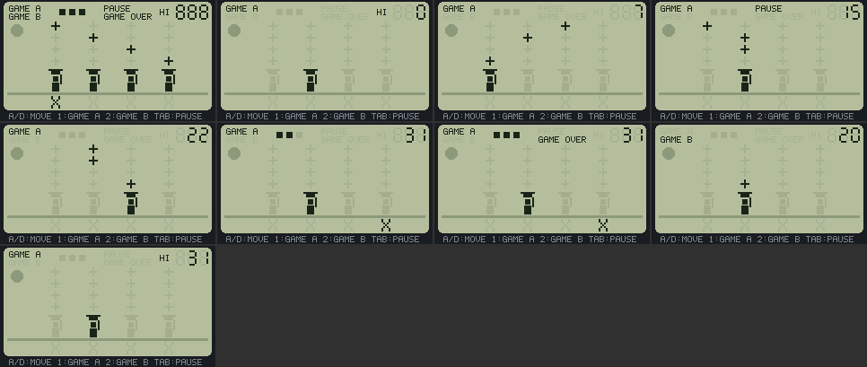

# LCD CATCH — 固定セグメントの液晶ゲーム

2026-09-29、ブランチ `vm/game-lcd`（`vm/main` 026e8c7 から）。メニュー行 "LCD CATCH"（`local.lcdcatch`）の中身。アプリは [`apps/lcdcatch/lcd_catch.js`](../../apps/lcdcatch/lcd_catch.js)、コードの注と調整用定数の表は [`apps/lcdcatch/README.md`](../../apps/lcdcatch/README.md)。**この文書の数値は断りのない限り host の実測**（実物の QuickJS と実物の `pocket.kasane` を 64bit の Linux で動かしたもの）で、実機では何も測っていない。計算・推定にはその旨を書く。

## 結論

- 画面の絵は**あらかじめ決めた位置の図形の集合**で、状態に応じて各図形を「点灯（暗い色）」か「消灯（背景よりわずかに暗い影）」に切り替えるだけ。動くものは1つも無い — 星も網の子も、決まった位置の図形の点灯が移るだけ。拍（ティック）は 30 fps のフレームを数えて打ち、拍と拍のあいだの画面は止まっている。
- **Kasane の2つの上限が設計を決めた。** (1) 1つのシーンが公開できる ref は32個（`KASANE_REF_LIMIT`）で、`patch` はノードを足せない。(2) アプリのコマンドは80個（`KSN_APP_COMMANDS`）で、キャッシュの instance は中身の矩形の数だけコマンドを使う。全部の図形を点灯切り替え可能な ref にすると 46 個で (1) を超える。星を「行ごとに1つの ref を、その行の4つの固定位置へ `setRect` で動かす」にして 31 ref、コマンド 78/80 に収めた。
- host の台本再生（固定の種）で、通常のプレイ・一時停止・ミス3回のゲームオーバー・最高得点の保存と読み戻し・GAME A/B・Back の保存ターン・同じ台本での完全な再現が通る（`LCDCATCH_HOST PASS`）。例外 0、表示失敗 0。
- 1フレームの patch は多くて 30 操作（全点灯からタイトルへ移る1回）、プレイ中は多くて 16、平均 0.46 操作/フレーム。変化の無いフレームは `patch` を呼ばない（2,918 フレーム中 364 フレームだけ patch）。
- ソース 8,347 B、ゲストのヒープは評価後 39,468 B・評価中の最大 49,088 B・1セッションの最大 93,368 B（上限 163,840 B。64bit host なので実機より大きく出る側）。
- **面白さ・手触り（拍の速さ、加速、星の出方、判定の厳しさ、音、見え方）は実機で人が遊んで決める。** 定数は `T` の1か所にまとめた。

## 題材と、なぜそれにしたか

屋根の上で、たも網を持った子が、夜空の4本の筋を1段ずつ落ちてくる星を受ける。取り損ねた星は屋根の下で割れる（`X`）。

- **「落ちてくるものを受ける」は、固定セグメントの型で最も素直に遊びが立つ形**だから。落下物は1段ずつの点灯の移動、受け手は下の段の4つの位置の点灯の移動で表せ、どちらも「決まった位置の図形」の切り替えで済む。足場渡りは受け手の位置が2次元になり、図形の数が倍になる。
- 星は `display` 字体（5×7 のビットマップを2倍）の `+` 1文字。**1コマンドで十字の星形が描ける**のは文字だけで、矩形で描くと2コマンドかかる。影の `+` が 4×4 に並ぶ見た目も、液晶の「消えているセグメントが薄く見える」をそのまま示す。割れた星は `X`。
- 日本語の記号（★ など）は使わなかった。ASCII 以外は `jpfont` のフラッシュ領域から引くので、host の描画シムでは描けない（`tools/hostshim/jpfont.c` は常に false）— host の画像が実機と違うものになる。
- 既存の製品のタイトル・キャラクター・名前は使っていない。借りたのは型（固定セグメント、影、7セグの得点、GAME A/B、ミスの印、拍、ビープ）だけ。

## 遊び方とキー

| キー | 働き | 場面 |
| --- | --- | --- |
| `a` / `,` | 左へ1マス | いつでも（一時停止中を除く） |
| `d` / `/` | 右へ1マス | 同上 |
| `1` / `2` | GAME A / GAME B を始める | タイトル、ゲームオーバー |
| `e` / `;` | 選んでいる方を始める | 同上 |
| `s` / `.` | A と B の選択を切り替える | 同上 |
| `tab` | 一時停止・再開 | プレイ中、ミスの停止中 |
| `` ` ``（Back） | 終了。最高得点を保存 | いつでも |

- 移動は**押した瞬間に1マス**（`keys.pressed()`）。押しっぱなしで連続しない（液晶ゲーム機のボタンと同じ）。1フレームより短い押下も1回に数える。
- 左右を両手どちらでも押せるように、`a`/`d`（左手）と `,`/`/`（右手、Fn で矢印になる位置）の2組にした。依頼の「互いに化けない8キー」（`e a s d ; , . /`）と、安全なキー `1` `2` `tab` だけを使う。`f` `space` `enter` `z` は使わない（同時押しのゴーストで押していないのに押されたことになる）。Enter は開始・一時停止にも使わない。
- 素の `;` `,` `.` `/` は `frame(buttons)` にも矢印のビットとして届くが、このアプリは `buttons` のうち `0x2000`（Back の保存ターン）しか読まない。

**規則**: 星は1拍ごとに全部が同時に1段下がる。4段目（網の真上）にいる星は、次の拍の瞬間に網がその筋にあれば1点、なければミス。ミス3回でゲームオーバー。200点・500点でミスが消える。拍は `T.step`（20）点ごとに1フレーム短くなる。GAME B は拍が短く（10 フレームから）、星が多く、前の星から遠い筋に落ちうる。

## 画面の構成（78 コマンド、ref 31 個、instance 7 個）

| 部品 | 数 | 作り | 点灯の切り替え |
| --- | ---: | --- | --- |
| 液晶の窓・屋根・月・キーの凡例 | 4 | `roundRect` `rect` `text` | 無し（印刷された背景） |
| 星の影 | 16 | `text '+'`（影の色） | 無し |
| 星（行ごと） | 4 | `text '+'` | `setRect`（行の中の4位置）＋`setColor` |
| 割れた星の影・割れた星 | 4＋1 | `text 'X'` | 同上 |
| GAME A / GAME B / PAUSE / GAME OVER / HI | 5 | `text`（`caption`） | `setColor` |
| 得点（7セグ3桁） | 21 | `rect` | `setColor` |
| 網の子（4位置） | 4×5 | `cache.create`（矩形5）→ `instantiate` | `place` の `opacity`（255 / 26） |
| ミスの印 | 3×1 | 同上（矩形1） | 同上 |

- 使ったプリミティブ: `background` `rect` `roundRect` `text`（`caption` と `display`） `cache.create` `instantiate` `instance.place` `ref.setColor` `ref.setRect` `replace` `patch` `stats`。使っていないもの: `strokeRect`（網の輪に使うとテンプレートに入らない）、`image`（独自の絵の資源を持てない。`resource` は組み込みの `pets` だけ、`pixel` は画素プログラムでアトラスにならない）、`group`、`setVisible`、`animate`、手続き描画。
- 消灯は**隠さずに色を変える**。点灯＝`INK`、消灯＝`GH`（背景 `LCD` よりわずかに暗い）。instance には色を変える操作が無いので、群の不透明度で同じ見え方を作る（26/255 で `INK` を背景に混ぜると `GH` に近い色になる。計算）。
- 色（host の画像で数えた実画素の色、RGB565 を8bitに戻した値）: 7色。液晶 `b5be9c`、ベゼル `191c21`、影 `a5b294`、印刷（屋根・月） `8c9a7b`、instance の影 `a5ae8c`、点灯 `192419`、凡例 `7b868c`。**instance の影は文字・7セグの影とわずかに違う色になる**（不透明度の混色と RGB565 の丸めのため。`GO` で寄せられる）。

## 設計の判断と却下した案

| 案 | 採否 | 理由 |
| --- | --- | --- |
| 全図形を固定の ref にして `setColor` だけで切り替える | 却下 | 46 ref。1更新32 ref の上限で `replace` が `the update exposes more than 32 draw references` を投げる（host で実際に踏んだ） |
| `patch` で2回に分けてノードを足す | 不可 | `core_add` は REPLACE だけを受ける。ノードを足せるのは `replace` だけで、`replace` はシーンを作り直す |
| 変化のたびに `replace` で全図形を描き直す（ref を持たない） | 却下 | 約70回の描画呼び出しと全面の再描画を拍・移動のたびに払う。差分 patch なら1拍あたり数操作 |
| 星を行ごとの ref にして位置を動かす | **採用** | 1拍に生まれる星は多くて1個で、全部が同時に1段下がるので、1行に星は多くて1個（計算）。行ごとに1 ref で足りる |
| 網の子を `rect` などの ref で描く | 却下 | 1体4〜5 ref、4体で16〜20 ref。instance なら ref を使わない（instance の上限は8） |
| 網の子の網を `strokeRect` で | 却下 | キャッシュのテンプレートは矩形しか受けない（`parse_cache_draw`） |
| 図形を `setVisible` で消し、影は別の静的ノード | 却下 | 影の分だけコマンドが倍になる。色の切り替えなら1つの図形が影も兼ねる |
| 拍を `Date.now()` などの時計で打つ | 却下 | フレームで数えると、同じ台本で同じ結果になる。実機でフレームが落ちると拍も遅れる（実機で確かめる項目） |
| 判定を「星が4段目にいる間に網が来たら即座に取る」寛容な方式 | 見送り | 拍の瞬間の判定の方が型に近い。寛容さは `T.tick` の長さで調整する。実機で遊んで厳しすぎれば入れる |
| 押しっぱなしで連続移動 | 見送り | 液晶ゲーム機のボタンは1回1マス。`keys.held()` で足せる |

## 音

`pocket.audio.tone({frequencyHz, durationMs, gain})`（capability `audio.tone`、manifest では optional）。拍ごとに 1600 Hz 12 ms のクリック（受けた拍は代わりに 2100 Hz 50 ms）、ミスで 220 Hz 350 ms、開始で 1000 Hz 40 ms。**1度に1音**で、鳴っている間の次の `tone()` は `BUSY` で断られる（Promise の拒否を握りつぶしている）。`tone()` はホームの音楽を止める（`pocket_av_background_stop("tone")`）。ミュート中は同じ長さの無音。host では `tone()` の呼び出しを数えただけで、鳴り方は確かめていない。

## 最高得点の保存

`pocket.storage` のキー `hi` に `[GAME A, GAME B]`。ゲームオーバーで更新があったとき、および Back の保存ターン（`frame(0x2000)`、プレイ中の得点が最高を超えていればそれも）で書く。`storage.set` は JS のタスクで書き込みを終えてから Promise を返す（`pocket_storage.c` のコメント）ので、Back の直後にセッションが終わっても書き込みは残る。manifest の optional に `storage.kv` を足した（`main/pocket/app_registry.c` のこのアプリの行。能力の検査はセッションの注入を変えないが、宣言として正しくするため）。

## host の検証 — `tools/games/run_lcd_catch.sh`

```bash
wsl -e bash -lc "cd <repo> && bash tools/games/run_lcd_catch.sh"          # 台本の再生、PASS/FAIL
wsl -e bash -lc "cd <repo> && bash tools/games/run_lcd_catch.sh --sheet"  # 画像も作る
```

`tools/games/test_lcd_catch_host.c` を `tools/build_kasane_test.sh` の部品（実物の QuickJS、`pocket_kasane.c` と Kasane の core・render、ASan/UBSan）に `pocket_input.c` `keymap.c` `keystate.c` を足して作る（`tools/build_keytest_app_test.sh` と同じ組み方）。キーは実物の `keymap_poll()` へ押下・解放の辺として入れる。`pocket.audio` `pocket.storage` `pocket.random` は JS の代役: `tone()` は数えるだけ、ストアは C の文字列1つでセッションを越えて残る、乱数は common-api.md §8.1 の `xorshift32-v1` をそのまま JS で書き、種は定数 20260929。ゲストのヒープは実機の TLSF の数え方（4 B 切り上げ、最小 12 B）で数え、上限 163,840 B をかける（`test_megademo_app_host.c` と同じ模型）。

プレイヤーは**台本どおりに反応するボット**: 毎フレーム、いちばん下の星の筋へ1回だけ押す（押下と解放を同じフレームに入れる）。

| 段 | 台本 | 確かめること | 結果 |
| --- | --- | --- | --- |
| 1 | 起動（Enter を押したまま評価、離す）→30 フレーム | 全点灯の後タイトル | 通過 |
| 2 | `1` → ボットで30点まで | GAME A の最初の拍が13フレーム、30点までミス0 | 通過 |
| 3 | 15点で `tab` → 90 フレーム → `tab` | 一時停止中に拍が1つも進まない、再開する | 通過 |
| 4 | ボットを止める | ミス3回でゲームオーバー、最高得点＝最終得点（31） | 通過 |
| 5 | `2` → ボットで20点 → Back（`frame(0x2000)`） | GAME B の最初の拍が10フレーム、保存が `[31,20]` | 通過 |
| 6 | 2つめのセッション | 保存した `[31,20]` が読み戻される、`s` で B を選べる | 通過 |
| 7 | 空のストアから 1〜5 をもう一度 | 得点・拍の数・保存内容が1回目と同じ | 通過 |

| 実測（host） | 値 |
| --- | --- |
| ソース | 8,347 B |
| Kasane のコマンド（`stats().displayed.commands`） | 78（上限 80） |
| 公開している ref | 31（上限 32、数えたのはコード） |
| ゲストのヒープ（TLSF の模型、64bit） | 評価後 39,468 B、評価中の最大 49,088 B、1セッションの最大（GC 前のごみを含む） 93,368 B |
| 1フレームの patch 操作（`setColor` `setRect` `place` の数） | 最大 30（全点灯→タイトル）、プレイ中の最大 16（得点の桁上がり）、プレイ中の平均 0.46 |
| patch したフレーム | 2,918 フレーム中 364 |
| `tone()` の呼び出し | 210（3セッション） |

64bit の host は JSValue が 16 B（実機は 8 B）なので、ヒープは実機より大きく出る。MEGADEMO（ソース 28 KB）は実機で評価後 100 KB 台だったので、このアプリは十分に小さい側と見ている（推定、実機では測っていない）。

## 見てもらうための画像

[`lcd-catch-preview.png`](lcd-catch-preview.png)（966×409、host の描画、等倍）。左上から台本の順に: 全点灯（起動）、タイトル（GAME A 選択、HI 0）、プレイ中（7点）、一時停止（15点）、プレイ中（22点）、ミスの停止中（割れた星が点灯、印2つ）、ゲームオーバー、GAME B（20点）、2つめのセッションのタイトル（HI 31）。見え方の評価はしていない。



## ファームのビルド

`idf.py -B build_gamelcd build` は通る（既存の `main/scene/flower.c` の未使用変数の警告だけ）。`tools/memlog.py --map` で、同じビルドディレクトリで基準（`vm/main` 026e8c7 のプレースホルダーと元の `app_registry.c`）と比べた実測: **DIRAM 172,204 B で ±0**、Flash Data 559,348 → 567,300 B（+7,952 B）、image 2,177,184 → 2,185,136 B（+7,952 B）。増えたのは埋め込んだ JS（フラッシュ上の読み取り専用データ）と manifest の配列1つで、RAM には何も足していない。image に新しいソースが入っていることは文字列 `LCDCATCH OVER` で確かめた。

## 実機で調整・確認する項目

1. **拍の速さと加速**（`T.tick` `T.fast` `T.step`）。13 フレーム（約 2.3 Hz）から 5 フレーム（6 Hz）まで。実機の30 fps が保たれるか（この画面は変化が少ないので保たれると見ているが、推定）。フレームが落ちたら拍も遅れる。
2. **星の出方**（`T.spawn` `T.ramp` `T.most` `T.jump`）。1拍に1個まで・前の星から `jump` 筋以内という制約で、ボットは1拍に1マス動けば全部取れる。人が `a`/`d` を押す速さで間に合うか、GAME B の `jump` 2 が理不尽でないか。
3. **判定の寛容さ**。拍の瞬間に網がその筋にあること。遅すぎる・早すぎると感じるかどうか。
4. **音**。クリックが毎拍（最短 167 ms ごと）鳴るのがうるさくないか、`tone()` の呼び出しが1フレームの JS を重くしないか（実機のターン時間で見る）。音量 `T.gain`。
5. **見え方**。影 `GH` と背景 `LCD` の差（実機の LCD のガンマと視野角で、影が見えない・濃すぎる）、instance の影（不透明度 26）が文字の影と同じ濃さに見えるか、`display` の `+` が星に見えるか、網の子の形。
6. **キー**。`a`/`d` と `,`/`/` を同時に押したときに化けないか（依頼の測定では8キーは互いに化けない）、`tab` での一時停止。
7. **保存**。ゲームオーバーと Back で最高得点が残るか、電源を切っても残るか。
