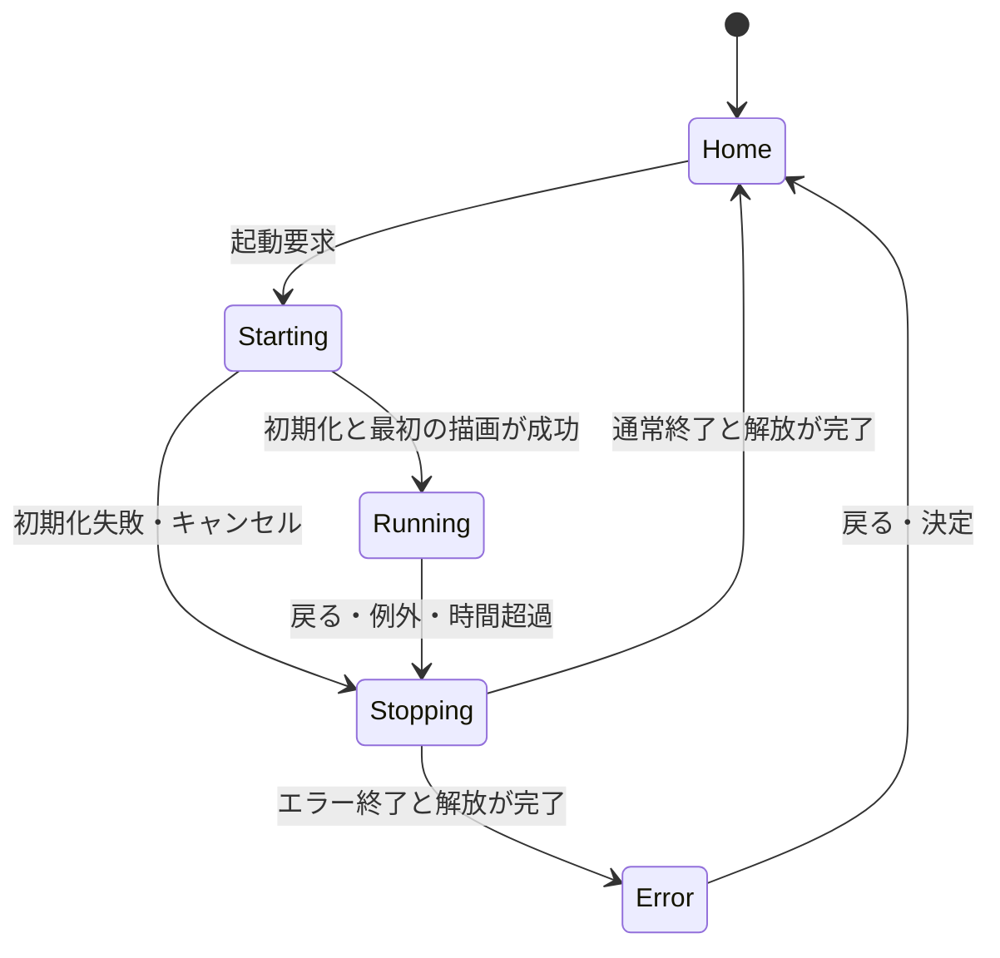

# プラットフォーム設計

状態: 初期設計 / 2026-09-06。実装・実機測定は未実施。

ハードウェアの前提は[仕様と開発制約](hardware-constraints.md)を参照する。

## 目的と境界

Cardputer ADV上でQuickJS版PocketJSのアプリを起動・操作・終了できる土台を作る。
最初のアプリはJavaScript製Hello Worldとキー入力カウンター。
アプリ管理とネイティブホームを先に確立し、後からPlayground、Docs、ペット、PC連携を追加する。

対象はESP32-S3FN8、240×135 LCD、PSRAMなし。8MB Flashは保存領域でありJSヒープには数えない。
QuickJSとMicroQuickJSは異なるエンジンであり、この計画ではPocketJS上流が使用するquickjs-ngを用いる。
Pocket VaporのCへの事前変換は使用しない。

## 依存関係

調査基準はPocketJSコミット `6a0a1b6c91a506c473fc37a0256a47b12eceeca8`。
そのESP-IDFコンポーネントはIDF `>=6.0,<6.2` と `espressif/quickjs-ng 0.14.0` を宣言している。
このPCのEIMに登録されたIDF v6.0.1を最初のビルド基準とし、依存ロックは実装開始時に固定する。[環境とコマンド](build-environment.md)を参照。
S3用Rustアーカイブの配布状態を確認し、なければ対応Xtensa Rustでソースビルドする。
公式ADVデモのIDF 5.4.2設定をそのまま流用せず、ドライバーの参考として扱う。

S3では `pocketjs_package`、`pocketjs_ui_qjs`、`pocketjs_render_rgb565` とその依存を使用する。
P4専用PPAは組み込まない。液晶転送とADVの入力は本プロジェクトが担当する。

## 責務と所有権

| 部分 | 責務 | 所有する資源 |
| --- | --- | --- |
| Board HAL | LCD、TCA8418キーボード、時刻、将来の音・IMU | デバイスハンドル、転送バッファ |
| Shell | ホーム、起動表示、エラー表示、選択位置の保持 | 小さなネイティブUI状態 |
| AppManager | 起動、停止要求、状態遷移、失敗時の後始末 | アプリセッション、固定長のエラー情報 |
| AppSession | QuickJSとPocketJSの生成、評価、フレーム処理 | guest、UI core、binding、renderer、package |
| InputRouter | ForceStopの先取り、IME優先配送、未消費キーの配送 | 上限付き入力キュー、フォーカス世代 |
| TextInputService（M2） | 共通SKK、候補表示、確定UTF-8の配送 | 単一所有のIME状態、共有Flash辞書 |
| DisplayService | Shellまたはアプリの描画を液晶へ送る | 画面所有者、DMA完了状態 |

同時に動くJSアプリは1つ。ホームと復帰画面はネイティブ実装。
アプリ実行中はホーム背景を停止し、アプリ終了時はセッション全体を破棄する。
ホームのカテゴリIDと項目IDだけを残す。カテゴリを切り替えても各カテゴリの選択位置を覚える。

## 状態遷移

起動要求の連打はStarting以降では受理しない。Stoppingから新しいアプリを起動しない。
画面所有者の切り替えは前の転送完了後に行い、同じLCDへ複数タスクが直接描画しない。

## 実行モデル

制御タスクがキーを読み、停止要求とShellの状態を扱う。アプリ用タスクがQuickJSとPocketJSを直列に呼ぶ。
QuickJS contextを別タスクから操作しない。別タスクからの停止は上流の割り込みAPIを使い、終了通知を待ってから解放する。
両タスクとDisplayServiceの通信は上限付きキューまたは所有権の明確な通知で行う。

1回の処理は、入力の取り込み、JSフレームとPromiseジョブ、PocketJS DrawList生成、描画、転送の順。
初期tick目標は30Hz。性能未達時はプロファイルとパッケージのtick設定を揃えて変更する。
起動時の評価にも期限を設ける。Promiseの連鎖を含め、フレーム全体の期限と停止応答を検証する。
処理中のネイティブ関数は短時間で返すか、タイムアウト付きの非同期処理にする。

## 起動と解放

起動はpackage検証、guest生成、core生成、binding生成とリソース登録、mount、JS評価、renderer生成、最初の描画の順に進める。
どの段階で失敗しても生成済み資源だけを解放する。エラー文字列はguestを破棄する前に上限付きでコピーする。

停止手順は上流の寿命規則に従う。

1. JS処理を停止し、アプリタスクがアクセスを終了したことを確認する。
2. LCD転送を完了させ、描画トランザクションをcommitまたはabortする。
3. rendererとtargetを破棄する。
4. guestを破棄する。
5. bindingとcoreを破棄する。
6. packageとその保存領域を解放する。

単なる生成順の逆順にしない。上流はguestをbindingより先に破棄することを要求する。
描画結果の借用ポインタは次のtickやmutationを越えて保存しない。
停止確認が取れないタスクのメモリを先に解放しない。復帰不能時の最終手段はwatchdogによる再起動とし、通常のJSエラーからの復帰とは区別する。

## アプリとAPI

初期アプリ一覧はファームウェア内の静的テーブル。ID、表示名、カテゴリID、package参照を持つ。
動的インストーラーや独自の複雑なmanifestはまだ作らない。
`.pocket` のHostOps ABI、画面サイズ、tick、host profile hashは上流の検証を通す。

Hello Worldは素のJSを編集用ソースにし、ビルド時にPocketJSのホストAPIへ接続する起動コードと束ねる。
上流guestは `globalThis.frame` を要求するため、単独の `print()` のみではアプリとして成立しない。
JSX/TSXやVue SFCはQuickJSでは直接評価できず、使用する場合はPCで変換する。

最初の入力は決定・戻る・方向操作。M1ではBackでホームへ戻る。
M2以降は専用ForceStopだけを制御タスクで先取りし、通常キーはIME、入力欄、Shellの順に処理する。
変換中のEscをアプリ終了に使わず、Enter確定を改行や送信へ二重配送しない。
詳細は[SKK日本語入力設計](japanese-input.md)を参照する。
将来のエディタ用文字入力は方向ボタンとは別のイベントとして追加する。現行IDF入力構造には文字列入力がないためアダプターが必要。
音、SD、IMU、通信APIは後段で追加し、実装していない機能をhost capabilitiesへ宣言しない。

## メモリと描画

512KB SRAMの全量をヒープ予算としない。OS、コード・静的データ、スタック、HAL、転送用DMA領域も計測する。
上流の4MiB guest heap上限と256KiB stack上限はADV用設定ではない。stack上限は確保量でもなく、実際のタスクスタックより余裕を持って小さく設定する。
具体的なguest上限は起動計測後に決め、native側と復帰画面のための余裕を残す。

| 項目 | 設計方針 |
| --- | --- |
| LCDバッファ | 240×8行×2byte = 3,840byteを候補に評価。DMA中は再利用しない |
| 全画面 | RGB565で64,800byte。常駐二重バッファは初期構成で採用しない |
| 描画領域 | damage領域を固定高さへ分割し、上流render_stripで整合性を検証 |
| パッケージ | 同梱版はFlashの借用領域。SD全体読み込みは後段で検討 |
| フォント | 最初は英数字。日本語は字形キャッシュと必要範囲の読み込みを別途設計 |
| ログ | 固定容量リング。超過時は古いログを捨て、破棄件数を表示 |
| Wi-Fi/BLE | 最初は無効。通信追加前後で再計測 |

QuickJS heap limitはRust製core、renderer、フォントなどのメモリを制限しない。
上流Rust OOMは致命的なため、任意アプリが安全に復帰できるとはまだ保証できない。
Hello Worldの固定リソース数で成立性を測り、Playgroundの前にノード・画像・文字列などの上限とnative allocationの失敗対策を設計する。

## 将来への接続点

- Playground: ネイティブエディタからJSソースをセッションへ渡し、実行終了後に編集状態へ戻す。
- Docs: Flash/SDの索引付き記事からサンプルを編集用領域へコピー。HTMLブラウザーは搭載しない。
- Pet: 同じJSアプリAPIで実装し、切り替え時に保存・復元する。常時実行は未決定。
- PC bridge: USB経由の転送と状態通知から開始。Codex/Claude Code本体と認証情報はPCに置く。

## 参照

- [Cardputer ADV仕様](https://docs.m5stack.com/ja/core/Cardputer-Adv)
- [PocketJS ESP-IDFガイド（調査基準）](https://github.com/pocket-stack/pocketjs/blob/6a0a1b6c91a506c473fc37a0256a47b12eceeca8/site/content/docs/esp-idf.md)
- [PocketJS guest実装（調査基準）](https://github.com/pocket-stack/pocketjs/blob/6a0a1b6c91a506c473fc37a0256a47b12eceeca8/hosts/esp-idf/components/pocketjs_guest/src/guest.c)
