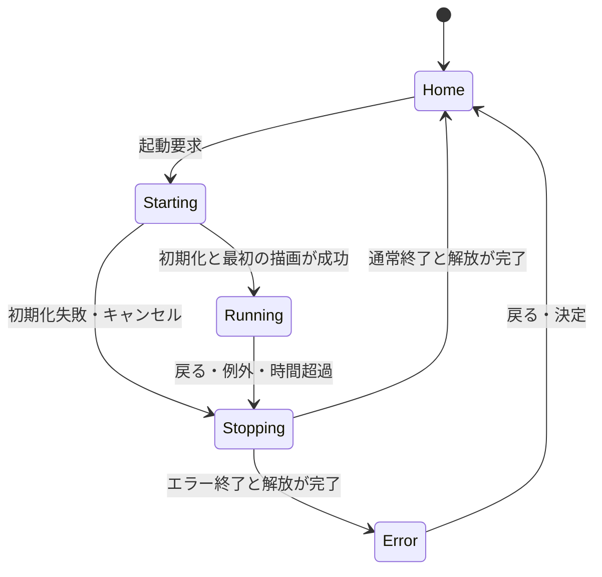

# プラットフォーム設計

更新: 2026-09-06。確定済みcommit `2b053b7`の実装を反映。チュートリアル統合は進行中。未実装の契約は明記し、現在の制約は[レビュー](implementation-audit.md)を参照する。

ハードウェアの前提は[仕様と開発制約](hardware-constraints.md)を参照する。

将来の公開APIは[共通JS API仕様案 v0.1](common-api.md)に分離する。pocket.*は新設予定であり、本書が記載する現在の実装済みAPIではない。

## 目的と境界

Cardputer ADV上でQuickJS版PocketJSのアプリを起動・操作・終了できる土台を作る。
最初のアプリはJavaScript製Hello Worldとキー入力カウンター。
アプリ管理・ネイティブホームに加え、PlaygroundとSKK Practiceを実装した。Docs／チュートリアルは進行中、PC連携は未実装。ペットは2026-09-07に同梱JSアプリとして実装し、ホストテスト・ビルドを確認した（実機未確認）。

対象はESP32-S3FN8、240×135 LCD、PSRAMなし。8MB Flashは保存領域でありJSヒープには数えない。
QuickJSとMicroQuickJSは異なるエンジンであり、この計画ではPocketJS上流が使用するquickjs-ngを用いる。
Pocket VaporのCへの事前変換は使用しない。

## 依存関係

調査基準はPocketJSコミット `6a0a1b6c91a506c473fc37a0256a47b12eceeca8`。
そのESP-IDFコンポーネントはIDF `>=6.0,<6.2` と `espressif/quickjs-ng 0.14.0` を宣言している。
EIMのIDF v6.0.1と固定依存を使用する。[環境とコマンド](build-environment.md)を参照。
S3用RustアーカイブはWSLでtools/build_native.shによりソースビルドする。
公式ADVデモのIDF 5.4.2設定をそのまま流用せず、ドライバーの参考として扱う。

S3では `pocketjs_package`、`pocketjs_ui_qjs`、`pocketjs_render_rgb565` とその依存を使用する。
P4専用PPAは組み込まない。液晶転送とADVの入力は本プロジェクトが担当する。

## 責務と所有権

| 部分 | 責務 | 所有する資源 |
| --- | --- | --- |
| Board HAL / motion / sound | LCD、TCA8418キーボード、時刻、音・IMU | デバイスハンドル、転送バッファ |
| Shell | ホーム、起動表示、エラー表示、選択位置の保持 | 小さなネイティブUI状態 |
| AppManager | 起動、停止要求、状態遷移、失敗時の後始末 | アプリセッション、固定長のエラー情報 |
| AppSession | QuickJSとPocketJSの生成、評価、フレーム処理 | guest、UI core、binding、renderer、package |
| InputRouter（main.c / keymap.c） | キー変換・停止要求、ネイティブ編集欄への入力 | 16件の入力キュー。フォーカス世代・overflow処理は未実装 |
| SKK / Editor / Playground | SKK、候補表示、ネイティブバッファへのUTF-8挿入 | 単一所有のIME状態、共有Flash辞書。任意JSへのTextCommit配送は未実装 |
| DisplayService | Shellまたはアプリの描画を液晶へ送る | 画面所有者、DMA完了状態 |

上表は責務の区分で、AppManagerとDisplayServiceは独立クラス／タスクではなくmain.cのui_taskとapp_session.cに実装する。同時に動くJSアプリは1つ。ホームと復帰画面はネイティブ実装。
アプリ実行中はホーム背景を停止し、アプリ終了時はセッション全体を破棄する。
ホームのカテゴリIDと項目IDだけを残す。カテゴリを切り替えても各カテゴリの選択位置を覚える。

## 状態遷移

起動要求の連打はStarting以降では受理しない。Stoppingから新しいアプリを起動しない。
画面所有者の切り替えは前の転送完了後に行い、同じLCDへ複数タスクが直接描画しない。

## 実行モデル

input_taskがキー・IMU・USB診断を読み、停止フラグと16件のキューを扱う。ui_taskがShell、ネイティブ編集画面、QuickJS、PocketJS、LCD転送を直列に所有する。専用アプリタスクはない。
別タスクからQuickJS contextを操作せず、停止は割り込みで確認する。JS呼び出しが戻ってからui_taskが解放する。音声は専用タスクで合成する。

1回の処理は、入力の取り込み、JSフレームとPromiseジョブ、PocketJS DrawList生成、描画、転送の順。
初期tick目標は30Hz。性能未達時はプロファイルとパッケージのtick設定を揃えて変更する。
初期評価の期限は2秒、tickの期限は250ms。Promise連鎖を含むM1の中断試験は[記録](firmware-m1.md)を参照する。現在構成での性能保証は別途再測定する。
処理中のネイティブ関数は短時間で返すか、タイムアウト付きの非同期処理にする。

## 起動と解放

現在は埋め込みJSまたは編集ソースを直接評価する。package検証は未実装。guest生成、core/binding生成、リソース登録、mount、JS評価、renderer生成、最初の描画へ進む。
どの段階で失敗しても生成済み資源だけを解放する。エラー文字列はguestを破棄する前に上限付きでコピーする。

停止手順は上流の寿命規則に従う。

1. JS処理を停止し、アプリタスクがアクセスを終了したことを確認する。
2. LCD転送を完了させ、描画トランザクションをcommitまたはabortする。
3. rendererとtargetを破棄する。
4. guestを破棄する。
5. bindingとcoreを破棄する。
6. packageとその保存領域を解放する。

単なる生成順の逆順にしない。上流はguestをbindingより先に破棄することを要求する。
描画結果の借用ポインタは次のtickやmutationを越えて保存しない。
停止確認が取れないタスクのメモリを先に解放しない。復帰不能時の最終手段はwatchdogによる再起動とし、通常のJSエラーからの復帰とは区別する。

## アプリとAPI

現在のアプリ一覧は静的な名称配列と起動分岐で、Hello World、SKK Practice、Playgroundを持つ。package参照付きの登録テーブルは未実装。
動的インストーラーや独自の複雑なmanifestはまだ作らない。
将来.pocketを受け入れる場合はHostOps ABI、画面サイズ、tick、host profile hashを上流で検証する。現在は.pocketを受け入れない。

Hello Worldは素のJSを編集用ソースにし、ビルド時にPocketJSのホストAPIへ接続する起動コードと束ねる。
上流guestは `globalThis.frame` を要求するため、単独の `print()` のみではアプリとして成立しない。
JSX/TSXやVue SFCはQuickJSでは直接評価できず、使用する場合はPCで変換する。

最初の入力は決定・戻る・方向操作。M1ではBackでホームへ戻る。
現在はCtrl+Alt+DelでForceStopを検出し、編集欄では通常キーをIME優先で処理する。ただしSKK編集／CODE_EDIT中の即時停止、キュー満杯時の処理、フォーカス世代は未完成である。
変換中のEscをアプリ終了に使わず、Enter確定を改行や送信へ二重配送しない。
詳細は[SKK日本語入力設計](japanese-input.md)を参照する。
文字入力はkeystroke_tとしてネイティブ編集欄に接続済み。動作中JSへの配送はEnterのビットが中心で、共通の方向・TextCommit APIは未実装。
音とIMUはネイティブで利用済みだがJS用共通APIは未公開。SD・通信も未実装で、未実装機能をhost capabilitiesへ宣言しない。

## メモリと描画

512KB SRAMの全量をヒープ予算としない。OS、コード・静的データ、スタック、HAL、転送用DMA領域も計測する。
上流の4MiB guest heap上限と256KiB stack上限はADV用設定ではない。stack上限は確保量でもなく、実際のタスクスタックより余裕を持って小さく設定する。
現在のguestヒープ上限は128KiB、JSスタック上限20KiB、ui_taskスタック32KiB。これは上限設定であり、実使用量とは区別する。

| 項目 | 設計方針 |
| --- | --- |
| LCDバッファ | 240×8行×2byte = 3,840byteを候補に評価。DMA中は再利用しない |
| 全画面 | RGB565で64,800byte。常駐二重バッファは初期構成で採用しない |
| 描画領域 | damage領域を固定高さへ分割し、上流render_stripで整合性を検証 |
| パッケージ | 同梱版はFlashの借用領域。SD全体読み込みは後段で検討 |
| フォント | ネイティブはFlashの東雲12px／美咲8px。JSアトラスは実行中の出現文字を累積、最大160字 |
| ログ | 6行×46bytesのリング、128bytesのエラー領域。破棄件数表示は未実装、UTF-8折返しは修正対象 |
| Wi-Fi/BLE | 最初は無効。通信追加前後で再計測 |

QuickJS heap limitはRust製core、renderer、フォントなどのメモリを制限しない。
上流Rust OOMは致命的なため、任意アプリが安全に復帰できるとはまだ保証できない。
Hello Worldの固定リソース数で成立性を測り、Playgroundの前にノード・画像・文字列などの上限とnative allocationの失敗対策を設計する。

## ソース保存とFlash

partitions.csvを容量の基準とする。factoryは0x10000から3MiB、skk_dictは0x310000から2MiB、jp_fontは0x510000から512KiB、storageは0x590000から2496KiB。旧storage先頭0x710000からの自動移行はない。

srcstoreは最大8192bytesのソースを16スロットで保存する。0はユーザー、1以降は教材用。各スロットは12KiBブロック×2面の24KiB、全体384KiB。CRC付き二面保存だが、保存失敗表示、空文書、破損復旧後の保存先選択には[未解決事項](implementation-audit.md)がある。汎用ファイルシステムやwear levelingではない。

## 実装済みの接続点と将来機能

- Playground（実装済み）: ネイティブエディタからJSソースをセッションへ渡し、実行終了後に編集状態へ戻す。frameなしのソースも評価し、コンソールへ戻る。
- Docs: Flash/SDの索引付き記事からサンプルを編集用領域へコピー。HTMLブラウザーは搭載しない。
- Pet: 同じJSアプリAPIで実装し、切り替え時に保存・復元する。常時実行は未決定。
- PC bridge: USB経由の転送と状態通知から開始。Codex/Claude Code本体と認証情報はPCに置く。

## 参照

- [Cardputer ADV仕様](https://docs.m5stack.com/ja/core/Cardputer-Adv)
- [PocketJS ESP-IDFガイド（調査基準）](https://github.com/pocket-stack/pocketjs/blob/6a0a1b6c91a506c473fc37a0256a47b12eceeca8/site/content/docs/esp-idf.md)
- [PocketJS guest実装（調査基準）](https://github.com/pocket-stack/pocketjs/blob/6a0a1b6c91a506c473fc37a0256a47b12eceeca8/hosts/esp-idf/components/pocketjs_guest/src/guest.c)
