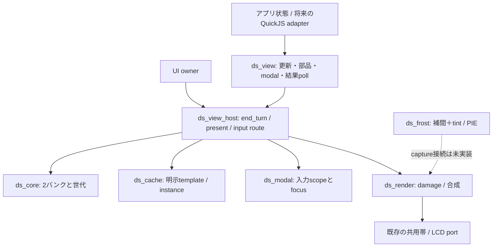

# 新DSの利用APIとowner境界 v0.3

2026-09-14。`ds_view.h`と`ds_view_host.h`は実装済みC API。
QuickJSへの公開・既存アプリの移植は未実装。この文書は既存PocketJS UIの
`pocket.ui`と区別し、新DSの利用窓口を定める。
画素と容量の規範は[合成仕様](design-composition.md)と[DS仕様](design-system.md)。

## 1. 再構成の理由と境界

従来はcoreのabort/present/discard、cacheのabort/resolve、modalのcancel/resolveを
利用側が正しい順序で呼ぶ必要があった。更新失敗やVM yieldで一つでも漏れると、
画面・instance参照・入力scopeの状態が食い違う。
`ds_view_host`がその順序を所有し、アプリadapterはレイヤー固定の`ds_view *`だけを受け取る。



公開型を`ds_composition_types.h`へ分離した。`ds_view.h`から内部bankやcore/cacheの
保存レイアウトを参照する必要はない。endpointはAPPまたはSYSTEMに固定され、
begin引数にlayerを渡さない。template/instanceも発行側layerに限定する。
関数呼出にheap確保はなく、部品ごとのvtable・汎用broker・イベントqueueを追加しない。

## 2. 公開操作

| 用途 | 実装済みC API | 契約 |
| --- | --- | --- |
| 能力と容量 | `ds_view_features`, `ds_view_get_stats` | rendererまで動く能力だけ公開。core保存形式の語彙と区別 |
| 更新開始 | `ds_view_begin` | REPLACE / PATCH、共有builderは一つ。BUSY時はdomain stateを保持 |
| 基本描画 | `background`, `add`, `change`, `group`（`ds_view_`接頭辞） | 背景、矩形、属性更新、隔離group opacity |
| 提出と取消 | `ds_view_submit`, `ds_view_cancel` | submitはLCD完了ではない。cancelはbuilderまたは未確定提出を取消 |
| 結果取得 | `ds_view_poll` | layerごとに最後の`ticket/status/reason`を保持。別layerの提出では消えない |
| 明示部品 | `ds_view_cache_create/release` | 不変命令templateのコピー。更新の外で作成・解放 |
| 部品の配置 | `ds_view_instantiate/place/visible` | 複数同時表示、位置・clip・opacity・表示のPATCH |
| modal | `ds_view_modal_open/close` | APP REPLACE内。solid/dim-live、表示成功後に入力scopeとfocusを確定 |

現在の`draw_kinds/cache_kinds`はRECTだけ。グループ透明度は対応、native animationと
frosted modalはfalse。角丸・文字・画像・gradientはコアに保存できても描画APIでは
UNSUPPORTEDを返し、LCD提出まで進めない。文字の予約容量を表示対応とは解釈しない。
すりガラス画素フィルタのPIE対応はfrosted modalの完成を意味しない。

## 3. 原子的な更新と参照

新APIでは、所有中builderの変更に失敗した時点でcore/cache/modalをまとめてabortする。
旧低レベルAPIの「poisonをabortまで保持」は内部契約として残す。
別layerや古いticketでの呼出しは正しいbuilderを取消しない。
参照やinstanceの出力はその更新の候補値で、PRESENTED確認後にアプリの表示参照へ昇格する。
失敗したREPLACEの候補参照を次更新へ持ち越さない。育成値などdomain stateは戻さない。

```c
/* widthはdomain側で0..100へ検証済み。fillは前回PRESENTEDの参照。 */
ds_tx ticket;
ds_result r = ds_view_begin(view, DS_PATCH, &ticket);
if (r != DS_OK) return r; /* BUSYなら次回、最新のwidthで再試行 */
ds_change change = {.property=DS_SET_RECT, .value.rect={8,110,8+width,118}};
r = ds_view_change(view, ticket, fill, &change);
if (r != DS_OK) return r; /* 新窓口が既に全builderをabort済み */
return ds_view_submit(view, ticket);
```

submit後はSUBMITTED。ownerが必要な全帯を転送した時にPRESENTEDへ進む。
転送失敗はSUBMITTEDを維持し、再試行は全帯修復。cancelした場合はDISCARDEDになるが、
部分転送の修復要求は残り、修復完了までAPP入力は遮断する。
表示済みticketへの遅いcancelはSTALEを返し、成功した画面を巻き戻さない。
pollは消費型queueではなく固定state。同一layerの次submit前に結果を扱う。

## 4. cache / modal / VM境界

cache.createは更新の外で行う。templateは明示releaseまたはhost resetまで保持する。
template作成を後続REPLACEの取消に連動させない。表示中のinstanceを参照するreleaseはBUSY。
同じtemplateをREPLACE内で複数instantiateできる。PATCHはplace/visibleで更新し、
構造変更はREPLACE。REPLACEから省略されたinstanceは表示成功時にdetachされる。
abort/discardした配置・非表示変更は元に戻り、新instanceは破棄される。

solid modalはREPLACEの先頭、dim-liveは通常内容を追加した後にopenし、その後にmodal内容を追加する。
closeは最新domain stateを再構築するREPLACE内で行う。closeが失敗したらmodalを維持する。

ownerは**全JS復帰境界（正常・例外・yield）**で`ds_view_host_end_turn`を呼ぶ。
未提出builderをabortし、提出済み状態は残す。
`ds_view_host_present`は描画→core確定→cache反映→modal反映→layer結果保存の順で処理し、
途中でJSを呼ばない。入力は`ds_view_host_route`で到着時に一度だけ配送先を決める。
初期化/resetの前にはguestを破棄し、古いendpointを持つJSを再開させない。
hostはcore/cacheを排他的に所有し、旧低レベルAPIとの混在更新を禁止する。

## 5. JS側の次の接続

既存仕様の`view.patch(tx => ...)`、軽量参照wrapperはこの窓口へ接続する。
JSのbegin/submit/cancel/pollがネイティブの同名操作に対応し、公開rootはAPP endpointだけを持つ。
共有prototypeと固定数のwrapperで参照を保持し、bankポインタをJSへ渡さない。
callback版patch/replaceは同期処理に限定し、PromiseやVM yieldを跨ぐbuilderを禁止する。
入力、時計、音声、保存は既存サービスを利用する。

JS adapterの対応契約（以下は未export）:

| JS表現 | nativeへの対応 |
| --- | --- |
| `view.replace(build)` / `view.patch(build)` | begin→同期build→submit。例外/thenable/yieldならcancel。戻り値はticket |
| `tx.background(color)` / `tx.rect(spec)` | background / add。rectは候補DrawRefを返す |
| `ref.setRect(tx, bounds)` / `setClip` / `setColor` / `setVisible` | change。wrapperは作成時に一度だけ確保し、setterで増やさない |
| `view.cache.create(rects)` / `release(template)` | 更新外の不変template管理 |
| `tx.instantiate(template, placement)` | 候補InstanceRefを返す。placementはoffset、clip、opacity、visible |
| `instance.place(tx, placement)` / `setVisible(tx, bool)` | place / visible。template内部は変更しない |
| `tx.modal.open(spec)` / `close()` | modal_open / modal_close。specはbackdrop、color、focus |
| `view.poll()` / `view.cancel(ticket)` | poll / cancel。Promiseや自動再提出を生成しない |
| `view.features()` / `view.stats()` | features / get_stats |

buildが作る候補wrapperは提出結果と関連付け、DISCARDEDなら無効化する。
呼出前にwrapperのsession・所有view・状態を検証する。内部の数値IDを利用者が差し替えられる
普通のJS propertyに保持しない。参照上限32件は既存BETTER契約を引き継ぐ。
schemaの文字列ID解決は構築時に行い、毎PATCHで名前検索しない。
画面への自動レイアウト、暗黙cache、Reactiveな依存追跡は追加しない。

今回の再構成ではbindingやスキーマloaderを実装したとは扱わない。
次の実アプリ接続では文字・画像renderer、結果pollによる候補wrapper確定、guest終了cleanup、
ownerの呼出位置まで一組で検証する。旧`pocket.ui`への移植を新DS移行の代用にしない。

## 6. 検証とメモリ

`tools/ds_contract/test_view.c`は二つのcache instance、透明度、PATCH取消、
VM yield相当の未完modal、新instanceのcleanup、別layerの干渉拒否、layer別poll、
転送途中失敗→cancel→全帯修復、modal開閉とfocus復帰を検証する。
ASan/UBSan、O2 strict-aliasing、C++17ヘッダ検査を`run.sh`へ組み込んだ。
実機の`VIEW PASS`も同じ窓口で二つのinstance、取消、無変更の転送ゼロ、modal開閉を通す。

core 9,216 B、cache 4,096 Bは維持。追加coordinatorはホスト64-bitで112 B。
S3の実サイズは実機診断で84 B。共有IDカウンタは20 B。
statsのnative_bytesはこれらの合計で、LCD帯・JS heap・frost snapshotを含まない。
S3では13,416 B、既存LCD帯3,840 Bを合算すると17,256 Bになる。
これはcacheを含む明示計上であり、DS基本16 KiBへ収まったという報告ではない。
部品数ごとの追加heap確保は0。PIE側も保持snapshotは2,048 Bのまま。
