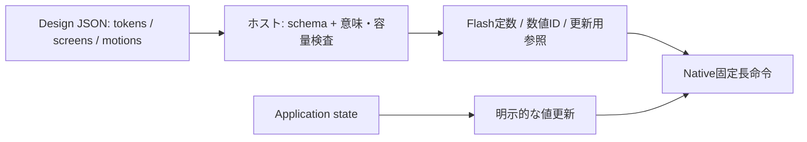

# デザイン定義スキーマ v0.1

2026-09-13。実装前の仕様。機械可読の型は[design-schema.json](design-schema.json)、記述例は[design-example.json](design-example.json)。
共通の描画契約は[デザインシステム仕様](design-system.md)に従う。
v0.2の重なり・透過・cache・modal・effectsは[合成仕様](design-composition.md)で定義する。本書とJSON Schemaはv0.1の交換形式として残し、新要件の全機能を表せるとはしない。
JSON Schemaは型・必須項目の検証用であり、コンパイラや端末上のローダーはまだ実装していない。
例はペットとすりガラスモーダルの表現を示す縮小例で、既存ペットアプリの全機能を置き換えるものではない。

## 1. 定義と実行を分ける

JSONは制作時の交換形式。端末へ巨大なオブジェクト木としてロードすることは標準経路にしない。
ホストでtokenを解決し、IDを数値化し、初期命令と必要な更新参照を生成する。
QuickJSへJSON全体、token辞書、不要画面を常駐させない。ソース文字列・解析一時領域・生成JSのヒープも測定対象とする。
動的画面は従来の明示座標APIでも生成でき、両経路に同じ容量と失敗契約を適用する。

## 2. 記述の階層

| 要素 | 意味 |
| --- | --- |
| version / target | 形式と端末プロファイル。未知versionは拒否 |
| tokens | 色、共通間隔・角丸、Flash typographyプロファイル |
| screens | 排他的に表示する画面定義。全画面をRAMへ展開しない |
| nodes | 配列順で重なる、平坦な部品定義。実行時の親子木ではない |
| focus / actions | フォーカス順とアプリcommand名。JSソースを含めない |
| motions | 明示的に開始する演出レシピ。定義しただけでは動かない |
| modals | 同時1個、入れ子なし。画面定義と同じ座標系を使用 |
| budget | 当該画面とモーダル遷移時に守る最大使用量 |

色は`#RRGGBBAA`または`@color/name`。token値はリテラルだけで、参照連鎖や継承を作らない。
このv0.1形式では透明度は色のalphaで指定し、合成グループへのopacityフィールドは持たない。v0.2の必須グループopacityは後続形式と生成器で追加する。
rect/clipは整数の`[x0,y0,x1,y1]`。clip省略は画面全体。visible省略はtrue。
spacing/radiiは共通語彙であり、自動paddingを適用しない。panelの内側へ文字を置く座標も明示する。
未知propertyは拒否し、CSS互換の曖昧な指定を黙って無視しない。

## 3. 部品から命令への展開

| kind | 定義 | 命令への展開 |
| --- | --- | --- |
| panel | fill、radius、任意border | fill 1＋枠があれば1 |
| label | text、UTF-8 capacity、font、color | text 1 |
| meter | value 0..100、track、fill | 矩形2。fill幅は最近接整数の割合 |
| pet | variant 0..11、mood 0..5、scale | PPT2描画1 |

labelのalign省略はstart、overflowはclip固定。垂直位置は矩形上端を基準とする。
center/endは文字変更時に送り幅を計算して座標へ解決し、親や他部品を再配置しない。
panelのradiusは幅・高さの半分を超えて指定できない。0サイズのradiusは0のみ。
角丸borderは同じ輪郭から内側1〜2 pxの帯を描く。v0.1スキーマのpanelに対応するnative枠描画は実装時に追加・検証する必要がある。
petの矩形サイズはscaleに応じて64×64または32×32と一致させる。矩形による任意伸縮はしない。
画像・List・Speech・Toast・Button等のヘルパーは、この語彙への展開または後続versionでの型追加とする。未定義kindは使えない。
このスキーマにないnative機能まで未対応になったことを意味せず、初期交換形式を小さく保つ。

## 4. 状態・入力・演出

アプリのfoodや選択中ペット等はアプリ側が所有する。定義中のvalue/text/moodは初期値であり、永続データではない。
生成物が公開する数値IDを使い、アプリが状態変更時にsetText/setMeter/setPet相当の更新を明示する。
JSON中に式、eval、watch式、関数名からの動的実行、汎用双方向bindingを入れない。
actionのcommandはアプリが明示登録する処理IDで、未登録は検査エラー。名称が一致する任意のJS関数を探索して呼ばない。
activateのtargetはそのscopeのfocusに存在すること。backはscopeの戻る操作として最大1件に限定し、targetは既存nodeを指す。
モーダル表示中はモーダル内だけへ入力を配送し、閉じた後は元の有効なfocusへ戻す。システム通知の入力優先順位は別途上位で適用する。

motionsは初期版ではtranslateYのみを公開する。省メモリnative trackへ展開し、配列の全レシピを常時trackとして確保しない。
対象が複数命令のpanel等なら連続範囲を同時に動かす。clipは動かない。
from/toは元座標からのoffset。onceは終端保持、loopは同じ区間を反復、pingpongは片道durationMsで往復する。
開始・停止はアプリが明示する。reduceMotion、同一属性の競合、終了時の回収は共通仕様に従う。
色・opacity・revealのnative演出も、型と必要な検査を定義した後にスキーマへ追加する。

## 5. すりガラスモーダル拡張

本節は任意のfrosted-staticに限る。必須のsolid/dim-live、明示capture handle、入力scopeの遷移はv0.2合成仕様に従う。

`frosted-static`はv0.1の任意機能。汎用blur命令とは分け、背後の画面全体を静止した縮小画像として保存する。
モーダルを開く時点の背景を帯単位で再合成し、縮小→ぼかし→拡大→tintの順に処理する。
CPU側で合成した帯を使用し、LCD読戻しは必要としない。モーダル自身やシステム通知はcaptureに入れず、通知は常に後から鮮明に描く。
背景の画像だけを固定し、育成・時計・通信は継続する。閉じた時点の最新アプリ状態で画面を再構築する。

| downsample | 画像 | RGB565画像 B | 専用領域の上限案 B |
| --- | --- | ---: | ---: |
| 8 | 30×17 | 1,020 | 2,048 |
| 4 | 60×34 | 4,080 | 6,144 |

最下段の不完全な縮小セルは実際の画素数で平均する。blurRadiusは縮小画像上の1または2画素。
初期アルゴリズムは水平・垂直の分離box blur 1回、端は端画素複製。8 bit成分へ展開して平均を最近接整数へ丸め、RGB565へ戻す。
水平処理は行scratch、垂直処理は列scratchに元値を退避してから上書きすることで、第2全画像を作らない。
拡大は画素中心対応のbilinear補間、端はclamp。tintは共通のalpha合成式で適用する。
縮小用accumulator・行/列scratch・管理を含めて上表の専用領域に収める。詳細なscratch配置と画素一致の参照実装は実装段階で確定する。
ぼかしと補間のPIE化はプロファイル後に判断し、命令の有無をJSONへ露出しない。

この領域は既存native 16 KiBの外に明示追加する。モーダル時はそれぞれ18 KiB/22 KiB以内を目標とし、JS状態やスタック等はさらに別計測する。
画質・時間・追加RAMは未実測。暗黙にglyph cache等を借用しない。
画面budget.backdropBytesに必要量がない場合は生成時にエラー。実機能力不足または確保失敗は指定fallbackの不透明な単色背景へ切り替える。
fallbackは必須でalpha=255とする。モーダルの内容・入力・保存動作は維持し、演出の失敗をアプリの失敗にしない。
実際のbackdrop modeは状態照会で確認可能にし、fallbackを無言で性能実績に数えない。

背景commandのsnapshotコピーは追加しない。表示済みbankをcapture完了まで保持し、構築bankへモーダルを作る。
capture中の新しい表示更新はBUSYとして合流し、処理途中に別画面を混ぜない。
モーダル提出後は背景のnative命令を保持し続けず、復帰用のアプリ状態から再構築する。背景のactive演出は退避trackを作らず、再開方針をアプリが時刻から決定する。
capture中の入力取消・終了は資源を解放して旧画面を維持する。閉じる画面への切替完了までbackdropを保持し、表示中に解放しない。

## 6. 型検査に加えて必要な意味検査

JSON Schema単独では以下を保証できない。ホストの生成段階と必要なruntime更新検査で強制する。

- 画面IDは文書内で一意、node/action/motion/modal IDはそれぞれのscopeで一意。参照切れを拒否する。
- 色tokenの存在、background/fallbackの不透明性、rectの順序、radiusとpet寸法を検査する。
- labelのUTF-8バイト数がcapacity以下。不正UTF-8、改行、未対応制御文字は拒否する。JSON SchemaのmaxLengthはバイト数ではない。
- 展開後の命令数と文字予約総量を計算する。node数だけで容量を判定しない。不可視nodeも予約を消費する。
- 通常画面と各modalの使用量の最大を採用する。modalは背景命令と同時常駐させないが、backdrop描画1命令分を加える。
- 文字capacityは各bankの値。既存2bankのメモリ表をさらに2倍に数えたり、片bankだけを総量と呼んだりしない。
- アプリ80命令/896 B/6 trackとシステム予約を守る。画面固有budgetが小さければそちらを強制する。
- motionsは同時開始できる数をbudget以内に制限する。同一属性への競合や実行時上限超過は明示エラー。
- backdrop予算、focus最大32、activate参照、戻る操作の一意性、command登録を検査する。

生成物の容量レポートにはFlash定数、生成JS、命令数、文字予約、track上限、backdrop画像/scratchを分けて載せる。
スキーマ適合は実機RAM予算や画質の達成証明ではない。部分描画の画素一致、モーダル遷移時の失敗処理、実機の総量を別に検証する。
