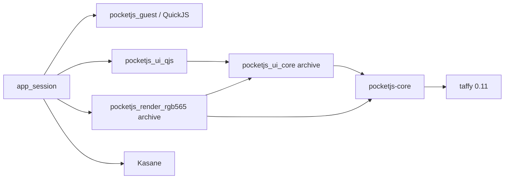
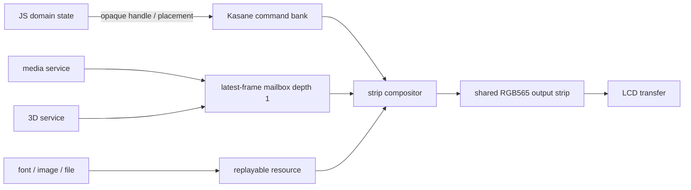
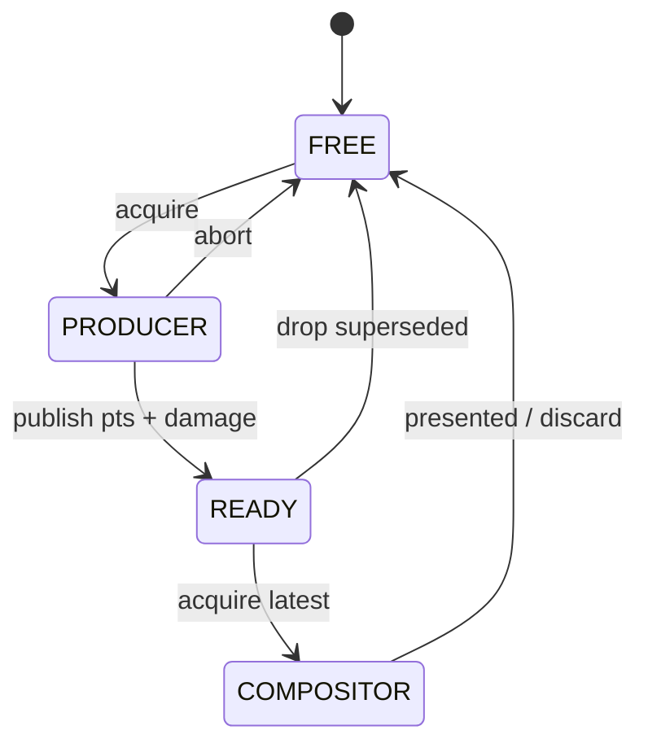

# Kasane カバレッジ・完全移行・将来設計 v0.1

2026-09-14。対象は240×135、PSRAMなしのCardputer ADV。
[Kasane本体仕様](design-system.md)、[合成仕様](design-composition.md)、
[利用API](design-api.md)に対し、実装済み範囲とTaffy完全除去までの順序を定める。

## 1. 名前と到達点

新デザインシステムの名称は **Kasane（かさね）**、JS公開名は`pocket.kasane`とする。
矩形、画層、透明度、部品、modalを順に重ねて最終画素を作る性質から付けた。
`ksn_*`はC ABIの短い接頭辞として維持する。

最終到達点は、APPとSYSTEMの全画面をKasaneが所有し、旧PocketJS UI core、
RGB565 renderer、UI QuickJS adapterと、それらが取り込むTaffyをリンクしない構成である。
QuickJS VM、VM scheduler、`pocket.*`の時計・保存・通信等はUIとは別の責務であり、
移行中は残してよい。プロジェクト名からPocketJSを外す作業はUI除去後に行う。

推奨するプロジェクト表示名は **Cardputer Kasane Runtime**。`Kasane`は描画系、
`JS Runtime`はQuickJS実行系としてモジュール名を分ける。JSの`pocket.*`互換名は
リポジトリ名と同時に変更せず、別のAPI互換性判断として扱う。

## 2. 現在の機能カバレッジ

### 2.1 実装済み

| 項目 | 状態 | 現在の契約 |
| --- | --- | --- |
| 固定容量core | 完了 | APP 80命令、SYSTEM 16命令、2 bank、1命令32 B、heap確保なし |
| 原子的REPLACE/PATCH | 完了 | submit、present、discard、cancel、世代付きticket。失敗時はbuilder全体をabort |
| 矩形・clip・重なり順 | 完了 | append順にsource-over。自動layoutや部品木なし |
| 透明度 | 完了 | RGBA、命令opacity、隔離group opacity |
| 差分更新 | 完了 | 前後命令を比較し、240×8の17帯をdirty maskで再描画 |
| 軽量参照API | 完了 | `DrawRef`のsetRect/setClip/setColor/setVisible。公開参照は32件上限 |
| 明示cache | 完了 | 48命令、8 template、16 instance。複数配置、移動、表示切替、明示release |
| modal | 完了 | 1個、入れ子なし、solid/dim-live、表示確定と入力scope/focusを同時commit |
| QuickJS API | 完了 | `pocket.kasane`。同期build callback、thenable拒否、opaque wrapper、poll/cancel |
| session/display owner | 完了 | 初回submitで旧rendererを解放。未描画提出とLCD修復をJSより先に処理 |
| 遅延初期化 | 完了 | featuresだけならKasane arenaは0 B。S3で使用開始時14,440 B、静的DIRAM増分52 B |

### 2.2 一部実装

| 項目 | 現在あるもの | 足りないもの |
| --- | --- | --- |
| 入力routing | `app/modal/blocked`を到着時に判定し、修復中を遮断 | action購読をscope別に自動配送するadapter、JSからのfocus key登録 |
| SYSTEM layer | C endpointと16命令枠 | 通知、時計、電池、textfieldを載せるownerと公開adapter |
| すりガラス | 2,048 B縮小snapshot、radius 1/2 blur、PIE span kernel | capture handle、modal attachment、damage/presentとの結線 |
| 画像 | coreのresource登録、IMAGE保存、同期`read_span` | `ksn_view`許可、renderer、JS resource wrapper、pet adapter |
| 文字 | coreのTEXT保存、容量、setText/setReveal | jpfont renderer、JS spec/ref、SYSTEM textfieldとの合成 |

### 2.3 未実装

- round-rect、stroke、gradientのQuickJS公開（C endpointとrendererは実装済み）
- native animation、deadline scheduler、reduce-motion
- transform、blur一般化、projective quad、3D renderer
- pixel stream、frame mailbox、buffer lease、動画resource
- schema loaderと薄いJS component library
- 既存5アプリの移植、および旧PocketJS/Taffy依存の除去

移行可否を判断する13項目のgateでは、8項目完了、入力とSYSTEMの2項目が一部、
文字・画像・アプリ移植の3項目が未完了である。部分を0.5として **9/13、約69%**。
合成MUSTの中核は動作するが、文字と画像がないため「既存UIを完全に作れる69%」とは
解釈しない。現時点で移植できるのは矩形だけの画面で、既存アプリ移植は0/5である。

実機の継時診断は9命令の通常画面と12命令のdim-live modalを300ターン動かした。
通常時renderは約4.6–5.1 ms、modal中は約11.4–12.5 ms、10窓平均は
JS turn 3.29 ms、render 7.70 ms、LCD send 3.18 ms。scopeはmodal表示成功時に
`modal`、close表示成功時に`app`へ戻った。

## 3. Taffyが残る経路

Taffy 0.11は旧`pocketjs-core`の直接依存である。ESP-IDF側ではそのRust coreを含む
二つのprebuilt archiveと、それを駆動するadapterが現在もリンクされている。



Kasaneアプリでもソース評価前に旧coreと`pocketjs_ui_qjs`を生成しているため、
旧RGB565 rendererを省略できてもTaffyはまだ外れていない。
`pocketjs_guest`はQuickJS所有、job drain、watchdog、VM schedulerの実装であり、
Taffyには依存しない。まずUI関連3 componentを外し、その後にこのcomponentを
`js_runtime`等へ改名する方が責務と差分を混ぜない。

## 4. 完全移行計画

### M0: Kasane縦断経路を固定する（完了）

- `pocket.kasane`、lazy native arena、display owner切替を導入する。
- hostの実QuickJS契約テストとUSB診断`K`を回帰テストにする。
- 完了条件: ASan/UBSan、ESP-IDF build、300ターン実機診断が通る。

### M1: UI構築に必要な描画面を閉じる

1. TEXTを`jpfont`のspan rendererへ接続する。文字列はbankの896/128 Bへコピーし、
   glyph cacheやfont atlasを部品ごとに持たない。
2. IMAGEを`ksn_image_port`へ接続する。pet assetは64×64 RGB565+A8のproviderへ変換する。
3. round-rect、1/2 px stroke、2色gradientをQuickJSへ公開する。C endpointとrendererは実装済み。
   これらは既存画面の同等表示とデザインschemaに必要だが、layout engineは追加しない。
4. SYSTEM endpointに通知、時計、電池、host textfieldを載せる。APPより後に合成する。

完了条件は、旧rendererを一切呼ばないKasane-only診断で文字、画像、日本語、textfield、
SYSTEM通知を表示し、静的DIRAM、最大連続空き、dirty帯数を記録すること。

### M2: JS turnを旧UIから切り離す

- foreground ownerを`pocketjs_ui_turn/continue`から`pocketjs_guest_frame/continue`へ変更する。
- Kasaneのschedule/presentをguest job drainとは独立に呼ぶ。native animationや動画だけが
  更新されたフレームではJSの`frame()`を起こさない。
- `pocketjs_ui_qjs`、旧font mount、旧node guardを無効にした`CONFIG_KASANE_ONLY`を作り、
  この時点でTaffy非リンク構成を継続ビルドする。

完了条件はmapとlink commandに`pocketjs_ui_qjs`、`pocketjs_ui_core`、Taffyのsymbol/archiveが
なく、VMのyield/continuation/leave保存テストが従来どおり通ること。

2026-09-14時点では、`main/CMakeLists.txt`の旧UI依存を`LEGACY_UI_COMPONENTS`へ分離したが、
無効化するbuild optionはまだ追加しない。`app_session.c`が起動ごとに`pocketjs_ui_core`と
`pocketjs_ui_qjs`を生成・mountし、通常turnとcontinuationをそれぞれ
`pocketjs_ui_turn`/`pocketjs_ui_turn_continue`へ渡しているためである。さらにhello、imucal、
bridge、companion、petの5アプリに旧node APIが計32呼出し残る。Astra側ではguest単独の
frame/job-drain境界を先に定め、この32呼出しを移植してから`LEGACY_UI_COMPONENTS`を条件付きで
空にし、link mapで旧3 componentとTaffy archiveの不在を確認する必要がある。

### M3: アプリを小さい順に移植する

順序は`hello` → `imucal` → `bridge` → `companion` → `pet`とする。
先頭3本で文字・矩形・動的更新、companionで時計とpet画像、petで画像animation・保存・
textfieldまで覆う。各アプリは座標をJSの薄いcomponent関数で解決し、native node treeを作らない。

各移植の完了条件:

- 旧`ui.createNode/setProp/insertBefore`が0件
- 起動、入力、Back保存、100回session再起動が成功
- 表示の目視またはpre-SPI pixel比較
- JS heap、native current/peak、最大連続空きを移植前後で記録
- 平常PATCHのdirty帯数と30 fps deadline missを記録

### M4: compatibility層とTaffyを削除する

- `pocket_ui.c`の旧global `ui` bridge、`jsfont`、旧pet overlayを削除する。
- CMake/idf manifestから`pocketjs_ui_qjs`、`pocketjs_ui_core`、
  `pocketjs_render_rgb565`と二つのprebuilt archiveを外す。
- 旧renderer専用`render_accel`を削除し、使えるPIE kernelはKasane側の名前と契約へ移す。
- `tools/uibudget`は履歴資料へ移し、出荷依存の検査対象から外す。

完了条件はclean checkoutで依存準備からbuildでき、`rg`とmap/nmの両方で出荷物にTaffyがなく、
5アプリとhome/overlay/通知の実機smokeが通ること。

### M5: PocketJS名称を整理する

UI除去後にprojectを`cardputer_kasane`、VM componentを`js_runtime`へ段階的に改名する。
C ABIは一度に全面置換せず、薄いrename wrapperを置いてからcall siteを移す。
`pocket.*` JS namespaceはアプリ互換性のあるsystem API名なので、名称変更する場合は
API versionを上げ、alias期間を設ける。Taffy除去の完了条件には含めない。

## 5. 将来のresource/surface設計

### 5.1 2種類の描画入力

Kasane commandは最終的に次の2種類を参照する。

1. **Replayable resource**: font、pet、静止画、file-backed MJPEG frame。任意の帯を
   同じ内容で再読出しできるpull型。現在の`ksn_image_port.read_span`を発展させる。
2. **Live surface**: camera、video decoder、3D renderer。producerが最新frameをpublishし、
   compositorが短時間leaseして帯を読む。queueは深さ1のlatest-winsとする。

JSへpixel pointerや書込み可能なArrayBufferは渡さない。JSはresource/surfaceのopaque handle、
bounds、crop、opacity、transformと再生状態だけを操作する。buffer leaseはnative provider APIに限る。



### 5.2 frame mailboxとbuffer lease

frameは`FREE → PRODUCER → READY → COMPOSITOR → FREE`の所有状態を持つ。
handleはresource ID、generation、slotを含み、古いreleaseや二重submitをSTALEにする。
producerは`READY`が残る場合に新frameを上書きせず、旧READYを明示dropしてから最新をpublishする。
compositor取得後はLCD成功、discard、session resetまで内容を不変にする。



初期native contract案:

```c
typedef struct {
    uint32_t generation;
    uint64_t pts_us;
    ksn_rect damage;
    uint16_t width, height, stride;
    uint8_t format, flags; /* RGB565 first; OPAQUE, REPLAYABLE, SEQUENTIAL */
} ks_frame_desc;

typedef struct {
    ksn_result (*acquire_latest)(void *ctx, ks_frame_desc *out);
    ksn_result (*read_strip)(void *ctx, uint32_t generation,
                            uint16_t y, uint16_t rows,
                            uint16_t *rgb565, uint8_t *alpha);
    ksn_result (*rewind)(void *ctx, uint32_t generation);
    void (*release)(void *ctx, uint32_t generation, bool presented);
} ks_surface_port;
```

`read_strip`には既存の240×8出力帯を貸し出せる。surfaceが最背面、RGB565、不透明、等倍、
full-widthならproviderがその帯へ直接decodeし、後続UIを同じ帯へ重ねる。透明、crop、変形、
順序入替が必要な場合だけ固定のsource tileを使う。貸出pointerはcallback終了まで有効で、
保持、別task利用、JS公開を禁止する。

LCD途中失敗では通常resourceは同じgenerationを`rewind`し、全dirty帯を再生成する。
inter-frame codec等で再現できないlive frameはその提出をdiscardし、次のreplay可能frameまたは
keyframeでfull redrawして初めて入力を復帰する。再現不能frameを論理baselineとしてcommitしない。

### 5.3 動画

初期対応はfile-backed MJPEGまたは連番RGB565のように、frame境界と再読出し位置が明確な形式を
優先する。media serviceがPTSとfile offsetを所有し、`DIRTY_MEDIA`と次PTS deadlineだけをownerへ渡す。
JS timerや`frame()`を30回/秒起こさない。遅れたframeはlatest-winsでdropし、音声clockがある場合は
音声をmasterとする。H.264等のinter-frame codecはdecoder stateと再送契約のRAMを測ってから追加する。

### 5.4 3D投影とeffect

2段階に分ける。

- **2.5D**: 不変cache/surfaceへ固定小数点3×3 homographyを適用するprojective quad。
  nearest samplingをMUST、bilinearとPIE化をBETTERとする。z-bufferは不要。
- **full 3D**: 3D serviceがband/tile単位でRGB565 surfaceを生成し、Kasaneは最終2D合成だけを担う。
  depthも240×8等の固定帯に限定し、mesh、texture、triangle binには明示上限を設ける。

共通effect順は`source → filter → transform/project → clip → opacity → source-over`。
filter最大1、transform/project最大1から始め、循環参照、feedback、任意shader、暗黙full-frame bufferを
禁止する。すりガラスだけは明示captureをsourceとし、現在の2,048 B snapshotを再利用する。

### 5.5 owner scheduling

ownerはsystem runtimeのpoll + dirty maskに統合する。

| dirty bit | 起床理由 | JSを起こすか |
| --- | --- | --- |
| `DIRTY_APP_COMMANDS` | JSがsubmit | すでにJS turn内。追加起床なし |
| `DIRTY_SYSTEM` | 時計、電池、通知 | 原則native SYSTEM rebuildのみ |
| `DIRTY_MEDIA` | 新video frameのPTS | 起こさない。native surfaceをpresent |
| `DIRTY_ANIMATION` | native track deadline | 起こさない。該当commandだけ評価 |
| `DIRTY_REPAIR` | LCD途中失敗 | JSを止め、full repairを優先 |

次deadlineがなくdirty maskも0ならKasaneの通知main loopは動かさない。この原則により、
動画・animationを追加してもJS callback、Promise、仮想木diffをフレームごとに生成しない。

## 6. メモリ方針

現在の実測14,440 Bはcore、cache、coordinator、参照2世代分を含む。
既存LCD帯3,840 Bは共有し、Kasane専用full framebuffer 64,800 Bは追加しない。
将来機能の初期予算は次のように個別opt-inで計上する。

| 機能 | 初期追加予算 | 方針 |
| --- | ---: | --- |
| frost snapshot | 2,048 B | 現在の固定値 |
| RGB565 source tile | 960–3,840 B | 2–8行。必要なsurfaceだけ |
| alpha tile | 480–1,920 B | RGB565+A8時だけ |
| 3D depth tile | 480–3,840 B | 8/16 bit、帯高に連動 |
| mailbox/lease metadata | 256 B以下/active surface | pointerではなく世代handle中心 |

これらは同時に常駐させず、feature取得は0 B、resource登録または再生開始時に予約する。
失敗はOUT_OF_MEMORY/BUSYとして旧表示を維持し、fallbackを暗黙に選ばない。
