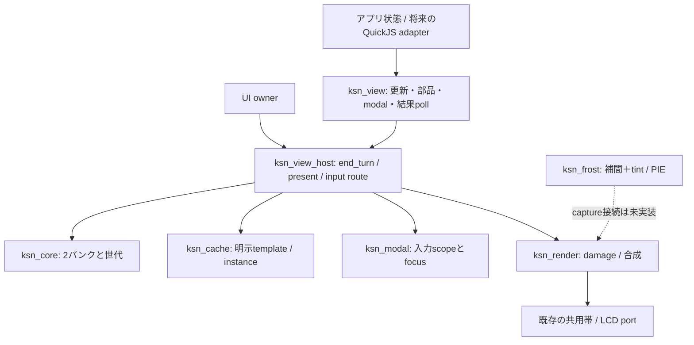
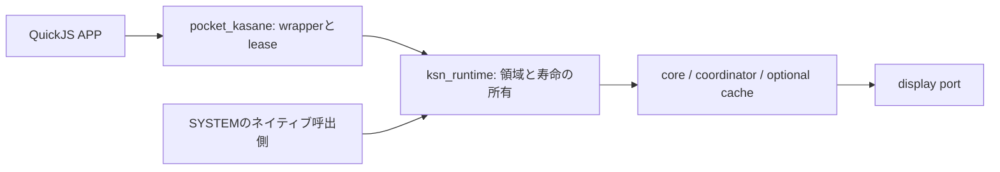

# Kasane利用APIとowner境界 v0.4

2026-09-14。`ksn_view.h`と`ksn_view_host.h`、`pocket.kasane`は実装済み。
既存アプリの移植は未実装。この文書は既存PocketJS UIの
`pocket.ui`と区別し、Kasaneの利用窓口を定める。
画素と容量の規範は[合成仕様](design-composition.md)と[Kasane仕様](design-system.md)。

## 1. 再構成の理由と境界

### JSプリミティブ（CP8、2026-09-15）

`replace`/`patch`のtxに次を公開する。戻り値は既存と同じDrawRefで、setRect/setClip/
setVisible、shapeのsetColorを利用できる。gradientの端点色変更はREPLACEで行う。

| メソッド | 共通指定以外のフィールド |
| --- | --- |
| `tx.rect(spec)` | `color: RRGGBBAA` |
| `tx.roundRect(spec)` | `color`、`radius`（整数0–8、既定0、幅/高さの半分以下） |
| `tx.strokeRect(spec)` | `color`、`width`（整数1または2、既定1、内側の枠） |
| `tx.gradient(spec)` | `from`/`to: RRGGBBAA`、`axis: 'x'/'y'`（既定y）、`radius`（既定0）、`dither: boolean`（既定false） |

共通は`bounds: [x0,y0,x1,y1]`、任意`clip`（既定bounds）、`opacity`（整数0–255、既定255）。
bounds/clip/placement offset/DrawRef更新の有限数は最近接丸め、半分は0から遠い側へ揃える。
丸めた結果がint16外なら拒否。色・opacity・radius・widthは丸めず整数として検証する。
featuresのroundRect/strokeRect/gradientはtrue。cache.createは現段階では引き続き矩形のみ。
不正引数やgetter例外をcallback内でcatchしても、そのtransaction全体を取消す。

従来はcoreのabort/present/discard、cacheのabort/resolve、modalのcancel/resolveを
利用側が正しい順序で呼ぶ必要があった。更新失敗やVM yieldで一つでも漏れると、
画面・instance参照・入力scopeの状態が食い違う。
`ksn_view_host`がその順序を所有し、アプリadapterはレイヤー固定の`ksn_view *`だけを受け取る。



公開型を`ksn_composition_types.h`へ分離した。`ksn_view.h`から内部bankやcore/cacheの
保存レイアウトを参照する必要はない。endpointはAPPまたはSYSTEMに固定され、
begin引数にlayerを渡さない。template/instanceも発行側layerに限定する。
関数呼出にheap確保はなく、部品ごとのvtable・汎用broker・イベントqueueを追加しない。

## 2. 公開操作

| 用途 | 実装済みC API | 契約 |
| --- | --- | --- |
| 能力と容量 | `ksn_view_features`, `ksn_view_get_stats` | rendererまで動く能力だけ公開。core保存形式の語彙と区別 |
| 更新開始 | `ksn_view_begin` | REPLACE / PATCH、共有builderは一つ。BUSY時はdomain stateを保持 |
| 基本描画 | `background`, `add`, `change`, `group`（`ksn_view_`接頭辞） | 背景、矩形、属性更新、隔離group opacity |
| 提出と取消 | `ksn_view_submit`, `ksn_view_cancel` | submitはLCD完了ではない。cancelはbuilderまたは未確定提出を取消 |
| 結果取得 | `ksn_view_poll` | layerごとに最後の`ticket/status/reason`を保持。別layerの提出では消えない |
| 明示部品 | `ksn_view_cache_create/release` | 不変命令templateのコピー。更新の外で作成・解放 |
| 部品の配置 | `ksn_view_instantiate/place/visible` | 複数同時表示、位置・clip・opacity・表示のPATCH |
| modal | `ksn_view_modal_open/close` | APP REPLACE内。solid/dim-live、表示成功後に入力scopeとfocusを確定 |

`draw_kinds`はRECT、ROUND_RECT、STROKE、GRADIENT、TEXT、IMAGE、`cache_kinds`は先頭3種を公開する。
グループ透明度は対応、native animationとfrosted modalはfalse。CP12からIMAGEもnativeで描画する。
すりガラス画素フィルタのPIE対応はfrosted modalの完成を意味しない。

CP9のnative TEXTは`ksn_display_port.text`のcoverage portを必須とする。省略時は
最初の転送前にUNSUPPORTED。`span`は絶対画面座標の最大64画素を読み、count=0は
可用性確認で出力なし。render中のI/O・heap確保・JS・core変更は禁止。pending/committedの
再描画でも同じ字形を返す不変データをownerが保持する。productionは`ksn_font_port`を接続。
Flashの1bpp cellを直接読み、文字bufferや展開glyphを常設しない。coverageは最大64 B、
CP12の共用96 B span scratchを使い、隔離groupでは256 B tileと併存する。
alphaは色alpha→coverage→command opacity→group。

captionはLatin6×8/全角8×8、bodyはLatin6×12/全角12×12、displayはLatin12×16/全角16×16。
displayは8px字形の2倍。欠字/faceなしでも送り幅を維持し、ASCIIはbuiltin、全角は豆腐を描く。
1命令は単行のcounted UTF-8で、revealはUnicode scalar数（サロゲート組も1）。改行・折返しは
利用側で行を分割する。

### JS文字（CP10）

`tx.text({bounds, clip?, opacity?, text, capacity?, font?, color})`はDrawRefを返す。
fontは`caption`/`body`/`display`、既定body。textはstringのみ。capacityはUTF-8の予約バイト数
（1–128、既定max(1,初期UTF-8長)）で、アプリ合計896 Bの枠内に固定予約する。
空文字は可、孤立サロゲート・NUL・改行等の未対応制御文字は拒否する。
`ref.setText(tx,string)`は予約内で更新しrevealを全文へ戻す。
`ref.setReveal(tx,count)`は0から現在のUnicode scalar数までの整数を受け取る。
`setColor/setRect/setClip/setVisible`も利用できる。構造変更・capacity変更はREPLACE。

JSのUTF-16長128単位を変換前に確認するので、UTF-8変換の一時文字領域は最大384 B＋
QuickJS headerに限定される。変換後にも128 B上限とnative容量を検証する。
`setReveal`は文字列変換を伴わず、コピー済み文字列に対する数値のPATCHだけになる。
setTextで作った一時文字列をnative側に保持せず、成功・失敗ともJS変換用領域を解放する。
features.textはtrue。cacheのTEXT公開と整数値の直接更新APIはまだ含まない。

## 3. 原子的な更新と参照

### native IMAGE（CP12）

image descriptorはresource、variant/frame、source_x/source_y、scaleを持つ。
scaleは`KSN_IMAGE_1X`（既定0）、`KSN_IMAGE_2X`、`KSN_IMAGE_HALF`。
source原点からのcrop範囲はboundsの幅/高さとscaleで決める。2倍はbounds幅/高さが偶数、
1/2倍はsource範囲がbounds幅/高さの2倍となる。範囲外・未知scaleは提出前に拒否する。
最近傍は画素中心で選ぶため、1/2倍はsource原点から1,3,5…をsampleする。
setRectは移動と有効なcrop範囲のサイズ変更を許し、source原点/scaleの変更はREPLACE。

providerは不変のsource座標を受け、RGB565とstraight alphaを必ずcount個返す。
通常/隔離groupとも16 destination画素ごとに最大31 source画素を読む。RGBはbit replicationで
8bitへ展開し、alphaへcommand opacity、その後group opacityを掛ける。providerのI/O・heap・JSは禁止。
エラー後はpending世代を保持し、全帯再描画または取消後のcommitted修復を行う。
source登録はowner/layer固定、APP終了時にはSYSTEM資源を残してAPP資源だけ失効する。

命令は32 Bのまま。crop原点をpayloadの空き4 B、scaleを未使用flag bitへ格納する。
pixel scratchはgroup tile256＋span共用96＋dither8＋provider行最大128＝488 B。
command snapshotや呼出しstackは別に実機high-waterと併せて計上する。
frame中にproviderの選択を変えてはならない。

### JS IMAGE / PPT2（CP13）

`view.petImage()`はFlash上の組込みPPT2を借りる不透明handleを返す。
readonlyのwidth/height=64、variants=12、frames=6を持つ。APP session内のnative登録は一度だけ。
取得はbuilder外で行う。初回登録はpending/repair中BUSY、登録済みhandleの再取得は可能。
JS wrapperをGCしてもnative登録は残り、APP detachでまとめて失効する。
SYSTEMの資源は残す。古いwrapperを次sessionで使用するとCLOSED。

`tx.image({resource, bounds, clip?, opacity?, variant?:0, frame?:0,
sourceX?:0, sourceY?:0, scale?:1})`はDrawRefを返す。scaleは0.5/1/2のみ。
source座標・variant・frameは非負整数。nativeと同じcrop制限を適用する。
`ref.setImageFrame(tx, variant, frame)`でペット種と表情をPATCHする。
setRect/setClip/setVisibleも使用可能。資源/source/scaleの変更はREPLACE。
`features().image`が対応を示す。画像は現時点のcache template対象外。

PPT2 providerは不変bytesを登録時に検証し、128 Bの行でRGB565/straight alphaへ変換する。
全画像をheapへ展開せず、ペット選択のglobal状態に依存しない。
native所有者は`ksn_view_host_register_image`でAPP/SYSTEMごとに登録する。
display/provider callbackからの登録はBUSY。登録はtransactionのrollback対象外。

### JS scene controller（CP11）

`view.createScene({build(tx,state), patch(tx,refs,state)?})`をアプリ初期化時に一度作る。
buildは候補DrawRef等を含むobjectを返す。patchは確定済みrefsだけを使う。
`scene.invalidate()`で表示をdirtyにし、`scene.invalidate(true)`で次回REPLACEを指定する。
ownerの通常turnで`scene.flush(domainState)`を呼ぶ。trueはdirty/pendingなし、falseは提出待ち
またはBUSY。inputでdomain stateを進めてからinvalidateし、display失敗を理由に状態を戻さない。

controllerはPRESENTEDまで候補refsを公開せず、SUBMITTED中は新たなAPP更新を始めない。
DISCARDEDなら最新stateで再試行し、REPLACEの候補refsは捨てる。BUSYだけを内部で再試行扱いとし、
検証・quota・OOM・callback例外はdirtyを保持して呼出元へ送出する。build/patchは同期限定。
idle時はpoll/提出をせず、timer・frame queue・毎flushのclosureを作らない。
controller自体のJS関数/状態はcreateScene時のguest heapに計上する（未使用時は作らない）。

APP提出の単独所有者として使う。他のcontrollerや直接replace/patchを混ぜない。
修復中のownerによるpresent、SYSTEM提出、hostのcancelは併用可能。
`flush`の再入は拒否し、callback中のinvalidateは次の更新要求として残る。
native animationのwakeやmodal専用状態機械の代わりではない。

新APIでは、所有中builderの変更に失敗した時点でcore/cache/modalをまとめてabortする。
旧低レベルAPIの「poisonをabortまで保持」は内部契約として残す。
別layerや古いticketでの呼出しは正しいbuilderを取消しない。
参照やinstanceの出力はその更新の候補値で、PRESENTED確認後にアプリの表示参照へ昇格する。
失敗したREPLACEの候補参照を次更新へ持ち越さない。育成値などdomain stateは戻さない。

```c
/* widthはdomain側で0..100へ検証済み。fillは前回PRESENTEDの参照。 */
ksn_tx ticket;
ksn_result r = ksn_view_begin(view, KSN_PATCH, &ticket);
if (r != KSN_OK) return r; /* BUSYなら次回、最新のwidthで再試行 */
ksn_change change = {.property=KSN_SET_RECT, .value.rect={8,110,8+width,118}};
r = ksn_view_change(view, ticket, fill, &change);
if (r != KSN_OK) return r; /* 新窓口が既に全builderをabort済み */
return ksn_view_submit(view, ticket);
```

submit後はSUBMITTED。ownerが必要な全帯を転送した時にPRESENTEDへ進む。
転送失敗はSUBMITTEDを維持し、再試行は全帯修復。cancelした場合はDISCARDEDになるが、
部分転送の修復要求は残り、修復完了までAPP入力は遮断する。
表示済みticketへの遅いcancelはSTALEを返し、成功した画面を巻き戻さない。
pollは消費型queueではなく固定state。同一layerの次submit前に結果を扱う。

## 4. cache / modal / VM境界

cache.createは更新の外で行う。templateは明示releaseまたはhost resetまで保持する。
template作成を後続REPLACEの取消に連動させない。表示中のinstanceを参照するreleaseはBUSY。
同じtemplateをREPLACE内で複数instantiateできる。PATCHはplace/visibleで更新し、
構造変更はREPLACE。REPLACEから省略されたinstanceは表示成功時にdetachされる。
abort/discardした配置・非表示変更は元に戻り、新instanceは破棄される。

solid modalはREPLACEの先頭、dim-liveは通常内容を追加した後にopenし、その後にmodal内容を追加する。
closeは最新domain stateを再構築するREPLACE内で行う。closeが失敗したらmodalを維持する。

ownerは**全JS復帰境界（正常・例外・yield）**で`ksn_view_host_end_turn`を呼ぶ。
未提出builderをabortし、提出済み状態は残す。
`ksn_view_host_present`は描画→core確定→cache反映→modal反映→layer結果保存の順で処理し、
途中でJSを呼ばない。入力は`ksn_view_host_route`で到着時に一度だけ配送先を決める。
初期化/resetの前にはguestを破棄し、古いendpointを持つJSを再開させない。
hostはcore/cacheを排他的に所有し、旧低レベルAPIとの混在更新を禁止する。

## 5. JS側の接続

既存仕様の`view.patch(tx => ...)`、軽量参照wrapperはこの窓口へ接続する。
JSのbegin/submit/cancel/pollがネイティブの同名操作に対応し、公開rootはAPP endpointだけを持つ。
共有prototypeと固定数のwrapperで参照を保持し、bankポインタをJSへ渡さない。
callback版patch/replaceは同期処理に限定し、PromiseやVM yieldを跨ぐbuilderを禁止する。
入力、時計、音声、保存は既存サービスを利用する。

JS adapterの対応契約:

| JS表現 | nativeへの対応 |
| --- | --- |
| `view.replace(build)` / `view.patch(build)` | begin→同期build→submit。例外/thenable/yieldならcancel。戻り値はticket |
| `tx.background(color)` / `tx.rect(spec)` | background / add。rectは候補DrawRefを返す |
| `ref.setRect(tx, bounds)` / `setClip` / `setColor` / `setVisible` | change。wrapperは作成時に一度だけ確保し、setterで増やさない |
| `view.cache.create(rects)` / `release(template)` | 更新外の不変template管理 |
| `tx.instantiate(template, placement)` | 候補InstanceRefを返す。placementはoffset、clip、opacity、visible |
| `instance.place(tx, placement)` / `setVisible(tx, bool)` | place / visible。template内部は変更しない |
| `tx.modal.open(spec)` / `close()` | modal_open / modal_close。specはbackdrop、color、focus |
| `view.poll()` / `view.cancel(ticket)` | poll / cancel。Promiseや自動再提出を生成しない |
| `view.features()` / `view.stats()` | features / get_stats |

buildが作る候補wrapperは提出結果と関連付け、DISCARDEDなら無効化する。
呼出前にwrapperのsession・所有view・状態を検証する。内部の数値IDを利用者が差し替えられる
普通のJS propertyに保持しない。参照上限32件は既存BETTER契約を引き継ぐ。
schemaの文字列ID解決は構築時に行い、毎PATCHで名前検索しない。
画面への自動レイアウト、暗黙cache、Reactiveな依存追跡は追加しない。

`main/pocket/pocket_kasane.c`がAPP endpointを`pocket.kasane`として遅延公開する。
features/statsだけではnative領域を確保せず、最初のreplace/patch/cache.createで基本領域を確保する。
RAM cacheは最初のcache.create成功時だけ追加する。管理情報・命令・文字の3ブロックを
全確保・検証してから公開し、失敗時は追加ブロックを回収する。最後のtemplateをreleaseしても
予約はsession resetまで保持する。stats.cache.reservedBytesは現在のcache予約量を返す。
公開DrawRefは32件。原子的REPLACE中に旧世代と候補世代を同時保持できるようnative slotは
2世代分を持つが、1更新が新規公開できる参照は32件を超えない。

session ownerは初回submitで旧RGB565 rendererを解放し、Kasaneのdirty帯だけを共用LCD stripへ送る。
ソース評価中の初回submitとLCD修復は次のJS turnより先に処理する。全JS復帰境界で
`pocket_kasane_end_turn`を呼び、guest終了前に`pocket_kasane_reset`する。

schema loader、文字・画像rendererは未実装。旧PocketJS/Taffyからの完全移行は
[Kasaneロードマップ](kasane-roadmap.md)に従う。

## 6. 検証とメモリ

`tools/kasane_contract/test_view.c`は二つのcache instance、透明度、PATCH取消、
VM yield相当の未完modal、新instanceのcleanup、別layerの干渉拒否、layer別poll、
転送途中失敗→cancel→全帯修復、modal開閉とfocus復帰を検証する。
ASan/UBSan、O2 strict-aliasing、C++17ヘッダ検査を`run.sh`へ組み込んだ。
実機の`VIEW PASS`も同じ窓口で二つのinstance、取消、無変更の転送ゼロ、modal開閉を通す。

coreは借用4ブロック（commands 3,072 B×2、text 1,024 B×2）と管理領域に分割する。
利用前に`ksn_core_bind`で結び、resetは同じブロックを再使用する。ブロックとcoreは移動不可。
S3のcore管理領域は516 B、合計8,708 B。CP4aの描画中guard追加後のcoordinatorは
ホスト64-bitで120 B、S3で88 B。共有IDカウンタは20 B。
Cのstats.native_bytesはcore/coordinator/共有IDと有効なcache予約を合算する。
JSのstats.nativeBytesは参照2世代分を含むadapterの予約heapで、共有staticを含まない。
どちらもLCD帯・JS heap・frost snapshotを含まない。
CP3bのS3 ELF型情報では基本領域9,836 B（adapter管理1,644 B＋借用4ブロック）、
cacheは496+1,536+1,024=3,056 B。cacheありは12,892 B。CP3aより両方508 B減。
CP4aでは描画中guardとalignmentにより基本/cache込みとも4 B増（9,840 / 12,896 B）。
CP4bではhost基本8,808 B（管理616 B＋借用8,192 B）とAPP adapter1,044 Bへ分離する。
APP使用時合計9,852 B、cache込み12,908 B。SYSTEMのみならadapter分を確保しない。
host基本5確保＋adapter1確保となり、CP4a比は要求サイズ12 B増とallocator管理情報1件増。
新runtimeの共有staticはpointer/lease issuerの8 B。JS統計はこれを含まない。
基本/cacheとも個別確保は3,072 B以下。基本5確保の途中失敗では全回収し、初期化完了後にのみ公開する。
数値はallocator管理情報・alignment overheadを除く要求サイズ。ブロック分割で管理情報の個数は増える。
cacheの文字1,024 Bは予約済みだが文字templateは未対応。cache.createのdraw配列はS3で
48×40=1,920 Bのstackを使う。S3生成コードの関数単体frameはcache.create 1,984 B、
ensure_state/core_begin/core_init各48 B、core_bind 32 B。子関数・VMを含むstack peakは実機で後日確認する。
APP/SYSTEMのどちらもKasaneを取得していない場合の予約heapは0 B。board共用描画帯3,840 Bと転送buffer7,680 Bは
別途同時ピークに含める。CP3aでstatic DIRAM増分はない。
部品数ごとのnative追加heap確保は0。PIE側も保持snapshotは2,048 Bのまま。

### APP終了のhost境界（CP4a）

`ksn_view_host_reset_app`はAPPのbuilder/submissionを取消し、両bankのAPP命令・文字・
画像provider、APPのcache template/instance、modal/focusを破棄する。基本/cacheの予約は保持し、
SYSTEMの確定済み表示・参照・pollと構築中/送信待ち更新は残す。APP背景はopaque blackへ戻す。
部分LCD転送後も次のpresentで全面を再描画し、修復完了まではAPP入力をblockする。
この終了処理は新しいID・heap・guest callbackを必要としない。

owner taskがguestアクセスを止めた後、描画呼出しの外で実行する。display/provider callbackからの
再入はBUSYで無変更。これは低レベルの終了機構であり、endpointポインタの失効機構ではない。
CP4bで追加したruntimeがhostの領域所有とAPP leaseを担い、JS adapter/session終了から利用する。

### ネイティブruntimeとAPP lease（CP4b）

`ksn_runtime`がcore/coordinator/cacheの領域を所有する。QuickJSへの依存はなく、
JS adapterは参照wrapper管理と4 Bの`ksn_app_lease`だけを持つ。既存のsession終了の
`pocket_kasane_reset`はAPP detachへ委譲する。



- `ksn_runtime_app_attach`は同時に1接続を認め、process lifetimeで単調増加するIDを返す。
  `ksn_runtime_app_view(lease)`を**操作ごとに**解決する。古いleaseはNULL、detachはSTALE。
  ID上限ではLIMITで無変更とし、メモリアドレスが再利用されてもIDは復活しない。
  生のviewポインタはその操作中だけ借用し、detach/shutdownをまたいで保持しない。
- `ksn_runtime_system_acquire`はguestなしで領域とSYSTEM endpointを取得する。
  SYSTEM取得済みならAPP終了後も領域とSYSTEMを保持する。APPだけが利用した領域はdetachで全解放する。
  SYSTEMはネイティブownerが共有する単一endpointで、参照count付き多重leaseではない。
- APPからのreturn/yieldはAPPの未完builderだけをabortし、SYSTEM builderには触れない。
  detachはCP4aの終了処理を使う。描画callback中のdetachはBUSYで接続を維持する。
- SYSTEM呼出側はguestの有無に依存せず`needs_present`/`present`をpumpする。
  `shutdown`はAPP接続・builder・submission・描画中ならBUSY、停止後は全領域を解放する。
  runtimeはタスク・タイマー・framebufferを追加しない。
- cache初回確保もruntimeへ移し、最初のtemplateが成立してからattachする。
  `reserved_bytes`はruntimeの実予約heap、JS `nativeBytes`はそれに現在のadapter予約を加算する。
  SYSTEMが生存していれば、JSが未使用でも予約量は0とは限らない。

これは所有権と呼出し境界の実装。home/通知の実サービス移植とそのメインループへの
SYSTEM描画pump組込みは後続checkpointで行う。既存のlegacy homeへ自動でSYSTEMを重ねない。

`tools/test_pocket_kasane.c`は実QuickJSとASan/UBSanでreplace/patch、group、cache、modal、
参照失効、cancel、LCD失敗と全修復、thenable拒否、参照上限を検証する。
`tools/kasane_device_test.py`はUSB診断`K`を300ターン動かし、通常/modal/appのscope遷移と
30フレーム窓のturn/render/send時間を検査する。
