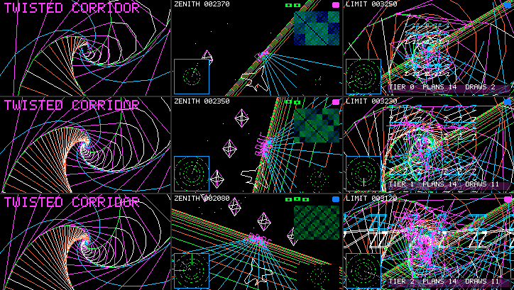

# MEGADEMO の負荷を実機で決める

2026-09-29。[megademo-limit-scenes.md](megademo-limit-scenes.md) の Act II（TWIST／ZENITH／LIMIT）を Cardputer ADV（ESP32-S3、PSRAM なし）で初めて動かし、負荷の段階（`KN`）と plan の読み込み（`LOAD`）を実機の限界から決め直した。**この文書の数値は断りのない限り実機の実測**で、host の値・計算値にはその旨を書く。美的な評価はしない（見比べ用のキャプチャを末尾に置いた）。

## 結論

- **統合直後の MEGADEMO は実機で ZENITH に入ったところで止まっていた。** 面1（レーダー）の最初の `beginFrame(color, surf1)` が候補・確定フレーム 2 枚（各 10,246 B の連続領域）を確保できず `frame allocation failed`、`DEGRADE` で段階を2回下げてもメモリは減らないので LIGHT で例外のまま終了した（通常 image で 3 回、診断 image で 1 回、すべて同じ）。空きは 43 KB あったが最大連続領域が 15,872 B で、2 枚目が入らなかった。host 検査はネイティブ heap の断片化を見ていない。
- 直したのはアプリ（JS）だけ（ネイティブの仕様は変えていない）:
  1. **面0・面1のフレーム 5 枚（51 KB）を起動時に確保する**（`beginFrame` を描かずに2回呼ぶだけ。まだ 10 KB の穴がある時点で取る）。
  2. **plan の読み込みを「1 フレーム 1 本」「空き heap 22,528 B 以上の間だけ先読み」「残りは場面の最初のフレームで順に登録し、未登録の plan の draw は飛ばす」に変えた**（`LOAD = [16, 1, 22528]`、空きは `pocket.memory.info().internalFreeBytes`）。旧・新の全 plan を共存させる方式はメモリが同時 24〜28 本目で尽き（1 フレーム 4 本の旧方式では ZENITH→LIMIT の先読み中にゲスト自身の確保が `out of memory`）、先読みを打ち切って切替フレームで残りを登録すると JS が 208 ms（runaway 監視 250 ms の 83%）に達した。
  3. **手続き面の回転読み出しを段階の負荷にした**（`KN[t].q`）。回転する面1の画像1つにつき帯の再描画が 1 フレーム約 780〜870 回・約 23 ms 増える。HEAVY は ZENITH のレーダー回転だけを残す。
  4. **段階の値を実機で決め直した**（下の「決めた値」）。
- 決めた段階での実測（通常 image、KASANE_PAINT 30 フレーム窓の fps）: HEAVY は TWIST 29.8／ZENITH 19.7／LIMIT 22.5 fps、MID は 29.9／29.9／24.7、LIGHT は 29.7／29.8／26.9。**既定は HEAVY のまま**にした（測った範囲で最も重く、かつ安定: 6 周 2,237 フレームで DEGRADE・OOM・runaway なし、最長ターン 57 ms、ターン内の最小空き heap 6.8 KB）。
- **LIMIT はどの段階でも 30 fps に届かない。** 描画量ゼロでも固定費（HUD の合成約 13 ms、JS の frame() 約 8 ms、LCD 転送 7.4 ms）で約 28 ms かかる。
- 仕様上限（線分・ラスタ・ステップ）は時間より先に効く: LIMIT HEAVY はフレーム 49 ms（15 fps の下限まで約 17 ms 残る）で線分 1,010/1,024。一方 **plan 32 本と 2 面は、メモリが先に尽きて仕様上限まで使えない**（2 面＋ZENITH の 16 本＋先読みで同時 24〜28 本目の確保が失敗）。

## 条件と出所

| 項目 | 値 |
| --- | --- |
| 基準 | `vm/mega-device`（`vm/main` 43b000b から）。本記録のコミットで変わるのは `apps/kasane/proc_megademo.js`、診断オプション `KASANE_MEGADEMO_TRACE`（既定 OFF）、試験スクリプト |
| 通常 image | `idf.py -B build_megadev build`、2,172,832 B、SHA-256 `19197b038d4c6ec24d2f70057941ff4303c3d37732b6a4410a2e39380b4f0eb1`、DIRAM 171,900 B（基準と ±0、`tools/memlog.py`）。コミット前の作業ツリーで作った image で、ソースは `8f677e1` と同じ（image の版文字列 `43b000b-dirty` だけが違う。記録後に機体へ書いた `2cb200a` の image は同じ大きさで SHA-256 `1c7b671ae85f1cbc2bb0fae83ef876b3a1e707f1a1bcfcf3157b07b56d4db820`） |
| 診断 image | `idf.py -B build_megatrace -DKASANE_MEGADEMO_TRACE=ON build`。1 ターン1行の `MDT` ログ（JS／帯描画／転送／register／draw／空き heap／ターン内の最小空き／ゲストの malloc_size）と、HOME の `~` でゲスト heap 上限を次の起動だけ下げる機能 |
| 駆動 | [`tools/kasane_contract/megademo_device.py`](../../tools/kasane_contract/megademo_device.py)（`run` で APPS メニューから起動・段階選択・キー送出・キャプチャ・Back、`analyze` で場面×段階の集計、`shots` でキャプチャの抽出と host 参照との比較） |
| 回数 | 段階ごとの計測は診断 image で各 40 秒×2 回（段階を決める前と後）、通常 image で各 40 秒×1 回。長時間は HEAVY 95 秒（2,237 フレーム、約 6 周）。ログは `.cache/megadev/`（git 管理外） |
| 状態 | Wi-Fi 接続後、ホームの音楽 overlay が動いた状態から APPS→MEGADEMO。音量などの設定は変えていない |

統合結果の土台: `tools/kasane_contract/run.sh`（WSL）と `idf.py -B build_megadev build` は、実機に載せる前に通過した。worktree では WSL の git が Windows 側の gitdir を読めず、`run_megademo_app_host.py` の比較用 baseline だけが `cannot read the baseline app` で止まる（統合の副作用ではない。スクリプトのコメントどおり Windows 側で `git show HEAD:apps/kasane/proc_megademo.js` を `.cache/kasane_megademo_app/proc_megademo_baseline.js` に置いてから実行）。

診断 image の `MDT` 行の出力はフレーム間に入るので、fps は通常 image より 1〜4% 低く出る（同じ段階で診断 21.7 fps／通常 22.5 fps など）。時間の内訳は診断 image、fps は通常 image の値を主にした。

## 場面×段階の実測

診断 image、各 40 秒（約 2 周）、中央値（括弧は p95 または最大）。JS は frame() 1回（中断されたら継続の合計）、帯は手続き面の帯の再描画時間（描画の内数）、fps は診断 image のフレーム完了間隔から、「通常」は通常 image の KASANE_PAINT 窓から。空き heap はターン境界の最小、「ターン内最小」は `heap_caps_monitor_local_minimum_free_size` で1ターンごとに測った最小。

| 段階 | 場面 | JS ms | 描画 ms | 転送 ms | VM draw ms | 帯 ms（回/フレーム最大） | 間隔 ms（p95） | fps | fps 通常 | 空き最小 | ターン内最小 |
| --- | --- | ---: | ---: | ---: | ---: | ---: | ---: | ---: | ---: | ---: | ---: |
| 共通 | NEWS | 4.5（先読み時 40） | 8.0 | 7.3 | 0.9 | 2.2（17） | 33.2（57.6） | 28.6 | — | 27,316 | 15,116 |
| HEAVY | TWIST | 10.0 | 10.2 | 7.3 | 3.9 | 2.5（17） | 33.8（35.9） | 29.5 | 29.8 | 24,272 | 11,792 |
| HEAVY | ZENITH | 8.2 | 36.6 | 7.4 | 1.7 | 20.7（780） | 54.1（68.7） | 18.6 | 19.7 | 15,392 | 6,948 |
| HEAVY | LIMIT | 19.6 | 20.2 | 7.4 | 11.4 | 7.3（35） | 49.1（64.8） | 21.7 | 22.5 | 20,092 | 7,512 |
| MID | TWIST | 10.0 | 10.2 | 7.3 | 3.9 | 2.5（17） | 33.8（36.1） | 29.4 | 29.9 | 23,572 | 12,052 |
| MID | ZENITH | 8.1 | 14.4 | 7.4 | 1.7 | 3.5（56） | 33.6（46.1） | 28.9 | 29.9 | 15,380 | 6,848 |
| MID | LIMIT | 15.4 | 18.9 | 7.4 | 7.1 | 6.0（35） | 43.6（60.0） | 23.5 | 24.7 | 20,076 | 7,628 |
| LIGHT | TWIST | 7.7 | 9.0 | 7.3 | 1.8 | 1.4（17） | 33.6（35.9） | 29.5 | 29.7 | 23,568 | 11,916 |
| LIGHT | ZENITH | 7.4 | 13.1 | 7.4 | 1.0 | 2.2（56） | 33.5（45.1） | 29.0 | 29.8 | 15,404 | 6,796 |
| LIGHT | LIMIT | 12.2 | 17.3 | 7.4 | 4.0 | 4.3（35） | 38.6（55.9） | 25.7 | 26.9 | 19,780 | 7,452 |

- 転送は全画面 64,800 B で 7.3〜7.4 ms。表示周期は 33.3 ms なので、TWIST と MID/LIGHT の ZENITH は表示レートで頭打ち（29.5〜29.9 fps）。
- 1 draw の VM 時間の最大は LIMIT HEAVY のアトラクタ（9,817 ステップ）で 5.46 ms。
- p95 が伸びるのは plan を登録するフレーム（下の「登録の時間」）。
- ゲスト heap（`JS_GetMemoryCounters` の malloc_size）はターン境界の最大 112,432 B。起動直後（評価後）は 100,696 B で、そのときの空きは 39,368 B、最大連続 12,800 B（`tools/memlog.py --port` の `app_free`／`app_largest`）。アイドル時の空きは 221,516 B。

### 周回とメモリ

HEAVY 95 秒（2,237 フレーム、約 6 周、plan の登録 327 回）: 2 周目以降、各周の頭（LIMIT→NEWS 直後）の空きは 35,892〜35,904 B、最大連続 7,680 B で一定。ゲスト heap も周ごとに同じ値（106,732〜106,744 B）に戻った。**周回で減り続ける成分と、断片化で最大連続が縮む傾向はなかった。** Back から `APP_STOPPED` まで 62〜188 ms（host の時計、USB 往復込み）、終了後の空きは起動前と同じ 221,516 B（通常 image）。

### 登録の時間

| 項目 | 値 |
| --- | --- |
| プログラムのテキスト解読（JS の `prog()`、`Date.now()` 差、104 本） | 3〜35 ms、中央値 12 ms、1 命令あたり約 0.54 ms |
| `register()` の呼出し（配列の読み取り・確保・解析を含むネイティブ側） | 1 本あたり中央値 0.83 ms、最大 1.5 ms（120 点の点列付きで最大 4.3 ms） |
| `ksn_proc_plan_prepare`（解析のみ） | 1 本あたり中央値 0.19 ms、最大 0.36 ms |
| 1 本登録したフレームの JS | 中央値 20 ms、最大 57 ms |

時間の大半は JS 側の解読だった。host（x86）の同じ QuickJS では 1 本 36 µs 程度で、実機との差は約 360 倍（単純ループは約 250 倍、`split(',').map(f)` のようなネイティブ→JS のコールバックはさらに遅い: 1 回約 5.7 ms。JSON.parse ベースの解読に置き換えても実機では 466→602 ms/37 本と遅くなった）。そこで 1 フレーム 1 本（`LOAD[1] = 1`）にした。4 本だった旧方式は先読みのフレームが 60〜80 ms になり、切替で残りを一度に登録した試作では 200 ms を超えた。

### 入力への応答

- UP/DOWN/LEFT/RIGHT/Enter は、届いたターンの frame() に渡っていた（診断 image、12 回、持ち越し 0 ターン）。キーを USB に書いてから `MEGADEMO SCENE` のログが host に届くまで 47〜63 ms（host の時計、USB 往復込み）。上限はその時のフレーム間隔（HEAVY の ZENITH で最大 84 ms）。
- Back: 上記のとおり 62〜188 ms で `APP_STOPPED`、続いて `HOME_READY`。

## 破綻の境界（実測）

| 境界 | 実測 | 何が先に尽きたか |
| --- | --- | --- |
| 面1のフレーム確保 | 統合直後の app は ZENITH の最初のフレームで `frame allocation failed`（空き 43,204 B、最大連続 15,872 B）→ DEGRADE×2 → 終了 | ネイティブ heap の連続領域。起動時の確保で解消（起動直後の空きは 96 KB→39 KB に下がるが、以後は動かない） |
| plan の同時数 | 1 フレーム 1 本で旧・新を全部共存させると、TWIST 7＋ZENITH 16＝23 本でターン内最小 920 B、ZENITH 16＋LIMIT 先読みで同時 24 本目（空き 10,844 B、最大連続 1,088 B）、DEGRADE 後の再試行で 25 本目・28 本目の確保が `plan allocation failed` → 終了 | ネイティブ heap。**仕様の 32 本より先に 24〜28 本目で尽きる**。登録のフレームはターン内で heap を中央値 4〜9 KB、最大 14.6 KB 余分に使う（JS の解読で作る配列） |
| 切替フレームの登録 | 先読みを同時 20 本で打ち切り、残り（最大 10 本）を切替フレームで一度に登録した試作（4 本/フレーム）で JS 208 ms、フレーム間隔 250 ms | 時間。frame() の runaway 監視（250 ms）の手前 |
| 回転読み出し | ZENITH HEAVY の回転なし／レーダーのみ／縮小画像のみ／両方 = 28.7／18.7／18.4／12.6 fps、帯の再描画 56／778／868／1,367 回/フレーム。LIMIT のレーダー回転ありで 21.0→14.6 fps | 時間。帯キャッシュ（8 行1本、両面で共有）を回転した読み出しが毎行取り替える |
| ゲスト heap 上限 | 144／136／128 KiB は評価も 1 周も通過。124 KiB は評価は通るが ZENITH→LIMIT の切替で OOM（used 126,968 B）。120 KiB は評価で OOM（used 122,828 B） | 実機で要る上限は 124〜128 KiB。現行の 160 KiB に対し 32〜36 KiB の余裕（host の推定は最小 123,125 B） |
| fps の下限 | 15 fps（間隔 66.7 ms）を破綻とみなした。両回転の ZENITH（12.6）と、レーダー回転ありの LIMIT HEAVY（14.6、p95 86 ms）がこれを割る | — |

破綻の判定に使った基準: fps 中央値 15 未満、1 ターン 125 ms 超（runaway 250 ms の半分）、ターン内最小の空き 4 KB 未満、DEGRADE・OOM・起動失敗、キーが次のフレームに渡らない。

## 決めた値

### `KN`（段階）

| 段階 | TWIST `c` | ZENITH `z` | LIMIT `l` | 回転 `q` | 決め方 |
| --- | --- | --- | --- | --- | --- |
| HEAVY（既定） | n 26 r .8 m 3 s 8 D 6（変更なし） | 60, 14, 15, 3×8, 4, 16, 4（変更なし） | **s 6→8、ao 34→37、lt 4.6→5.7**（他は変更なし） | ZENITH のレーダーのみ | 15 fps を割らない最重。LIMIT は仕様上限の 88〜99% まで詰めた（host で全フレーム検査） |
| MID | **HEAVY と同じ** | **HEAVY と同じ** | n 18 … ao 22 lt 2.5（変更なし） | なし | TWIST・ZENITH は HEAVY の負荷でも表示レート（29.9 fps）を保つので共有。LIMIT は固定費で 30 fps に届かないため HEAVY と LIGHT の中間のまま |
| LIGHT | 変更なし | 変更なし | 変更なし | なし | 全場面で 26.9 fps 以上、TWIST の仕事 24 ms（表示周期まで 9 ms） |

LIMIT HEAVY の使用率（host の全フレーム検査、`run_proc_megademo_scenes.py`）: 線分 1,010/1,024（98.6%）、フレームのラスタ 58,000/65,535（88.5%）、1 draw のラスタ 7,824/8,192（95.5%、格子）、1 draw のステップ 9,817/10,000（98.2%、アトラクタ）。実機の時間は LIMIT HEAVY で 49 ms（旧値 48.5 ms から +0.6 ms）。

回転は 1 つあたり約 23 ms で、HEAVY でも 2 つ（12.6 fps）は下限を割る。縮小画像の回転（`setRotation`）はどの段階でも 0°（呼び出しは残る）、LIMIT のレーダーは `animate` の回転量 0（境界だけのアニメーション）。

### `LOAD`（読み込み）

`LOAD = [16, 1, 22528]`: 切替の 16 フレーム前から、1 フレーム 1 本、`pocket.memory.info().internalFreeBytes` が 22,528 B 以上のときだけ次の場面を先読みする。残りは場面の最初のフレームから 1 本ずつ登録し、それまでの draw は飛ばす（その間、層が1つずつ現れる）。段階変更（UP/DOWN）と LEFT/RIGHT も同じく 1 本ずつになった（旧方式は最大 16 本を1フレームで登録）。

- 22,528 B の根拠: 登録フレームの余分な heap 使用は最大 14.6 KB、空きの標本は最長 100 ms（3 フレーム）古いので最大 3 本分（約 3 KB）行き過ぎる。22.5 − 3 − 14.6 ≈ 5 KB がターン内に残る（計算）。実測のターン内最小は 6.8 KB（HEAVY 6 周）。
- 実際の先読み: HEAVY 6 周で NEWS→NEWS は 5 本全部、NEWS→TWIST は 7 本全部、TWIST→ZENITH は 5〜9 本、ZENITH→LIMIT と LIMIT→NEWS は 0 本（空きが 15〜20 KB）。**2 周目以降の最初の NEWS は最初の 5 フレームが部分描画になる**（Act I の C 参照との一致は起動直後の 1 周目で成り立ち、試験もそこを見ている）。同様に、LIMIT は最初の 14 フレーム、ZENITH は 7〜11 フレームが部分描画。
- `pocket.memory.pressure()` の FREE ビットは使わなかった: 24 KB 未満で立ち 36 KB 以上が 500 ms 続くまで下りないので、ZENITH を一度通ると以後の先読みがすべて止まった（実測）。

### 既定の段階

HEAVY を既定のままにした。理由: 測った範囲で最も重く、上の基準では安定している（6 周で DEGRADE・OOM・runaway なし、最長ターン 57 ms、ターン内最小 6.8 KB、ゲスト heap 最大 112 KB）。代わりの案は MID で、TWIST・ZENITH が表示レート（29.9 fps）、LIMIT 24.7 fps になり、「30 fps 近くを保つ最も重い段階」に当たる。ストレステストとしての性格を優先して HEAVY とした。

## 仕様上限と実機の余力

| 仕様上限 | 使用（最大、host 計数） | 実機で余っているもの | 先に効くもの |
| --- | --- | --- | --- |
| 線分 1,024/フレーム | LIMIT HEAVY 1,010（98.6%） | 時間: LIMIT HEAVY は 49 ms、15 fps の下限まで約 17 ms | 仕様。上げると frame が 10 B×本数×5 枚（2 面）増えるが、空きは ZENITH で 15 KB しかないので**メモリが次に効く** |
| ラスタ 8,192/draw | TWIST 7,395（90%）、ZENITH 7,294（89%）、LIMIT 7,824（96%） | 時間: TWIST・ZENITH（回転なし）は仕事 24〜28 ms、表示周期まで 5〜9 ms、下限までは 30 ms 以上 | 仕様。**この上限はメモリを使わない**（カウンタのみ）ので、緩める候補として最も安い |
| ラスタ 65,535/フレーム | LIMIT HEAVY 58,000（88.5%） | 時間 | 1 draw の上限と draw 数の構造が先に効き、フレーム上限まで届かない |
| ステップ 10,000/draw | 9,817（98.2%） | 時間: その draw は 5.46 ms | 仕様 |
| plan 32 本 | 同時最大 16（HEAVY、実機、決めた `LOAD` で） | なし | **メモリ**。全部を共存させると ZENITH の 16 本＋先読みで同時 24〜28 本目の確保が失敗（3 回） |
| 面 2 | 2 | なし | **メモリ**（2 面目のフレーム 20.5 KB）と**時間**（回転読み出し 23 ms/個） |
| 点列 128 点 | 120 | 時間・メモリとも余る（120 点で 1,043 B） | 仕様 |
| 命令 64・レジスタ 16・入れ子 8・入力 8 | 63・16・8・8 | 時間のコストは測定誤差内 | 仕様 |
| 表示待ち候補 1 枚（全面） | 面1の更新は 4 フレームに 1 回、そのフレームは面0が止まる | — | 仕様。止まりが見えるかは人の目で確かめる（下）。ネイティブは変えていない |

## 見てもらうための実機画像

通常 image、`s` による `board_capture`（転送前の RGB565、135 行）。行は上から LIGHT／MID／HEAVY、列は TWIST（場面に入って約 2.5 秒後）／ZENITH（約 2 秒後）／LIMIT（約 2 秒後）。パネルそのものは読んでいない（MISO 未配線）。

host 参照（`run_proc_megademo_scenes.py --out`、programs `78adf99d6be8ed29` pixels `f3fa45461681fc66`）との比較（HUD の矩形と回転する画像の掃引範囲を除く手続き面の画素）:

| 段階 | NEWS（Act I 2場面目） | TWIST | ZENITH | LIMIT |
| --- | --- | --- | --- | --- |
| LIGHT | t=9: 0/32,400 | t=77: 0/26,832 | t=60: 0/17,870 | t=50: 723/22,644 |
| MID | t=9: 0/32,400 | t=76: 0/26,832 | t=58: 0/17,870 | t=48: 1,266/22,644 |
| HEAVY | t=8: 0/32,400 | t=77: 0/26,832 | t=38: 0/17,870 | t=45: 2,170/22,644 |

（差のある画素／比較した画素。フレーム番号 t は通常 image にフレームの記録が無いので、場面の全フレームから最も近い host フレームを選んだ。診断 image で `MDT` 行からフレームを数えた別の 12 枚も同じ結果: NEWS・TWIST・ZENITH は 0、LIMIT は 723／1,454／2,376。）

LIMIT の差は、すべてが紫（0xFA3F、アトラクタの色）を含む画素で、中央の矩形（x 60〜192、y 9〜115）に収まる。アトラクタは de Jong 写像を VM 内で `SIN` 付きで 16 回反復するカオス写像で、実機（newlib）と host（glibc）の `sinf` の末尾ビットの差を増幅したと推定している（未検証）。同じ LIMIT の廊下・地面・車線・格子・螺旋の画素は一致し、TWIST・ZENITH・NEWS は全画素一致した。

## 回帰（通常 image）

| 試験 | 結果 |
| --- | --- |
| `tools/kasane_megademo_menu_device.py`（1 周 368 フレームを要求するよう更新。APPS から起動→1 周→Back→再起動→1 周） | `MEGADEMO_RUN_1/2 PASS`、`MEGADEMO_MENU_RESTART PASS` |
| `tools/kasane_contract/measure_megademo_menu_device.py`（窓に場面名を付けるよう更新） | 2 回 PASS。全画面 turn 9.9 ms・render 10.1 ms・send 7.2 ms（TWIST） |
| `tools/smoke_device.py --cycles 20` | `SMOKE_OK 20`（APPS のカーソルを先頭に戻してから。MEGADEMO の行に残っていると HELLO WORLD ではなく MEGADEMO が起動して `HELLO_COUNT` 待ちで止まる） |
| `tools/stress_app.py` | `STRESS_APP_PASS` |
| `tools/test_app_resume.py` | `TEST_APP_RESUME_OK`（IMU CAL／PET／COMPANION） |
| `tools/memlog.py --port --check` | `MEMLOG_OK`、DIRAM +0、idle_free 221,516、app_free 39,368（MEGADEMO 起動直後） |
| host: `tools/kasane_contract/run.sh`（WSL） | 全通過（exit 0）。`run_proc_megademo_scenes.py` は programs `78adf99d6be8ed29` pixels `f3fa45461681fc66`、3 段階×1,104 フレームで上限検査と全画素比較 PASS |

host 側で変えたもの: `test_megademo_app_host.c` は `pocket.memory.info()` を実機のターン境界の空きに合わせた直線（31,000 − 1,000×live B）で代用する（同時 plan 最大 16、1 フレームの登録最大 1、旧・新の共存 179 フレーム）。`test_proc_megademo_js.c` と `test_pocket_proc_qjs.c` は `pocket.memory` を足し、前者の模擬 `beginFrame` は描画前の開き直しを許すようにした（実物と同じ）。

## 人が実パネルで確かめること

1. ZENITH の HEAVY（18.6〜19.7 fps）で、回転するレーダーとバレルロールが滑らかに見えるか。MID（29.9 fps、レーダーは回らない）との差。
2. 面1（レーダー）を更新するフレーム（4 フレームに1回）で面0が1フレーム止まるのが見えるか。見えるなら「表示待ち候補を面ごとに持つ」ネイティブ変更を検討する材料になる。
3. 場面の頭で層が1つずつ現れる（LIMIT で 14 フレーム＝約 0.6 秒、ZENITH で 7〜11 フレーム、2 周目以降の最初の NEWS で 5 フレーム）のが気になるか。
4. Apple II 風の6色がパネルでどう見えるか、TWIST のねじれの錯視が 30 fps で成立するか。

## ほかに気づいたこと

- 書き込み直後の起動で1回だけ `board_init()` が `ESP_ERR_NOT_FOUND` で abort し、自動の再起動で正常に上がった（約 20 回の書き込み中 1 回）。原因は追っていない（I2C の周辺が見つからなかったと推定）。
- `pocket.memory.info()` の空きは最長 100 ms 古い（`NATIVE_SAMPLE_US`）。1 フレーム 1 本の読み込みではこれで足りた。
- ホームに戻った後、APPS のカーソルは MEGADEMO の行に残る。行数を数える試験（`smoke_device.py` など）はカーソルが先頭にある前提なので、先に戻す必要がある。

## 迷った点と判断

- **ネイティブを変えなかった。** 面1の確保失敗は起動時の確保で、plan の同時数は読み込み方式で、どちらもアプリ側で避けられた。帯キャッシュを面ごとに持つ変更（+3.8 KB）は回転そのものの取り替え（1 つの面の中で行ごとに帯をまたぐ）を減らさないので効果が薄く、メモリは最も足りない資源なので見送った。
- **回転を段階に含めた。** 回転は描画量ではなく読み出し方の負荷だが、実機では最も大きい単一の費用（23 ms）で、fps の下限を決めていた。
- **1 フレーム 1 本の読み込みで、場面の頭が部分描画になる。** 旧・新を全部共存させる設計はメモリで成り立たず、切替時に一度に登録する設計は時間で成り立たない。先読みできる分は先読みし、残りを 1 本ずつにするのが両方の境界の内側に入る唯一の形だった。
- **既定は HEAVY**（上記）。
