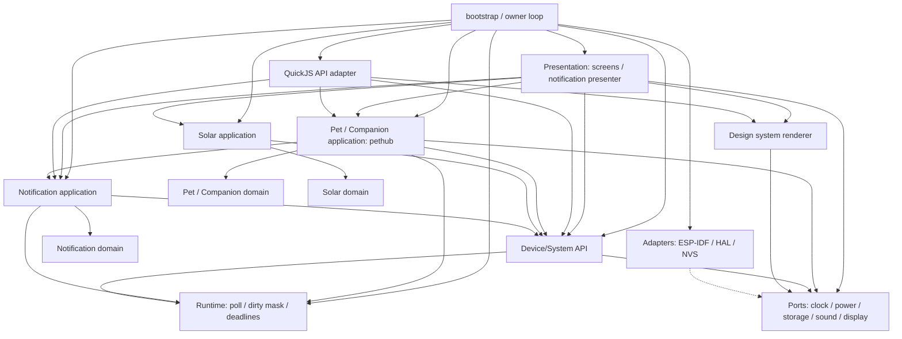
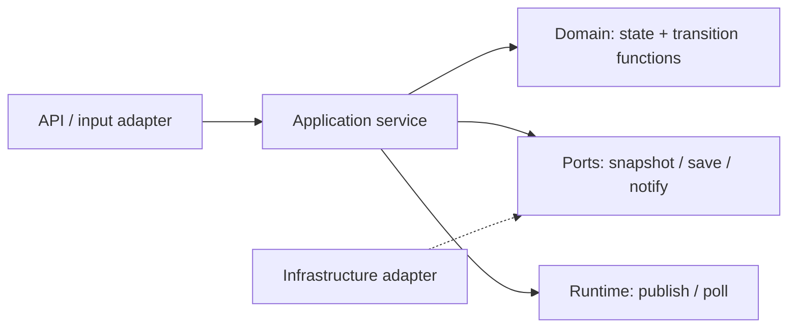
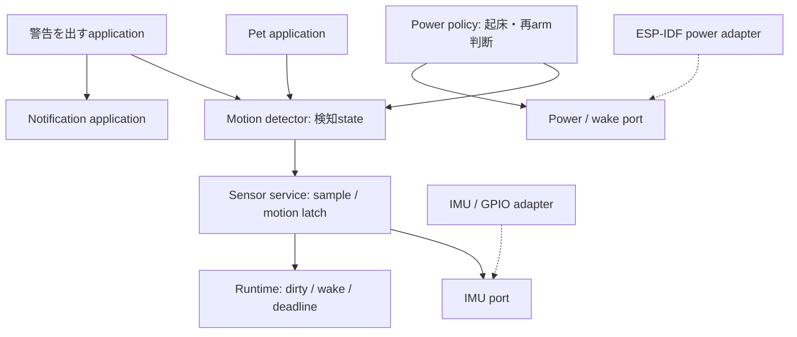

# モジュール境界と依存関係

2026-09-13。DDDの責務分割を取り入れた実装前の構成案。現状のinclude関係ではなく、移行後の依存を示す。
[システムruntime](system-runtime.md)と[デザインシステム](design-system.md)の構造を定義する。
図の実線矢印は「依存する側 → 公開契約を提供する側」。破線はportの実装関係で、イベントの流れではない。

## 1. コンテキストを分ける

| 境界 | 所有する意味・状態 | 外へ持ち出さないもの |
| --- | --- | --- |
| Device/System | 時計の品質・source、電源・センサーの観測値、取得方針 | ADC/RTC/I2C/RTOSの実装型 |
| Notification | 受付容量、通知の識別とstate、FIFO、確認・snooze・期限 | ペット、天文、画像、JSValue |
| Pet | 育成、個体選択、名前、操作、保存の意味 | 通知キューや共通時計のコピー |
| Companion | PC利用量、packet順序、reset通知判定 | 育成値、通知表示の状態 |
| Solar | 天文時刻変換、暦の適用範囲、demo、天体計算 | 時計同期の実装、pethubのfallback時計 |
| Presentation | DS命令、画面座標、フォーカス、通知の見た目 | 育成・通知stateの決定権 |

現行pethubはPetとCompanionとNotificationを束ねた入口になっている。
移行後のpethubはアプリケーション層の調整役とし、ドメイン状態の巨大な共通所有者にはしない。
目覚まし・相対timerの設定と発火はNotificationのユースケース、利用量resetの意味判断はCompanionに置く。
既存の保存blobは移行adapterで読み書きできるようにし、モジュール分割だけを理由に保存形式を変更しない。

図のPortsは読みやすさのための集合表示であり、全機能をincludeする共通巨大ヘッダーではない。
各portは利用側が必要とする最小契約に分ける。pethubは保存port、presenterは音声要求port、DSは表示portだけを利用する。
bootstrapだけが具象adapterを選び、既存owner taskへ配線する。applicationやdomainからbootstrapへ依存しない。

## 2. ドメインは判断、applicationは実行順序を所有する

ドメイン関数には時刻や観測値を引数として渡す。内部でRTC読取り、NVS、publish、JS呼出、描画をしない。
例えば通知domainは現在stateと操作と時刻から遷移を判定し、applicationが受付・期限更新・dirtyのpublishを確定する。
pethub applicationは利用量packetの検証結果からdomainを更新し、保存と通知受付の順序を実行する。
他コンテキストの構造体を直接書き換えず、公開commandとsnapshotを使う。

Notificationの集約は容量制約を含む固定通知集合。個別通知の識別、ACTIVE最大1件、待機最大8件を同じ所有者が守る。
Petの育成状態とCompanionの利用量状態は独立して更新可能にする。共通のsaved構造体がある現状では、保存adapterが旧形式への変換を担う。
時計・電源のsnapshotは小さな値型。読取り用snapshotと操作用commandを分けるが、CQRS用の複製DBやevent sourcingは導入しない。

## 3. pub/subは依存を隠す場所にしない

topicのpayload型とread契約は提供コンテキストの公開ヘッダーが所有する。
runtimeが知るのは整数のmask、pending、購読世代、期限だけで、PetやSolarの構造体を知らない。
topic bitの割当は配線用の独立ヘッダーに置き、ドメイン型をincludeしない。
購読者は提供側のsnapshot APIへ明示的に依存する。文字列topicで実際の依存を追えなくしない。
通知を作る操作は同期commandで受付結果を返し、dirty publishを「必ず処理される通知作成命令」の代わりにしない。

stateを書き換えたapplicationがpublishする。presenterはpollして必要なsnapshotだけ読み、表示が変わったときだけDSをpatchする。
runtimeの購読pending maskとDSの画面damage maskは別物であり、直接同じbitを流用しない。
stateの変更でも画素が変わらなければ再描画しない。

## 4. 配置案と実装上の制約

| 配置案 | 内容 |
| --- | --- |
| `main/system/` | clock/powerの状態・取得方針・公開API |
| `main/notification/` | domainの状態遷移、applicationの期限・受付処理 |
| `main/pet/` | 育成domain、pethub application、既存画像decoder |
| `main/companion/` | 利用量domainと外部packet変換 |
| `main/solar/` | 天文domainとapplication |
| `main/runtime/` | 固定pub/sub、期限集約。既存VM wakeと統合 |
| `main/ui/` | DS、画面、通知presenter |
| `main/adapters/` | QuickJS・NVS・時刻同期等の接続。既存HALを再利用 |
| `main/main.c`等 | composition rootとowner loop |

この表は目標であり、直ちに全ファイルを移動する指示ではない。現行テストに直書きされたパスを移行単位ごとに修正する。
小さなモジュールではdomain/applicationを同じディレクトリの別Cファイルに置けばよく、空の階層や汎用基底クラスは作らない。
公開headerはドメイン固有の型と最小値型だけを公開し、domainファイルにFreeRTOS、ESP-IDF、QuickJS、DSのincludeを許さない。
portはリンク時に選ぶC関数を優先し、実行時差替えが必要な境界だけ固定の関数表を使う。レコードごとの関数ポインタは持たせない。
モジュール分割でstateを複製せず、専用task・heap・queueを追加しない。既存の2 KiB runtime予算と16 KiB描画予算を維持する。

## 5. 移行の確認

まずclock/power抽出で`pethub → solar_time`をなくす。次に通知domain/applicationを抽出し、描画と音声要求をpresenterへ移す。
Pet/Companionの内部境界は既存packet・保存互換テストを保ちながら分ける。
各段階で公開headerへの依存、domain単独のホストテスト、実機ビルド、map上の重複状態とRAM増減を確認する。
依存の循環をpub/subの裏へ移しただけになっていないかもレビューする。

## 6. センサーとwakeの境界

IMU等はDevice/Systemの独立したSensor serviceに置く。通知runtimeの受付レコードには生サンプルを格納しない。
同じpoll/dirty機構を利用しても、ユーザー向けNotificationとセンサー観測の責務は分離する。
振動の検知条件はMotion detector、画面を起こすかどうかはPower policyが所有する。
「振るとペットが喜ぶ」の意味はPet application、「振動を警告として表示する」はその用途のapplicationが決める。

実線はコード依存。割込み発生からwakeする実行順序を表した図ではない。
HALの割込み入口は必要最小限のpendingを公開し、既存ownerをwakeする。検知state確定と利用側の処理はowner側で行う。
sleep復帰のハードウェア経路はPower/wake adapterが構成し、通知の購読があるだけでは自動的にdeep sleep wakeを許可しない。
詳細契約と現状の制限は[システムruntimeのセンサー節](system-runtime.md#12-センサー観測とwake)を参照。
