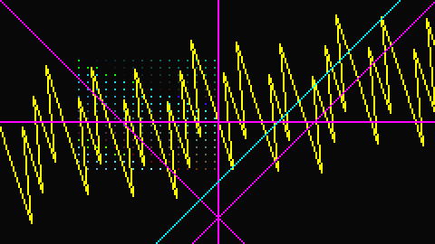

# 手続き型描画の上限緩和を実機で確かめる

2026-09-29。`c53f661`（plan 16→32、点列64→128点、入力8、レジスタ16、入れ子8、`unregister`、step 検査を書込み先のみに）を Cardputer ADV（ESP32-S3、PSRAM なし）で測った。目的は「上限を緩めた結果、ハードウェアの余力を仕様が潰していないか」を実測で分けること。値を変える実装はしていない。

**結論を先に。**

- 動的な plan の読み込みは実機で成立した。1セッションで累計 2,285 回登録し（同時 32 本の到達を含む）、登録解除後の空き heap は JS 分を除いて ±300 B 以内、最大連続空きは開始時の 31,744 B から動かない。16本登録＋16本描画＋16本解除を毎フレーム行っても 30 fps は維持した（JS 側の仕事は平均 5.7 ms）。
- 新しい上限での描画は host 参照（VM を1命令ずつ実行、点列は scalar）と**全画素一致**した（4回）。128点と8点のバッチは PIE を通った。
- **不具合を1件見つけた。** 1フレームの JS が 8 ms のターン予算を超えて VM に中断（park）されると、ターン終了時の `pocket_kasane_end_turn()` が `beginFrame` の状態を消し、再開後の `draw`/`commit` が `BUSY` になる。そのフレームは確定できない。1回で 8 ms を超える `draw`（10,000 step の SIN ループは 25 ms）を含むフレームは**絶対に commit できない**。step 上限（10,000/draw）でも 33 ms のフレームでもなく、この 8 ms が実効上限になっている。
- plan 32本×128点（実測 約 64 KB）はゲスト heap の上限（160 KiB）の外で確保される。112 KB を使う JS と並べると空きが 1.4〜3 KB まで落ち、2回に1回は32本目で `OUT_OF_MEMORY`、1回はゲスト自身の確保が失敗してアプリが止まった（再起動はしない）。2面目を併用すると 20 本まで。**32本という上限はメモリで裏付けられていない。**

## 測ったもの

| 項目 | 値 |
| --- | --- |
| 基準 commit | `c53f661`（`vm/limits-device`）＋本記録の診断コード |
| 診断 image | `idf.py -B build_limitsdev -DKASANE_PROC_LIMITS_PROBE=ON build`、2,173,520 B、SHA-256 `39b153887226fb672bc9152f6eee667b538b682472631e053782f41afb92ec1c` |
| 実行 | `python tools/kasane_contract/run_proc_limits_scene.py`（host 参照、WSL）→ `python tools/kasane_contract/run_proc_limits_device.py --port COM3 --out <log>` |
| 回数 | ネイティブ測定3回（run1/6/8。値は3回とも0.2%以内で一致）。JS 測定は最終 image で2回（run7/8）、それ以前の image で2回（run4/5）。ログは `.cache/proc-limits-20260929/`（git 管理外） |
| 条件 | Wi-Fi 接続後、ホームで音楽 overlay が動いた状態から開始。診断は overlay を止めてから走る。音声と FLOWER は同時に動かしていない |

`KASANE_PROC_LIMITS_PROBE` は既定 OFF。ON のときだけ USB `{`（ホームでネイティブ測定）と `}`（JS 測定アプリ [`proc_limits_probe.js`](../../apps/kasane/proc_limits_probe.js)）が有効になり、JS には `__lim`（heap・スタック・時計・frame hash）が入る。通常ビルドの EMBED とキー表は変わらない。`ksn_proc_step` には、旧来の全レジスタ検査を実行時に切り替える分岐がこのオプションのときだけ入る（後述）。

## 1. 動的な plan のライフサイクル

JS 測定アプリ（ゲスト約 112 KB、ソース 12 KB）の中で測った。**空き heap の差は `JS_ComputeMemoryUsage` のゲスト分と分けて読む**（ゲストの確保も同じ内部 RAM から来るため）。

| 段階（run7 / run8） | 累計登録 | 空き heap の開始時との差 | うちゲスト | 非ゲスト分 | 最大連続空き |
| --- | ---: | ---: | ---: | ---: | ---: |
| 開始時（登録0、枠確保済み） | 0 | 67,572 / 67,564 B | | | 31,744 B |
| 1本入替×150フレームと16本入替×40フレームの後 | 823 | −956 / −956 | +1,048 / +1,048 | +92 / +92 | 31,744 |
| さらに16本入替×40フレーム | 1,495 | −624 / −1,120 | +1,196 / +1,196 | +572 / +76 | 31,744 |
| さらに16本入替×40フレーム | 2,167 | −980 / −1,312 | +1,196 / +1,200 | +216 / −112 | 31,744 |
| 32本×128点を登録・全解除した後 | 2,200 前後 | −1,408 / −1,748 | | | 31,744 |

累計登録数に比例して減る成分はなく、断片化で最大連続空きが縮むこともなかった（実測）。

| フレームの内容（各40〜150フレーム） | フレーム間隔 平均/最大 | JS の仕事 平均/最大 | 捨てたフレーム |
| --- | --- | --- | --- |
| 16本を描くだけ | 33.6 / 34.4 ms | 1.4〜2.0 / 2.6 ms | 0 |
| 毎フレーム1本登録・1本解除 | 33.6 / 34.4 ms | 1.9 / 3.4 ms | 0 |
| 毎フレーム16本登録（半分は32点）→新16本を描く→旧16本解除（同時32本） | 33.2〜33.4 / 34.4 ms | 5.7 / 7.0 ms | 0 |
| 同上の2回目・3回目（GC の後） | 33.2〜33.4 / 38.5 ms | 7.0 / 37.7 ms | 各1（`beginFrame` が `BUSY`） |

場面切替を1フレームで行っても描画は途切れない。ただし仕事が 8 ms に近いので、GC が重なったフレームは中断され、次のフレームが1枚落ちた（後述の不具合と同じ原因）。

上限の確認（毎回成立）:

- 32本登録の後、33本目は `LIMIT_EXCEEDED`（点列あり・なし両方）。ただし heap が少ない時は点列ありの33本目が `OUT_OF_MEMORY` を返した（run6）。`register()` は JS 配列の読み取り・確保・解析を済ませてから空き slot を探すため。
- 途中の1本を解除して再登録すると、空いた slot に入り、handle はそれまでの最大値より大きい（再利用されない）。
- 解除済み handle の `unregister`・`draw` は `CLOSED`。
- 128点のバッチ（127線分）は1フレームに8本まで描ける。9本目は `LIMIT_EXCEEDED`（1,024線分の上限）。

## 2. 新しい上限での正しさ

[`proc_limits_probe.js`](../../apps/kasane/proc_limits_probe.js) の `limScene` を実機と host の両方で描いた。

- 入力8個を r8〜r15 へ読み、REPEAT を8段入れ子にして 16×16 の点を `PLOT_COLOR_REG` で打つ（32命令。シーン4 draw の合計は 1,599 step、391線分）。
- 128点の型付きバッチ（Q14 の回転・並進、変換後の座標は一部が画面外）。
- 8点の恒等バッチで −480 と 720 の端点をすべて通る線。
- VM の `MOVE`/`LINE` で (−480,700)→(700,−480)。

host 参照は adapter を使わず、各 draw を `ksn_proc_step()` で1命令ずつ進め、点列を scalar kernel で変換して線分列を作る。同じ host で実物の `pocket_proc.c` にも描かせ、参照と一致することを確かめてから実機と比べた。

| 確認 | 結果 |
| --- | --- |
| 実機の USB capture（送信前の RGB565、135行）と host 参照 | 差のある画素 0（run4/5/7/8 の4回） |
| 実機 backdrop の FNV-1a と host | 両方 3,856,000,315 |
| 点列の経路 | 1フレームで PIE 2回、scalar 0回（`pocket_proc_batch_counts`） |
| 拒否 | 入れ子9段、r16、入力番号8、129点、変換後 x=721、y=−481、`draw` の入力9個はすべて `INVALID_ARGUMENT` |



capture は LCD への転送前のバッファで、パネル表示そのものは読んでいない（MISO 未配線）。

## 3. 最悪時のメモリ

| 状態 | 確保量（実測） | 残りの空き / 最大連続 |
| --- | --- | --- |
| 32本×128点（run7） | 64,068 B（うちゲスト 132 B） | 2,148 / 704 B |
| 同（run8） | 31本目まで 62,600 B、32本目で `OUT_OF_MEMORY` | 3,192 / 1,536 B |
| 同（run5、ゲスト約110 KB） | 65,420 B（うちゲスト 1,572 B） | 3,004 / 1,536 B |
| 2面目（`createSurface`＋`resource`＋`beginFrame`） | 21,580〜21,740 B | 最大連続 31,744→20,480 B |
| 2面目がある状態で128点 plan を詰める | 20本（run7/8）で `OUT_OF_MEMORY` | 1,788〜2,164 / 512〜608 B |

計算値 61,664 B（plan 872 B＋点列 1,055 B を32本、`sizeof` は実機でも同じ値を確認）に対し、実測は約 63.9 KB（ヒープ管理の分が乗る。推定で1確保あたり約 35 B）。起動以来の最小空きは 908 B まで下がった。run6 では32本登録後にゲストの 336 B の確保が失敗し、アプリが `OOM` で止まってホームへ戻った（リセットなし）。

native の確保はゲストの `heap_limit` に数えられないので、アプリが大きいほど、32本上限の手前でシステム全体の空きが尽きる。上限は「32本まで登録できる」ではなく「32本を超えることはない」という意味しか持っていない。

## 4. 性能（ネイティブ測定、run1/6/8 の最小値）

同じ image の中で、`g_ksn_proc_sweep_regs` を 0/8/16 に切り替えて測った。0 が `c53f661` の動作（書込み先のみ検査）、8 が緩和前の全レジスタ検査、16 は検査を残したまま16レジスタにした場合。診断ビルドでは sweep=0 でも毎 step に回数0のループ判定が1つ入るので、出荷コードより数 cycle 遅い可能性がある（推定）。

| プログラム | 経路 | sweep=0 | sweep=8 | sweep=16 |
| --- | --- | ---: | ---: | ---: |
| 積和ループ 9,968 step（ADD/MUL、描画なし） | VM 単歩 | 100 cyc/step（4.16 ms） | 177（7.33 ms） | 249（10.34 ms） |
| 同 | plan（融合） | 84（3.51 ms） | 102（4.25 ms） | 119（4.95 ms） |
| 同 SIN 版 | VM 単歩 | 615（25.5 ms） | 691（28.7 ms） | 764（31.7 ms） |
| 同 SIN 版 | plan | 600（24.9 ms） | 618（25.7 ms） | 635（26.4 ms） |
| step 上限到達（SIN、10,000 step で `LIMIT`） | plan | 25.0 ms | 25.8 ms | 26.5 ms |
| 波形 706 step・99線分 | VM 単歩 / plan | 480 / 453 µs | 704 / 550 µs | 916 / 641 µs |

検査を書込み先に絞った効果は、同一バイナリで VM 単歩経路 −43%（緩和前の8レジスタ比）、plan 経路 −17%。SIN が支配するループでは −3〜−11%。ビルド間の15%変動の規則には当たらない（同じ image の中の比較）。

| 点列 kernel（2,048回） | scalar | PIE | 比 |
| --- | ---: | ---: | ---: |
| 8点 | 3.08 µs/回 | 1.23 µs/回 | 2.5倍 |
| 64点 | 24.0 µs/回 | 2.90 µs/回 | 8.3倍 |
| 128点 | 47.4 µs/回 | 4.81 µs/回 | 9.9倍 |

128点で scalar と PIE の出力は3組の係数（極端値を含む）で一致した。JS から見た1回の `draw` は、128点バッチ 184〜188 µs、8点 44〜76 µs、入れ子8段の点格子 1.16 ms、線1本 32 µs（`DRAWUS`）。128点バッチの登録は1本あたり約 1.7 ms（32本で 53〜56 ms。JS 配列の読み取りを含む）。64命令の `ksn_proc_plan_prepare` は 231 µs。

| 帯描画（全画面、8行×17帯） | 線分 | ラスタ歩数 | 時間 |
| --- | ---: | ---: | ---: |
| 範囲外の線分を棄却するだけ（16帯） | 1,024 | 1,024 | 0.82 ms（1線分・1帯あたり 50 ns） |
| 短い線 | 256 | 2,048 | 0.56 ms |
| 短い線（1 draw の上限相当） | 1,024 | 8,192 | 2.24 ms |
| 長い斜線（フレーム上限の 98%） | 1,024 | 64,512 | 18.2 ms |
| 128点バッチ1本の長い線 | 127 | 21,455 | 2.60 ms |

登録時のスタック: 64命令・入れ子8段の `prepare` は新しいタスクで測って 3,152 B（`ksn_proc_analysis` 2,952 B を含む）。JS 実行中の UI タスクは最後まで 23,708 B 以上の空きを残した。

## 5. 見つかった不具合

### フレームがターン予算で中断されると、組み立て中のフレームが消える

再現（通常 image も同じ経路を通る。コードを読んだ判断で、通常 image での実行は未確認）:

```js
const P = pocket.kasane.procedural;
const h = P.register([[0,0,0,0,5,0],[0,1,0,0,5,0],[8,0,0,1,0,65535]]);
globalThis.frame = () => {
  P.beginFrame(0);
  const t = Date.now(); while (Date.now() - t < 12);  // 8 ms を超える
  P.draw(h, []);   // BUSY "beginFrame required"
  P.commit();
};
```

診断 image では `}` の最後に `PARK draw_after_12ms=BUSY commit=BUSY` が出る。`app_tick()` は `dispatch_guest()` が frame() を VM_TURN_BUDGET_US（8 ms）で park させた後にも `pocket_kasane_end_turn()` を呼び、そこから `pocket_proc_end_turn()` が `building=false` にする。継続ターンで同じ frame() が再開すると、`draw`/`commit` は `beginFrame` 前と見なされる。

実測した影響:

- 10,000 step の SIN ループを1回 `draw` すると 25 ms かかり、同じフレームの `commit` は `BUSY`（`VMDRAW commit=BUSY`）。native 呼出しは中断されないが、戻った直後の opcode で park する。
- 1回 4.3 ms の積和 draw は1フレームに2回まで。3回目以降は `BUSY`（`VMFRAME want=3 drawn=2`）。
- 32本の登録を1フレームで行うと（54 ms）、同じフレームの描画が消える（run5 で `drawn=0 err=BUSY`）。場面切替の GC が重なったフレームも1枚落ちる。

`end_turn` の目的（例外で終わったフレームの候補を次のターンへ持ち越さない）は、park 中のフレームには当てはまらない。直すなら「frame() が park していない（`pocketjs_guest_work_pending()` が偽）ターンの終わりだけ組み立てを捨てる」のような条件になる（案。未実装・未検証）。

### 上限と `OUT_OF_MEMORY` の順序

`register()` は命令配列と点列を読み、plan と点列を確保し、解析を済ませてから空き slot を探す。32本登録済みで heap が少ないと、33本目は `LIMIT_EXCEEDED` ではなく `OUT_OF_MEMORY` になる（run6）。空き slot の確認を先にすれば、仕事と確保も省ける。

## 6. 仕様上限の棚卸し

実機で先に効くもの（ハードウェア側）と、コードが強制している仕様上限を並べた。分類は上の実測だけに基づく。

| 仕様上限 | 実機で測ったこと | 分類 |
| --- | --- | --- |
| フレームの時間予算（明示の上限なし） | 実効上限は 8 ms のターン予算。超えたフレームは確定できない（不具合）。フレーム周期 33 ms のうち転送と UI を除いた時間は使えていない | **仕様（実装）が先に効いている。直すべき** |
| step 10,000/draw | 積和 3.5〜4.2 ms、SIN 25 ms。後者はターン予算の3倍 | 上の不具合を直すまでは意味が無い。直した後も SIN 主体なら 33 ms フレームを1回で使い切るので、**緩めるべきでない** |
| 点列のラスタ歩数（draw 単位の上限なし） | 1回の draw で 21,455 歩（VM の上限 8,192 の2.6倍）を通した。帯描画 2.6 ms | VM と非対称。時間は余っているので、上限を付けるならフレームの 65,535 だけで足りる。**現状のままで可（仕様の文言を揃える）** |
| ラスタ 8,192/VM draw | 8,192 歩の帯描画 2.24 ms | 時間には余力がある。ただしフレーム上限がすぐ下にある。**緩められる（フレーム上限の範囲内で）** |
| ラスタ 65,535/フレーム | 64,512 歩で帯描画 18.2 ms。全画面転送 7.7 ms（`vm_sched.h` の既存記録、今回は未測定）と合わせると 33 ms にほぼ届く | **緩めるべきでない** |
| 線分 1,024/フレーム | 128点バッチ8本で到達。1,024本の棄却は 0.8 ms、短線なら 2.2 ms。frame は 10 B/線分×（1面2枚＋scratch）で、2,048 にすると 1面で +30.7 KB、2面で +51.2 KB（計算）。アプリ中の最大連続空きは 31,744 B | 時間は余っているが**メモリが先に尽きる。緩めるべきでない**（可変長 frame にするなら再検討） |
| plan 32本 | 32本×128点で約 64 KB、空き 2 KB 前後、2面目併用では20本で OOM | **緩めるべきでない**。点列付きはむしろ実質 20〜31 本。点列の常時128点確保（1,055 B）を点数に応じた確保にすれば同じ heap で本数が増える |
| 点列 128点 | PIE 4.8 µs、draw 188 µs、1フレーム8本まで | 時間は大きく余る。点数を増やすと固定確保が効くので、**確保を可変にすれば緩められる** |
| 命令 64 | `prepare` 231 µs、スタック 3.2 KB（UI タスクの空き 23.7 KB）。plan は 872 B 固定で、128命令なら 32本で +約 27 KB（計算） | スタックと時間には余力。**メモリ（plan 固定長×32本）で条件付き** |
| 描画面 2 | 2面目で 21.6 KB、最大連続が 11 KB 縮む | **緩めるべきでない** |
| 入力8・レジスタ16・入れ子8 | 実機で正しく動き、コストは測定誤差内 | 今回の緩和で足りている |
| 登録数/フレーム（上限なし） | 128点 plan の登録は1本 1.7 ms。5本前後でターン予算を超える | 不具合の側で効く。上限を足す必要はない |

## 追加で測るべきこと

- ターン予算の不具合を直した image で、同じ `}` を回す（VMFRAME と場面切替の落ちるフレームが0になるか）。
- ゲストが小さい実アプリ（MEGADEMO など）の heap で、32本×128点がどこまで入るか。今回のゲストは約 112 KB で、通常アプリより大きい。
- 音声・FLOWER・Wi-Fi 通信を同時に動かしたときの帯描画と VM の時間。
- パネル側の表示は目視していない（capture は送信前バッファ）。
