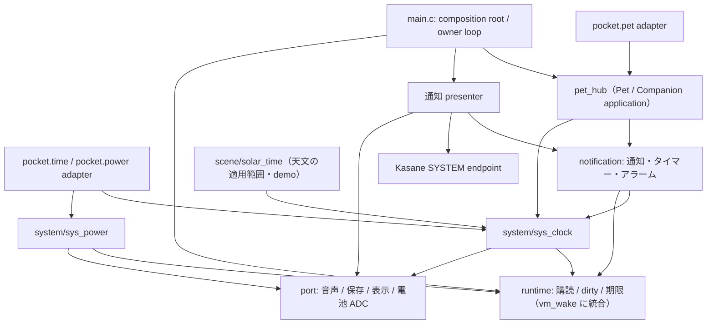

# システムランタイム移行設計: pet_hub から時計・通知・タイマーを取り出す

2026-09-15。**設計**（未実装）。[システムランタイム仕様](system-runtime.md)と[モジュール境界](module-boundaries.md)を、vm/main の現行コードへ当てはめる手順を決める。Kasane 側の実装順序は `vm/design-contracts` の `docs/kasane-roadmap.md` と `docs/kasane-astra-plan.md`（Astra 計画）に従い、その checkpoint 番号をここでも使う。

**前提（ユーザー判断、2026-09-15）:** `pocket.pet` はネイティブアプリ（Pocket Pet / Pet Companion）の面であり、共通 API ではない。依存は **ペット → システムモジュール** の向きが正しい。

## 1. 現状: システムの機能がペットの中にある

`main/pet/pet_hub.c` と `pet_hub_core.c` が、ペットと無関係に使われるべき機能を所有している。

| 機能 | 現行の実装 | 本来の持ち主（[モジュール境界](module-boundaries.md) §1） |
| --- | --- | --- |
| 壁時計の補完 | `utc_now()`: SNTP 済みなら `solar_time_now()`、それ以外は PC パケットの `clock_utc`/`clock_ms` アンカー | Device/System の時計 |
| タイムゾーン | `hub.saved.utc_offset`（PC パケットで上書き、既定 +9h、ペットの NVS blob に保存） | Device/System の時計設定 |
| 通知キュー | `alerts[8]` のリング＋表示中 `alert` 1件（ASCII 24文字） | Notification |
| 相対タイマー | `timers[4]`（id 16文字、label、`due` ms）。発火で通知へ変換。スヌーズもこの枠を1つ使う | Notification（タイマー） |
| 日次アラーム | `wake_minute`/`wake_day`。**その分の間に pump された場合だけ**発火 | Notification（アラーム） |
| 利用量リセット通知 | `usage[].reset[]` と `notified[]` の発火済みキー | Companion（意味判断）＋Notification（受付） |
| 鳴動 | `pet_hub_pump()` が `sound_tone(1046 Hz, 200 ms)` を 2 秒ごと、最大 30 秒 | Notification の presenter が音声 port へ要求 |
| 確認キー | `pet_hub_key()`: 通知中は RIGHT=5分スヌーズ、ENTER/BACK=確認、他キーは飲み込む | ホスト優先入力（Notification の操作 command） |
| 表示 | `pet_hub_overlay()`: 画面上端 48 px に自前で `paint_*` とペット画像 | Presentation（通知 presenter → Kasane SYSTEM） |
| USB 受信 | `pet_hub_usb()`: RS+`P`+96 hex の枠を `inbox`（4×48 B）へ | Companion の外部 packet adapter |

依存の逆転が3か所ある。

- **`main/hal/board.c:327`（唯一の LCD 転送口）が `pet_hub_overlay()` を呼ぶ。** HAL がペットに依存している。
- **`main/main.c` がキー入力を画面へ配る前に `pet_hub_key()` に、USB 文字を最初に `pet_hub_usb()` に渡す。** ホストの入力経路がペットに依存している。
- **`pet_hub.c` が `solar_time.h`（背景シーンの天文時刻層）と `sound.h` と `paint.h` を include する。**

`pocket.pet` の公開範囲は 2026-09-15 に修正済みで、`pet.companion` を登録情報で名指ししたアプリにだけ注入し、capability 登録はセッションごとに破棄する（[common-api.md](../api/common-api.md) §2）。本書が扱うのは内部の所有と依存である。

## 2. 目標の依存

守ること:

- **`board.c` と `main.c` は `pet_hub` を include しない。** board は表示 port の実装であり、どの機能の画素も知らない。
- **`notification` と `sys_clock` はペット・天文・画像・JSValue の型を include しない。** 通知 presenter はペット画像を「画像 resource の1つ」として受け取る（Kasane の `ksn_image_port`）。
- **`solar_time` は `sys_clock` の利用側になる。** 同期の信頼判断は `sys_clock` へ移し、`solar_time` には 2000〜2050 年の適用範囲・J2000 変換・DEMO/OUT_OF_RANGE だけを残す（[システムランタイム仕様](system-runtime.md) §5）。

## 3. 各モジュールの契約（案）

名前は案。[システムランタイム仕様](system-runtime.md)の §3〜§8 を正とし、ここではその C 契約を現行コードのどこから作るかを書く。

### 3.1 `main/system/sys_clock`（S1）

- **状態:** UTC anchor（epoch 秒と単調 µs）、`valid`、`source`、`trust`、`revision`、タイムゾーン offset（秒）。
- **source の区別:**
  - `RTC`: 起動時に `gettimeofday` が適用窓の中にある（ESP32-S3 の RTC タイマーはリセットをまたいで時刻を保つ。`solar_time.h` のコメントどおり。**電池付き RTC は無い**ので、電源断では保たれない）
  - `SNTP`: `wifi_time.c` の同期成功時。今の `solar_time_set_synchronized(true)` の呼び出し元を置き換える
  - `PC`: Pet Companion の packet。**SNTP・RTC が無効なときだけの fallback**（現行 `utc_now()` と同じ優先順位）
- **タイムゾーン:** `pet_hub_saved_t.utc_offset` から移す。**保存形式は変えない**（[モジュール境界](module-boundaries.md) §1）。起動時に移行 adapter がペットの blob から読み、`sys_clock` の設定として持つ。PC packet の offset 更新は `sys_clock_set_timezone()` の command になる。
- **読み取り:** `sys_clock_read(mono_us, &state)` はコピーを返し、呼ぶたびに `gettimeofday` を叩かない（anchor ＋ 経過時間）。
- **publish:** step・source/trust 変更・タイムゾーン変更で `CLOCK_CONFIG`。自然な経過では publish しない。

JS 側の変化:

- `pocket.time.wall()` は `sys_clock` を読む。**PC 由来の時刻も `wall()` に出るようになる。** そのとき `source` の値をどう名付けるか（`host` を PC 同期の意味に使うか、`pc` を足すか）は §6 の未決事項。
- `pocket.pet.clock()` は `sys_clock` の UTC とタイムゾーンを返す薄い関数になり、補完ロジックを持たない。

### 3.2 `main/system/sys_power`（S1）

- `pocket_av.c` の `power_pump()`・`power_state()`・1秒 / 20 mV の閾値判定を移す（値は仕様と一致済み）。
- JS の `pocket.power.status()/onChange()` は `sys_power` の購読1件を共有する adapter になる。**購読が無ければ ADC を読まない**性質を保つ。
- `keepAwake` は引き続き UNSUPPORTED。スリープやバックライト消灯を入れるときに、Power policy として別途設計する。

### 3.3 `main/runtime`（S2）

- 固定8件の購読（interest / pending / 世代）、`sys_poll()`、`next_deadline()`。
- **起床は既存の `vm_wake` に統合する。** 通知の到着・期限は `vm_wake_post()` を「state を公開した後」に呼ぶ（`vm_wake.h` の順序契約）。新しい task notification の値を別用途で使わない。
- **現行ループへの入れ方:** 今の `ui_task` は 30 fps で回るので、S2 の目的は起床の削減ではなく、**毎フレームの無駄な処理をやめること**。`pet_hub_pump()` が毎フレーム行っている全タイマー走査・`utc_now()`・アラーム判定を、`next_deadline()` に達したときだけ行う形にする。

### 3.4 `main/notification`（S3）

- **domain（ホストテスト可能、ESP-IDF 非依存）:** [システムランタイム仕様](system-runtime.md) §7 の9レコード状態機械（FREE / QUEUED / ACTIVE / SNOOZED / ACKED / CANCELLED / EXPIRED）、タイマー4件、日次アラームの論理日キー。`pet_hub_core.c` の `pet_hub_notify/take/timer/tick` が出発点。
- **application:** 受付（同期 command、FULL を返す）、期限の処理、publish。
- **容量:** 待機8＋表示1、タイマー4、ラベル ASCII 24 文字、id 16 文字。現行の `pet.companion` の `limits` と同じ値で、`limits` はこのモジュールの定数を参照するよう変える。
- **操作 command:** `notify_ack(id, gen)` / `notify_snooze(id, gen, 300 s)` / `notify_cancel(owner, key)`。結果は OK / FULL / GONE / STALE。
- **JS への対応:** `pocket.pet.notify()` の FULL は今の `LIMIT_EXCEEDED`（retryable）を保つ。GONE/STALE は `pocket.pet` からは発生しない（JS は確認操作を持たない）。

### 3.5 通知 presenter と入力（S3 暫定 → S4 Kasane）

**S3（Kasane を待たない暫定）:**

- `main/ui/notify_presenter.c` を作り、今の `pet_hub_overlay()` の描画と鳴動（30 秒・2 秒間隔）をそこへ移す。音は `sound_tone` を直接呼ぶのではなく、音声 port の関数を通す。
- **`board.c` の呼び出しを、composition root が登録する「システム重ね描き」フック1本に置き換える。** board は関数ポインタを呼ぶだけで、`pet_hub.h` を include しない。録音インジケータ（`pocket_capture_overlay`）も同じフックに並べる。
- **キー:** `main.c` の `pet_hub_key()` 呼び出しを、presenter の `notify_presenter_key()` に置き換える。これは Kasane の `ksn_view_host_route(host_priority=true)` と同じ位置付けで、通知が ACTIVE の間だけ RIGHT/ENTER/BACK を取り、他のキーを飲み込む現行の挙動を保つ。
- ペット画像は presenter が `pet_pixels_draw()` を呼ぶ。これはペット adapter の関数で、S4 で image port に置き換える。

**S4（Kasane の checkpoint に合わせる）:**

| 必要な Kasane の機能 | Astra checkpoint | 通知 presenter でやること |
| --- | --- | --- |
| host がコアを所有し、ゲスト無しで SYSTEM 層が動く | 4 | presenter が SYSTEM endpoint を持つ（アプリ実行中もホーム画面でも） |
| TEXT の coverage renderer と JS/C の text 命令 | 9, 10 | ラベルと「ENTER OK > SNOOZE」を TEXT 命令にする |
| PPT2 のペット画像 provider | 13 | ペット画像を `ksn_image_port` の resource として描く |
| 通知・時計/電池・録音を SYSTEM へ | 14 | 暫定の `paint_*` 描画とシステム重ね描きフックを削除する |
| scope 購読と focus の原子的確定 | 15 | 通知の確認キーを Kasane の入力 scope に移す |

- **SYSTEM 層の予算は 16 命令・128 B・トラック2**（[デザインシステム](design-system.md) §5、[ペット適用仕様](design-system-pet.md) §5）。表示するのは ACTIVE の1件だけで、待機中の通知は命令を持たない。
- 描画順は APP → APP モーダル → SYSTEM（`vm/design-contracts` の `docs/design-composition.md` §2）。通知はモーダルより上に出る。

## 4. 現行の挙動との対応

| 現行 | 移行後 | 区分 |
| --- | --- | --- |
| 通知8件のリング、表示中1件、ASCII 24 文字 | 9 レコード（待機8＋ACTIVE 1）、同じ文字制限 | 同じ |
| RIGHT=5分スヌーズ（タイマー枠を1つ使う）、枠が無ければ表示を維持 | SNOOZED は待機枠を使う。待機が満杯なら FULL で ACTIVE を維持 | **意図的な変更**: スヌーズがタイマー4件を食わなくなる |
| 鳴動 30 秒・2 秒間隔、音が止まっても表示は残る | 同じ。音声の完了やミュートで確認済みにしない | 同じ |
| 日次アラームは「その分に pump された場合だけ」発火 | 時計が前進して期限を越えたら当日分を1回発火。後退・タイムゾーン変更で重複しない | **意図的な変更**（[システムランタイム仕様](system-runtime.md) §5） |
| PC 時刻はペット内部の補完だけ、`pocket.time.wall()` には出ない | `sys_clock` の fallback source として `wall()` にも出る | **意図的な変更**。JS の `source` 名は未決 |
| タイムゾーンはペットの blob | `sys_clock` の設定。保存形式は移行 adapter で互換 | 所有者の移動のみ |
| 利用量リセットの発火済みキーはペットの blob | Companion の domain に残し、受付成功後に更新 | 同じ（exactly-once は保証しない） |
| 描画は `board_present()` 内で上端 48 px を上書き | S3: システム重ね描きフック / S4: Kasane SYSTEM 層 | 見た目は S3 で同じ、S4 で Kasane の配色へ |

## 5. 段階計画と検証

S1〜S3 は Kasane を待たずに vm/main 上（作業用ワークツリー）で進める。S4 は Kasane の checkpoint 14 以降に `vm/design-contracts` 側で進める。各段階は独立してビルドでき、既存の挙動を保つ。

| 段階 | 変更 | 検証 |
| --- | --- | --- |
| **S1: 時計と電源** | `sys_clock`/`sys_power` を作る。`solar_time`・`pocket_app.c`（`time.wall`）・`pet_hub.c`（`utc_now`）・`pocket_av.c`（power）を利用側にする。`pet_hub → solar_time` の include を消す | `tools/test_solar_time.c`（WSL）を通す。`sys_clock` のホストテストを足す（source の優先順位、PC fallback、前進・後退、タイムゾーン移行 adapter が旧 blob を読めること）。`tools/test_pet_hub.c` と `tools/test_pet_companion.py` を回帰に使う。実機で SNTP 同期前後の `wall()` と Companion の時計表示 |
| **S2: 購読と期限** | `runtime` を作り、`vm_wake` に統合。`pet_hub_pump()` の毎フレーム走査を期限駆動にする | 購読2件が同じ変更を別々に観測できる、publish の合流、解除と再登録、世代切れ（ホスト）。実機で静止時の runtime 起因の処理回数を数える |
| **S3: 通知・タイマー・presenter（暫定）** | `notification` の domain/application を `pet_hub_core` から抜き出す。`notify_presenter.c` とシステム重ね描きフック。`board.c`/`main.c` から `pet_hub_*` を消す | `pet_hub_core` の既存テストを notification domain のテストへ移し、[システムランタイム仕様](system-runtime.md) §10 の必須検証（8＋1、満杯時のタイマー保持と再試行、スヌーズ満杯、重複 ACK、30 秒で音だけ止まる）を足す。`grep -rn pet_hub main/hal main/main.c` が0件。実機でアラーム・スヌーズ・利用量リセット通知、アプリ実行中の通知表示 |
| **S4: Kasane SYSTEM presenter** | Astra checkpoint 4/9/10/13/14/15 の後、presenter を SYSTEM endpoint に載せ替え、暫定の描画とフックを削除 | Kasane の H/Q 試験、SYSTEM の16命令予算、通知とモーダルの重なり、APP 転送失敗時の修復。実機で通知・時計・電池・録音の SYSTEM 表示 |

各段階で `tools/memlog.py --map`（静的 DIRAM）と、実機の `--port --check`（空きヒープ）を記録する。ランタイムの予算は [システムランタイム仕様](system-runtime.md) §10 の 2 KiB（関連 native 込みで 3 KiB）。**旧 `pet_hub_t` の通知配列・タイマーを残したまま新しい配列を足していないか**を map で確かめる。

## 6. 未決事項

1. **`pocket.time.wall()` の `source` 名。** PC 由来の時刻を出すとき、共通 API の `host` を「PC 同期」の意味に使うか、`pc` を足すか。`trust` を JS に出すかも含む（[common-api.md](../api/common-api.md) §5）。
2. **JS の汎用通知・タイマー API を共通 API に作るか。** 作るなら `notification` の JS adapter として出し、`pocket.pet` を入口にしない。FULL / GONE / STALE と共通エラーコード（`LIMIT_EXCEEDED` / `NOT_FOUND` / `CONFLICT` 候補）の対応をそのとき決める。
3. **時計の変更通知を JS に出すか**（`CLOCK_CONFIG` に対応する `pocket.time.onChange`）。
4. **タイムゾーンの設定 UI。** 今は PC packet でしか変えられない。ホストの設定画面に置くか。
5. **S3 のシステム重ね描きフックを、S4 を待たずに Kasane の SYSTEM 層で置き換えられるか。** Astra checkpoint 14 の時期次第で、S3 の暫定 presenter を省けるなら省く。
