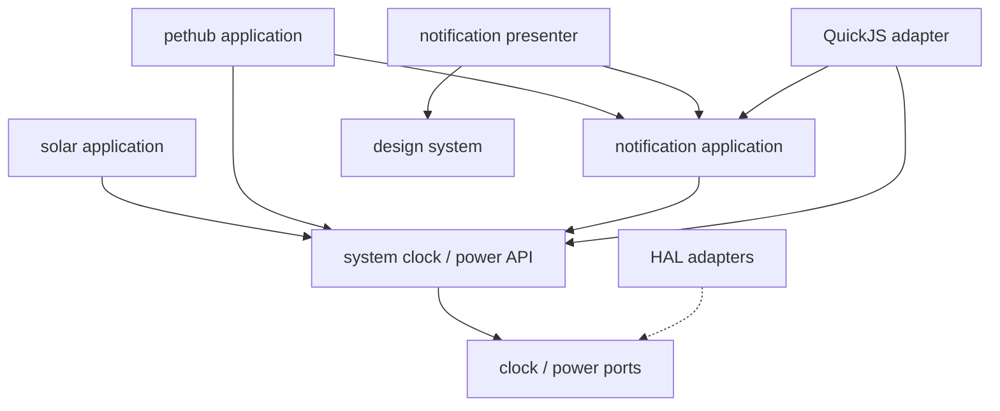

# システムAPI・通知ランタイム仕様 v0.1

2026-09-13。実装前の設計案。[デザインシステム](design-system.md)と組み合わせるが、描画・QuickJS・PocketJSに依存しないCの基盤とする。
目的は時計・電源・通知の共通化と、poll + dirty mask + pub/subによる不要な起床・再計算・割当の削減。
本書の容量・性能は設計予算であり、実測値ではない。

2026-09-16 CP14a: `main/system/sys_state.c`に固定購読・独立dirty・電源snapshotを実装。
`sys_device.c`がHALを接続し、`pocket_power.c`が既存JSコールバックへ配送する。
現在のtopicはSYS_POWERのみ。時計・通知・timer・SYSTEM描画は以降のcheckpoint。
stateは144 B、購読ID管理4 B（sizeof/ELFで確認する）。動的確保・専用taskは追加しない。

`sys_power_read`はsampledの有無を返し、valid/errorを含むsnapshotをコピーする。
`sys_power_step`は購読またはrefresh要求があり期限到達した時だけHALを呼ぶ。
解除後の再購読でも直前の測定から1秒の間隔を守り、初回dirtyで最新cacheを読める。
未変更・初回配送済みならJS配送処理へ入らない。購読IDはprocess全体で単調増加し、
UINT32_MAX到達後は新規受付をFULLにする（再起動まで古いIDを復活させない）。

互換性: `pocket.power.status()`とcapability probeは従来通り同期HAL読取りを維持する。
`onChange`はnative購読1件を全JS listenerで共有し、payloadはcacheから作る。
最後のclose/例外/guest終了で即座にnative購読も解除する。nativeの別購読は存続する。
初回値は次のowner pumpで配送し、再購読だけで測定期限を前倒ししない。
現在は既存owner loopからstepする。runtime専用の周期wakeは追加せず、既存の画面・VMの
周期待機そのものを停止したとはしない。

## 1. 現状と依存の向き

現状の`main/pet/pet_hub.c`は時計補完、USB入力、NVS、タイマー、通知キュー、鳴動、入力処理、描画、JS bindingを持つ。
UTC取得は`solar_time_now()`経由で、`main/main.c`はループごとに`pet_hub_pump()`を呼ぶ。
`main/scene/solar_time.c`は実時計の信頼状態と天文表示用の日時範囲・demo時間を同時に扱う。
`main/pocket/pocket_av.c`の電源購読は既に無購読時の早期return、1秒poll、20 mVの変化閾値を持つ。
この省資源の性質と既存の通知・保存契約を保ちながら責務を分ける。



実線は「依存する側 → 公開契約を提供する側」、破線はportの実装関係。system/notifyはsolarやpethubの型をincludeしない。
DDD風のコンテキストとdomain/application/adapterの詳細は[モジュール境界](module-boundaries.md)を参照。
solarの天文暦、pethubの育成・利用量・保存スキーマは基盤へ移さない。
通知presenterは任意のペット画像を使えるが、runtimeは描画関数や画像データを持たない。
音声は既存サービスへ要求するadapterに委譲する。専用RTOSタスク、専用スタック、汎用イベントオブジェクトは追加しない。

## 2. 状態とイベントを区別する

時計や電源は最新状態が意味を持つ。複数回の変更はdirty bit 1個へ合流してよい。
通知の受付・確認・取消は消失させてはいけないため、固定長レコードのstateで保持する。
pub/subは全イベント履歴の配送ではなく「購読した状態に変更がある」という通知。途中の全変化や配送回数の一致は保証しない。
dirty bitはpayloadでもキュー件数でもない。現在のstateが真実で、wakeは再確認を促すだけである。

topicは固定enum、maskはuint32_t。初期topicはCLOCK_CONFIG、POWER、NOTIFY、TIMER、PET_USAGE、PET_STATE。
時刻の自然な経過ではCLOCK_CONFIGを毎秒publishしない。秒表示・分表示の境界は購読者の期限として管理する。
topicの発行権は提供側に限定し、アプリから電圧・時計の信頼状態を任意に上書きできない。
同じ意味の値を再publishしてもdirtyにしない。観測時刻だけの更新でUIを再描画しない。

## 3. pub/subとpollの契約

ネイティブ購読者は最大8件の小さな固定配列。各要素はinterest mask、pending mask、世代、使用状態を持つ。
コールバック・文字列topic・購読者ごとのpayloadコピー・動的リストは持たない。
初回subscribe時はinterestをpendingに立て、現在値の初期読取りを保証する。

```c
sys_sub_t sys_subscribe(uint32_t interest);
uint32_t sys_poll(sys_sub_t sub);
void sys_unsubscribe(sys_sub_t sub);
bool sys_clock_read(uint64_t mono_us, sys_clock_state_t *out);
bool sys_power_read(sys_power_state_t *out);
```

名称は提案。readは呼出元の領域へコピーし、内部ポインタの寿命を公開しない。
publishは各購読者の`pending |= changed & interest`。pollはその購読者のpendingだけを取得・クリアする。
全購読者で1個のdirty maskを共有して先着が消す方式は禁止する。
購読変更時は追加したinterestだけ初期dirtyにする。解除時はpendingを捨て、ハンドルの世代を更新する。
世代wrapで古い参照を復活させず、枯渇したエントリは再起動まで再利用しない。

state更新、fan-out、poll、snapshot取得は既存owner taskで直列化し、その途中でJSや利用側を呼び出さない。
poll→snapshotの間には別タスクによるstate直接変更がない。利用側が後回しにする場合は取得maskを自分で保持する。
新しいpublishは次のpollへ残るため、読取り中の更新をclearで失う競合を作らない。
8件程度の線形走査で十分とし、汎用brokerや空間/木索引を導入しない。

QuickJS adapterはネイティブ購読1件を共有し、既存のJS購読寿命管理を再利用してfan-outする。
新たなcallback registryやPromise完了機構を複製しない。無購読topicはJSオブジェクトを作らない。
JS公開名・既存`pocket.power`とのaliasは実装時に互換表で定めるが、C基盤にPocketJS依存を持ち込まない。

## 4. 別タスク・ISRとの境界

別タスクはstate本体を書かず、固定mailboxまたは既存のbounded queueへ入力を置いてownerをwakeする。
時計設定など最新値だけ必要な入力はmailboxで合流できる。通知の追加・確認など各操作が必要な入力は固定queueで保持する。
mailboxの複数wordは短いcritical sectionで一貫したコピーを保証し、dirty bitだけをatomicにして非atomic payloadを競合読取りしない。
release/acquireまたはRTOSの同等保証で「payload公開→pending→wake」の順を守る。

ownerは入力を取得してからstateを更新する。入力数に上限を設け、1巡は最大4件処理し、残りがあればreadyを維持して他の処理へ譲る。
queue満杯は明示的なFULL。通知を黙って上書きしない。ISRは待機・確保・NVS・JS・描画を行わない。
現行USB inbox 4×48 Bは必要な入力キューとして利用し、broker用に同じpacketを再度キューへコピーしない。

## 5. 時計API

単調時計はuint64_t microseconds。相対タイマー・鳴動間隔・表示TTLはこれを使う。
UTCはint64_tのepoch時間と単調時刻のanchorで表現し、read時に差分を加える。自然な経過のためにstateを書き換え続けない。
stateはvalid、source、trust、UTC/mono anchor、revisionを持つ。取得不能と未同期を区別する。
sourceは少なくともRTC、SNTP、検証済みPC同期を区別する。タイムゾーンはUTCとは別の設定とする。
外部PC packetのCRC/形式検証は時刻の真正性保証ではない。既存の入力経路からの設定として扱い、SNTPより優先させない。

既存pethub互換では信頼可能なRTC/SNTPを優先し、無効時だけPC anchorをfallbackに使う。
同期失敗だけで有効な時計を無効化しない。明示的な無効化と取得失敗は別状態。
起動時RTCの妥当性判定は共通側の方針として明記し、電源断後まで正確性が保証されるとはしない。
solarの2000〜2050年範囲判定、J2000変換、DEMO/OUT_OF_RANGEはsolar側へ残す。共通時計を天文暦の範囲に制限しない。

時計のstep、source/trust変更、timezone変更はCLOCK_CONFIGをpublishし、壁時計alarmの次期限を再計算する。
相対タイマーはUTC変更で伸縮しない。
日次alarmは論理日付の発火済みキーを保持する。前進で当日の期限を越えた場合は当日分を1回だけ発火し、飛ばした日数分を再生しない。
後退では既に発火した日付以前を再発火しない。timezone変更時も重複抑制する。明示的な再設定時だけ抑制状態を再設定できる。
これは現行の「該当分にpollできた場合」の挙動からの意図的変更としてテストする。
時計無効時は壁時計alarmを停止状態で保持し、CLOCK_CONFIGの有効化で再評価する。相対タイマーは動作を続ける。

## 6. 電源API

stateはmillivolts、sampled_at、valid、errorを基本とする。現行ハードではpercentとchargingは不明を返し、電圧から正確そうな残量を捏造しない。
readはキャッシュのみでADCを暗黙に起動しない。初回値がない場合は未取得を返す。
購読開始または明示refresh要求で初回取得を予約する。refreshは合流し、最短測定間隔を破らない。
購読がある間は最短1秒の期限で取得し、全購読者がなくなれば周期取得を止める。
低電圧等を監視するシステム機能が必要なら、その機能を明示的な購読者として数える。
値のpublishは最後に通知した値から20 mV以上の差、valid/error変更、初回取得時。微小差は累積して判定し、毎回の生値との差だけでは判定しない。
取得時刻だけ変わってもPOWERをpublishしない。測定値は更新し、利用側は鮮度を読める。
ADCの500 msキャッシュ等のHAL事情は提供側に閉じ込める。従来の同期status/probeとの違いはadapterで互換試験する。

## 7. 通知レコードとstate

固定配列9レコードで、現行相当の待機8件＋表示中1件を保持する。文字列やpayloadをJSから借用しない。
1件80 B以内を目標とし、id/世代、owner、dedupe key、state、reason、revision、作成時刻、期限、表示方針、短いlabelを収める。
labelは現行互換のASCII24文字＋終端。日本語/長文はこの容量を暗黙に拡張せず、別仕様で資源参照等を検討する。
描画用の文字コピーはDS側の予算に含める。通知runtimeにピクセルやフォントを保持しない。

stateはFREE、QUEUED、ACTIVE、SNOOZED、ACKED、CANCELLED、EXPIRED。

| 遷移 | 条件 |
| --- | --- |
| FREE → QUEUED | 受付成功。owner + keyによる重複抑制を選択可能 |
| QUEUED → ACTIVE | 表示枠が空いた。基本FIFO、v0.1は優先度による横取りなし |
| ACTIVE → ACKED | 正しいid/世代への確認操作 |
| ACTIVE → SNOOZED | snooze期限の予約に成功した場合のみ |
| SNOOZED → QUEUED | 単調時計の期限到達、受付順を新しくする |
| QUEUED/ACTIVE/SNOOZED → CANCELLED | ownerによる取消または寿命終了 |
| QUEUED/ACTIVE → EXPIRED | 明示されたTTLが経過 |
| 終端 → FREE | owner巡回内で結果を確定し回収 |

SNOOZEDも待機8件の容量を使う。ACTIVEから移す際、待機枠が満杯ならFULLでACTIVEを維持する。
ACTIVEを他の通知で上書きしない。更新は同じowner/key/idに明示し、表示TTL・鳴動を勝手に最初からやり直さない。
終端遷移は消費操作の戻り値とownerの結果状態へ確定してから回収する。
pub/subは終端履歴の全件配送を保証しない。後からidを読むとGONEとなることがあり、同じ番号の別通知と混同しない。
全件の履歴が必要な機能は別の永続化責務であり、無制限履歴を追加しない。

既存alarmは自動消去TTLなし。鳴動は最大30秒・次toneは2秒後、音が止まっても確認待ち表示は残す。
右キーsnooze 5分、Enter/Back確認の意味を維持する。音声完了やミュート状態だけで通知を確認済みにしない。
音声待ちでruntimeをブロックしない。鳴動期限と表示のdirtyを分け、同じ画像の再送をしない。
通知操作は冪等性を定義し、既に終了したidへの操作はGONE、別世代にはSTALEを返す。

## 8. タイマー・pethub・保存

共通タイマー枠は現行相当4件。owner/key、単調期限、固定通知内容を持ち、IDやlabelの既存上限を維持する。
pethubは利用量reset・目覚まし等の意味を判定し、次の意味のある期限をruntimeへ提示する。毎フレーム全条件を検査しない。
通知キュー満杯で期限発火に失敗したタイマーはdue状態を保持する。
同じ過去期限を返してbusy loopを作らず、NOTIFYの容量解放を再試行条件にする。期限到達自体と受付成功を区別する。
永続の発火済みキーは通知受付成功後に更新する。保存失敗・再起動をまたぐexactly-onceは保証せず、既存の重複防止とエラー報告を維持する。
強いexactly-onceが必要なら永続outboxが必要になるため別案件とする。
NVSスキーマと保存頻度はpethub等のownerが管理し、pollや描画ごとに保存しない。保存要求は合流してよいが、操作成功を返す既存の保存契約を弱めない。
アプリ所有通知・購読・タイマーは終了時に解放する。システムalarmやpethubの常駐状態はアプリ終了から独立したownerを持つ。

## 9. メインループとwake

runtimeは`step(now, input_mask)`と`next_deadline()`を提供する。期限なしはNEVER、即時処理はreadyで表現する。
待機条件はVM、入力、音声供給、描画、システム期限の最小値。時計だけのための固定30 Hz tickは置かない。
未購読・通知なし・期限なし・外部入力なしなら、システムruntime起因の周期wakeは0。
他の描画が30 Hzで動いていても、runtimeはpendingと次期限だけを確認してreturnし、ADC・全通知走査・時刻変換・NVSを繰り返さない。

手順は入力を取り込む→到来期限を処理→state変更をpublish→購読者がpoll→必要な描画/音声→readyと期限を再確認→待機。
既存`vm_wake`の「入力を公開してからwake」と通知カウンタの取りこぼし防止契約を共有する。
新しい通知機構で同じRTOS task notificationの値を別用途に上書きしない。
待機直前の到着でも必ず戻れるよう、既存wake統合を単一窓口にする。期限差分のtick変換は切り上げ、wake後に実時刻を再確認する。
入力が続く場合はbounded処理とスケジューラへのyieldで公平性を保つ。

現行VM/画面ループが周期駆動である間は、その周期全体の停止を達成済みとはしない。
長時間JS/native処理中の期限保証も別問題。専用大スタックを追加せず、VMの安全な制御返却点に統合する。

## 10. RAM予算と検証

| 領域 | 設計予算 B |
| --- | ---: |
| 通知9×80 | 720 |
| タイマー4×80 | 320 |
| 購読8×16 | 128 |
| 時計・電源・mailbox・期限・管理・統計 | 768 |
| 小計 | 1,936 |

共通runtimeは2 KiB以内を目標。既存USB inbox 192 BとRTOS管理、adapter等も含めた関連native領域は3 KiBを初期目標とする。
JS callback、DSの表示命令、pethubの育成/利用量状態、OSスタック、音声、NVSは別に実測し、装置全体の増減も報告する。
専用タスク追加0、初期化後のpublish/poll/期限処理のヒープ確保0。枠は固定配列であり、可変長レコード用スロット基盤を作らない。
実装時はsizeof/static_assertとmapで確認し、重複して残った旧通知配列や時計stateも集計する。

必須検証:

- 購読者2件が別々にpollして同じ変更を観測できる。publish合流、初期snapshot、解除/再登録、stale参照。
- publishと待機の各境界への入力到着、mailbox整合性、queue満杯、連続入力中の公平性。
- 静止60秒でruntime起因wake 0。電源無購読のADC呼出0。購読中は1秒以上の間隔、20 mV基準とエラー遷移。
- UTC前進/後退、信頼状態変更、無効時計、timezone変更、相対timer不変、solar範囲外/demoの互換性。
- 8件待機＋1件表示、満杯時のtimer保持と容量解放後の再試行。過去期限によるbusy loopなし。
- snooze満杯時ACTIVE維持、重複ACK、取消、TTL、30秒で音だけ停止、通知消去時の部分描画。
- アプリ終了100回で購読・タイマー・通知の解放漏れなし。システム所有alarmは存続。
- pethubのpacket/保存テスト、solar_timeのホストテスト、実QuickJS binding、実機ビルド・wake/heap計測。

## 11. 実装順

1. S1: clock/powerのC stateとadapterを抽出し、solar/pethubを利用側にする。互換APIを残してテストする。
2. S2: 固定購読・dirty mask・deadline・wake統合を実装。まず既存ループ内で不要処理を止める。
3. S3: 通知state/タイマー/鳴動期限を抽出し、pethubは通知内容の生成側にする。
4. S4: DS通知presenterと統合し、システム期限なしの待機を実測する。不要な旧stateと依存を除去する。

実装はworktreeで進め、段階ごとのテスト・ビルド後にvm/mainへ統合する。本変更では仕様のみ追加する。

## 12. センサー観測とwake

IMU、温度等はSystem配下の独立Sensor serviceとして扱う。時計や電源と同じsnapshot/poll規約を使うが、Notificationの9レコードを消費しない。
初期拡張topicはSENSOR_STATE、MOTION。sampleと「振動が発生した」事実を区別する。

| 対象 | 保持方法 | 合流の意味 |
| --- | --- | --- |
| 加速度・角速度等の観測 | 最新sample、取得時刻、sequence、valid/error | 中間sampleは省略可能。履歴保証なし |
| motion検知 | 検知sequence、最終検知時刻、reason、armed状態 | 一瞬の検知も次のpollまで消えない |
| ユーザーへの警告 | Notificationのstateレコード | 明示的な受付・確認・取消 |
| 実行再開要求 | 既存wakeカウンタ/ハードwake要因 | 再開後にstateを確認する合図 |

MOTIONは現在の加速度が閾値以下へ戻っても検知sequenceを元に戻さない。
各購読者はpendingと前回sequenceを保持し、ある購読者の確認で他の購読者の検知を消さない。
複数検知は最新時刻・sequenceに合流してよく、全検知時刻の履歴は保証しない。sequenceの周回だけで未変化と判断せずpendingも用いる。
回数や波形を欠損なく記録する用途は、容量・overflow方針を明示した別のbounded stream仕様とする。

Sensor serviceは観測と設定の仲裁を担当する。Motion detectorは閾値・継続時間・hysteresis・cooldownで検知を判断する。
ハード検知を使う場合も同じ検知stateへ変換し、software検知との能力差を公開する。
生sample購読、motion監視、システムの傾き表示を別々の需要として数える。
観測レートは有効な要求の最大値をハードの対応レートへ丸め、実レートを返す。非対応要求は明示的に拒否する。
gyroはgyroの需要があるときだけ有効化する。読取りsnapshotだけではセンサーを有効化しない。
全需要がなくなれば不要な取得を停止する。低電力motion監視が残る場合は、対応する検知モードだけを維持する。
JSを終了してもシステムが所有するwake監視は残り、JS購読だけを確実に解放する。

### wakeの3種類

1. owner taskの待機解除: 既存wakeへ統合できる。CPU停止からの復帰とは異なる。
2. 消灯画面の点灯: Power policyが検知stateを読み、設定・cooldown・現在の表示状態を確認して行う。
3. light/deep sleepからの復帰: センサーの低電力検知、割込み配線、GPIOとsleep modeの対応確認が必要。

割込みではI2C読取り、検知の浮動小数点計算、JS、描画を行わない。
割込み要因の読取り・解除・再armはセンサー所有taskで行う。レベル割込みなら、要因未解除の連続割込みを防ぐmask/clear/rearm手順をadapterが持つ。
周期sample取得中に毎sampleでownerをwakeしない。購読者の配送期限または意味のある検知でwakeし、不要な50 Hz起床を避ける。
振動中の繰り返しwakeはlatchと再arm条件で抑える。センサー側の連続割込みが止まらない状態でsleepへ戻さない。
deep sleep復帰ではRAMの購読や通知stateの存続を仮定せず、起動処理がwake reasonを新しいstateへ取り込む。

### 現状と受け入れ条件

現行`main/hal/motion.c`はBMI270の加速度を50 Hzで構成し、input_taskの`motion_poll()`が20 ms間隔で読む。
gyroは要求時に有効化するが、加速度取得は現状では購読数に連動して停止しない。
このファイルにはmotion割込みの設定がない。実機の割込み配線やsleep wake対応は本調査では確認していない。
従って現行コードだけから「振動でdeep sleepから起床できる」とは主張しない。
software polling検知は実行中の検知には利用できるが、CPUを停止したままの検知手段として扱わない。

能力はsample対応、hardware motion対応、task wake、light sleep wake、deep sleep wakeを別々に公開する。
未検証の能力をsupportedとして公開しない。基板配線・設定・実機試験で裏付ける。
センサーsample/mailbox/detectorの追加RAMはSystem管理領域へ実計上し、2 KiB予算へ収まるか確認する。収まらなければ内訳付きで改訂する。
専用通知queue、センサーごとのtask、サンプルごとのJSオブジェクトを自動的に追加しない。
検証は無需要時の取得停止、複数購読と解除、一瞬の振動の保持、連続振動のwake抑制、ISR競合、センサー故障、復帰後の再armを含む。
sleep wakeを実装する場合は対応modeごとに復帰率・遅延・消費電流を実測する。
