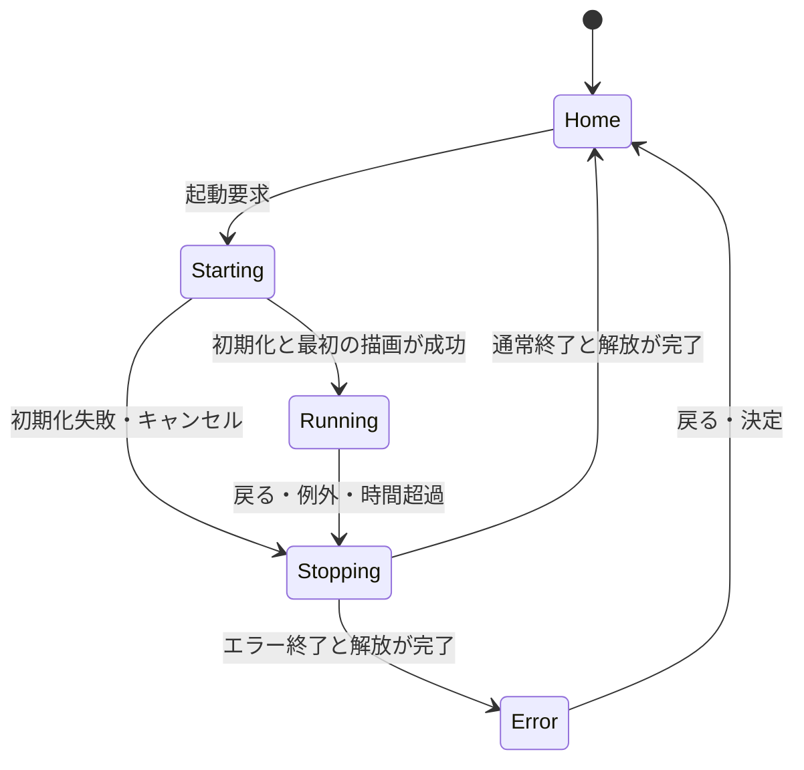

# プラットフォーム設計

Cardputer ADV上でQuickJS版PocketJSのアプリを起動・操作・終了する土台の設計。短い制約の要約は`CLAUDE.md`にあり、本書はその詳細（責務分担・状態遷移・起動/停止の手順）を持つ。ハードウェアの前提は[ハードウェア仕様と開発制約](hardware-constraints.md)、`pocket.*` APIの契約は[共通JS API仕様](../api/common-api.md)を参照する。本書はどちらとも重複させず、プラットフォームの構造だけを扱う。

対象はESP32-S3FN8、240×135 LCD、PSRAMなし。8MB Flashは保存領域でありJSヒープには数えない。QuickJSとMicroQuickJSは異なるエンジンで、PocketJS上流が使うquickjs-ngを使用する。Pocket VaporのCへの事前変換は使用しない。

## ディレクトリ構成

`main/`直下は`main.c`（`ui_task`と起動シーケンス）と`app_session.c`（JSセッションの生成・破棄）のみ。残りは役割ごとのサブディレクトリに分かれ、全て`INCLUDE_DIRS`に入っているため`#include "board.h"`のような書き方は移動前後で変わらない。

| ディレクトリ | 内容 |
| --- | --- |
| `hal/` | LCD・TCA8418キーボード・IMU（BMI270）・音声（ES8311） |
| `pocket/` | `pocket.*` API本体（`pocket_api.c`が土台）とWi-Fi、`app_registry.c` |
| `pet/` | Pet Companionアプリのネイティブ側資産 |
| `ui/` | 画面（shell、エディタ、オーバーレイ、ピッカー）と描画 |
| `text/` | フォント・字句解析（`jslex.c`）・SKK・ソース保存（`srcstore.c`） |
| `scene/` | ホーム背景と描画カーネル（FLOWER、SOLAR SAIL、PIEカーネル等） |
| `vm/` | QuickJSをFreeRTOS上で中断・再開できる基盤への作り替え（L0〜L5、進行中）。設計は[docs/vm/](../vm/) |

## 依存関係

調査基準はPocketJSコミット`6a0a1b6c91a506c473fc37a0256a47b12eceeca8`。そのESP-IDFコンポーネントはIDF `>=6.0,<6.2`と`espressif/quickjs-ng 0.14.0`を宣言し、本プロジェクトはEIMのIDF v6.0.1を使う（[環境とコマンド](build-environment.md)）。S3用RustアーカイブはWSLで`tools/build_native.sh`によりソースビルドする。公式ADVデモのIDF 5.4.2設定はそのまま流用せず、ドライバーの参考としてのみ扱う。

S3では`pocketjs_package`、`pocketjs_ui_qjs`、`pocketjs_render_rgb565`とその依存を使用する。P4専用PPAは組み込まない。液晶転送とADVの入力は本プロジェクトが担当する。

## 責務と所有権

| 部分 | 責務 | 所有する資源 |
| --- | --- | --- |
| Board HAL（`hal/board.c`, `motion.c`, `sound.c`） | LCD、TCA8418キーボード、時刻、音・IMU | デバイスハンドル、転送バッファ（`board_strip()`） |
| Shell（`ui/shell.c`） | ホーム、起動表示、エラー表示、選択位置の保持、`SCREENS[]`ディスパッチ | 小さなネイティブUI状態 |
| AppManager（`main.c`の`ui_task`が兼ねる） | 起動、停止要求、状態遷移、失敗時の後始末 | アプリセッション、固定長のエラー情報 |
| AppSession（`app_session.c`） | QuickJSとPocketJSの生成、評価、フレーム処理 | guest、UI core、binding、renderer、package |
| InputRouter（`main.c` / `keymap.c`） | キー変換・停止要求、ネイティブ編集欄への入力 | 16件の入力キュー |
| SKK / Editor / Playground（`text/skk_session.c`, `ui/codeedit.c`, `ui/editor.c`） | SKK、候補表示、ネイティブバッファへのUTF-8挿入 | 単一所有のIME状態、共有Flash辞書 |
| DisplayService（`board_present()`） | Shellまたはアプリの描画を液晶へ送る唯一の転送口 | 画面所有者、転送状態 |

AppManagerとDisplayServiceは独立クラス／タスクではなく、`main.c`の`ui_task`と`app_session.c`に実装する。**描画タスクは1つ、JSアプリは同時に1つ。** アプリ実行中はホーム背景を停止し、アプリ終了時はセッション全体を破棄する。ホームのカテゴリIDと項目IDだけを残し、カテゴリを切り替えても各カテゴリの選択位置を覚える。

画面追加は`SCREENS[]`記述子テーブル（`open`/`key`/`dirty`/`draw`/`wants_run`/`ended`/`frame_ms`/`takes_text`）に行を足す形で行い、`ui_task`側の分岐を増やさない。

## 状態遷移

起動要求の連打はStarting以降では受理しない。Stoppingから新しいアプリを起動しない。画面所有者の切り替えは前の転送完了後に行い、同じLCDへ複数タスクが直接描画しない。

オーバーレイアプリ（`pocket.overlay`、[common-api.md 3.1](../api/common-api.md)）はホーム画面そのものになる別の遷移を持つ。XMBを終了させて立ち上がり、シェル予約の戻るキーで降りる。詳細と安全弁は共通API仕様3.1節を正規参照とする。

## 実行モデル

`input_task`がキー・IMU・USB診断を読み、停止フラグと16件のキューを扱う。`ui_task`がShell、ネイティブ編集画面、QuickJS、PocketJS、LCD転送を直列に所有する。専用アプリタスクはない。別タスクからQuickJS contextを操作せず、停止は割り込みで確認する。JS呼び出しが戻ってから`ui_task`が解放する。音声は専用タスクで合成・再生・録音する（`hal/sound.c`、再生中だけ生きる`opusdec`/MP3復号タスク）。

1回の処理は、入力の取り込み、JSフレームとPromiseジョブ、PocketJS DrawList生成、描画、転送の順。tick目標は30Hz。初期評価の期限は2秒、tickの期限は250ms。処理中のネイティブ関数は短時間で返すか、タイムアウト付きの非同期処理にする（`pocket_api.c`の購読テーブル・Promise完了テーブル）。

## 起動と解放

アプリ登録は`main/pocket/app_registry.c`の静的テーブルで、各エントリが`app_manifest_t`（id、title、entry、`runtime`=`APP_RUNTIME_LEGACY`/`APP_RUNTIME_POCKET`、`api`範囲、`access`の works レベル）を持つ。legacyランタイムは`ui.createNode`と`globalThis.frame`を使う旧アプリ、pocketランタイムは`pocket.*`のみを使うアプリで、`app_registry_admit()`がAPI範囲適合を検査してから起動する。`.pocket`形式・動的インストーラーはまだ受け入れない。

guest生成 → `pocketjs_guest_quickjs_install_once()`で各ネイティブ面を注入 → UIコア・バインディング・レンダラ生成、の順に組み立て、`app_stop()`が逆順に壊す（`app_session.c`）。どの段階で失敗しても生成済み資源だけを解放する。エラー文字列はguestを破棄する前に上限付きでコピーする。

停止手順は上流の寿命規則に従う。

1. JS処理を停止し、アプリタスクがアクセスを終了したことを確認する。
2. LCD転送を完了させ、描画トランザクションをcommitまたはabortする。
3. rendererとtargetを破棄する。
4. guestを破棄する。
5. bindingとcoreを破棄する。
6. packageとその保存領域を解放する。

単なる生成順の逆順にしない。上流はguestをbindingより先に破棄することを要求する。**ゲストのコールバックを保持するモジュールは、ゲストが死ぬ前に`app_stop()`から reset される必要がある。** 描画結果の借用ポインタは次のtickやmutationを越えて保存しない。停止確認が取れないタスクのメモリを先に解放しない。復帰不能時の最終手段はwatchdogによる再起動とし、通常のJSエラーからの復帰とは区別する。

## pocket.* API

`main/pocket/pocket_api.c`が土台（capability登録、`PocketError`、cancelトークン、購読テーブル、Promise完了テーブル、遅延名前空間、`pocket_api_pump()`）で、各面（`pocket_imu.c`/`pocket_av.c`/`pocket_storage.c`/`pocket_fs.c`/`pocket_ui.c`/`pocket_net.c`/`pocket_io.c`/`pocket_bridge.c`/`pocket_capture.c`/`pocket_workspace.c`/`pocket_random.c`/`pocket_ble.c`/`pocket_overlay.c`/`pocket_text.c`他）が乗る。名前空間はアプリが最初に読んだときに構築される（`pocket_api_lazy()`）。`capabilities`と`apiVersion`だけがeager。新しい面は`pocket_api_register()`でcapabilityを差し替えるだけで、`pocket_api.c`自体は編集しない。

契約・章立て・実装状況の一覧は[共通JS API仕様](../api/common-api.md)の冒頭表を正規参照とする。要約すると、BLE Central/Peripheral（同仕様12節）を除く全面が実装済み。

Hello Worldは素のJSを編集用ソースにし、ビルド時にPocketJSのホストAPIへ接続する起動コードと束ねる。上流guestは`globalThis.frame`を要求するため、単独の`print()`のみではアプリとして成立しない。JSX/TSXやVue SFCはQuickJSでは直接評価できず、使用する場合はPCで変換する。

入力はキー入力・IMU・時刻に加え、`pocket.input`の方向・決定・TextCommit APIを持つ。Ctrl+Alt+DelでForceStopを検出し、編集欄では通常キーをIME優先で処理する。変換中のEscをアプリ終了に使わず、Enter確定を改行や送信へ二重配送しない。詳細は[SKK日本語入力設計](../apps/japanese-input.md)を参照する。

## メモリと描画

512KB SRAMの全量をヒープ予算としない。OS、コード・静的データ、スタック、HAL、転送用DMA領域も計測する。数値（guestヒープ上限、idle free heap、UIノード数の崖など）は変わり続けるため本書では固定値を主張しない。現在の実測は`CLAUDE.md`の「この機体で繰り返し踏む制約」と[ハードウェア仕様と開発制約](hardware-constraints.md)、および`tools/memlog.py --port --check`が持つ。

| 項目 | 設計方針 |
| --- | --- |
| LCDバッファ | 240×8行×2byte = 3,840byteのstrip。DMA中は再利用しない |
| 全画面 | RGB565で64,800byte。常駐二重バッファは採用しない |
| 描画領域 | damage領域を固定高さへ分割し、上流render_stripで整合性を検証 |
| パッケージ | 同梱版はFlashの借用領域 |
| フォント | ネイティブはFlashの東雲12px／美咲8px。JSアトラスは実行中の出現文字を累積 |
| ログ | 6行×46bytesのリング、128bytesのエラー領域 |
| Wi-Fi/BLE | リンクするだけで空きヒープが約37KiB減る（`CLAUDE.md`） |

QuickJS heap limitはRust製core、renderer、フォントなどのメモリを制限しない。上流Rust OOMは致命的で、任意アプリが安全に復帰できるとはまだ保証できない（オーバーレイは例外——[common-api.md 3.1](../api/common-api.md)の「安全弁」節を参照）。

## ソース保存とFlash

`partitions.csv`を容量の基準とする。factoryは0x10000から3MiB、skk_dictは0x310000から2MiB、jp_fontは0x510000から512KiB、storageは0x590000から2496KiB。旧storage先頭0x710000からの自動移行はない。

srcstoreは最大8192bytesのソースを16スロットで保存する（0はユーザー、1以降は教材用）。各スロットは12KiBブロック×2面の24KiB、全体384KiB。CRC付き二面保存。`pocket.storage`と`pocket.workspace`（[common-api.md](../api/common-api.md) 7節）はこのsrcstoreを公開APIの背後に隠すバックエンドとして使う。汎用ファイルシステムやwear levelingではない。

エディタの**未保存の文書は、画面を閉じるときに下書きとして flash へ置かれる**（2026-09-23）。バッファは8KiBのheapで、`code_close()`が解放し次の`code_open()`がflashから読み直すので、保存していない編集は画面を離れた時点で消えていた。下書きは所属スロットを持つ1件だけの記録で、スロットを1つ増やすのではなく`pocket.fs`の後ろ（`SRCSTORE_DRAFT_BASE`=0xa0000、2面で24KiB）に置く — `pocket_fs.c`が`SRC_SLOT_COUNT`からファイルシステムの先頭を計算しており、スロットを増やすと保存済みのファイルが全部ずれるため。保存に成功したとき、実行前の保存が通ったとき、そのスロットを`srcstore_clear()`で忘れるときに消える。実機の検査は`tools/test_editor_draft.py`。

**この下書きの範囲は本文だけで、意図的にそこで止める**（2026-09-23の判断）。カーソル位置とundo履歴は戻さない — 完全な復元が目的ではなく、打った文字が消えないことが目的。SKK練習や設定・Wi-Fi画面の入力途中は対象外で、それらは「編集中」という状態を持たない。JSアプリの途中状態も保存しない（保存したいアプリは`pocket.storage`を自分で使う。POCKET PETがそうしている）。`pocket.fs`（同7節、[filesystem-api.md](../api/filesystem-api.md)）は別の保存領域（`app:`/`assets:`/`sd:`）を持つ。

## 未解決事項

プラットフォーム全体の残件は[docs/platform/backlog.md](backlog.md)にまとめた。

## 参照

- [Cardputer ADV仕様](https://docs.m5stack.com/ja/core/Cardputer-Adv)
- [PocketJS ESP-IDFガイド（調査基準）](https://github.com/pocket-stack/pocketjs/blob/6a0a1b6c91a506c473fc37a0256a47b12eceeca8/site/content/docs/esp-idf.md)
- [PocketJS guest実装（調査基準）](https://github.com/pocket-stack/pocketjs/blob/6a0a1b6c91a506c473fc37a0256a47b12eceeca8/hosts/esp-idf/components/pocketjs_guest/src/guest.c)
